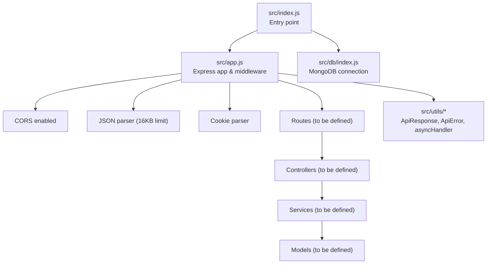
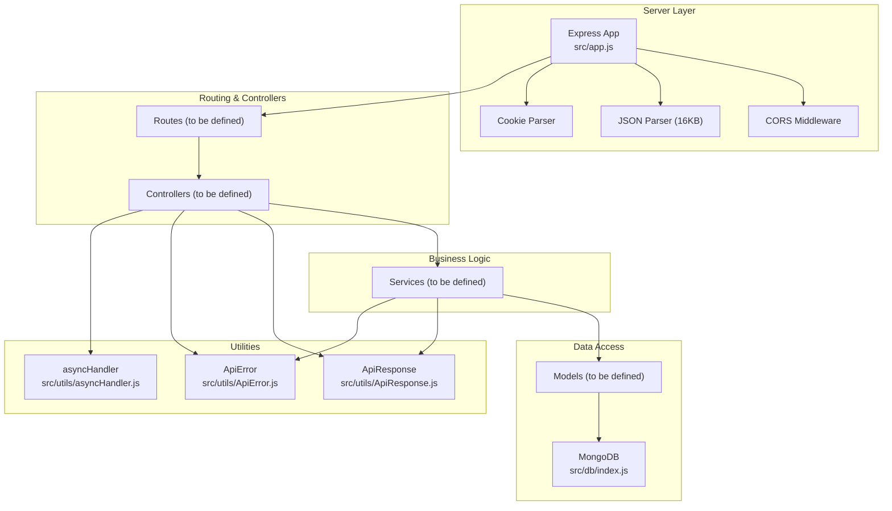
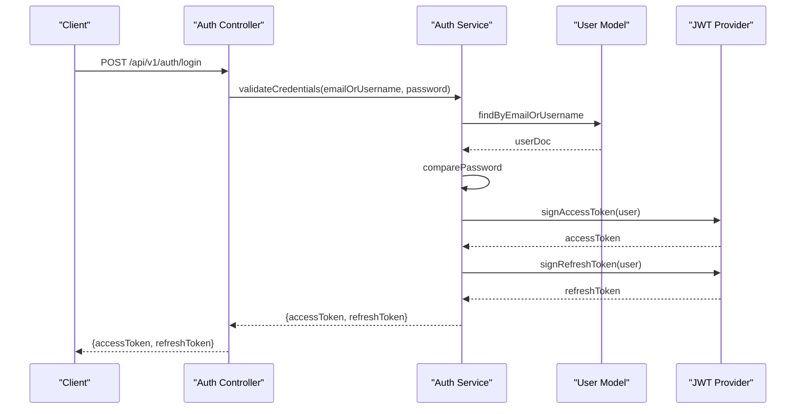
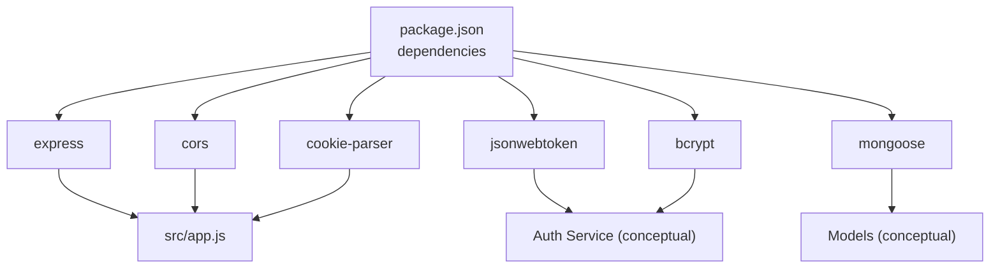

# API Endpoints Reference

<cite>
**Referenced Files in This Document**
- [package.json](file://package.json)
- [src/app.js](file://src/app.js)
- [src/index.js](file://src/index.js)
- [src/db/index.js](file://src/db/index.js)
- [src/utils/ApiResponse.js](file://src/utils/ApiResponse.js)
- [src/utils/ApiError.js](file://src/utils/ApiError.js)
- [src/utils/asyncHandler.js](file://src/utils/asyncHandler.js)
</cite>

## Table of Contents
1. [Introduction](#introduction)
2. [Project Structure](#project-structure)
3. [Core Components](#core-components)
4. [Architecture Overview](#architecture-overview)
5. [Detailed Component Analysis](#detailed-component-analysis)
6. [Dependency Analysis](#dependency-analysis)
7. [Performance Considerations](#performance-considerations)
8. [Troubleshooting Guide](#troubleshooting-guide)
9. [Conclusion](#conclusion)
10. [Appendices](#appendices)

## Introduction
This document provides a comprehensive API reference for the Task Management System backend. It covers HTTP methods, URL patterns, request/response schemas, authentication requirements, and operational guidelines for the RESTful endpoints. Authentication is handled via JSON Web Tokens (JWT), and the server supports CORS and JSON request parsing. Pagination, filtering, sorting, and rate limiting are discussed conceptually, along with versioning strategy and backward compatibility considerations.

## Project Structure
The backend is structured around Express.js with modular directories for configuration, routes, controllers, models, services, middlewares, validators, utilities, and sockets. The application initializes environment configuration, connects to MongoDB, and exposes HTTP endpoints through Express.

**Diagram sources**
- [src/index.js](file://src/index.js#L1-L18)
- [src/app.js](file://src/app.js#L1-L16)
- [src/db/index.js](file://src/db/index.js#L1-L14)
- [src/utils/ApiResponse.js](file://src/utils/ApiResponse.js#L1-L17)
- [src/utils/ApiError.js](file://src/utils/ApiError.js#L1-L22)
- [src/utils/asyncHandler.js](file://src/utils/asyncHandler.js#L1-L8)

**Section sources**
- [src/index.js](file://src/index.js#L1-L18)
- [src/app.js](file://src/app.js#L1-L16)
- [src/db/index.js](file://src/db/index.js#L1-L14)

## Core Components
- Express application initialization and middleware configuration
- CORS policy configuration
- JSON body parsing with size limits
- Cookie parsing support
- MongoDB connection module
- Utility classes for standardized API responses and error handling
- Async handler wrapper for route handlers

Key behaviors:
- CORS is configured using an environment variable for origins.
- JSON bodies are parsed with a 16KB limit.
- Cookie parsing is enabled for session-like behaviors.
- MongoDB connection is established at startup.

**Section sources**
- [src/app.js](file://src/app.js#L1-L16)
- [src/db/index.js](file://src/db/index.js#L1-L14)
- [src/utils/ApiResponse.js](file://src/utils/ApiResponse.js#L1-L17)
- [src/utils/ApiError.js](file://src/utils/ApiError.js#L1-L22)
- [src/utils/asyncHandler.js](file://src/utils/asyncHandler.js#L1-L8)

## Architecture Overview
The system follows a layered architecture:
- Entry point initializes environment and database.
- Express app configures middleware and routes.
- Controllers orchestrate requests and delegate to services.
- Services encapsulate business logic and interact with models.
- Models define data schemas and persistence.
- Utilities standardize responses and error handling.

**Diagram sources**
- [src/app.js](file://src/app.js#L1-L16)
- [src/db/index.js](file://src/db/index.js#L1-L14)
- [src/utils/ApiResponse.js](file://src/utils/ApiResponse.js#L1-L17)
- [src/utils/ApiError.js](file://src/utils/ApiError.js#L1-L22)
- [src/utils/asyncHandler.js](file://src/utils/asyncHandler.js#L1-L8)

## Detailed Component Analysis

### Authentication Endpoints
Authentication is implemented via JWT tokens. The following endpoints are defined:

- POST /api/v1/auth/register
  - Purpose: Register a new user.
  - Authentication: Not required.
  - Request body schema:
    - Required fields: username, email, password.
    - Additional recommended fields: fullName, avatarUrl.
  - Response:
    - On success: Returns a compact success payload with user details excluding sensitive fields.
    - On failure: Returns a standardized error response with status code and error details.
  - Example curl:
    - curl -X POST https://your-host/api/v1/auth/register -H "Content-Type: application/json" -d '{...}'
  - Notes:
    - Password hashing and validation are handled by service-layer logic.
    - On success, a refresh token may be stored in cookies depending on implementation.

- POST /api/v1/auth/login
  - Purpose: Authenticate a user and issue JWT access token.
  - Authentication: Not required.
  - Request body schema:
    - Required fields: email or username, password.
  - Response:
    - On success: Returns tokens and user profile; sets secure cookie for refresh token if applicable.
    - On failure: Returns a standardized error response with status code and error details.
  - Example curl:
    - curl -X POST https://your-host/api/v1/auth/login -H "Content-Type: application/json" -d '{...}'

- POST /api/v1/auth/logout
  - Purpose: Invalidate current session/token.
  - Authentication: Required (Bearer JWT).
  - Request body: Optional (logout scope depends on implementation).
  - Response:
    - On success: Clears tokens and returns confirmation.
    - On failure: Returns a standardized error response.

- POST /api/v1/auth/refresh
  - Purpose: Issue a new access token using a valid refresh token.
  - Authentication: Not required (requires valid refresh token).
  - Request body schema:
    - Required field: refreshToken.
  - Response:
    - On success: Returns a new access token.
    - On failure: Returns a standardized error response.

- POST /api/v1/auth/change-password
  - Purpose: Change the authenticated user’s password.
  - Authentication: Required (Bearer JWT).
  - Request body schema:
    - Required fields: oldPassword, newPassword.
  - Response:
    - On success: Confirms password change.
    - On failure: Returns a standardized error response.

- POST /api/v1/auth/forgot-password
  - Purpose: Initiate password reset process.
  - Authentication: Not required.
  - Request body schema:
    - Required field: email.
  - Response:
    - On success: Indicates reset initiation.
    - On failure: Returns a standardized error response.

- POST /api/v1/auth/reset-password
  - Purpose: Complete password reset using a token.
  - Authentication: Not required.
  - Request body schema:
    - Required fields: token, newPassword.
  - Response:
    - On success: Confirms reset completion.
    - On failure: Returns a standardized error response.

Validation rules (conceptual):
- Email format validation.
- Password strength requirements (length, character variety).
- Unique constraints enforced at model/service level.
- Token expiration and refresh window managed by service logic.

Error response format (standardized):
- Fields: success (boolean), message (string), statusCode (number), data (object|null), errors (array).
- Example structure:
  - {
      "success": false,
      "message": "Invalid credentials",
      "statusCode": 401,
      "data": null,
      "errors": ["email", "password"]
    }

Authentication flow sequence:

**Diagram sources**
- [src/utils/ApiResponse.js](file://src/utils/ApiResponse.js#L1-L17)
- [src/utils/ApiError.js](file://src/utils/ApiError.js#L1-L22)

### Task Management Endpoints
CRUD operations for tasks:

- GET /api/v1/tasks
  - Purpose: List tasks with optional pagination, filtering, and sorting.
  - Authentication: Required (Bearer JWT).
  - Query parameters (conceptual):
    - page (integer, default 1)
    - limit (integer, default 10)
    - sortBy (string, e.g., createdAt, title)
    - sortOrder (asc|desc)
    - filter[field]=value (repeatable)
  - Response:
    - Success: Paginated array of tasks with metadata.
    - Failure: Standardized error response.

- POST /api/v1/tasks
  - Purpose: Create a new task.
  - Authentication: Required (Bearer JWT).
  - Request body schema:
    - Required fields: title, description.
    - Optional fields: status (pending|in-progress|completed), priority (low|medium|high), dueDate, assigneeId.
  - Response:
    - Success: Returns created task object.
    - Failure: Standardized error response.

- GET /api/v1/tasks/:id
  - Purpose: Retrieve a single task by ID.
  - Authentication: Required (Bearer JWT).
  - Path parameters:
    - id (ObjectId format)
  - Response:
    - Success: Returns task object.
    - Failure: Standardized error response.

- PUT /api/v1/tasks/:id
  - Purpose: Update an existing task.
  - Authentication: Required (Bearer JWT).
  - Path parameters:
    - id (ObjectId format)
  - Request body schema:
    - Fields to update: title, description, status, priority, dueDate, assigneeId.
  - Response:
    - Success: Returns updated task object.
    - Failure: Standardized error response.

- DELETE /api/v1/tasks/:id
  - Purpose: Delete a task.
  - Authentication: Required (Bearer JWT).
  - Path parameters:
    - id (ObjectId format)
  - Response:
    - Success: Confirmation of deletion.
    - Failure: Standardized error response.

Pagination, filtering, and sorting (conceptual):
- Pagination: page and limit parameters with total count and hasNext/hasPrevious flags.
- Filtering: filter[field]=value for supported fields.
- Sorting: sortBy and sortOrder parameters.

Example curl commands (conceptual):
- List tasks:
  - curl -H "Authorization: Bearer YOUR_ACCESS_TOKEN" "https://your-host/api/v1/tasks?page=1&limit=10&sortBy=createdAt&sortOrder=desc"
- Create task:
  - curl -X POST -H "Authorization: Bearer YOUR_ACCESS_TOKEN" -H "Content-Type: application/json" -d '{...}' "https://your-host/api/v1/tasks"
- Get task:
  - curl -H "Authorization: Bearer YOUR_ACCESS_TOKEN" "https://your-host/api/v1/tasks/:id"
- Update task:
  - curl -X PUT -H "Authorization: Bearer YOUR_ACCESS_TOKEN" -H "Content-Type: application/json" -d '{...}' "https://your-host/api/v1/tasks/:id"
- Delete task:
  - curl -X DELETE -H "Authorization: Bearer YOUR_ACCESS_TOKEN" "https://your-host/api/v1/tasks/:id"

### User Management Endpoints
Profile operations for authenticated users:

- GET /api/v1/users/profile
  - Purpose: Retrieve authenticated user profile.
  - Authentication: Required (Bearer JWT).
  - Response:
    - Success: Returns user profile excluding sensitive fields.
    - Failure: Standardized error response.

- PUT /api/v1/users/profile
  - Purpose: Update authenticated user profile.
  - Authentication: Required (Bearer JWT).
  - Request body schema:
    - Fields to update: fullName, email, avatarUrl.
  - Response:
    - Success: Returns updated profile.
    - Failure: Standardized error response.

- DELETE /api/v1/users/profile
  - Purpose: Deactivate or delete user account.
  - Authentication: Required (Bearer JWT).
  - Response:
    - Success: Confirmation of deletion.
    - Failure: Standardized error response.

### Shared Response and Error Handling
Standardized response format:
- Fields: success (boolean), message (string), statusCode (number), data (object|array|null), errors (array).
- Used across all endpoints for consistent client consumption.

Standardized error format:
- Extends native Error with statusCode, message, and errors array.
- Utilized for propagating validation and business errors.

Async handler wrapper:
- Wraps route handlers to safely handle asynchronous operations and forward errors to Express error middleware.

**Section sources**
- [src/utils/ApiResponse.js](file://src/utils/ApiResponse.js#L1-L17)
- [src/utils/ApiError.js](file://src/utils/ApiError.js#L1-L22)
- [src/utils/asyncHandler.js](file://src/utils/asyncHandler.js#L1-L8)

## Dependency Analysis
External dependencies relevant to API behavior:
- Express: HTTP framework for routing and middleware.
- CORS: Cross-origin resource sharing policy.
- jsonwebtoken: JWT signing and verification.
- bcrypt: Password hashing and comparison.
- mongoose: MongoDB ODM for data modeling and queries.
- cookie-parser: Parsing cookies for token storage.

**Diagram sources**
- [package.json](file://package.json#L14-L23)
- [src/app.js](file://src/app.js#L1-L16)

**Section sources**
- [package.json](file://package.json#L14-L23)
- [src/app.js](file://src/app.js#L1-L16)

## Performance Considerations
- JSON body size limit: 16KB to prevent abuse and reduce memory pressure.
- CORS origin controlled via environment variable to restrict cross-origin access.
- Asynchronous route handling via async wrapper to avoid unhandled promise rejections.
- Pagination reduces payload sizes for list endpoints.
- Indexing on frequently queried fields (e.g., userId, status, createdAt) recommended at the model level.

## Troubleshooting Guide
Common issues and resolutions:
- CORS errors: Verify CORS origin environment variable matches client origin.
- JSON parse errors: Ensure request bodies are valid JSON and under 16KB limit.
- Authentication failures: Confirm Authorization header format (Bearer token) and token validity.
- Database connectivity: Check MONGODB_URI environment variable and network access.
- Standardized error responses: Inspect response fields for message, statusCode, and errors to diagnose issues.

Operational checks:
- Confirm environment variables are loaded via dotenv.
- Validate MongoDB connection logs at startup.
- Use standardized response/error utilities for consistent logging and debugging.

**Section sources**
- [src/index.js](file://src/index.js#L1-L18)
- [src/db/index.js](file://src/db/index.js#L1-L14)
- [src/app.js](file://src/app.js#L1-L16)
- [src/utils/ApiError.js](file://src/utils/ApiError.js#L1-L22)
- [src/utils/ApiResponse.js](file://src/utils/ApiResponse.js#L1-L17)

## Conclusion
The Task Management System provides a clear RESTful API surface with JWT-based authentication, standardized responses, and error handling. Authentication endpoints cover registration, login, logout, refresh, password change, and reset flows. Task and user management endpoints support CRUD operations with conceptual pagination, filtering, and sorting. The architecture leverages Express middleware, CORS, JSON parsing, and MongoDB for scalable data access. Adopt the documented patterns for request/response schemas, validation, and error handling to maintain consistency and reliability.

## Appendices

### API Versioning Strategy
- Base path: /api/v1
- Backward compatibility: Introduce new endpoints under /api/v2 for breaking changes; keep /api/v1 unchanged until migration period ends.

### CORS Configuration
- Origin controlled by environment variable; configure per deployment needs.

### Input Validation Patterns
- Use service-layer validators to enforce field presence, formats, and uniqueness.
- Return standardized error responses with detailed errors array for client-side validation hints.

### Rate Limiting
- Conceptual recommendation: Apply rate limiting per endpoint or globally using middleware; track by IP or user ID.

### Practical Examples (curl)
- Register:
  - curl -X POST https://your-host/api/v1/auth/register -H "Content-Type: application/json" -d '{...}'
- Login:
  - curl -X POST https://your-host/api/v1/auth/login -H "Content-Type: application/json" -d '{...}'
- List tasks:
  - curl -H "Authorization: Bearer YOUR_ACCESS_TOKEN" "https://your-host/api/v1/tasks?page=1&limit=10"
- Create task:
  - curl -X POST -H "Authorization: Bearer YOUR_ACCESS_TOKEN" -H "Content-Type: application/json" -d '{...}' "https://your-host/api/v1/tasks"
- Get task:
  - curl -H "Authorization: Bearer YOUR_ACCESS_TOKEN" "https://your-host/api/v1/tasks/:id"
- Update task:
  - curl -X PUT -H "Authorization: Bearer YOUR_ACCESS_TOKEN" -H "Content-Type: application/json" -d '{...}' "https://your-host/api/v1/tasks/:id"
- Delete task:
  - curl -X DELETE -H "Authorization: Bearer YOUR_ACCESS_TOKEN" "https://your-host/api/v1/tasks/:id"