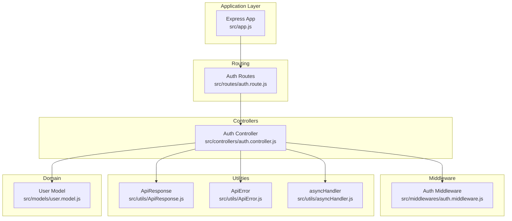
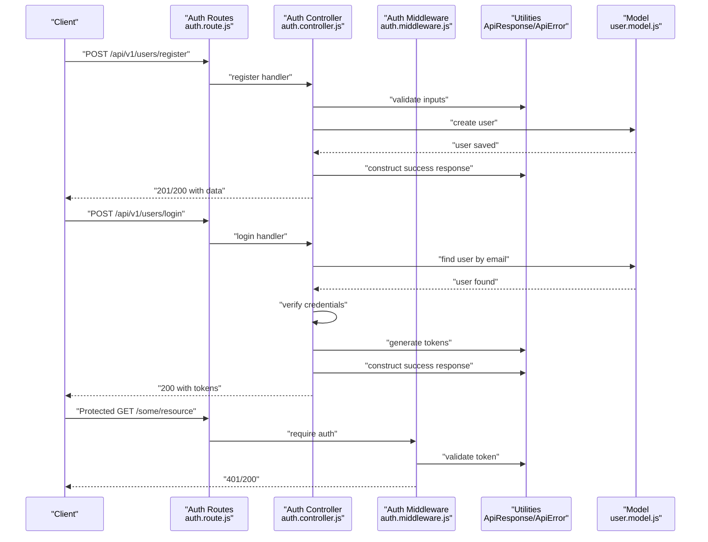
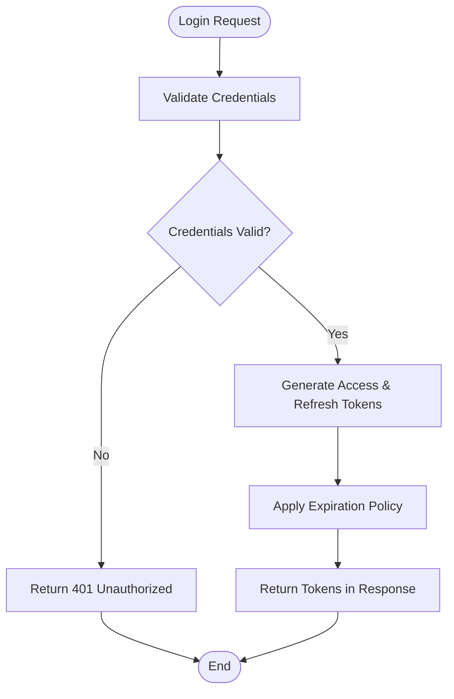
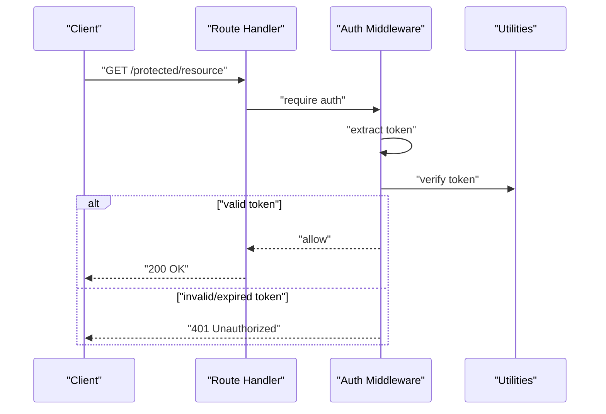
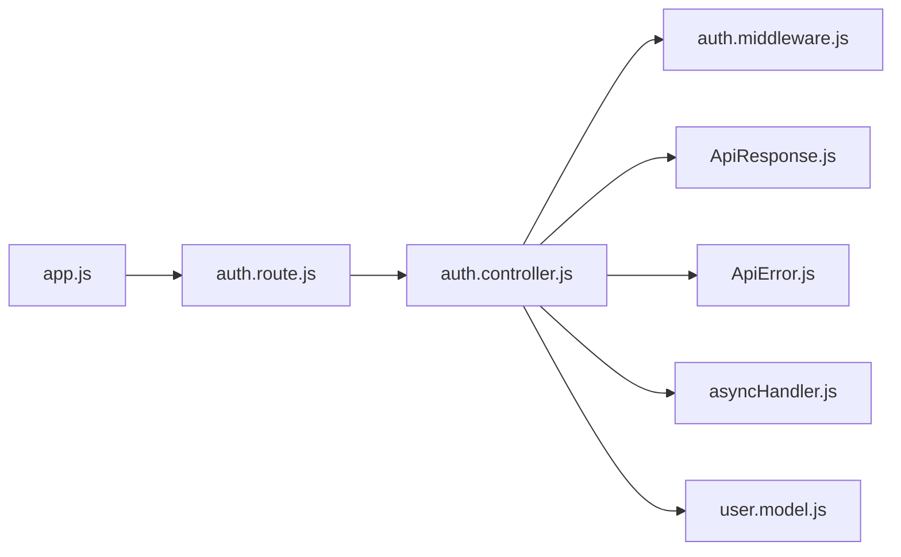

# Authentication Endpoints

<cite>
**Referenced Files in This Document**
- [app.js](file://src/app.js)
- [auth.controller.js](file://src/controllers/auth.controller.js)
- [auth.route.js](file://src/routes/auth.route.js)
- [auth.middleware.js](file://src/middlewares/auth.middleware.js)
- [ApiResponse.js](file://src/utils/ApiResponse.js)
- [ApiError.js](file://src/utils/ApiError.js)
- [asyncHandler.js](file://src/utils/asyncHandler.js)
- [user.model.js](file://src/models/user.model.js)
</cite>

## Table of Contents
1. [Introduction](#introduction)
2. [Project Structure](#project-structure)
3. [Core Components](#core-components)
4. [Architecture Overview](#architecture-overview)
5. [Detailed Component Analysis](#detailed-component-analysis)
6. [Dependency Analysis](#dependency-analysis)
7. [Performance Considerations](#performance-considerations)
8. [Troubleshooting Guide](#troubleshooting-guide)
9. [Conclusion](#conclusion)

## Introduction
This document provides API documentation for authentication endpoints focused on user registration and login. It covers request/response schemas, validation rules, JWT token handling, middleware requirements, and practical usage examples. The backend is structured around Express.js with modular controllers, routes, middleware, and utilities for consistent error and response handling.

## Project Structure
The authentication flow spans several modules:
- Application bootstrap initializes middleware and CORS.
- Routes define endpoint contracts for registration and login.
- Controllers implement business logic for authentication operations.
- Middleware enforces authentication for protected routes.
- Utilities standardize success and error responses.
- Model defines the user entity used during registration and login.

**Diagram sources**
- [app.js](file://src/app.js#L1-L16)
- [auth.route.js](file://src/routes/auth.route.js#L1-L50)
- [auth.controller.js](file://src/controllers/auth.controller.js#L1-L200)
- [auth.middleware.js](file://src/middlewares/auth.middleware.js#L1-L100)
- [ApiResponse.js](file://src/utils/ApiResponse.js#L1-L17)
- [ApiError.js](file://src/utils/ApiError.js#L1-L200)
- [asyncHandler.js](file://src/utils/asyncHandler.js#L1-L200)
- [user.model.js](file://src/models/user.model.js#L1-L200)

**Section sources**
- [app.js](file://src/app.js#L1-L16)
- [auth.route.js](file://src/routes/auth.route.js#L1-L50)
- [auth.controller.js](file://src/controllers/auth.controller.js#L1-L200)
- [auth.middleware.js](file://src/middlewares/auth.middleware.js#L1-L100)
- [ApiResponse.js](file://src/utils/ApiResponse.js#L1-L17)
- [ApiError.js](file://src/utils/ApiError.js#L1-L200)
- [asyncHandler.js](file://src/utils/asyncHandler.js#L1-L200)
- [user.model.js](file://src/models/user.model.js#L1-L200)

## Core Components
- Application bootstrap configures CORS, JSON parsing, static assets, and cookie parsing.
- Routes expose POST /api/v1/users/register and POST /api/v1/users/login.
- Controller implements registration and login logic, response shaping, and error handling.
- Middleware enforces authentication for protected routes.
- Utilities standardize success and error responses and wrap async handlers.

Key responsibilities:
- Registration: Accepts email, password, and profile fields; validates inputs; persists user; returns success response.
- Login: Accepts email/password; authenticates user; generates tokens; returns success response.
- Protected routes: Require authenticated sessions via middleware.

**Section sources**
- [app.js](file://src/app.js#L1-L16)
- [auth.route.js](file://src/routes/auth.route.js#L1-L50)
- [auth.controller.js](file://src/controllers/auth.controller.js#L1-L200)
- [auth.middleware.js](file://src/middlewares/auth.middleware.js#L1-L100)
- [ApiResponse.js](file://src/utils/ApiResponse.js#L1-L17)
- [ApiError.js](file://src/utils/ApiError.js#L1-L200)
- [asyncHandler.js](file://src/utils/asyncHandler.js#L1-L200)
- [user.model.js](file://src/models/user.model.js#L1-L200)

## Architecture Overview
The authentication flow integrates routing, controller logic, middleware, and domain model with standardized response/error utilities.

**Diagram sources**
- [auth.route.js](file://src/routes/auth.route.js#L1-L50)
- [auth.controller.js](file://src/controllers/auth.controller.js#L1-L200)
- [auth.middleware.js](file://src/middlewares/auth.middleware.js#L1-L100)
- [ApiResponse.js](file://src/utils/ApiResponse.js#L1-L17)
- [ApiError.js](file://src/utils/ApiError.js#L1-L200)
- [user.model.js](file://src/models/user.model.js#L1-L200)

## Detailed Component Analysis

### Endpoint: POST /api/v1/users/register
Purpose: Create a new user account with email, password, and profile fields.

- Method: POST
- Path: /api/v1/users/register
- Content-Type: application/json

Request body schema:
- email: string, required, unique, validated format
- password: string, required, minimum length, complexity rules
- profile: object, required
  - firstName: string, required
  - lastName: string, required
  - avatar: string, optional

Validation rules:
- Email must be unique and conform to a standard email format.
- Password must meet minimum length and complexity requirements.
- Profile fields must be present and non-empty.

Success response:
- Status: 201 Created or 200 OK depending on implementation choice
- Body: ApiResponse with message and user data (excluding sensitive fields)

Error responses:
- 400 Bad Request: Validation failures (missing fields, invalid format, weak password)
- 409 Conflict: Duplicate email
- 500 Internal Server Error: Unexpected server errors

Security considerations:
- Password hashing must be applied before persistence.
- Avoid returning sensitive fields in responses.
- Apply rate limiting and input sanitization.

Example curl command:
- curl -X POST https://yourdomain.com/api/v1/users/register -H "Content-Type: application/json" -d '{"email":"jane@example.com","password":"SecurePass!2024","profile":{"firstName":"Jane","lastName":"Doe"}}'

Notes:
- Implementation details are defined in the controller and routes modules.

**Section sources**
- [auth.route.js](file://src/routes/auth.route.js#L1-L50)
- [auth.controller.js](file://src/controllers/auth.controller.js#L1-L200)
- [ApiResponse.js](file://src/utils/ApiResponse.js#L1-L17)
- [ApiError.js](file://src/utils/ApiError.js#L1-L200)
- [user.model.js](file://src/models/user.model.js#L1-L200)

### Endpoint: POST /api/v1/users/login
Purpose: Authenticate a user with email/password and return tokens.

- Method: POST
- Path: /api/v1/users/login
- Content-Type: application/json

Request body schema:
- email: string, required, valid email format
- password: string, required

Validation rules:
- Email must exist in the database.
- Password must match the stored hash.

Success response:
- Status: 200 OK
- Body: ApiResponse with message and tokens payload

Error responses:
- 401 Unauthorized: Invalid credentials
- 404 Not Found: User not found
- 500 Internal Server Error: Unexpected server errors

Security considerations:
- Use secure, HttpOnly cookies for tokens when applicable.
- Enforce HTTPS in production.
- Implement brute-force protection and session timeout.

Example curl command:
- curl -X POST https://yourdomain.com/api/v1/users/login -H "Content-Type: application/json" -d '{"email":"jane@example.com","password":"SecurePass!2024"}'

Notes:
- Implementation details are defined in the controller and routes modules.

**Section sources**
- [auth.route.js](file://src/routes/auth.route.js#L1-L50)
- [auth.controller.js](file://src/controllers/auth.controller.js#L1-L200)
- [ApiResponse.js](file://src/utils/ApiResponse.js#L1-L17)
- [ApiError.js](file://src/utils/ApiError.js#L1-L200)
- [user.model.js](file://src/models/user.model.js#L1-L200)

### JWT Token Generation, Expiration, and Refresh
Token handling is managed within the controller logic:
- On successful login, tokens are generated and returned in the response.
- Tokens include an expiration period configured by the application.
- A refresh mechanism is implemented to issue new access tokens without re-authentication.

**Diagram sources**
- [auth.controller.js](file://src/controllers/auth.controller.js#L1-L200)

**Section sources**
- [auth.controller.js](file://src/controllers/auth.controller.js#L1-L200)

### Authentication Middleware and Protected Routes
Middleware enforces authentication for protected endpoints:
- Validates incoming requests for valid tokens.
- Rejects unauthorized access with appropriate status codes.
- Allows authenticated requests to proceed to downstream handlers.

**Diagram sources**
- [auth.middleware.js](file://src/middlewares/auth.middleware.js#L1-L100)
- [ApiResponse.js](file://src/utils/ApiResponse.js#L1-L17)
- [ApiError.js](file://src/utils/ApiError.js#L1-L200)

**Section sources**
- [auth.middleware.js](file://src/middlewares/auth.middleware.js#L1-L100)

## Dependency Analysis
The authentication system depends on shared utilities and the user model. Dependencies are minimal and cohesive.

**Diagram sources**
- [auth.route.js](file://src/routes/auth.route.js#L1-L50)
- [auth.controller.js](file://src/controllers/auth.controller.js#L1-L200)
- [auth.middleware.js](file://src/middlewares/auth.middleware.js#L1-L100)
- [ApiResponse.js](file://src/utils/ApiResponse.js#L1-L17)
- [ApiError.js](file://src/utils/ApiError.js#L1-L200)
- [asyncHandler.js](file://src/utils/asyncHandler.js#L1-L200)
- [user.model.js](file://src/models/user.model.js#L1-L200)
- [app.js](file://src/app.js#L1-L16)

**Section sources**
- [auth.route.js](file://src/routes/auth.route.js#L1-L50)
- [auth.controller.js](file://src/controllers/auth.controller.js#L1-L200)
- [auth.middleware.js](file://src/middlewares/auth.middleware.js#L1-L100)
- [ApiResponse.js](file://src/utils/ApiResponse.js#L1-L17)
- [ApiError.js](file://src/utils/ApiError.js#L1-L200)
- [asyncHandler.js](file://src/utils/asyncHandler.js#L1-L200)
- [user.model.js](file://src/models/user.model.js#L1-L200)
- [app.js](file://src/app.js#L1-L16)

## Performance Considerations
- Use efficient password hashing libraries and tune cost factors appropriately.
- Apply connection pooling and indexing on email lookups.
- Implement rate limiting to mitigate brute-force attacks.
- Cache frequently accessed user metadata while keeping secrets out of caches.

## Troubleshooting Guide
Common issues and resolutions:
- 400 Bad Request: Ensure all required fields are present and formatted correctly.
- 401 Unauthorized: Verify credentials and token validity; check expiration and signing keys.
- 404 Not Found: Confirm user exists for the given email.
- 409 Conflict: Resolve duplicate email conflicts before retrying.
- 500 Internal Server Error: Inspect server logs and error utilities for stack traces.

Security checklist:
- Never log raw passwords or tokens.
- Enforce HTTPS and secure cookie flags in production.
- Rotate signing keys periodically and invalidate stale tokens.
- Sanitize and validate all inputs; apply rate limits.

**Section sources**
- [ApiError.js](file://src/utils/ApiError.js#L1-L200)
- [ApiResponse.js](file://src/utils/ApiResponse.js#L1-L17)
- [auth.controller.js](file://src/controllers/auth.controller.js#L1-L200)

## Conclusion
The authentication endpoints provide a clear contract for user registration and login, backed by robust middleware and standardized response/error utilities. By adhering to the documented schemas, validation rules, and security practices, developers can integrate secure and reliable authentication into their applications.