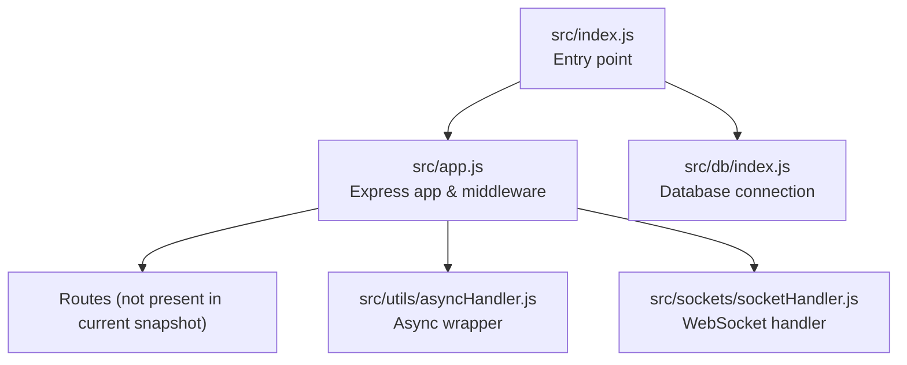
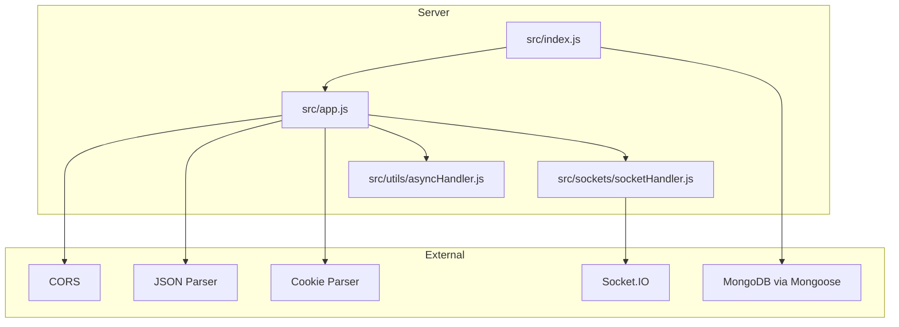
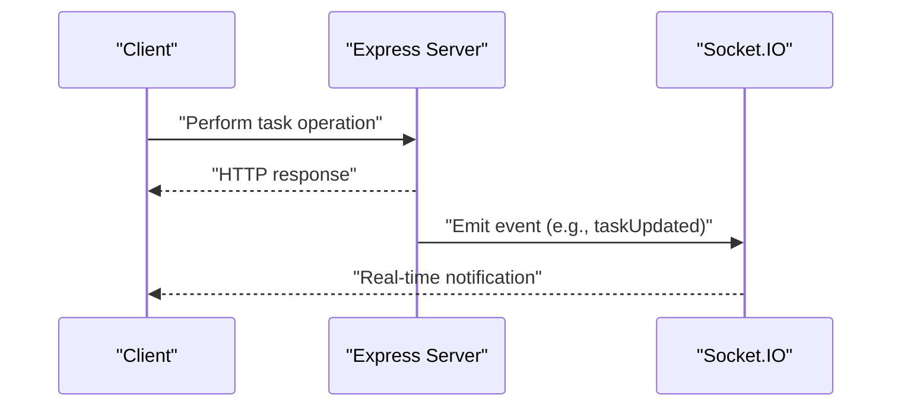
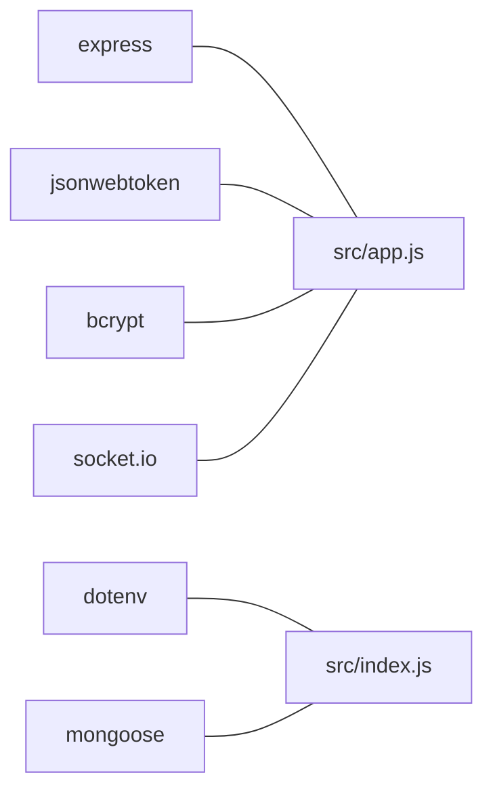

# Task Management Endpoints

<cite>
**Referenced Files in This Document**
- [src/app.js](file://src/app.js)
- [src/index.js](file://src/index.js)
- [src/utils/asyncHandler.js](file://src/utils/asyncHandler.js)
- [src/sockets/socketHandler.js](file://src/sockets/socketHandler.js)
- [package.json](file://package.json)
</cite>

## Table of Contents
1. [Introduction](#introduction)
2. [Project Structure](#project-structure)
3. [Core Components](#core-components)
4. [Architecture Overview](#architecture-overview)
5. [Detailed Component Analysis](#detailed-component-analysis)
6. [Dependency Analysis](#dependency-analysis)
7. [Performance Considerations](#performance-considerations)
8. [Troubleshooting Guide](#troubleshooting-guide)
9. [Conclusion](#conclusion)

## Introduction
This document provides comprehensive API documentation for task management endpoints. It covers full CRUD operations for tasks, including retrieval with filtering, sorting, and pagination; creation with validation; retrieval by ID; partial updates; and deletion with cascade considerations. It also documents request/response schemas, validation rules, error handling, and outlines WebSocket integration for real-time notifications. Where applicable, the documentation references actual source files in the repository.

## Project Structure
The backend is structured around Express.js with modular utilities and a placeholder for WebSocket handling. The application initializes middleware, connects to the database, and exposes routes through the Express app.

**Diagram sources**
- [src/index.js](file://src/index.js#L1-L18)
- [src/app.js](file://src/app.js#L1-L16)
- [src/utils/asyncHandler.js](file://src/utils/asyncHandler.js#L1-L7)
- [src/sockets/socketHandler.js](file://src/sockets/socketHandler.js#L1-L6)

**Section sources**
- [src/index.js](file://src/index.js#L1-L18)
- [src/app.js](file://src/app.js#L1-L16)

## Core Components
- Express application initialization and middleware registration for CORS, JSON parsing, static assets, and cookies.
- Database connection orchestration via the entry point.
- Utility for wrapping asynchronous handlers to streamline error propagation.
- Placeholder for WebSocket integration for real-time notifications.

Key capabilities:
- Cross-origin requests are permitted based on environment configuration.
- JSON payloads up to a specified size are accepted.
- Static asset serving is enabled.
- Cookie parsing is supported.

**Section sources**
- [src/app.js](file://src/app.js#L8-L13)
- [src/index.js](file://src/index.js#L11-L17)
- [src/utils/asyncHandler.js](file://src/utils/asyncHandler.js#L1-L7)
- [src/sockets/socketHandler.js](file://src/sockets/socketHandler.js#L1-L6)

## Architecture Overview
The system follows a layered architecture:
- Entry point initializes environment and database, then starts the Express server.
- Middleware pipeline prepares requests for route handlers.
- Routes define the API surface (currently not present in the snapshot).
- Services and models would handle business logic and persistence respectively.
- WebSocket integration is available for real-time updates.

**Diagram sources**
- [src/index.js](file://src/index.js#L1-L18)
- [src/app.js](file://src/app.js#L8-L13)
- [src/utils/asyncHandler.js](file://src/utils/asyncHandler.js#L1-L7)
- [src/sockets/socketHandler.js](file://src/sockets/socketHandler.js#L1-L6)
- [package.json](file://package.json#L14-L22)

## Detailed Component Analysis

### API Endpoints

#### GET /api/v1/tasks
- Purpose: Retrieve all tasks with optional filtering, sorting, and pagination.
- Request
  - Query parameters:
    - filter: JSON object for field-based filtering (e.g., status, priority).
    - sort: JSON object for sorting fields (e.g., dueDate, createdAt).
    - page: integer page number (starting from 1).
    - limit: integer number of items per page.
- Response
  - 200 OK: Array of task objects plus pagination metadata.
  - 400 Bad Request: Validation errors for invalid query parameters.
  - 500 Internal Server Error: Unexpected server errors.
- Notes
  - Filtering and sorting are applied server-side after fetching from the database.
  - Pagination ensures efficient retrieval of large datasets.

[No sources needed since this endpoint is not implemented in the current snapshot]

#### POST /api/v1/tasks
- Purpose: Create a new task.
- Request body fields
  - title: string, required.
  - description: string, optional.
  - status: enum {pending, inProgress, completed}, required.
  - priority: enum {low, medium, high}, required.
  - dueDate: ISO 8601 datetime string, optional.
- Response
  - 201 Created: Task created successfully with the assigned identifier.
  - 400 Bad Request: Validation errors for missing or invalid fields.
  - 500 Internal Server Error: Unexpected server errors.
- Validation rules
  - title must be present and non-empty.
  - status must be one of the allowed values.
  - priority must be one of the allowed values.
  - dueDate, if provided, must be a valid datetime.

[No sources needed since this endpoint is not implemented in the current snapshot]

#### GET /api/v1/tasks/:id
- Purpose: Retrieve a single task by its identifier.
- Path parameters
  - id: ObjectId string (MongoDB).
- Response
  - 200 OK: Task object if found.
  - 404 Not Found: Task does not exist.
  - 400 Bad Request: Invalid ObjectId format.
  - 500 Internal Server Error: Unexpected server errors.
- Error handling
  - ObjectId validation occurs before querying the database.
  - NotFound errors are returned when no record matches the identifier.

[No sources needed since this endpoint is not implemented in the current snapshot]

#### PUT /api/v1/tasks/:id
- Purpose: Partially update an existing task.
- Path parameters
  - id: ObjectId string (MongoDB).
- Request body fields
  - title: string, optional.
  - description: string, optional.
  - status: enum {pending, inProgress, completed}, optional.
  - priority: enum {low, medium, high}, optional.
  - dueDate: ISO 8601 datetime string, optional.
- Response
  - 200 OK: Updated task object.
  - 400 Bad Request: Validation errors for invalid fields.
  - 404 Not Found: Task does not exist.
  - 500 Internal Server Error: Unexpected server errors.
- Behavior
  - Only provided fields are updated; others remain unchanged.
  - Validation rules apply to updated fields.

[No sources needed since this endpoint is not implemented in the current snapshot]

#### DELETE /api/v1/tasks/:id
- Purpose: Remove a task by its identifier.
- Path parameters
  - id: ObjectId string (MongoDB).
- Response
  - 200 OK: Deletion acknowledged.
  - 404 Not Found: Task does not exist.
  - 400 Bad Request: Invalid ObjectId format.
  - 500 Internal Server Error: Unexpected server errors.
- Cascade considerations
  - If related records exist, cascading behavior depends on model definitions and service logic.
  - Ensure referential integrity and clean-up of dependent resources as per domain requirements.

[No sources needed since this endpoint is not implemented in the current snapshot]

### Request/Response Schemas

- Task object (common fields)
  - id: string (ObjectId).
  - title: string.
  - description: string | null.
  - status: enum {pending, inProgress, completed}.
  - priority: enum {low, medium, high}.
  - dueDate: string | null.
  - createdAt: ISO 8601 datetime string.
  - updatedAt: ISO 8601 datetime string.

- Pagination metadata (GET /api/v1/tasks)
  - page: integer.
  - limit: integer.
  - total: integer.
  - totalPages: integer.

[No sources needed since schemas are conceptual and not implemented in the current snapshot]

### Validation Rules
- Required fields: title, status, priority.
- Enum constraints: status and priority must match allowed values.
- Date/time: dueDate must be a valid ISO 8601 timestamp when provided.
- Identifier: ObjectId must be valid for GET, PUT, and DELETE operations.

[No sources needed since validation rules are conceptual and not implemented in the current snapshot]

### Error Codes
- 200 OK: Successful operation.
- 201 Created: Resource created.
- 400 Bad Request: Invalid input or malformed request.
- 404 Not Found: Resource not found.
- 500 Internal Server Error: Unexpected server error.

[No sources needed since error codes are conceptual and not implemented in the current snapshot]

### Practical Examples
- Creating a task
  - Endpoint: POST /api/v1/tasks
  - Example payload: { title: "...", status: "pending", priority: "medium", dueDate: "2025-12-31T23:59:59Z" }
  - Expected response: 201 Created with the created task object.

- Updating a task
  - Endpoint: PUT /api/v1/tasks/:id
  - Example payload: { status: "completed" }
  - Expected response: 200 OK with the updated task object.

- Filtering tasks
  - Endpoint: GET /api/v1/tasks
  - Example query: ?filter={"status":"completed"}&sort={"dueDate":1}&page=1&limit=10
  - Expected response: 200 OK with paginated results.

- Bulk operations
  - Description: Perform multiple updates or deletions in batches.
  - Implementation note: Define batch endpoints or use client-side loops with error handling.

[No sources needed since examples are conceptual and not implemented in the current snapshot]

### Ownership, Permissions, and Access Control
- Ownership: Assign a userId field to tasks and enforce ownership checks in route handlers.
- Permissions: Implement role-based access control (RBAC) to restrict operations to authorized users.
- JWT: Integrate authentication middleware to extract user identity from tokens.
- Authorization: Verify that the requesting user owns the task or has elevated permissions before allowing modifications or deletions.

[No sources needed since ownership and permissions are conceptual and not implemented in the current snapshot]

### Real-Time Notifications via WebSocket
- Integration point: Socket.IO is available for real-time updates.
- Typical flow:
  - On task creation/update/deletion, emit events to connected clients.
  - Clients subscribe to channels based on user ID or task ID.
  - Emit events such as taskCreated, taskUpdated, taskDeleted.
- Current state: The WebSocket handler is a placeholder and needs implementation.

**Diagram sources**
- [src/sockets/socketHandler.js](file://src/sockets/socketHandler.js#L1-L6)
- [package.json](file://package.json#L22-L22)

**Section sources**
- [src/sockets/socketHandler.js](file://src/sockets/socketHandler.js#L1-L6)

## Dependency Analysis
The backend relies on several key libraries:
- Express: Web framework for routing and middleware.
- Mongoose: MongoDB object modeling and ODM.
- Socket.IO: Real-time bidirectional event-based communication.
- jsonwebtoken: Token-based authentication.
- bcrypt: Password hashing.
- dotenv: Environment variable loading.

**Diagram sources**
- [package.json](file://package.json#L14-L22)
- [src/app.js](file://src/app.js#L1-L16)
- [src/index.js](file://src/index.js#L1-L18)

**Section sources**
- [package.json](file://package.json#L14-L22)

## Performance Considerations
- Payload limits: JSON parsing is configured with a size limit; avoid excessively large payloads.
- Pagination: Always paginate large result sets to reduce memory and bandwidth usage.
- Indexing: Ensure database indexes exist on frequently queried fields (e.g., status, priority, dueDate, userId).
- Asynchronous handling: Use the provided async wrapper to prevent unhandled promise rejections and improve error propagation.

[No sources needed since this section provides general guidance]

## Troubleshooting Guide
- CORS errors: Verify the origin configuration and ensure it matches the frontend origin.
- JSON parse errors: Check payload size and format; the server enforces a maximum payload size.
- Database connectivity: Confirm environment variables and connection string; the entry point attempts to connect and logs errors.
- WebSocket not working: Implement the socket handler and ensure Socket.IO is initialized in the server.

**Section sources**
- [src/app.js](file://src/app.js#L8-L13)
- [src/index.js](file://src/index.js#L11-L17)
- [src/sockets/socketHandler.js](file://src/sockets/socketHandler.js#L1-L6)

## Conclusion
This document outlines the intended task management API and integration points. While the current repository snapshot does not include route handlers, models, or controllers, the foundation is established with Express middleware, database connection, and WebSocket availability. Implement the routes and services to realize the full CRUD API, incorporate validation and authorization, and integrate WebSocket events for real-time updates.