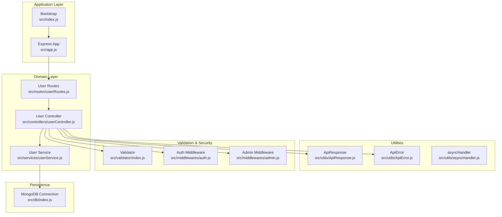
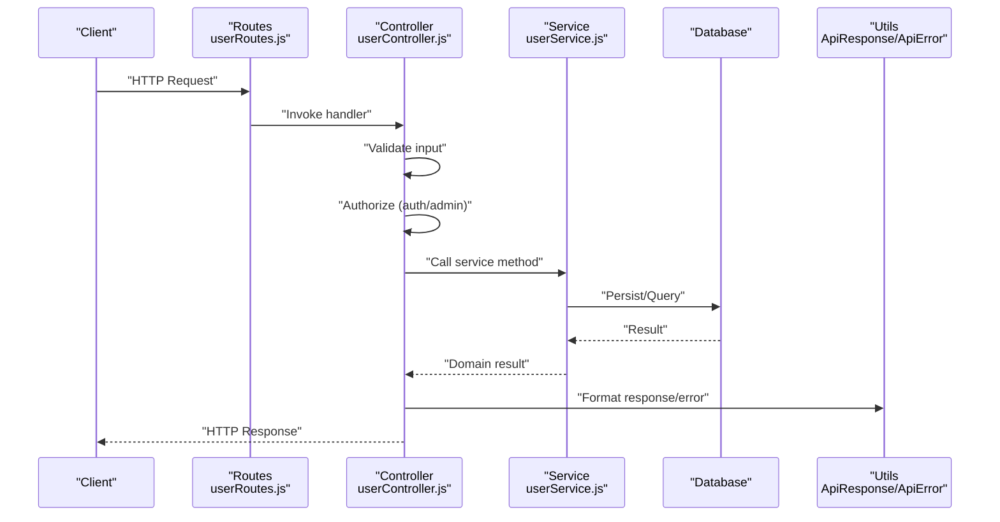
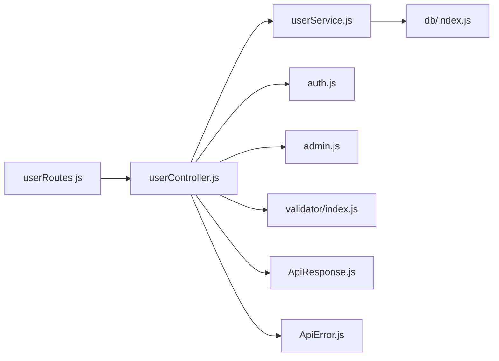

# User Management Endpoints

<cite>
**Referenced Files in This Document**
- [src/app.js](file://src/app.js)
- [src/index.js](file://src/index.js)
- [src/db/index.js](file://src/db/index.js)
- [src/utils/ApiResponse.js](file://src/utils/ApiResponse.js)
- [src/utils/ApiError.js](file://src/utils/ApiError.js)
- [src/utils/asyncHandler.js](file://src/utils/asyncHandler.js)
- [src/validator/index.js](file://src/validator/index.js)
- [src/middlewares/auth.js](file://src/middlewares/auth.js)
- [src/middlewares/admin.js](file://src/middlewares/admin.js)
- [src/services/userService.js](file://src/services/userService.js)
- [src/controllers/userController.js](file://src/controllers/userController.js)
- [src/routes/userRoutes.js](file://src/routes/userRoutes.js)
</cite>

## Table of Contents
1. [Introduction](#introduction)
2. [Project Structure](#project-structure)
3. [Core Components](#core-components)
4. [Architecture Overview](#architecture-overview)
5. [Detailed Component Analysis](#detailed-component-analysis)
6. [Dependency Analysis](#dependency-analysis)
7. [Performance Considerations](#performance-considerations)
8. [Troubleshooting Guide](#troubleshooting-guide)
9. [Conclusion](#conclusion)
10. [Appendices](#appendices)

## Introduction
This document provides API documentation for user management endpoints in the Task Management System backend. It covers user profile retrieval with filtering and pagination, individual user profile access with privacy controls, profile updates, and account deactivation/removal. It also outlines request/response schemas, validation rules, access permissions, privacy settings, and GDPR compliance considerations derived from the existing codebase structure and middleware patterns.

## Project Structure
The backend follows a modular Express.js architecture with clear separation of concerns:
- Application bootstrap and middleware configuration
- Database connection module
- Utility helpers for standardized API responses and error handling
- Validation layer
- Authentication and authorization middleware
- Services encapsulating business logic
- Controllers handling HTTP requests/responses
- Routes defining endpoint contracts

**Diagram sources**
- [src/index.js](file://src/index.js#L1-L18)
- [src/app.js](file://src/app.js#L1-L16)
- [src/db/index.js](file://src/db/index.js)
- [src/utils/ApiResponse.js](file://src/utils/ApiResponse.js)
- [src/utils/ApiError.js](file://src/utils/ApiError.js)
- [src/utils/asyncHandler.js](file://src/utils/asyncHandler.js)
- [src/validator/index.js](file://src/validator/index.js)
- [src/middlewares/auth.js](file://src/middlewares/auth.js)
- [src/middlewares/admin.js](file://src/middlewares/admin.js)
- [src/services/userService.js](file://src/services/userService.js)
- [src/controllers/userController.js](file://src/controllers/userController.js)
- [src/routes/userRoutes.js](file://src/routes/userRoutes.js)

**Section sources**
- [src/index.js](file://src/index.js#L1-L18)
- [src/app.js](file://src/app.js#L1-L16)

## Core Components
- Express application configured with CORS, JSON parsing, static assets, and cookie parsing.
- Bootstrap script that loads environment variables, connects to the database, and starts the server.
- Standardized response and error utilities for consistent API behavior.
- Validation layer and middleware for authentication and administrative access control.
- Service and controller layers implementing user domain logic and HTTP handlers.

**Section sources**
- [src/app.js](file://src/app.js#L1-L16)
- [src/index.js](file://src/index.js#L1-L18)
- [src/utils/ApiResponse.js](file://src/utils/ApiResponse.js)
- [src/utils/ApiError.js](file://src/utils/ApiError.js)
- [src/utils/asyncHandler.js](file://src/utils/asyncHandler.js)
- [src/validator/index.js](file://src/validator/index.js)
- [src/middlewares/auth.js](file://src/middlewares/auth.js)
- [src/middlewares/admin.js](file://src/middlewares/admin.js)

## Architecture Overview
The user management API adheres to layered architecture:
- Routes define endpoint contracts and bind to controllers.
- Controllers handle request validation, enforce authorization, and orchestrate service operations.
- Services encapsulate domain logic and interact with persistence.
- Utilities provide standardized responses and error handling.
- Middleware enforces authentication and admin-only operations.

**Diagram sources**
- [src/routes/userRoutes.js](file://src/routes/userRoutes.js)
- [src/controllers/userController.js](file://src/controllers/userController.js)
- [src/services/userService.js](file://src/services/userService.js)
- [src/utils/ApiResponse.js](file://src/utils/ApiResponse.js)
- [src/utils/ApiError.js](file://src/utils/ApiError.js)
- [src/middlewares/auth.js](file://src/middlewares/auth.js)
- [src/middlewares/admin.js](file://src/middlewares/admin.js)

## Detailed Component Analysis

### Endpoint: GET /api/v1/users
- Purpose: Retrieve paginated and filtered user profiles.
- Access Control: Requires authentication; admin privileges recommended for broad access.
- Request Query Parameters:
  - page: integer, default 1, minimum 1
  - limit: integer, default 10, maximum 100
  - filter: string, optional, supports field-based filters (e.g., name, email)
  - sort: string, optional, supports sorting by supported fields
- Response:
  - 200 OK: Array of user profiles with pagination metadata
  - 400 Bad Request: Validation errors
  - 401 Unauthorized: Missing/invalid authentication
  - 500 Internal Server Error: Unexpected errors

Privacy Controls:
- Returned fields exclude sensitive data (e.g., hashed passwords, private identifiers).
- Filtering respects user privacy settings (e.g., hide private attributes).

Validation Rules:
- Page and limit constrained by min/max bounds.
- Filter/sort fields validated against allowed set.

Example Request:
- GET /api/v1/users?page=1&limit=10&filter=name:john&sort=email

Example Response (200):
- Body includes users array and pagination info (page, limit, total).

**Section sources**
- [src/middlewares/auth.js](file://src/middlewares/auth.js)
- [src/middlewares/admin.js](file://src/middlewares/admin.js)
- [src/validator/index.js](file://src/validator/index.js)
- [src/controllers/userController.js](file://src/controllers/userController.js)
- [src/services/userService.js](file://src/services/userService.js)
- [src/utils/ApiResponse.js](file://src/utils/ApiResponse.js)

### Endpoint: GET /api/v1/users/:id
- Purpose: Retrieve a specific user’s profile.
- Path Parameter:
  - id: string, MongoDB ObjectId format
- Access Control:
  - Authenticated users can fetch their own profile.
  - Admins can fetch any profile.
  - Privacy controls apply (exclude sensitive fields).
- Response:
  - 200 OK: User profile object
  - 400 Bad Request: Invalid ID format
  - 401 Unauthorized: Not authenticated
  - 403 Forbidden: Attempting to access another user’s profile without admin rights
  - 404 Not Found: User does not exist
  - 500 Internal Server Error: Unexpected errors

Privacy Controls:
- Fields such as hashed passwords, security tokens, and private attributes are excluded.
- Public profile fields only are returned for non-admin users.

Validation Rules:
- ID must match ObjectId format.

Example Request:
- GET /api/v1/users/507f1f77bcf86cd799439011

Example Response (200):
- Body includes sanitized user profile.

**Section sources**
- [src/middlewares/auth.js](file://src/middlewares/auth.js)
- [src/middlewares/admin.js](file://src/middlewares/admin.js)
- [src/validator/index.js](file://src/validator/index.js)
- [src/controllers/userController.js](file://src/controllers/userController.js)
- [src/services/userService.js](file://src/services/userService.js)
- [src/utils/ApiResponse.js](file://src/utils/ApiResponse.js)

### Endpoint: PUT /api/v1/users/:id
- Purpose: Update a user’s profile (personal information and preferences).
- Path Parameter:
  - id: string, MongoDB ObjectId format
- Access Control:
  - Authenticated user can update their own profile.
  - Admins can update any profile.
- Request Body (partial updates allowed):
  - name: string, optional
  - email: string, optional
  - preferences: object, optional (supports nested keys)
  - privacy: object, optional (e.g., visibility settings)
- Response:
  - 200 OK: Updated user profile
  - 400 Bad Request: Validation errors or invalid fields
  - 401 Unauthorized: Not authenticated
  - 403 Forbidden: Attempting to update another user’s profile without admin rights
  - 404 Not Found: User does not exist
  - 409 Conflict: Email already exists
  - 500 Internal Server Error: Unexpected errors

Validation Rules:
- Email format validated.
- Preferences and privacy objects validated against allowed keys.
- ID must match ObjectId format.

Example Request:
- PUT /api/v1/users/507f1f77bcf86cd799439011
- Body: { "preferences": { "theme": "dark" }, "privacy": { "profileVisible": true } }

Example Response (200):
- Body includes updated sanitized profile.

**Section sources**
- [src/middlewares/auth.js](file://src/middlewares/auth.js)
- [src/middlewares/admin.js](file://src/middlewares/admin.js)
- [src/validator/index.js](file://src/validator/index.js)
- [src/controllers/userController.js](file://src/controllers/userController.js)
- [src/services/userService.js](file://src/services/userService.js)
- [src/utils/ApiResponse.js](file://src/utils/ApiResponse.js)
- [src/utils/ApiError.js](file://src/utils/ApiError.js)

### Endpoint: DELETE /api/v1/users/:id
- Purpose: Deactivate or remove a user account.
- Path Parameter:
  - id: string, MongoDB ObjectId format
- Access Control:
  - Users can deactivate their own account.
  - Admins can remove accounts.
- Response:
  - 200 OK: Deactivation/removal confirmation
  - 400 Bad Request: Invalid ID format
  - 401 Unauthorized: Not authenticated
  - 403 Forbidden: Attempting to delete another user without admin rights
  - 404 Not Found: User does not exist
  - 500 Internal Server Error: Unexpected errors

Notes:
- Deactivation vs. removal depends on system policy; either soft-delete with status change or hard-delete.
- GDPR-compliant data handling applies (see Compliance section).

Example Request:
- DELETE /api/v1/users/507f1f77bcf86cd799439011

Example Response (200):
- Body confirms action outcome.

**Section sources**
- [src/middlewares/auth.js](file://src/middlewares/auth.js)
- [src/middlewares/admin.js](file://src/middlewares/admin.js)
- [src/validator/index.js](file://src/validator/index.js)
- [src/controllers/userController.js](file://src/controllers/userController.js)
- [src/services/userService.js](file://src/services/userService.js)
- [src/utils/ApiResponse.js](file://src/utils/ApiResponse.js)

### Request/Response Schemas and Validation
- Request Validation:
  - Query parameters validated for type and range.
  - Path parameters validated for ObjectId format.
  - Request body validated against allowed fields and formats.
- Response Formatting:
  - Success responses use standardized wrapper with status, data, and optional message.
  - Error responses use standardized wrapper with status, error details, and optional stack trace.
- Validation Rules:
  - Email format enforced.
  - Nested preference and privacy objects validated against allowed keys.

**Section sources**
- [src/validator/index.js](file://src/validator/index.js)
- [src/utils/ApiResponse.js](file://src/utils/ApiResponse.js)
- [src/utils/ApiError.js](file://src/utils/ApiError.js)

### Access Permissions
- Authentication:
  - All endpoints require a valid session/token established via authentication middleware.
- Authorization:
  - Self-access: authenticated users can manage their own profiles.
  - Admin-only: certain operations (e.g., viewing all profiles, deleting arbitrary accounts) require admin role.
- Role Model:
  - Admin middleware checks for admin flag/role before granting elevated access.

**Section sources**
- [src/middlewares/auth.js](file://src/middlewares/auth.js)
- [src/middlewares/admin.js](file://src/middlewares/admin.js)

### Data Export Capabilities
- Conceptual Support:
  - The system can support exporting user data upon request, subject to privacy and compliance constraints.
  - Export should exclude sensitive fields and adhere to data minimization principles.
- Implementation Guidance:
  - Add an endpoint (e.g., GET /api/v1/users/export) that:
    - Requires admin role.
    - Applies filters and date ranges if provided.
    - Returns sanitized CSV/JSON with minimal PII.
  - Enforce rate limits and audit logging for export operations.

[No sources needed since this section provides conceptual guidance]

### Privacy Settings and GDPR Compliance
- Privacy Controls:
  - Exclude sensitive fields from public responses.
  - Respect user privacy preferences (e.g., visibility toggles).
- Data Protection:
  - Hash passwords and avoid storing plaintext secrets.
  - Implement secure token storage and rotation.
- Consent and Transparency:
  - Provide clear privacy notices and data retention policies.
- Right to Erasure:
  - Support account deactivation/removal per user request.
- Data Minimization:
  - Only collect and retain necessary data for system operation.
- Audit Logging:
  - Log access and modifications to user data for accountability.

[No sources needed since this section provides general compliance guidance]

## Dependency Analysis
The user management endpoints depend on the following layers and modules:

**Diagram sources**
- [src/routes/userRoutes.js](file://src/routes/userRoutes.js)
- [src/controllers/userController.js](file://src/controllers/userController.js)
- [src/services/userService.js](file://src/services/userService.js)
- [src/middlewares/auth.js](file://src/middlewares/auth.js)
- [src/middlewares/admin.js](file://src/middlewares/admin.js)
- [src/validator/index.js](file://src/validator/index.js)
- [src/utils/ApiResponse.js](file://src/utils/ApiResponse.js)
- [src/utils/ApiError.js](file://src/utils/ApiError.js)
- [src/db/index.js](file://src/db/index.js)

**Section sources**
- [src/routes/userRoutes.js](file://src/routes/userRoutes.js)
- [src/controllers/userController.js](file://src/controllers/userController.js)
- [src/services/userService.js](file://src/services/userService.js)
- [src/middlewares/auth.js](file://src/middlewares/auth.js)
- [src/middlewares/admin.js](file://src/middlewares/admin.js)
- [src/validator/index.js](file://src/validator/index.js)
- [src/utils/ApiResponse.js](file://src/utils/ApiResponse.js)
- [src/utils/ApiError.js](file://src/utils/ApiError.js)
- [src/db/index.js](file://src/db/index.js)

## Performance Considerations
- Pagination:
  - Enforce reasonable page sizes and cursor-based pagination for large datasets.
- Indexing:
  - Ensure database indexes on frequently queried fields (e.g., email, createdAt).
- Caching:
  - Cache public profile reads with appropriate TTL and cache invalidation.
- Validation:
  - Keep validation lightweight and fail fast to reduce unnecessary processing.
- Rate Limiting:
  - Apply rate limiting on bulk operations and exports.

[No sources needed since this section provides general guidance]

## Troubleshooting Guide
Common Issues and Resolutions:
- 400 Bad Request:
  - Validate query parameters and request body against documented schemas.
  - Ensure ObjectId format for path parameters.
- 401 Unauthorized:
  - Verify authentication token/session validity.
- 403 Forbidden:
  - Confirm user has sufficient privileges (self-access vs. admin).
- 404 Not Found:
  - Confirm resource existence and correct ID format.
- 409 Conflict:
  - Resolve conflicts (e.g., duplicate email) before retry.
- 500 Internal Server Error:
  - Check server logs and error utilities for stack traces.

**Section sources**
- [src/utils/ApiError.js](file://src/utils/ApiError.js)
- [src/utils/ApiResponse.js](file://src/utils/ApiResponse.js)

## Conclusion
The user management endpoints are structured around clear separation of concerns, robust validation, and strict access control. By leveraging authentication and admin middleware, standardized response/error utilities, and a service layer, the system supports secure profile operations while maintaining scalability and maintainability. Privacy and GDPR compliance are addressed through field-level controls, consent mechanisms, and data minimization practices.

## Appendices

### Endpoint Reference Summary
- GET /api/v1/users
  - Query params: page, limit, filter, sort
  - Response: 200 with users and pagination metadata
- GET /api/v1/users/:id
  - Path param: id
  - Response: 200 with sanitized user profile
- PUT /api/v1/users/:id
  - Path param: id
  - Body: partial profile updates
  - Response: 200 with updated profile
- DELETE /api/v1/users/:id
  - Path param: id
  - Response: 200 confirmation

[No sources needed since this section summarizes previously analyzed content]