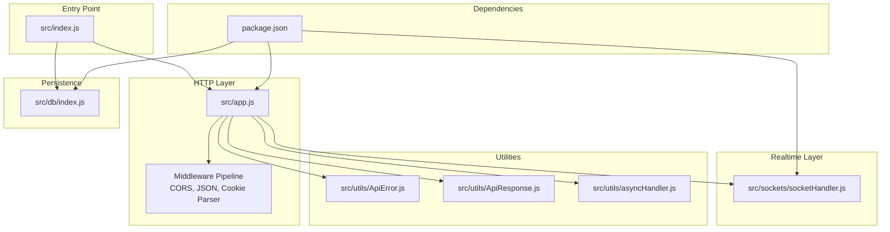
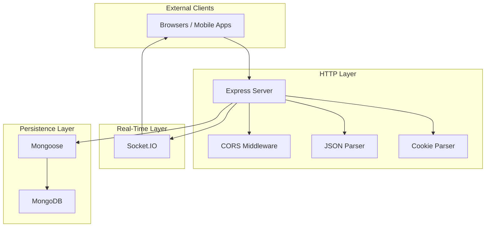
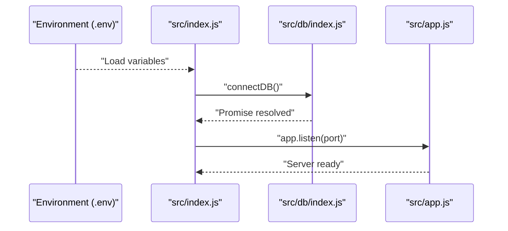
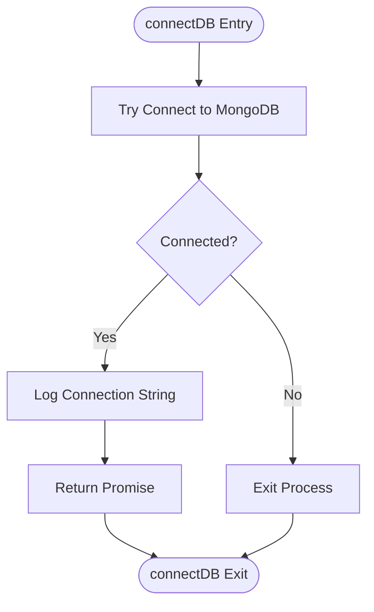
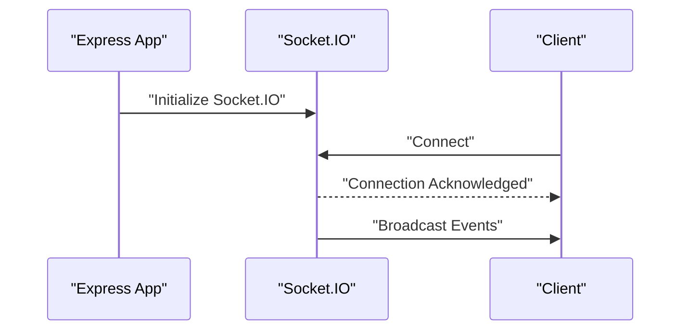
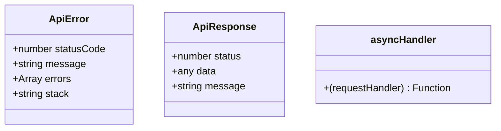
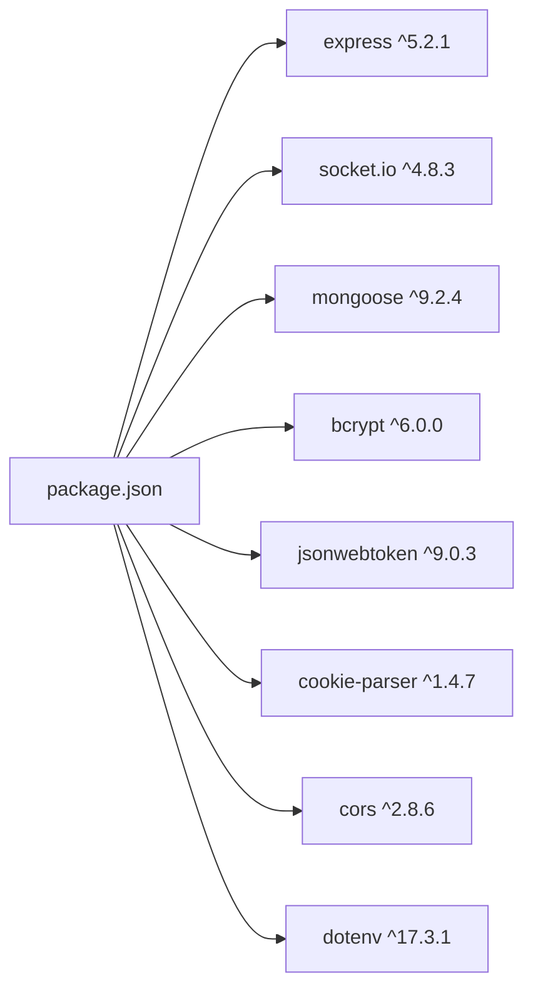

# Application Architecture

<cite>
**Referenced Files in This Document**
- [package.json](file://package.json)
- [src/index.js](file://src/index.js)
- [src/app.js](file://src/app.js)
- [src/db/index.js](file://src/db/index.js)
- [src/utils/ApiError.js](file://src/utils/ApiError.js)
- [src/utils/ApiResponse.js](file://src/utils/ApiResponse.js)
- [src/utils/asyncHandler.js](file://src/utils/asyncHandler.js)
- [src/sockets/socketHandler.js](file://src/sockets/socketHandler.js)
</cite>

## Table of Contents
1. [Introduction](#introduction)
2. [Project Structure](#project-structure)
3. [Core Components](#core-components)
4. [Architecture Overview](#architecture-overview)
5. [Detailed Component Analysis](#detailed-component-analysis)
6. [Dependency Analysis](#dependency-analysis)
7. [Performance Considerations](#performance-considerations)
8. [Troubleshooting Guide](#troubleshooting-guide)
9. [Conclusion](#conclusion)
10. [Appendices](#appendices)

## Introduction
This document describes the architecture of the Task Management System Backend application. The backend follows a layered architecture with clear separation of concerns and integrates Express for HTTP services, Socket.IO for real-time communication, and modular utility classes for error handling and response formatting. It also outlines infrastructure requirements, scalability considerations, deployment topology, and cross-cutting concerns such as CORS configuration and middleware processing.

## Project Structure
The backend is organized into feature-oriented layers under src, with configuration, database connectivity, utilities, sockets, and entry points clearly separated. The application starts from a single entry point that initializes environment configuration, connects to the database, and launches the HTTP server.

**Diagram sources**
- [src/index.js](file://src/index.js#L1-L18)
- [src/app.js](file://src/app.js#L1-L16)
- [src/db/index.js](file://src/db/index.js#L1-L14)
- [src/utils/ApiError.js](file://src/utils/ApiError.js#L1-L22)
- [src/utils/ApiResponse.js](file://src/utils/ApiResponse.js#L1-L17)
- [src/utils/asyncHandler.js](file://src/utils/asyncHandler.js#L1-L8)
- [src/sockets/socketHandler.js](file://src/sockets/socketHandler.js#L1-L7)
- [package.json](file://package.json#L1-L28)

**Section sources**
- [src/index.js](file://src/index.js#L1-L18)
- [src/app.js](file://src/app.js#L1-L16)
- [src/db/index.js](file://src/db/index.js#L1-L14)
- [src/utils/ApiError.js](file://src/utils/ApiError.js#L1-L22)
- [src/utils/ApiResponse.js](file://src/utils/ApiResponse.js#L1-L17)
- [src/utils/asyncHandler.js](file://src/utils/asyncHandler.js#L1-L8)
- [src/sockets/socketHandler.js](file://src/sockets/socketHandler.js#L1-L7)
- [package.json](file://package.json#L1-L28)

## Core Components
- HTTP Server and Middleware Pipeline
  - Express application configured with CORS, static assets, JSON parsing, and cookie parsing.
  - Environment-driven CORS origin and JSON payload limits.
- Database Connectivity
  - MongoDB connection via Mongoose with centralized connection management.
- Real-Time Communication
  - Socket.IO integration point established for real-time features.
- Utilities
  - ApiError and ApiResponse for consistent error and success responses.
  - asyncHandler for wrapping asynchronous route handlers to safely pass errors to Express error-handling middleware.
- Entry Point
  - Loads environment variables, connects to the database, and starts the HTTP server.

**Section sources**
- [src/app.js](file://src/app.js#L1-L16)
- [src/db/index.js](file://src/db/index.js#L1-L14)
- [src/sockets/socketHandler.js](file://src/sockets/socketHandler.js#L1-L7)
- [src/utils/ApiError.js](file://src/utils/ApiError.js#L1-L22)
- [src/utils/ApiResponse.js](file://src/utils/ApiResponse.js#L1-L17)
- [src/utils/asyncHandler.js](file://src/utils/asyncHandler.js#L1-L8)
- [src/index.js](file://src/index.js#L1-L18)

## Architecture Overview
The system follows a layered architecture:
- Presentation/HTTP Layer: Express server with middleware pipeline.
- Application Layer: Route handlers and controllers (not present in current snapshot but structured for future expansion).
- Domain/Service Layer: Services (not present in current snapshot but structured for future expansion).
- Persistence Layer: MongoDB via Mongoose.
- Real-Time Layer: Socket.IO for event broadcasting and client-server communication.

**Diagram sources**
- [src/app.js](file://src/app.js#L1-L16)
- [src/db/index.js](file://src/db/index.js#L1-L14)
- [src/sockets/socketHandler.js](file://src/sockets/socketHandler.js#L1-L7)
- [package.json](file://package.json#L14-L26)

## Detailed Component Analysis

### Express Server Setup and Middleware Pipeline
- Initialization and Environment Loading
  - Loads environment variables from a dotenv file and sets the server port.
- Middleware Configuration
  - CORS enabled with origin from environment variable.
  - Static asset serving for public folder.
  - JSON body parsing with size limit.
  - Cookie parsing for session and auth tokens.
- Control Flow
  - On successful database connection, the server listens on the configured port.

**Diagram sources**
- [src/index.js](file://src/index.js#L1-L18)
- [src/db/index.js](file://src/db/index.js#L1-L14)
- [src/app.js](file://src/app.js#L1-L16)

**Section sources**
- [src/index.js](file://src/index.js#L1-L18)
- [src/app.js](file://src/app.js#L1-L16)

### Database Connectivity
- Connection Management
  - Centralized Mongoose connection with logging of the active connection string.
  - Graceful exit on connection failure.
- Scalability Notes
  - Connection pooling is handled by Mongoose; tune connection options via environment variables for production deployments.

**Diagram sources**
- [src/db/index.js](file://src/db/index.js#L1-L14)

**Section sources**
- [src/db/index.js](file://src/db/index.js#L1-L14)

### Real-Time Communication with Socket.IO
- Current State
  - Socket.IO integration point exists and is imported by the Express app; handler implementation is currently empty and awaits development.
- Future Integration
  - Typical integration involves initializing Socket.IO with the Express server, defining namespaces and rooms, and emitting events on task updates.

**Diagram sources**
- [src/app.js](file://src/app.js#L1-L16)
- [src/sockets/socketHandler.js](file://src/sockets/socketHandler.js#L1-L7)
- [package.json](file://package.json#L22-L22)

**Section sources**
- [src/sockets/socketHandler.js](file://src/sockets/socketHandler.js#L1-L7)
- [src/app.js](file://src/app.js#L1-L16)
- [package.json](file://package.json#L22-L22)

### Utility Classes: Error Handling and Response Formatting
- ApiError
  - Extends native Error with status code, message, and optional stack.
- ApiResponse
  - Standardizes successful responses with status, data, and message fields.
- asyncHandler
  - Wraps async route handlers to forward thrown/rejected promises to Express error middleware.

**Diagram sources**
- [src/utils/ApiError.js](file://src/utils/ApiError.js#L1-L22)
- [src/utils/ApiResponse.js](file://src/utils/ApiResponse.js#L1-L17)
- [src/utils/asyncHandler.js](file://src/utils/asyncHandler.js#L1-L8)

**Section sources**
- [src/utils/ApiError.js](file://src/utils/ApiError.js#L1-L22)
- [src/utils/ApiResponse.js](file://src/utils/ApiResponse.js#L1-L17)
- [src/utils/asyncHandler.js](file://src/utils/asyncHandler.js#L1-L8)

### Routing System (Planned)
- Current Snapshot
  - No route or controller directories are present in the current snapshot.
- Planned Structure
  - Routes would define HTTP endpoints and delegate to controllers.
  - Controllers would orchestrate service calls and return standardized responses using ApiResponse.
  - Middlewares would handle cross-cutting concerns like authentication and validation.

[No sources needed since this section does not analyze specific files]

### Authentication Flow (Planned)
- JWT-based authentication is used in the stack; typical flow includes:
  - Login endpoint validating credentials.
  - Generating JWT tokens and setting secure cookies.
  - Protected routes verifying tokens via middleware.
- Real-time clients could receive JWT-based session tokens to authorize Socket.IO connections.

[No sources needed since this section does not analyze specific files]

## Dependency Analysis
The backend relies on a focused set of dependencies aligned with the layered architecture and real-time needs.

**Diagram sources**
- [package.json](file://package.json#L14-L26)

**Section sources**
- [package.json](file://package.json#L1-L28)

## Performance Considerations
- HTTP Payload Limits
  - JSON body parsing is limited to prevent large payloads; adjust limits based on workload.
- Database Connection Pooling
  - Configure Mongoose connection options (pool size, server selection timeout) via environment variables for production.
- Real-Time Scaling
  - Socket.IO supports horizontal scaling with a shared state store (e.g., Redis) for room and presence management.
- Caching
  - Introduce caching for read-heavy endpoints to reduce database load.
- Monitoring
  - Add metrics and logging to track latency, throughput, and error rates.

[No sources needed since this section provides general guidance]

## Troubleshooting Guide
- Database Connection Failures
  - The connection module exits the process on failure; check the MongoDB URI and network connectivity.
- CORS Issues
  - Verify the CORS origin environment variable matches client origins.
- Port Conflicts
  - Ensure the configured port is free; the server logs the listening port on startup.
- Error Propagation
  - Use asyncHandler to wrap route handlers so unhandled rejections reach Express error middleware.

**Section sources**
- [src/db/index.js](file://src/db/index.js#L1-L14)
- [src/app.js](file://src/app.js#L1-L16)
- [src/utils/asyncHandler.js](file://src/utils/asyncHandler.js#L1-L8)

## Conclusion
The Task Management System Backend employs a clean layered architecture with Express for HTTP services, Mongoose for persistence, and Socket.IO for real-time capabilities. Modular utilities standardize error and response handling, while the middleware pipeline manages CORS, JSON parsing, and cookies. The current snapshot establishes the foundation for future development of routes, controllers, services, and robust authentication and real-time features.

[No sources needed since this section summarizes without analyzing specific files]

## Appendices

### Technology Stack and Version Compatibility
- Express: 5.2.1
- Socket.IO: 4.8.3
- Mongoose: 9.2.4
- bcrypt: 6.0.0
- jsonwebtoken: 9.0.3
- cookie-parser: 1.4.7
- cors: 2.8.6
- dotenv: 17.3.1

**Section sources**
- [package.json](file://package.json#L14-L26)

### Infrastructure Requirements
- Node.js runtime aligned with dependency versions.
- MongoDB instance or managed cluster.
- Optional Redis for Socket.IO scaling.
- Reverse proxy/load balancer for production deployments.

[No sources needed since this section provides general guidance]

### Deployment Topology
- Single-instance deployment for development.
- Horizontal scaling with multiple backend instances behind a load balancer.
- Socket.IO scaling via Redis adapter for distributed sessions and rooms.

[No sources needed since this section provides general guidance]