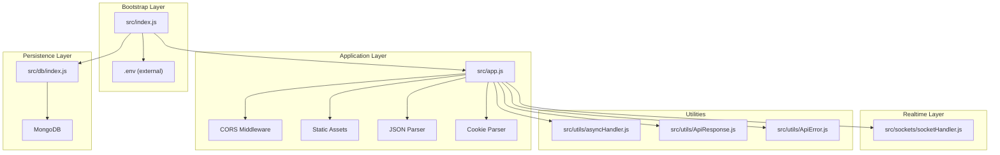
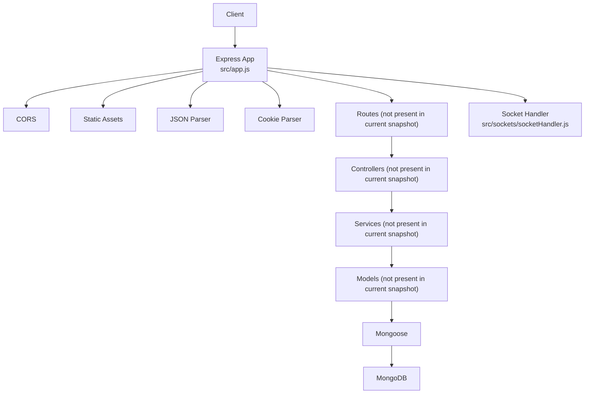
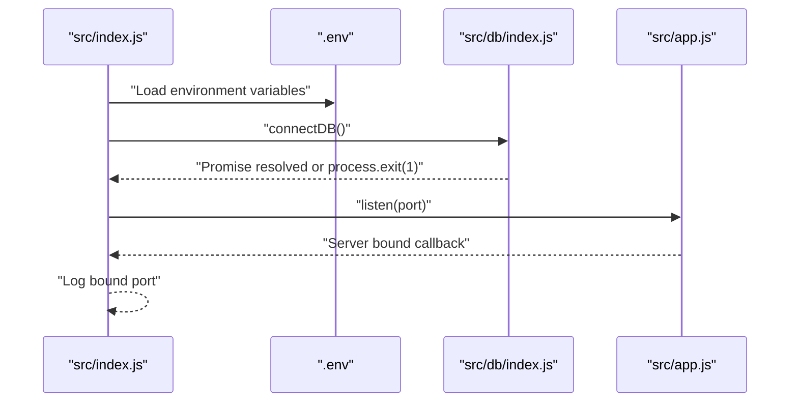
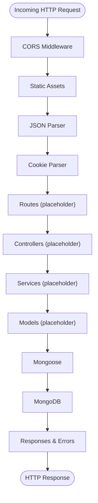
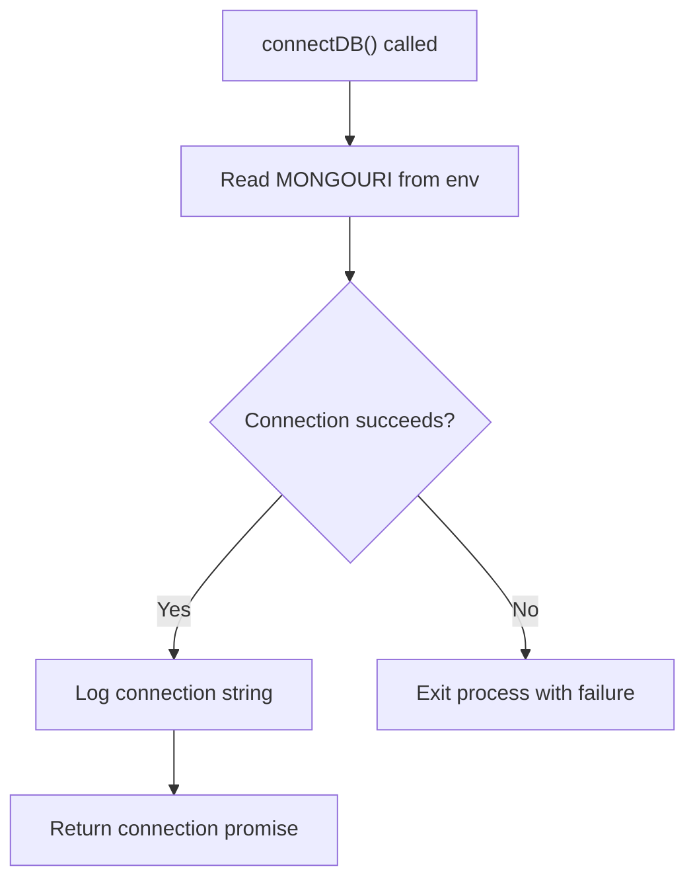
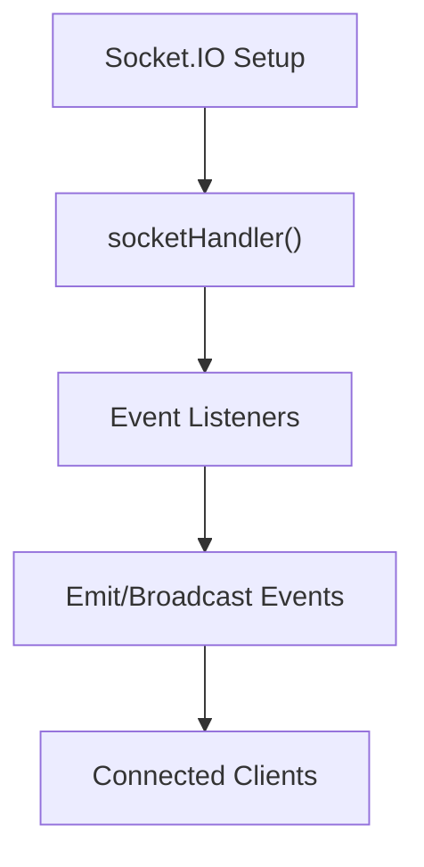
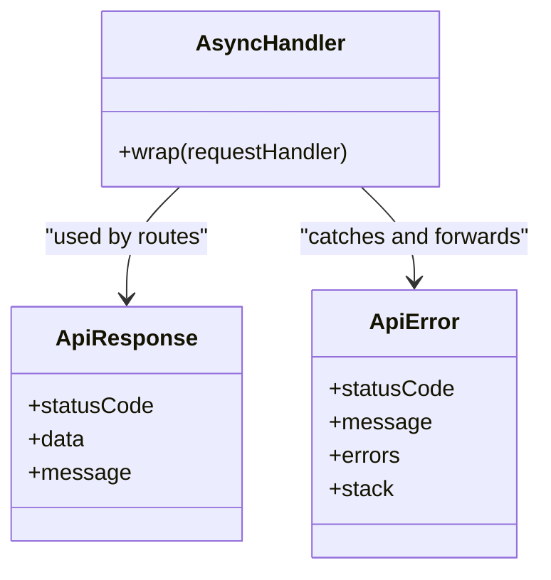
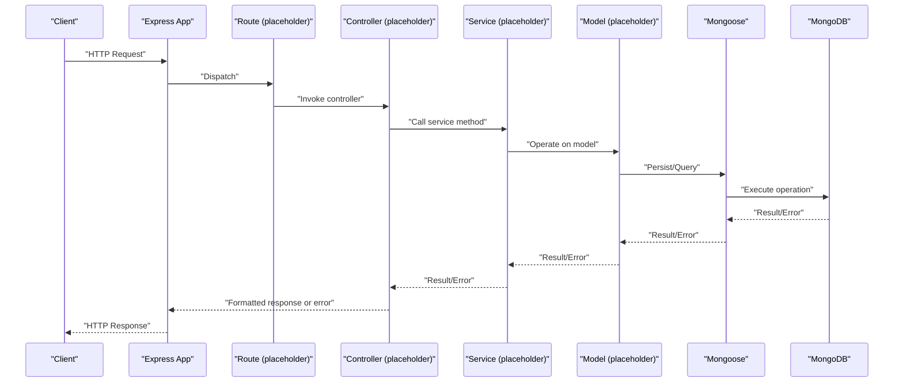
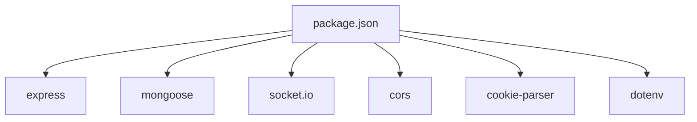

# Component Interactions

<cite>
**Referenced Files in This Document**
- [src/index.js](file://src/index.js)
- [src/app.js](file://src/app.js)
- [src/db/index.js](file://src/db/index.js)
- [src/sockets/socketHandler.js](file://src/sockets/socketHandler.js)
- [src/utils/asyncHandler.js](file://src/utils/asyncHandler.js)
- [src/utils/ApiResponse.js](file://src/utils/ApiResponse.js)
- [src/utils/ApiError.js](file://src/utils/ApiError.js)
- [package.json](file://package.json)
</cite>

## Table of Contents
1. [Introduction](#introduction)
2. [Project Structure](#project-structure)
3. [Core Components](#core-components)
4. [Architecture Overview](#architecture-overview)
5. [Detailed Component Analysis](#detailed-component-analysis)
6. [Dependency Analysis](#dependency-analysis)
7. [Performance Considerations](#performance-considerations)
8. [Troubleshooting Guide](#troubleshooting-guide)
9. [Conclusion](#conclusion)

## Introduction
This document explains how the Task Management System backend coordinates its components across architectural layers. It focuses on the bootstrap sequence, database connectivity, HTTP server setup, WebSocket event handling, middleware orchestration, and error/data response patterns. It also documents the current integration points and highlights areas for extending routing, controllers, services, and models to achieve a layered architecture.

## Project Structure
The backend follows a modular structure with clear separation of concerns:
- Bootstrap and environment: entry point initializes environment variables, connects to the database, and starts the HTTP server.
- Application core: Express application configured with CORS, static assets, JSON parsing, and cookie parsing.
- Persistence: Mongoose-based database connection module.
- Real-time: Placeholder for WebSocket handler.
- Utilities: Shared error and response wrappers, and an async error-handling utility for route handlers.

**Diagram sources**
- [src/index.js](file://src/index.js#L1-L18)
- [src/app.js](file://src/app.js#L1-L16)
- [src/db/index.js](file://src/db/index.js#L1-L14)
- [src/sockets/socketHandler.js](file://src/sockets/socketHandler.js#L1-L7)
- [src/utils/asyncHandler.js](file://src/utils/asyncHandler.js#L1-L8)
- [src/utils/ApiResponse.js](file://src/utils/ApiResponse.js#L1-L17)
- [src/utils/ApiError.js](file://src/utils/ApiError.js#L1-L22)

**Section sources**
- [src/index.js](file://src/index.js#L1-L18)
- [src/app.js](file://src/app.js#L1-L16)
- [src/db/index.js](file://src/db/index.js#L1-L14)
- [src/sockets/socketHandler.js](file://src/sockets/socketHandler.js#L1-L7)
- [src/utils/asyncHandler.js](file://src/utils/asyncHandler.js#L1-L8)
- [src/utils/ApiResponse.js](file://src/utils/ApiResponse.js#L1-L17)
- [src/utils/ApiError.js](file://src/utils/ApiError.js#L1-L22)
- [package.json](file://package.json#L1-L28)

## Core Components
- Bootstrap entry point: Loads environment variables, establishes a database connection, and starts the HTTP server.
- Express application: Provides middleware pipeline and integrates CORS, static assets, JSON parsing, and cookies.
- Database connector: Uses Mongoose to connect to MongoDB and logs the connection string upon success.
- WebSocket handler: Placeholder module for real-time event handling.
- Utility modules: Async error wrapper for route handlers, standardized response envelope, and error class for API responses.

Key integration points:
- Environment-driven configuration via dotenv.
- Port selection from environment variables.
- MongoDB URI from environment variables.
- CORS origin from environment variables.

**Section sources**
- [src/index.js](file://src/index.js#L1-L18)
- [src/app.js](file://src/app.js#L1-L16)
- [src/db/index.js](file://src/db/index.js#L1-L14)
- [src/sockets/socketHandler.js](file://src/sockets/socketHandler.js#L1-L7)
- [src/utils/asyncHandler.js](file://src/utils/asyncHandler.js#L1-L8)
- [src/utils/ApiResponse.js](file://src/utils/ApiResponse.js#L1-L17)
- [src/utils/ApiError.js](file://src/utils/ApiError.js#L1-L22)
- [package.json](file://package.json#L1-L28)

## Architecture Overview
The system follows a layered pattern:
- Presentation/HTTP layer: Express app with middleware.
- Persistence layer: Mongoose ODM connecting to MongoDB.
- Real-time layer: Socket.IO integration point (placeholder).
- Utilities layer: Shared helpers for error handling and response formatting.

**Diagram sources**
- [src/app.js](file://src/app.js#L1-L16)
- [src/db/index.js](file://src/db/index.js#L1-L14)
- [src/sockets/socketHandler.js](file://src/sockets/socketHandler.js#L1-L7)
- [src/utils/asyncHandler.js](file://src/utils/asyncHandler.js#L1-L8)
- [src/utils/ApiResponse.js](file://src/utils/ApiResponse.js#L1-L17)
- [src/utils/ApiError.js](file://src/utils/ApiError.js#L1-L22)

## Detailed Component Analysis

### Bootstrap Sequence and Initialization Order
The startup sequence ensures environment readiness, database connectivity, and server binding:
1. Load environment variables.
2. Establish database connection using Mongoose.
3. Start the Express server.
4. Log the bound port on successful startup.

**Diagram sources**
- [src/index.js](file://src/index.js#L1-L18)
- [src/db/index.js](file://src/db/index.js#L1-L14)
- [src/app.js](file://src/app.js#L1-L16)

**Section sources**
- [src/index.js](file://src/index.js#L1-L18)

### HTTP Server Coordination and Middleware Orchestration
The Express application configures middleware in a specific order:
- CORS policy configured from environment variable.
- Static asset serving.
- JSON body parsing with size limit.
- Cookie parsing.

These middleware layers define the request processing pipeline for incoming HTTP requests.

**Diagram sources**
- [src/app.js](file://src/app.js#L1-L16)
- [src/db/index.js](file://src/db/index.js#L1-L14)

**Section sources**
- [src/app.js](file://src/app.js#L1-L16)

### Database Connections and Data Flow
The database module encapsulates Mongoose connection:
- Reads the MongoDB URI from environment variables.
- Attempts to connect and logs the connection string on success.
- Exits the process on connection failure.

**Diagram sources**
- [src/db/index.js](file://src/db/index.js#L1-L14)

**Section sources**
- [src/db/index.js](file://src/db/index.js#L1-L14)

### WebSocket Event Handling
The WebSocket handler is currently a placeholder. Integration would typically involve:
- Initializing Socket.IO with the HTTP server.
- Defining namespaces and event listeners.
- Broadcasting events to connected clients.
- Managing room-based or user-specific channels.

**Diagram sources**
- [src/sockets/socketHandler.js](file://src/sockets/socketHandler.js#L1-L7)

**Section sources**
- [src/sockets/socketHandler.js](file://src/sockets/socketHandler.js#L1-L7)

### Error Handling and Response Patterns
The application exposes shared utilities for consistent error and response handling:
- Async error wrapper for route handlers to convert thrown errors into Express error-handling flow.
- Standardized response envelope for successful API responses.
- Error class for structured API errors with status codes and messages.

**Diagram sources**
- [src/utils/asyncHandler.js](file://src/utils/asyncHandler.js#L1-L8)
- [src/utils/ApiResponse.js](file://src/utils/ApiResponse.js#L1-L17)
- [src/utils/ApiError.js](file://src/utils/ApiError.js#L1-L22)

**Section sources**
- [src/utils/asyncHandler.js](file://src/utils/asyncHandler.js#L1-L8)
- [src/utils/ApiResponse.js](file://src/utils/ApiResponse.js#L1-L17)
- [src/utils/ApiError.js](file://src/utils/ApiError.js#L1-L22)

### Dependency Injection Patterns
Current state:
- No explicit DI container is present.
- Dependencies are imported directly within modules.
- Environment variables are injected via dotenv at bootstrap.

Recommended patterns for future extension:
- Use a lightweight DI container (e.g., InversifyJS) to register services and inject them into controllers.
- Define interfaces for services and models to enable swapping implementations.
- Centralize configuration objects and pass them as constructor parameters to avoid global environment reliance.

[No sources needed since this section provides general guidance]

### Service Layer Integration
Current state:
- Services directory exists but no files are present in the snapshot.

Integration guidelines:
- Place business logic in service modules.
- Inject models and external clients as dependencies.
- Keep controllers thin; delegate to services.
- Wrap service calls with the async error handler for consistent error propagation.

[No sources needed since this section provides general guidance]

### Data Flow Between Components
End-to-end HTTP flow:
1. Client sends an HTTP request.
2. Express middleware pipeline processes the request.
3. Routes dispatch to controllers.
4. Controllers invoke services.
5. Services operate on models and persist data via Mongoose.
6. Responses are formatted using the ApiResponse utility.
7. Errors are normalized using the ApiError utility and passed to Express error middleware.

**Diagram sources**
- [src/app.js](file://src/app.js#L1-L16)
- [src/utils/asyncHandler.js](file://src/utils/asyncHandler.js#L1-L8)
- [src/utils/ApiResponse.js](file://src/utils/ApiResponse.js#L1-L17)
- [src/utils/ApiError.js](file://src/utils/ApiError.js#L1-L22)
- [src/db/index.js](file://src/db/index.js#L1-L14)

## Dependency Analysis
External dependencies and their roles:
- Express: Web framework for HTTP server and middleware pipeline.
- Mongoose: ODM for MongoDB connectivity.
- Socket.IO: Real-time bidirectional communication library.
- CORS: Cross-origin resource sharing policy.
- Cookie parser: Parses HTTP cookies.
- Dotenv: Loads environment variables from .env.

**Diagram sources**
- [package.json](file://package.json#L1-L28)

**Section sources**
- [package.json](file://package.json#L1-L28)

## Performance Considerations
- Middleware ordering: Place static assets before heavy processing to reduce unnecessary work.
- JSON body size limits: Adjust limits based on payload sizes to prevent memory pressure.
- Database connection pooling: Configure Mongoose connection options for production environments.
- Graceful degradation: Implement circuit breakers around external services and fallbacks for partial failures.
- WebSocket scaling: Use clustering or separate real-time servers for horizontal scaling.

[No sources needed since this section provides general guidance]

## Troubleshooting Guide
Common issues and remedies:
- Database connection failures: Verify the MongoDB URI and network connectivity; the connection module exits the process on failure.
- CORS errors: Confirm the CORS origin environment variable matches the client origin.
- Port binding conflicts: Change the port environment variable if the default port is in use.
- Unhandled exceptions: Ensure route handlers are wrapped with the async error handler to propagate errors consistently.

**Section sources**
- [src/db/index.js](file://src/db/index.js#L1-L14)
- [src/app.js](file://src/app.js#L1-L16)
- [src/utils/asyncHandler.js](file://src/utils/asyncHandler.js#L1-L8)

## Conclusion
The backend establishes a clean bootstrap sequence, a configurable Express application, and a robust database connection module. While the routing, controllers, services, and models directories exist, they are not populated in the current snapshot. Integrating routes, controllers, services, and models will complete the layered architecture. Adding a DI container, centralizing configuration, and implementing standardized error and response patterns will improve maintainability and scalability. The WebSocket handler remains a placeholder and should be integrated alongside Socket.IO for real-time capabilities.