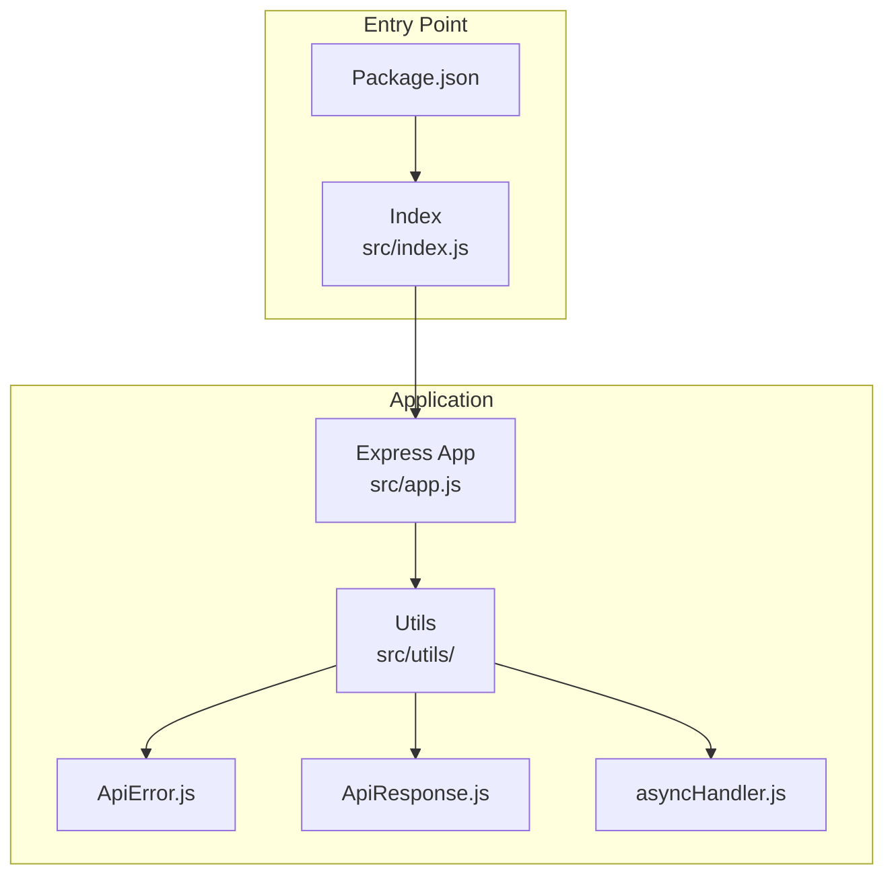
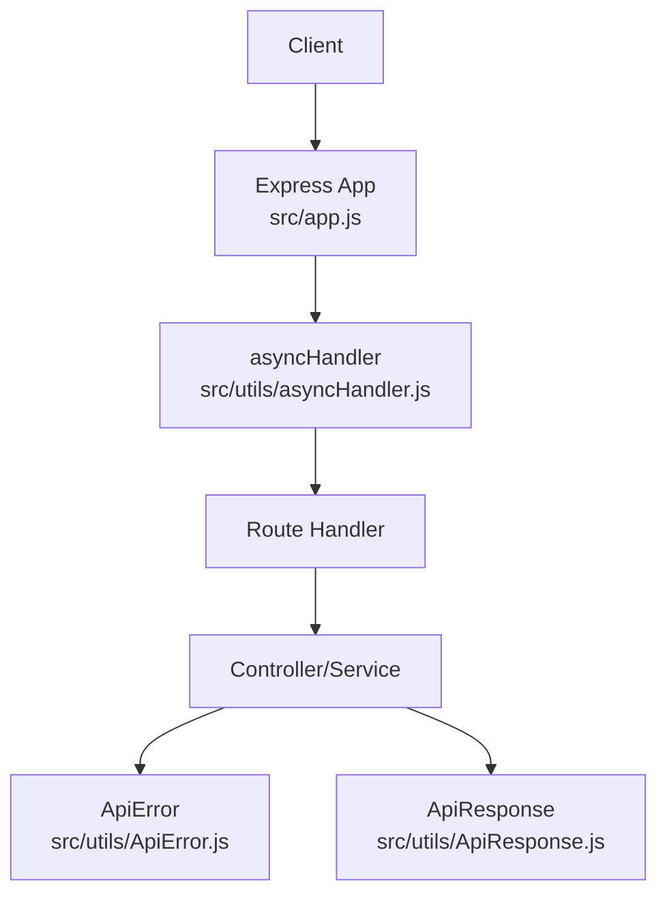
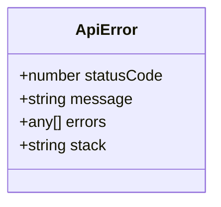
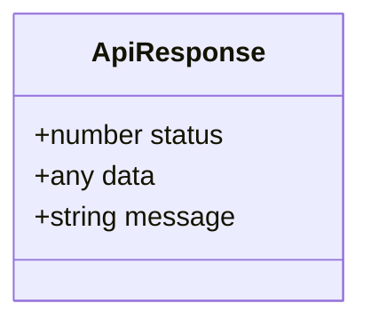
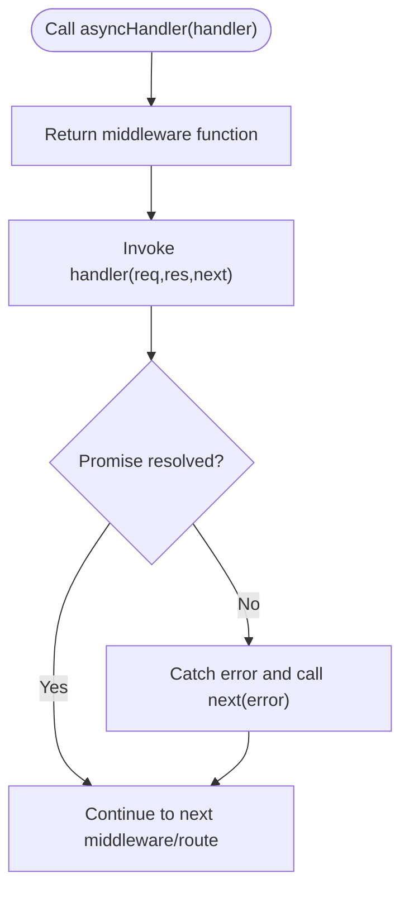
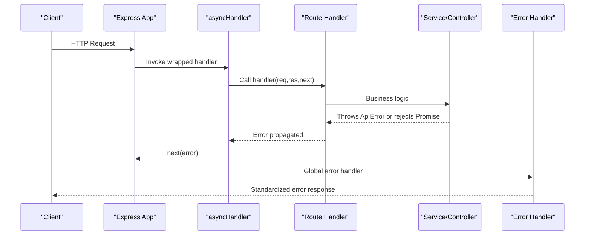
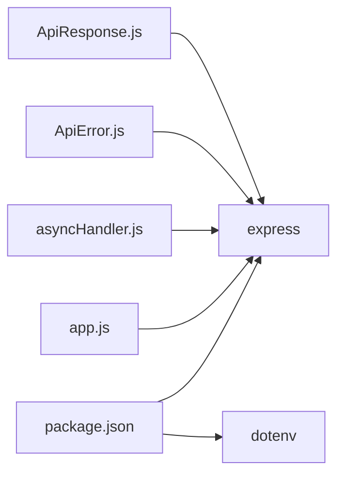

# Error Handling System

<cite>
**Referenced Files in This Document**
- [ApiError.js](file://src/utils/ApiError.js)
- [ApiResponse.js](file://src/utils/ApiResponse.js)
- [asyncHandler.js](file://src/utils/asyncHandler.js)
- [app.js](file://src/app.js)
- [index.js](file://src/index.js)
- [package.json](file://package.json)
</cite>

## Table of Contents
1. [Introduction](#introduction)
2. [Project Structure](#project-structure)
3. [Core Components](#core-components)
4. [Architecture Overview](#architecture-overview)
5. [Detailed Component Analysis](#detailed-component-analysis)
6. [Dependency Analysis](#dependency-analysis)
7. [Performance Considerations](#performance-considerations)
8. [Troubleshooting Guide](#troubleshooting-guide)
9. [Conclusion](#conclusion)

## Introduction
This document explains the error handling and response formatting system implemented in the backend. It focuses on three core utilities:
- ApiError: a custom error class for consistent error responses
- ApiResponse: a standardized success response wrapper
- asyncHandler: a promise-based wrapper to simplify async route handlers

It also documents error propagation patterns, HTTP status code mapping, response formatting standards, middleware integration, practical usage examples, and debugging/logging/error monitoring strategies.

## Project Structure
The error handling utilities live under the utils directory and are integrated into the Express application via the app module. The application entry point initializes the database connection and starts the server.

**Diagram sources**
- [app.js](file://src/app.js#L1-L16)
- [index.js](file://src/index.js#L1-L18)
- [package.json](file://package.json#L1-L28)

**Section sources**
- [app.js](file://src/app.js#L1-L16)
- [index.js](file://src/index.js#L1-L18)
- [package.json](file://package.json#L1-L28)

## Core Components
This section documents the three core utilities that form the error handling and response formatting backbone.

- ApiError
  - Purpose: Standardize error responses with a consistent shape including HTTP status code, message, and optional nested errors.
  - Fields: statusCode, message, errors, stack.
  - Usage pattern: Throw ApiError instances from controllers/services when validation or business logic fails.

- ApiResponse
  - Purpose: Standardize successful responses with a consistent shape including HTTP status code, data payload, and message.
  - Fields: status, data, message.
  - Usage pattern: Return ApiResponse instances from controllers/services to send structured success responses.

- asyncHandler
  - Purpose: Wrap Express route handlers to convert thrown exceptions and rejected promises into Express error-handling flow.
  - Behavior: Returns a function that invokes the handler and forwards any error to next(error).

**Section sources**
- [ApiError.js](file://src/utils/ApiError.js#L1-L22)
- [ApiResponse.js](file://src/utils/ApiResponse.js#L1-L17)
- [asyncHandler.js](file://src/utils/asyncHandler.js#L1-L8)

## Architecture Overview
The error handling system integrates with the Express middleware pipeline. While a dedicated error-handling middleware is not present in the current snapshot, the asyncHandler wrapper ensures unhandled rejections and thrown errors propagate to the global error handler. The app module sets up Express and CORS/JSON parsing, while the index module connects to the database and starts the server.

**Diagram sources**
- [app.js](file://src/app.js#L1-L16)
- [asyncHandler.js](file://src/utils/asyncHandler.js#L1-L8)
- [ApiError.js](file://src/utils/ApiError.js#L1-L22)
- [ApiResponse.js](file://src/utils/ApiResponse.js#L1-L17)

## Detailed Component Analysis

### ApiError: Custom Error Class
- Design: Extends the native Error class to carry HTTP status code and optional nested errors.
- Construction: Accepts statusCode, message, errors array, and optional stack.
- Propagation: When thrown inside asyncHandler-wrapped route handlers, the error is forwarded to Express’s next(error), enabling centralized error handling.

**Diagram sources**
- [ApiError.js](file://src/utils/ApiError.js#L1-L22)

**Section sources**
- [ApiError.js](file://src/utils/ApiError.js#L1-L22)

### ApiResponse: Standardized Success Response
- Design: Encapsulates success responses with status, data, and message fields.
- Construction: Accepts statusCode, data, and an optional message with a default value.
- Usage: Controllers/services return ApiResponse instances to ensure consistent success payloads.

**Diagram sources**
- [ApiResponse.js](file://src/utils/ApiResponse.js#L1-L17)

**Section sources**
- [ApiResponse.js](file://src/utils/ApiResponse.js#L1-L17)

### asyncHandler: Promise-Based Wrapper
- Design: Higher-order function that wraps Express route handlers.
- Behavior: Invokes the handler and catches any thrown error or rejected promise, forwarding it to next(error).
- Integration: Ensures async route handlers integrate cleanly with Express’s error middleware.

**Diagram sources**
- [asyncHandler.js](file://src/utils/asyncHandler.js#L1-L8)

**Section sources**
- [asyncHandler.js](file://src/utils/asyncHandler.js#L1-L8)

### Middleware Pipeline Integration
- Current state: The Express app sets up CORS, static assets, JSON parsing, and cookie parsing. There is no explicit error-handling middleware in the provided files.
- Integration point: asyncHandler ensures thrown/rejected errors reach the global error handler. To enforce consistent error responses, add a dedicated error-handling middleware after all routes.

**Diagram sources**
- [app.js](file://src/app.js#L1-L16)
- [asyncHandler.js](file://src/utils/asyncHandler.js#L1-L8)
- [ApiError.js](file://src/utils/ApiError.js#L1-L22)

**Section sources**
- [app.js](file://src/app.js#L1-L16)

## Dependency Analysis
- Internal dependencies:
  - apiHandler depends on Express’s next callback to forward errors.
  - ApiResponse and ApiError are standalone utilities used by controllers/services.
- External dependencies:
  - Express is used for the web framework and middleware pipeline.
  - Environment configuration via dotenv is loaded at startup.

**Diagram sources**
- [package.json](file://package.json#L1-L28)
- [app.js](file://src/app.js#L1-L16)

**Section sources**
- [package.json](file://package.json#L1-L28)
- [app.js](file://src/app.js#L1-L16)

## Performance Considerations
- Keep error payloads minimal: Use the errors array sparingly to avoid large response bodies.
- Prefer early validation: Reduce unnecessary work by validating inputs before heavy operations.
- Avoid redundant wrapping: Ensure asyncHandler is applied only where necessary to prevent extra overhead.
- Logging: Integrate structured logging in a future error-handling middleware to capture stack traces and request metadata without exposing sensitive details to clients.

## Troubleshooting Guide
- Throwing ApiError in a route:
  - Verify the handler is wrapped with asyncHandler so errors are forwarded to next(error).
  - Confirm the global error handler exists to transform ApiError into a standardized response.
- Rejected promises:
  - Ensure asyncHandler is used around route handlers returning promises.
  - Avoid returning promises without wrapping; otherwise, unhandled rejections may crash the process.
- Debugging strategies:
  - Log error stacks and request context in a centralized error handler.
  - Use environment-specific logging levels (development vs production).
- Error monitoring:
  - Integrate with an external error tracking service in the error-handling middleware.
  - Sanitize logs to remove sensitive data before sending to monitoring systems.

## Conclusion
The current error handling system provides a solid foundation with ApiError, ApiResponse, and asyncHandler. To achieve full consistency and observability:
- Add a global error-handling middleware to standardize error responses and log events.
- Enforce asyncHandler usage across all route handlers.
- Implement structured logging and error monitoring in the error handler.
- Continue to use ApiError for business and validation failures, and ApiResponse for success responses.