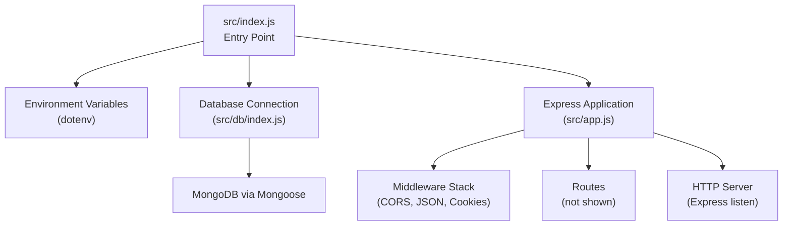
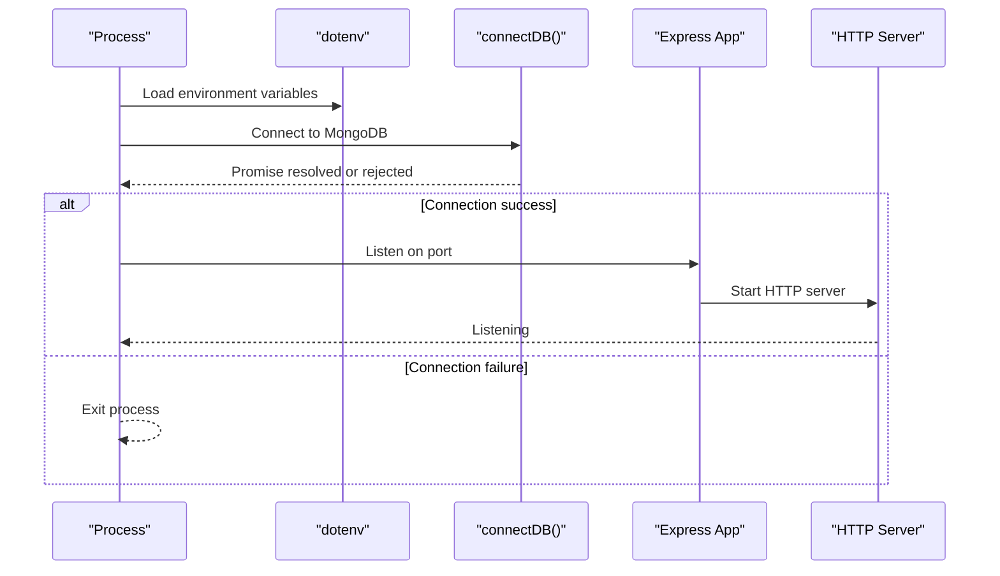
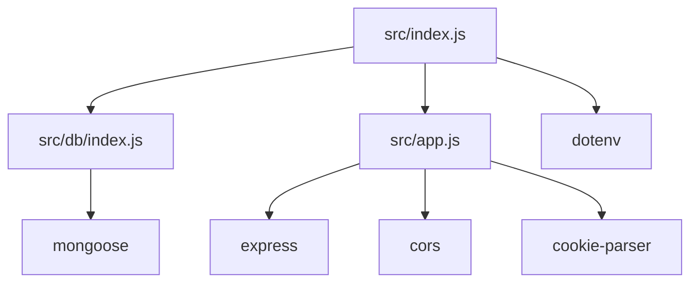

# HTTP Server Architecture

<cite>
**Referenced Files in This Document**
- [src/index.js](file://src/index.js)
- [src/app.js](file://src/app.js)
- [src/db/index.js](file://src/db/index.js)
- [package.json](file://package.json)
- [src/utils/asyncHandler.js](file://src/utils/asyncHandler.js)
- [src/utils/ApiError.js](file://src/utils/ApiError.js)
- [src/utils/ApiResponse.js](file://src/utils/ApiResponse.js)
</cite>

## Table of Contents
1. [Introduction](#introduction)
2. [Project Structure](#project-structure)
3. [Core Components](#core-components)
4. [Architecture Overview](#architecture-overview)
5. [Detailed Component Analysis](#detailed-component-analysis)
6. [Dependency Analysis](#dependency-analysis)
7. [Performance Considerations](#performance-considerations)
8. [Troubleshooting Guide](#troubleshooting-guide)
9. [Conclusion](#conclusion)

## Introduction
This document explains the HTTP server architecture of the backend service, focusing on the Express 5.2.1 server setup, application bootstrapping process, and server lifecycle management. It documents the initialization sequence from the entry point, database connection establishment, and port configuration. It also details Express application configuration, middleware registration, CORS setup, and the request processing pipeline. The document covers the relationship between server startup, database connectivity, and error handling mechanisms, and provides practical guidance for configuration options, environment variable handling, and graceful shutdown procedures. Scalability considerations, load balancing setup, and production deployment configurations are addressed to support robust operations.

## Project Structure
The server architecture follows a modular structure centered around an Express application configured in a dedicated module, initialized from an entry point that loads environment variables, connects to the database, and starts the server. Utility modules provide standardized error handling and response formatting. The project uses environment variables for configuration and NPM scripts for development and production startup.

**Diagram sources**
- [src/index.js](file://src/index.js#L1-L18)
- [src/db/index.js](file://src/db/index.js#L1-L14)
- [src/app.js](file://src/app.js#L1-L16)

**Section sources**
- [src/index.js](file://src/index.js#L1-L18)
- [src/app.js](file://src/app.js#L1-L16)
- [src/db/index.js](file://src/db/index.js#L1-L14)
- [package.json](file://package.json#L1-L28)

## Core Components
- Entry Point: Loads environment variables, establishes database connectivity, and starts the Express server.
- Express Application: Configures middleware, static assets, and CORS policy.
- Database Connector: Establishes a persistent connection to MongoDB using Mongoose.
- Utilities: Provide standardized error handling and async request handling patterns.

Key responsibilities:
- src/index.js: Orchestrates startup, handles database connection lifecycle, and logs server status.
- src/app.js: Defines middleware pipeline and CORS configuration.
- src/db/index.js: Manages MongoDB connection and exit behavior on failure.
- src/utils/*: Support structured error handling and async request handling.

**Section sources**
- [src/index.js](file://src/index.js#L1-L18)
- [src/app.js](file://src/app.js#L1-L16)
- [src/db/index.js](file://src/db/index.js#L1-L14)
- [src/utils/asyncHandler.js](file://src/utils/asyncHandler.js#L1-L8)
- [src/utils/ApiError.js](file://src/utils/ApiError.js#L1-L22)
- [src/utils/ApiResponse.js](file://src/utils/ApiResponse.js#L1-L17)

## Architecture Overview
The server initialization sequence is as follows:
1. Environment variables are loaded using dotenv.
2. Database connection is established via Mongoose.
3. On successful connection, the Express application listens on the configured port.
4. On connection failure, the process exits with a non-zero status.

**Diagram sources**
- [src/index.js](file://src/index.js#L1-L18)
- [src/db/index.js](file://src/db/index.js#L1-L14)

## Detailed Component Analysis

### Entry Point and Bootstrapping (src/index.js)
Responsibilities:
- Load environment variables from a .env file.
- Determine the server port from an environment variable with a fallback.
- Establish database connectivity and start the server upon success.
- Log server status and handle database connection errors.

Operational flow:
- Environment loading precedes all other operations to ensure configuration availability.
- Database connection is awaited; server startup proceeds only after a successful connection.
- Error handling during database connection triggers process termination to prevent an unstable state.

Practical configuration options:
- PORT: Controls the listening port; defaults to a fallback value if unset.
- .env file location: Managed by the dotenv configuration path.

Graceful shutdown considerations:
- The current implementation does not include explicit signal handlers or server close hooks. To support graceful shutdown, integrate process event listeners to close the server and database connections cleanly.

**Section sources**
- [src/index.js](file://src/index.js#L1-L18)

### Express Application Configuration (src/app.js)
Responsibilities:
- Initialize an Express application instance.
- Register middleware for CORS, static asset serving, JSON parsing, and cookie parsing.
- Expose the configured application instance for use by the entry point.

Middleware pipeline:
- CORS: Configured with origin from environment variables.
- Static assets: Serves files from the public directory.
- JSON parsing: Limits payload size to control resource usage.
- Cookie parsing: Enables cookie-based session handling.

Request processing pipeline:
- Requests pass through the middleware stack before reaching route handlers.
- Middleware order influences behavior; ensure CORS and security-related middleware are positioned appropriately.

**Section sources**
- [src/app.js](file://src/app.js#L1-L16)

### Database Connection (src/db/index.js)
Responsibilities:
- Establish a connection to MongoDB using Mongoose.
- Log the effective connection string upon successful connection.
- Exit the process on connection failure to avoid running an unconnected server.

Connection behavior:
- Uses an environment variable for the MongoDB URI.
- Returns a promise representing the connection state.
- On failure, the process exits immediately to prevent inconsistent operation.

**Section sources**
- [src/db/index.js](file://src/db/index.js#L1-L14)

### Error Handling Utilities
- Async Handler (src/utils/asyncHandler.js): Wraps asynchronous request handlers to forward thrown errors to Express error-handling middleware.
- API Error (src/utils/ApiError.js): Provides a standardized error class with status code, message, and optional stack.
- API Response (src/utils/ApiResponse.js): Provides a standardized response envelope with status, data, and message.

Usage patterns:
- Use asyncHandler to simplify error propagation in route handlers.
- Throw ApiError instances to communicate failures with appropriate status codes.
- Return ApiResponse instances to standardize client responses.

**Section sources**
- [src/utils/asyncHandler.js](file://src/utils/asyncHandler.js#L1-L8)
- [src/utils/ApiError.js](file://src/utils/ApiError.js#L1-L22)
- [src/utils/ApiResponse.js](file://src/utils/ApiResponse.js#L1-L17)

### Relationship Between Startup, Database Connectivity, and Error Handling
- Startup depends on successful database connectivity; the server does not start until the database promise resolves.
- On database failure, the process exits to prevent an unstable server state.
- Error handling utilities enable consistent error propagation and response formatting across the application.

**Section sources**
- [src/index.js](file://src/index.js#L11-L17)
- [src/db/index.js](file://src/db/index.js#L8-L10)
- [src/utils/asyncHandler.js](file://src/utils/asyncHandler.js#L1-L8)

## Dependency Analysis
External dependencies relevant to server architecture:
- Express 5.2.1: HTTP server framework.
- Mongoose: MongoDB ODM for database connectivity.
- dotenv: Environment variable loading.
- cors: Cross-origin resource sharing policy.
- cookie-parser: Cookie parsing middleware.

Internal dependencies:
- src/index.js depends on dotenv, src/db/index.js, and src/app.js.
- src/app.js depends on cors, express, and cookie-parser.
- src/db/index.js depends on mongoose.

**Diagram sources**
- [src/index.js](file://src/index.js#L1-L3)
- [src/app.js](file://src/app.js#L1-L4)
- [src/db/index.js](file://src/db/index.js#L1-L2)
- [package.json](file://package.json#L14-L26)

**Section sources**
- [package.json](file://package.json#L14-L26)
- [src/index.js](file://src/index.js#L1-L3)
- [src/app.js](file://src/app.js#L1-L4)
- [src/db/index.js](file://src/db/index.js#L1-L2)

## Performance Considerations
- Payload limits: JSON parsing limit helps control memory usage and protect against large payloads.
- Static assets: Serving static files from a dedicated directory reduces dynamic processing overhead.
- Middleware order: Place performance-sensitive middleware earlier to minimize unnecessary processing.
- Connection pooling: Mongoose manages connection pooling; ensure the MongoDB URI includes appropriate connection parameters for production.
- Graceful shutdown: Implement process signal handlers to drain requests and close connections before exiting.

[No sources needed since this section provides general guidance]

## Troubleshooting Guide
Common issues and resolutions:
- Database connection failures: Verify the MongoDB URI environment variable and network connectivity. The application exits on failure; address configuration or infrastructure issues before retrying.
- Port binding conflicts: Ensure the PORT environment variable is set to an available port or use the default fallback.
- CORS misconfiguration: Confirm the origin environment variable matches the client origin to avoid cross-origin restrictions.
- Environment variables not loading: Ensure the dotenv configuration path points to a valid .env file and that required keys are present.

Operational checks:
- Confirm environment variables are loaded before database and server startup.
- Validate middleware registration order and configuration.
- Use standardized error and response utilities to maintain consistent logging and client feedback.

**Section sources**
- [src/index.js](file://src/index.js#L5-L17)
- [src/db/index.js](file://src/db/index.js#L5-L10)
- [src/app.js](file://src/app.js#L8-L13)

## Conclusion
The server architecture centers on a clean separation of concerns: environment loading, database connectivity, and Express application configuration. The entry point orchestrates startup, ensuring the database is connected before the server listens. The Express application registers essential middleware and exposes a standardized error-handling and response-formatting toolkit. For production readiness, integrate graceful shutdown procedures, configure environment variables securely, and consider scalability and load balancing strategies aligned with Express and MongoDB best practices.

[No sources needed since this section summarizes without analyzing specific files]