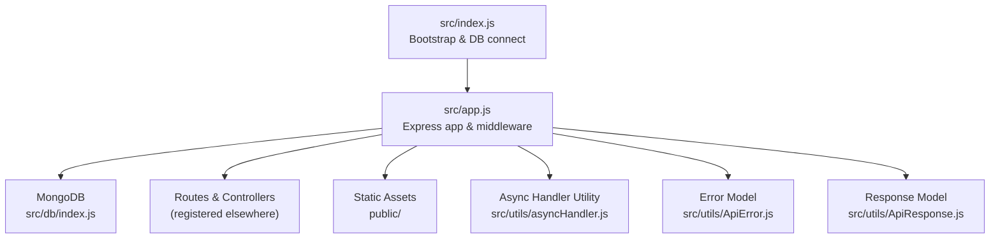
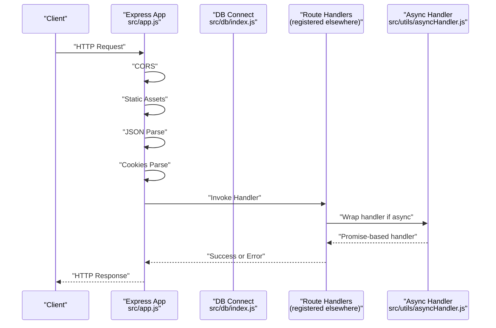
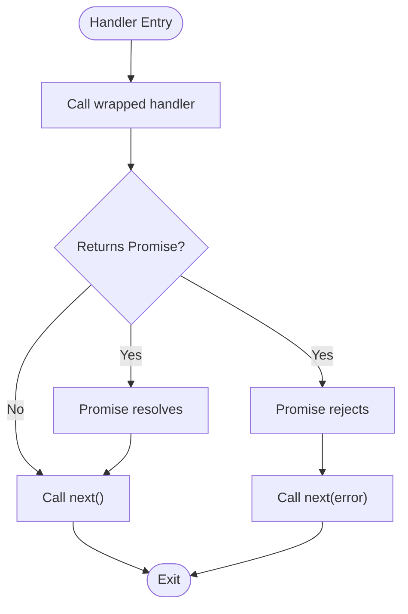
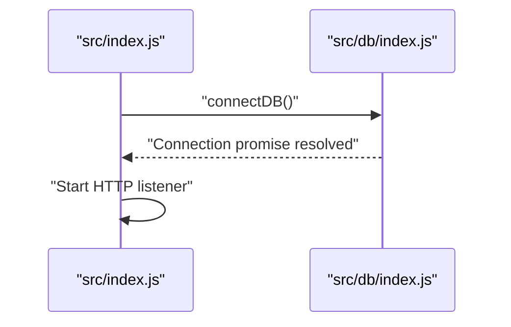
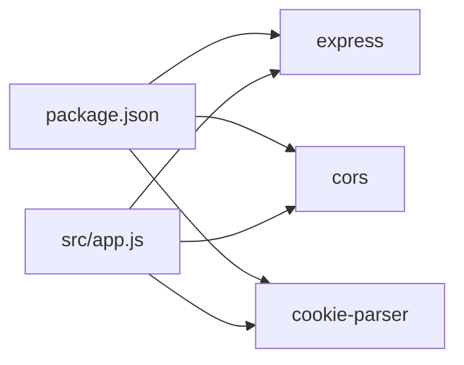

# Middleware Pipeline

<cite>
**Referenced Files in This Document**
- [src/app.js](file://src/app.js)
- [src/index.js](file://src/index.js)
- [src/utils/asyncHandler.js](file://src/utils/asyncHandler.js)
- [src/utils/ApiError.js](file://src/utils/ApiError.js)
- [src/utils/ApiResponse.js](file://src/utils/ApiResponse.js)
- [src/db/index.js](file://src/db/index.js)
- [package.json](file://package.json)
</cite>

## Table of Contents
1. [Introduction](#introduction)
2. [Project Structure](#project-structure)
3. [Core Components](#core-components)
4. [Architecture Overview](#architecture-overview)
5. [Detailed Component Analysis](#detailed-component-analysis)
6. [Dependency Analysis](#dependency-analysis)
7. [Performance Considerations](#performance-considerations)
8. [Troubleshooting Guide](#troubleshooting-guide)
9. [Conclusion](#conclusion)

## Introduction
This document explains the middleware pipeline architecture of the backend server built with Express. It covers the order and purpose of built-in middleware (CORS, static assets, JSON body parsing, cookies), how custom middleware would be registered, and how asynchronous route handlers integrate with the pipeline via a utility that converts promises into Express-compatible error propagation. It also discusses middleware ordering, error propagation, performance considerations, and practical patterns for building and debugging middleware.

## Project Structure
The server initializes Express, registers global middleware, connects to MongoDB, and starts the HTTP listener. The middleware chain is defined in the application bootstrap module, while the async handler utility centralizes error handling for route handlers.

**Diagram sources**
- [src/index.js](file://src/index.js#L1-L18)
- [src/app.js](file://src/app.js#L1-L16)
- [src/db/index.js](file://src/db/index.js#L1-L14)
- [src/utils/asyncHandler.js](file://src/utils/asyncHandler.js#L1-L8)
- [src/utils/ApiError.js](file://src/utils/ApiError.js#L1-L22)
- [src/utils/ApiResponse.js](file://src/utils/ApiResponse.js#L1-L17)

**Section sources**
- [src/index.js](file://src/index.js#L1-L18)
- [src/app.js](file://src/app.js#L1-L16)
- [package.json](file://package.json#L1-L28)

## Core Components
- Express application and middleware registration
  - CORS configuration with origin from environment
  - Static asset serving
  - JSON body parsing with size limit
  - Cookie parsing
- Async handler utility for promise-based route handlers
- Error and response model utilities

Key implementation references:
- Middleware registration and configuration: [src/app.js](file://src/app.js#L8-L13)
- Bootstrap and DB connection: [src/index.js](file://src/index.js#L11-L15)
- Async handler utility: [src/utils/asyncHandler.js](file://src/utils/asyncHandler.js#L1-L8)
- Error model: [src/utils/ApiError.js](file://src/utils/ApiError.js#L1-L22)
- Response model: [src/utils/ApiResponse.js](file://src/utils/ApiResponse.js#L1-L17)

**Section sources**
- [src/app.js](file://src/app.js#L1-L16)
- [src/index.js](file://src/index.js#L11-L15)
- [src/utils/asyncHandler.js](file://src/utils/asyncHandler.js#L1-L8)
- [src/utils/ApiError.js](file://src/utils/ApiError.js#L1-L22)
- [src/utils/ApiResponse.js](file://src/utils/ApiResponse.js#L1-L17)

## Architecture Overview
The middleware pipeline runs in the order it is registered. Requests pass through CORS, static asset serving, JSON parsing, and cookie parsing before reaching route handlers. Route handlers can be wrapped with the async handler utility to convert thrown or rejected promises into Express errors, ensuring consistent error propagation to downstream error-handling middleware.

**Diagram sources**
- [src/app.js](file://src/app.js#L8-L13)
- [src/index.js](file://src/index.js#L11-L15)
- [src/utils/asyncHandler.js](file://src/utils/asyncHandler.js#L1-L8)

## Detailed Component Analysis

### Express Middleware Chain
- CORS middleware
  - Purpose: Allow cross-origin requests from configured origin
  - Registration: [src/app.js](file://src/app.js#L8-L10)
- Static asset serving
  - Purpose: Serve files from the public directory
  - Registration: [src/app.js](file://src/app.js#L11)
- JSON body parsing
  - Purpose: Parse incoming request bodies as JSON up to a specified size
  - Registration: [src/app.js](file://src/app.js#L12)
- Cookie parsing
  - Purpose: Parse cookies attached to requests
  - Registration: [src/app.js](file://src/app.js#L13)

Ordering matters because:
- CORS must be registered before route handlers so preflight and origin checks occur early.
- Static assets are matched before route handlers; if a static route exists, it short-circuits further routing.
- JSON parsing must precede route handlers that rely on parsed body data.
- Cookies must be parsed before route handlers that read cookies.

**Section sources**
- [src/app.js](file://src/app.js#L8-L13)

### Async Handler Utility
The async handler utility wraps route handlers so that thrown exceptions or rejected promises are caught and passed to Express’s error-handling middleware via the next callback. This ensures consistent error propagation without manual try/catch blocks around every async operation.

**Diagram sources**
- [src/utils/asyncHandler.js](file://src/utils/asyncHandler.js#L1-L8)

**Section sources**
- [src/utils/asyncHandler.js](file://src/utils/asyncHandler.js#L1-L8)

### Error and Response Models
- Error model
  - Provides a structured error class with status code, message, and optional stack
  - Reference: [src/utils/ApiError.js](file://src/utils/ApiError.js#L1-L22)
- Response model
  - Provides a structured response envelope with status, data, and message
  - Reference: [src/utils/ApiResponse.js](file://src/utils/ApiResponse.js#L1-L17)

These models support consistent error and response formatting across route handlers and middleware.

**Section sources**
- [src/utils/ApiError.js](file://src/utils/ApiError.js#L1-L22)
- [src/utils/ApiResponse.js](file://src/utils/ApiResponse.js#L1-L17)

### Database Connection Lifecycle
The server connects to MongoDB during startup and listens for requests afterward. This ensures middleware and routes operate against a live database connection.

**Diagram sources**
- [src/index.js](file://src/index.js#L11-L15)
- [src/db/index.js](file://src/db/index.js#L1-L14)

**Section sources**
- [src/index.js](file://src/index.js#L11-L15)
- [src/db/index.js](file://src/db/index.js#L1-L14)

## Dependency Analysis
External dependencies relevant to middleware:
- Express: web framework providing middleware invocation and routing
- CORS: cross-origin policy enforcement
- cookie-parser: cookie header parsing

**Diagram sources**
- [package.json](file://package.json#L14-L23)
- [src/app.js](file://src/app.js#L1-L4)

**Section sources**
- [package.json](file://package.json#L14-L23)
- [src/app.js](file://src/app.js#L1-L4)

## Performance Considerations
- Middleware order impacts performance: place fast, selective middleware earlier (e.g., static assets before route matching).
- JSON body size limits reduce memory pressure and protect against large payloads.
- Cookie parsing adds CPU overhead per request; avoid enabling if not needed.
- Asynchronous route handlers should resolve quickly; offload heavy work to background jobs or streams.

[No sources needed since this section provides general guidance]

## Troubleshooting Guide
- Verify environment variables
  - CORS origin must be set; otherwise, cross-origin requests may be blocked.
  - Reference: [src/app.js](file://src/app.js#L8-L10)
- Debugging middleware
  - Add logging inside middleware functions to trace request flow.
  - Confirm order by checking logs for CORS, static, JSON, and cookie steps.
- Error handling
  - Use the async handler utility to convert unhandled rejections into Express errors.
  - Reference: [src/utils/asyncHandler.js](file://src/utils/asyncHandler.js#L1-L8)
  - Ensure downstream error-handling middleware receives errors via next(error).
- Response and error formatting
  - Standardize responses and errors using the provided models for consistent client consumption.
  - References: [src/utils/ApiResponse.js](file://src/utils/ApiResponse.js#L1-L17), [src/utils/ApiError.js](file://src/utils/ApiError.js#L1-L22)

**Section sources**
- [src/app.js](file://src/app.js#L8-L13)
- [src/utils/asyncHandler.js](file://src/utils/asyncHandler.js#L1-L8)
- [src/utils/ApiResponse.js](file://src/utils/ApiResponse.js#L1-L17)
- [src/utils/ApiError.js](file://src/utils/ApiError.js#L1-L22)

## Conclusion
The middleware pipeline in this project is intentionally minimal and focused: CORS, static assets, JSON parsing, and cookie parsing define the inbound request processing chain. Asynchronous route handlers integrate seamlessly through a dedicated async handler utility that normalizes promise-based errors into Express’s error-handling mechanism. Proper middleware ordering, combined with standardized error and response models, yields a predictable and maintainable request lifecycle.