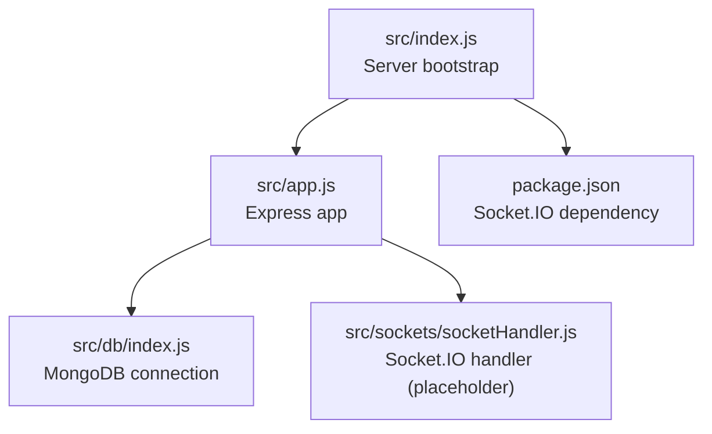
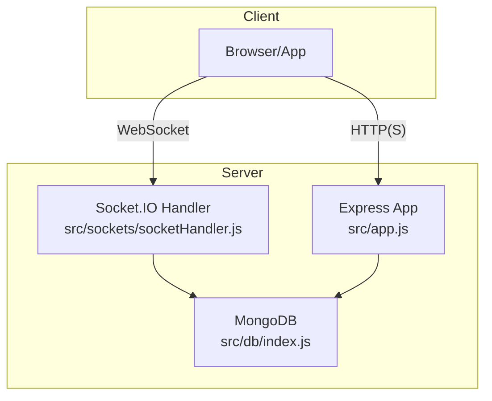
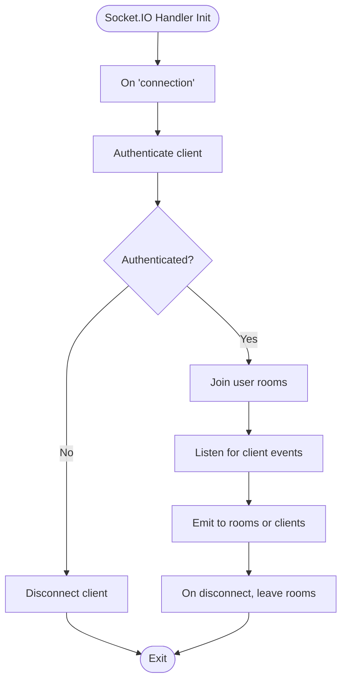
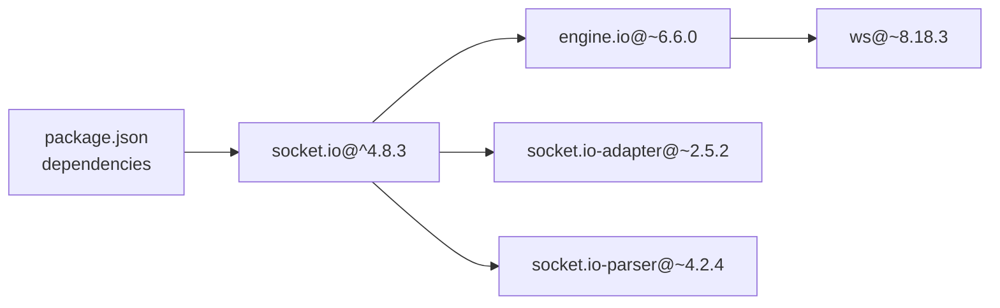

# WebSocket Communication

<cite>
**Referenced Files in This Document**
- [package.json](file://package.json)
- [src/index.js](file://src/index.js)
- [src/app.js](file://src/app.js)
- [src/db/index.js](file://src/db/index.js)
- [src/sockets/socketHandler.js](file://src/sockets/socketHandler.js)
</cite>

## Table of Contents
1. [Introduction](#introduction)
2. [Project Structure](#project-structure)
3. [Core Components](#core-components)
4. [Architecture Overview](#architecture-overview)
5. [Detailed Component Analysis](#detailed-component-analysis)
6. [Dependency Analysis](#dependency-analysis)
7. [Performance Considerations](#performance-considerations)
8. [Troubleshooting Guide](#troubleshooting-guide)
9. [Conclusion](#conclusion)

## Introduction
This document explains the WebSocket communication subsystem built with Socket.IO for real-time, bidirectional event-based communication. It covers the integration points, connection lifecycle, event broadcasting, room-based communication, and how WebSocket complements RESTful APIs for live updates and collaboration. Practical examples of socket events and message formats are included, along with guidance on scaling, performance optimization, and error handling.

## Project Structure
The WebSocket subsystem is currently declared but not yet implemented. The repository includes:
- Socket.IO dependency declaration
- Express server bootstrap
- Database connection wiring
- A placeholder for the socket handler module

**Diagram sources**
- [src/index.js](file://src/index.js#L1-L18)
- [src/app.js](file://src/app.js#L1-L16)
- [src/db/index.js](file://src/db/index.js#L1-L14)
- [src/sockets/socketHandler.js](file://src/sockets/socketHandler.js#L1-L7)
- [package.json](file://package.json#L1-L28)

**Section sources**
- [src/index.js](file://src/index.js#L1-L18)
- [src/app.js](file://src/app.js#L1-L16)
- [src/db/index.js](file://src/db/index.js#L1-L14)
- [src/sockets/socketHandler.js](file://src/sockets/socketHandler.js#L1-L7)
- [package.json](file://package.json#L1-L28)

## Core Components
- Socket.IO integration via the socket.io dependency
- Express server initialization and CORS configuration
- MongoDB connection for persistence
- Socket handler module intended to manage connections, rooms, and events

Key observations:
- Socket.IO is declared as a dependency and ready to use.
- The socket handler module exists but is currently empty; it needs to be implemented to handle real-time features.
- The Express app sets up CORS and JSON parsing, which are essential for browser-based clients.

**Section sources**
- [package.json](file://package.json#L14-L23)
- [src/app.js](file://src/app.js#L8-L13)
- [src/sockets/socketHandler.js](file://src/sockets/socketHandler.js#L1-L7)

## Architecture Overview
The WebSocket architecture integrates Socket.IO with the existing Express server. The typical flow is:
- Client connects to the server via WebSocket
- Server initializes Socket.IO and registers handlers
- Clients join rooms and listen for events
- Server emits events to rooms or individual clients
- REST endpoints co-exist alongside WebSocket for request-response interactions

**Diagram sources**
- [src/app.js](file://src/app.js#L1-L16)
- [src/db/index.js](file://src/db/index.js#L1-L14)
- [src/sockets/socketHandler.js](file://src/sockets/socketHandler.js#L1-L7)

## Detailed Component Analysis

### Socket.IO Integration and Initialization
- The project declares Socket.IO as a dependency, enabling real-time bidirectional event-based communication.
- The Express app is configured with CORS and JSON parsing, which are essential for WebSocket clients connecting from browsers.
- The server bootstrap file initializes the database connection and starts the HTTP server; Socket.IO should be initialized there to bind to the HTTP server.

Recommended steps:
- Initialize Socket.IO in the server bootstrap after the HTTP server is created.
- Pass the HTTP server instance to Socket.IO so it can upgrade requests.
- Register socket event handlers in the socket handler module.

**Section sources**
- [package.json](file://package.json#L22-L22)
- [src/app.js](file://src/app.js#L8-L13)
- [src/index.js](file://src/index.js#L11-L14)

### Socket Handler Implementation Plan
The socket handler module is currently a placeholder. Below is a recommended implementation outline:

- Connection management
  - Listen for connection events
  - Authenticate and authorize clients (e.g., via JWT)
  - Track connected clients and associate metadata (user ID, roles)

- Room-based communication
  - Join/leave rooms based on context (e.g., project/task)
  - Broadcast events to rooms or emit to specific clients

- Event-driven architecture
  - Define event names for tasks, comments, status updates, etc.
  - Emit events to rooms or individuals upon database changes
  - Handle client-initiated events (e.g., join room, send message)

- Message formats
  - Events carry structured payloads (e.g., { taskId, userId, content, timestamp })
  - Acknowledgements for reliability where needed

- Error handling
  - Disconnect on authentication failure
  - Graceful degradation for malformed messages
  - Logging and metrics for monitoring

[No sources needed since this diagram shows conceptual workflow, not actual code structure]

**Section sources**
- [src/sockets/socketHandler.js](file://src/sockets/socketHandler.js#L1-L7)

### Client-Server Interaction Patterns
Common patterns for real-time collaboration:
- Live task updates
  - Emit an event when a task is created, updated, or deleted
  - Clients update UI without polling
- Collaborative editing
  - Broadcast cursor positions or selections
  - Merge changes with conflict resolution
- Notifications
  - Notify users about mentions, due date reminders, or status changes

Message format example:
- Event: "task:updated"
  - Payload: { taskId, updatedBy, changes, timestamp }
- Event: "room:join"
  - Payload: { roomId, userId, joinedAt }

[No sources needed since this section provides general guidance]

### WebSocket vs RESTful APIs
- REST APIs remain ideal for request-response interactions, CRUD operations, and stateless queries.
- WebSocket enables continuous, low-latency updates for live features such as:
  - Real-time dashboards
  - Collaborative editing
  - Instant notifications
- Complementary usage:
  - Use REST for authoritative state changes
  - Use WebSocket for live propagation of those changes

[No sources needed since this section provides general guidance]

## Dependency Analysis
Socket.IO is a peer dependency of the project and relies on Engine.IO for transport and ws for WebSocket framing. These dependencies are resolved automatically when installing Socket.IO.

**Diagram sources**
- [package.json](file://package.json#L22-L22)

**Section sources**
- [package.json](file://package.json#L22-L22)

## Performance Considerations
- Connection scaling
  - Use a reverse proxy (e.g., Nginx) and multiple Node.js instances behind a load balancer
  - Consider sticky sessions if stateful rooms are required
- Room management
  - Keep room membership minimal and explicit
  - Periodically prune inactive rooms and clients
- Message sizes
  - Limit payload sizes and avoid unnecessary data
  - Use compression for large documents
- Backpressure
  - Throttle frequent updates (e.g., rate-limit cursor events)
  - Batch updates when appropriate
- Persistence
  - Use database change streams or hooks to trigger WebSocket emissions
- Monitoring
  - Track connection counts, memory usage, and event throughput

[No sources needed since this section provides general guidance]

## Troubleshooting Guide
- Connection issues
  - Verify CORS configuration allows WebSocket upgrades
  - Ensure the HTTP server instance is passed to Socket.IO
- Authentication failures
  - Disconnect unauthorized clients promptly
  - Log authentication errors for diagnostics
- Room problems
  - Confirm clients join the correct rooms
  - Leave rooms on disconnect to prevent leaks
- Error handling
  - Add error listeners on sockets and emit standardized error events
  - Implement retry logic on the client side for transient failures

[No sources needed since this section provides general guidance]

## Conclusion
The WebSocket subsystem is ready to integrate with Socket.IO and complement REST APIs for real-time collaboration. The current placeholder in the socket handler module should be implemented to manage connections, rooms, and events. With proper initialization, room-based communication, and robust error handling, the system can scale and deliver responsive live features while maintaining separation of concerns between REST and real-time pathways.