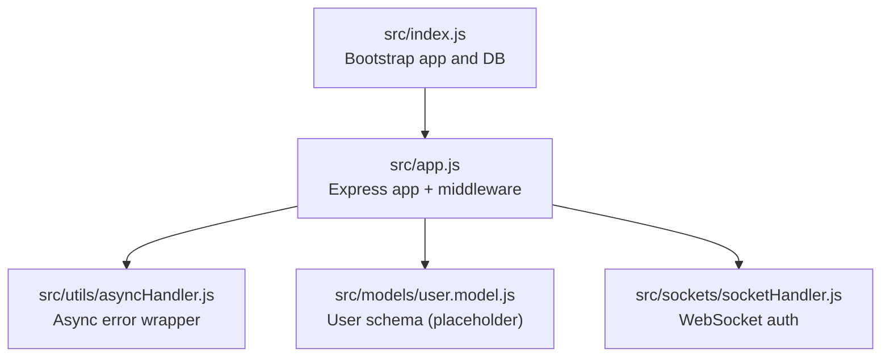
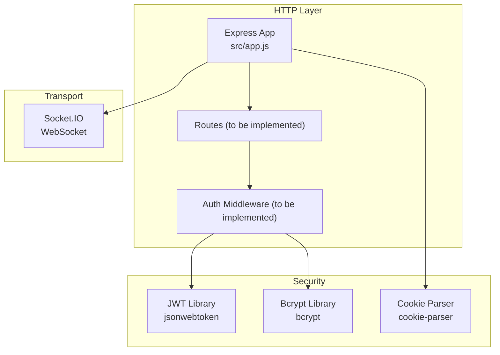
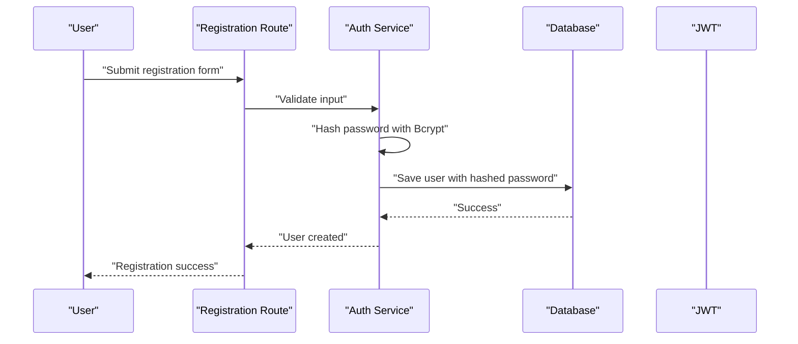
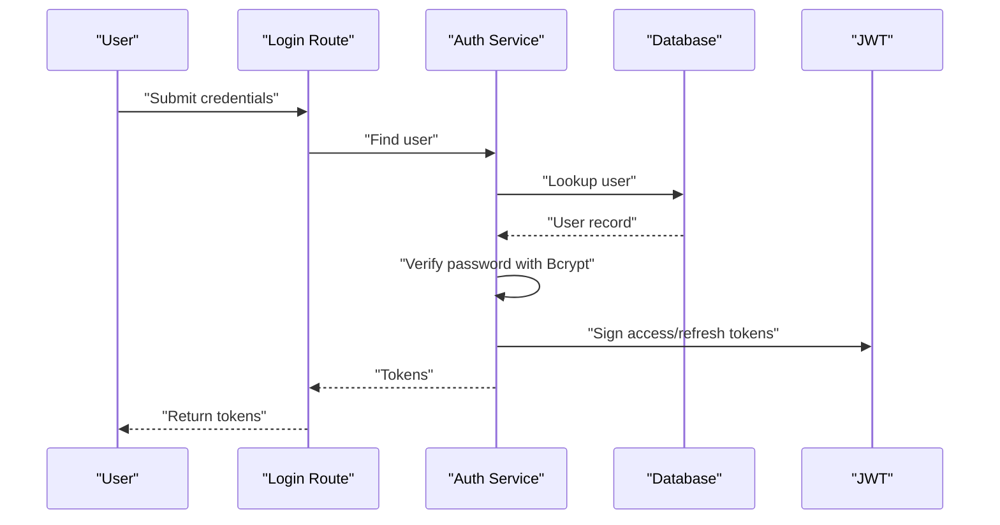
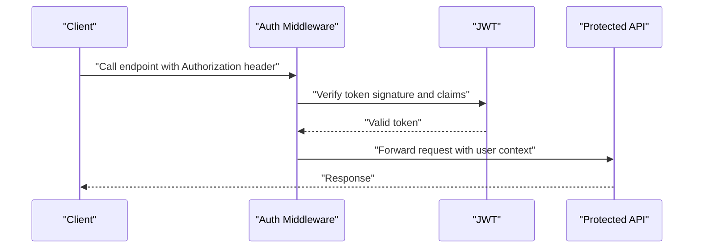
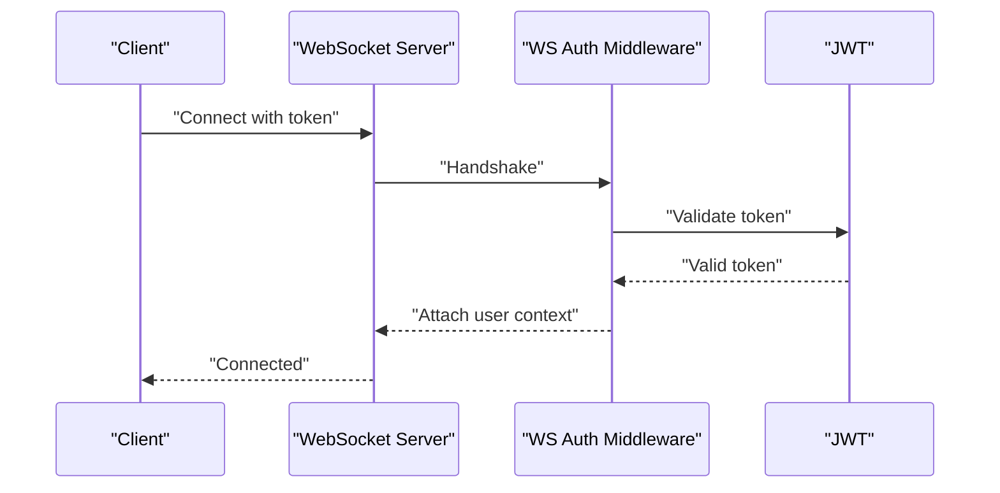
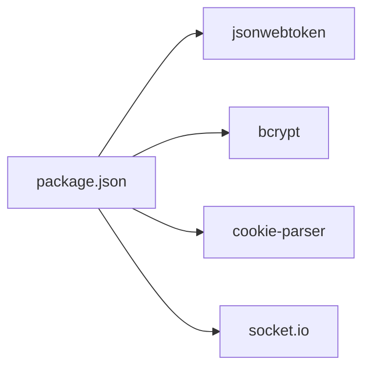

# Authentication & Authorization

<cite>
**Referenced Files in This Document**
- [src/app.js](file://src/app.js)
- [src/index.js](file://src/index.js)
- [package.json](file://package.json)
- [src/utils/asyncHandler.js](file://src/utils/asyncHandler.js)
- [src/models/user.model.js](file://src/models/user.model.js)
- [src/sockets/socketHandler.js](file://src/sockets/socketHandler.js)
</cite>

## Table of Contents
1. [Introduction](#introduction)
2. [Project Structure](#project-structure)
3. [Core Components](#core-components)
4. [Architecture Overview](#architecture-overview)
5. [Detailed Component Analysis](#detailed-component-analysis)
6. [Dependency Analysis](#dependency-analysis)
7. [Performance Considerations](#performance-considerations)
8. [Troubleshooting Guide](#troubleshooting-guide)
9. [Conclusion](#conclusion)

## Introduction
This document explains the authentication and authorization mechanisms implemented in the Task Management System backend. It focuses on JWT token handling, user registration and login workflows, password hashing with Bcrypt, middleware protection patterns for Express routes and WebSocket connections, and security practices such as secure token storage and CSRF considerations. Where applicable, it references the actual source files that define the current implementation and highlights areas requiring development.

## Project Structure
The backend is structured around an Express server with modular components:
- Application bootstrap and middleware configuration
- Environment and database initialization
- Utility helpers for async error handling
- Placeholder for user model and authentication logic
- WebSocket handler for real-time connections

**Diagram sources**
- [src/index.js](file://src/index.js#L1-L18)
- [src/app.js](file://src/app.js#L1-L15)
- [src/utils/asyncHandler.js](file://src/utils/asyncHandler.js#L1-L7)
- [src/models/user.model.js](file://src/models/user.model.js#L1-L1)
- [src/sockets/socketHandler.js](file://src/sockets/socketHandler.js)

**Section sources**
- [src/index.js](file://src/index.js#L1-L18)
- [src/app.js](file://src/app.js#L1-L15)

## Core Components
- Express app and middleware stack:
  - CORS configuration
  - JSON body parsing
  - Cookie parsing
  - Static asset serving
- Async error handling utility for route handlers
- Dependencies for authentication and transport:
  - jsonwebtoken for JWT operations
  - bcrypt for password hashing
  - cookie-parser for cookie-based sessions
  - socket.io for WebSocket support

Key implementation references:
- Express app setup and middleware: [src/app.js](file://src/app.js#L8-L13)
- Bootstrap and DB connection: [src/index.js](file://src/index.js#L11-L17)
- Async handler utility: [src/utils/asyncHandler.js](file://src/utils/asyncHandler.js#L1-L7)
- Dependencies: [package.json](file://package.json#L14-L22)

**Section sources**
- [src/app.js](file://src/app.js#L8-L13)
- [src/index.js](file://src/index.js#L11-L17)
- [src/utils/asyncHandler.js](file://src/utils/asyncHandler.js#L1-L7)
- [package.json](file://package.json#L14-L22)

## Architecture Overview
The authentication architecture integrates:
- Express routes (to be implemented) protected by middleware
- JWT-based session tokens issued after successful login
- Bcrypt-based password hashing for secure credentials
- Optional cookie-based session storage via cookie-parser
- WebSocket connections secured via token verification

**Diagram sources**
- [src/app.js](file://src/app.js#L8-L13)
- [package.json](file://package.json#L14-L22)
- [src/sockets/socketHandler.js](file://src/sockets/socketHandler.js)

## Detailed Component Analysis

### JWT Token Implementation
Current state:
- jsonwebtoken is declared as a dependency but no token generation/validation logic is present in the analyzed files.

Recommended implementation outline:
- Token generation:
  - Payload: include user identifier and roles
  - Secret: use a strong secret from environment variables
  - Expiration: set short-lived access tokens and longer refresh tokens
- Token validation:
  - Verify signature and claims
  - Enforce expiration checks
- Refresh strategy:
  - Issue refresh tokens with sliding expiration
  - Rotate refresh tokens on use
- Expiration handling:
  - Return explicit errors for expired/expired-refresh scenarios
  - Clear stale tokens on logout

References:
- Dependency declaration: [package.json](file://package.json#L20-L20)

**Section sources**
- [package.json](file://package.json#L20-L20)

### Password Hashing with Bcrypt
Current state:
- bcrypt is declared as a dependency; user model placeholder exists.

Recommended implementation outline:
- Hashing:
  - Generate salt rounds (e.g., 12) during registration
  - Hash plaintext password before storing
- Verification:
  - Compare incoming password with stored hash during login
- Security:
  - Reject empty or weak passwords
  - Use constant-time comparison to avoid timing attacks

References:
- Dependency declaration: [package.json](file://package.json#L15-L15)
- User model placeholder: [src/models/user.model.js](file://src/models/user.model.js#L1-L1)

**Section sources**
- [package.json](file://package.json#L15-L15)
- [src/models/user.model.js](file://src/models/user.model.js#L1-L1)

### User Registration and Login Workflows
Current state:
- No controller or service logic is present in the analyzed files.

Recommended implementation outline:
- Registration:
  - Validate input fields
  - Hash password with Bcrypt
  - Store user with hashed password
  - Optionally issue initial token
- Login:
  - Find user by identifier
  - Verify password using Bcrypt compare
  - Issue JWT access/refresh tokens
  - Manage session cookies if using cookie-based sessions

References:
- Express app middleware for request parsing: [src/app.js](file://src/app.js#L12-L13)
- Async handler utility: [src/utils/asyncHandler.js](file://src/utils/asyncHandler.js#L1-L7)

**Section sources**
- [src/app.js](file://src/app.js#L12-L13)
- [src/utils/asyncHandler.js](file://src/utils/asyncHandler.js#L1-L7)

### Middleware Protection Patterns
Current state:
- No auth middleware is present in the analyzed files.

Recommended implementation outline:
- Express routes:
  - Create middleware to extract and validate JWT
  - Attach user context to request object
  - Protect endpoints with middleware
- WebSocket connections:
  - Validate JWT in handshake or first message
  - Close unauthorized connections
  - Maintain per-connection user context

References:
- Express app middleware stack: [src/app.js](file://src/app.js#L8-L13)
- Socket handler file: [src/sockets/socketHandler.js](file://src/sockets/socketHandler.js)

**Section sources**
- [src/app.js](file://src/app.js#L8-L13)
- [src/sockets/socketHandler.js](file://src/sockets/socketHandler.js)

### Session Management
Current state:
- cookie-parser is configured; no session logic is present.

Recommended implementation outline:
- Cookie-based sessions:
  - Set HttpOnly, Secure, SameSite flags
  - Limit cookie lifetime to token TTL
- Token-based sessions:
  - Prefer bearer tokens in Authorization header
  - Store tokens in memory or secure storage on client

References:
- Cookie parser setup: [src/app.js](file://src/app.js#L13-L13)
- Dependencies: [package.json](file://package.json#L16-L16)

**Section sources**
- [src/app.js](file://src/app.js#L13-L13)
- [package.json](file://package.json#L16-L16)

### Role-Based Access Control (RBAC)
Current state:
- No RBAC logic is present in the analyzed files.

Recommended implementation outline:
- Define roles and permissions in user model
- Add role checks in auth middleware
- Decorate protected routes with role requirements

References:
- User model placeholder: [src/models/user.model.js](file://src/models/user.model.js#L1-L1)

**Section sources**
- [src/models/user.model.js](file://src/models/user.model.js#L1-L1)

### Authentication Flow Diagrams
Note: The following diagrams illustrate recommended flows. They are conceptual and do not map to specific existing code files.

### Practical Examples
- Using the async handler utility to wrap route handlers:
  - Reference: [src/utils/asyncHandler.js](file://src/utils/asyncHandler.js#L1-L7)
- Applying middleware to protect routes:
  - Reference: [src/app.js](file://src/app.js#L8-L13)
- Implementing JWT verification in middleware:
  - Reference: [package.json](file://package.json#L20-L20)
- Implementing Bcrypt hashing/verification:
  - Reference: [package.json](file://package.json#L15-L15)

**Section sources**
- [src/utils/asyncHandler.js](file://src/utils/asyncHandler.js#L1-L7)
- [src/app.js](file://src/app.js#L8-L13)
- [package.json](file://package.json#L15-L20)

## Dependency Analysis
External libraries used for authentication and transport:
- jsonwebtoken: JWT signing and verification
- bcrypt: Password hashing and verification
- cookie-parser: Cookie parsing for session cookies
- socket.io: WebSocket transport for real-time features

**Diagram sources**
- [package.json](file://package.json#L14-L22)

**Section sources**
- [package.json](file://package.json#L14-L22)

## Performance Considerations
- Use appropriate bcrypt cost factors to balance security and performance.
- Keep JWT payload minimal to reduce header size.
- Implement token revocation strategies (blacklists or short-lived tokens) to mitigate stolen token risks.
- Cache validated tokens when feasible and invalidate on logout.

## Troubleshooting Guide
Common issues and resolutions:
- JWT verification failures:
  - Ensure the correct signing secret is configured.
  - Confirm token expiration and clock skew are handled.
- Bcrypt comparison errors:
  - Verify the password and stored hash match the same salt rounds.
  - Check for encoding mismatches when comparing.
- CORS or cookie problems:
  - Validate CORS origin and credentials settings.
  - Confirm cookie flags (HttpOnly, Secure, SameSite) align with deployment.
- WebSocket auth failures:
  - Ensure token is sent during handshake and validated consistently.

## Conclusion
The backend currently defines the Express app, middleware stack, and key dependencies for authentication and transport. JWT, Bcrypt, and cookie/session handling are prepared for implementation. To complete the system, implement:
- User registration and login controllers/services
- JWT generation/validation middleware
- Bcrypt hashing/verification logic
- Auth middleware for Express routes and WebSocket connections
- RBAC and authorization guards
- Secure token storage and CSRF considerations