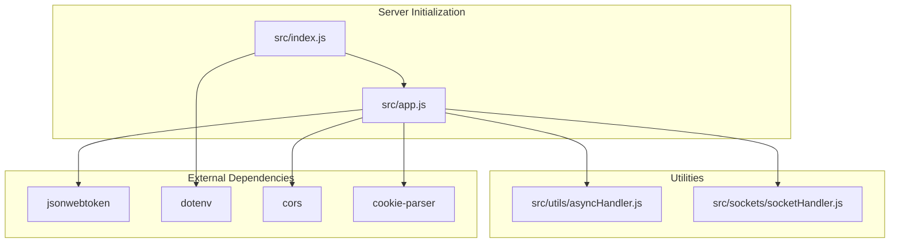
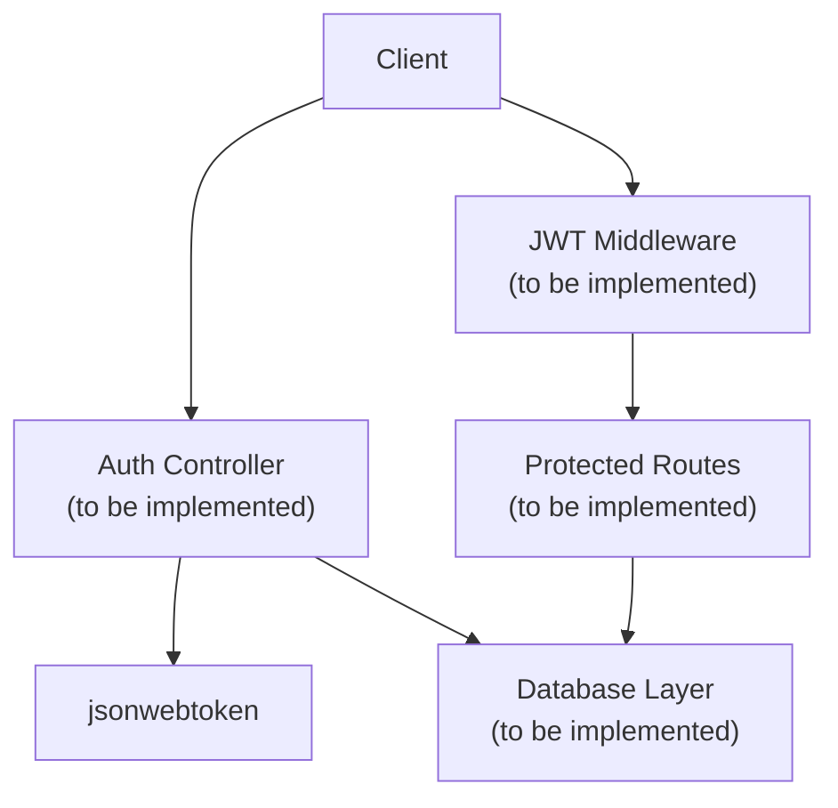
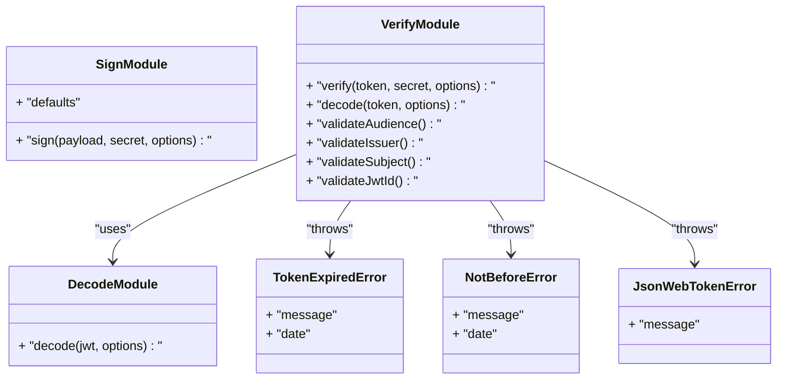
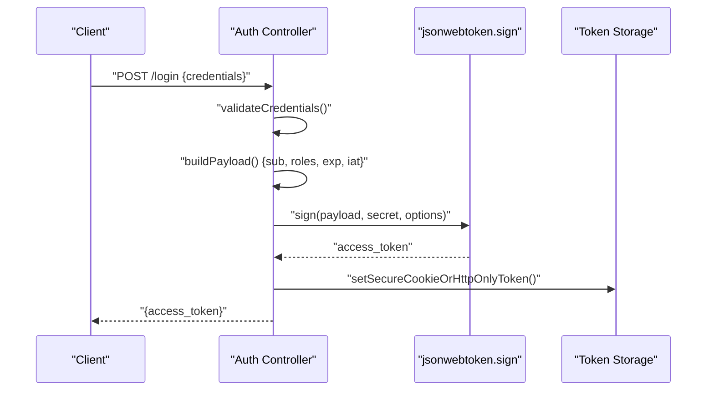
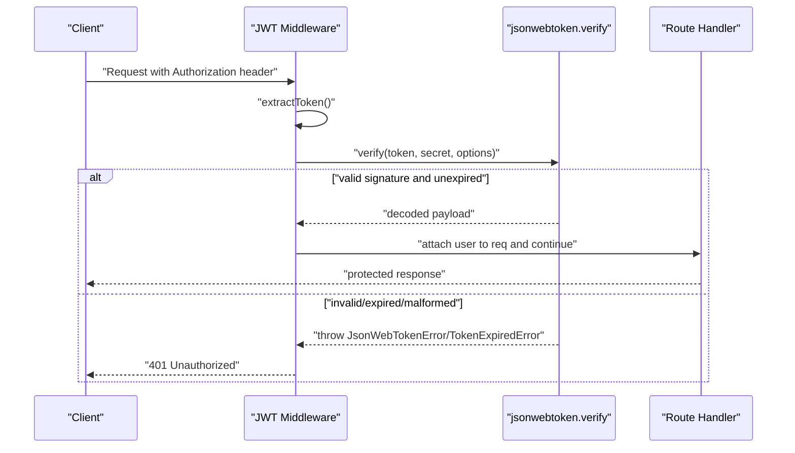
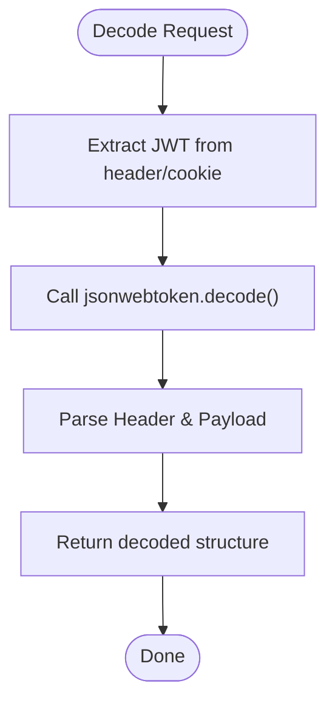
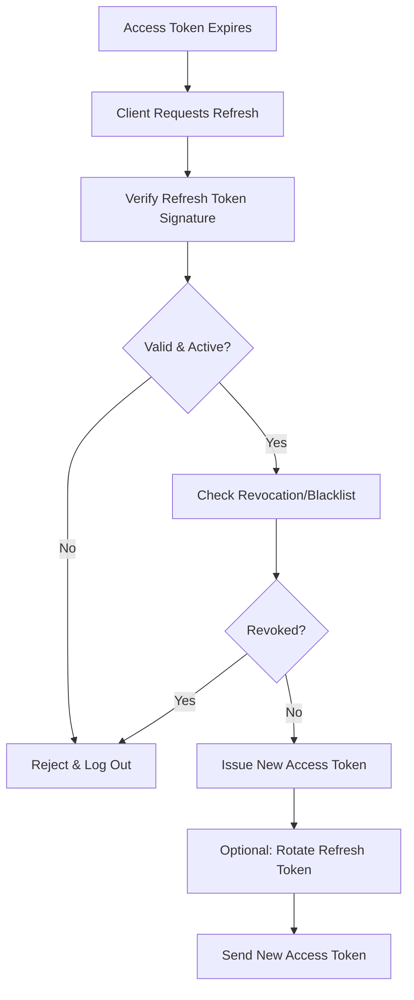
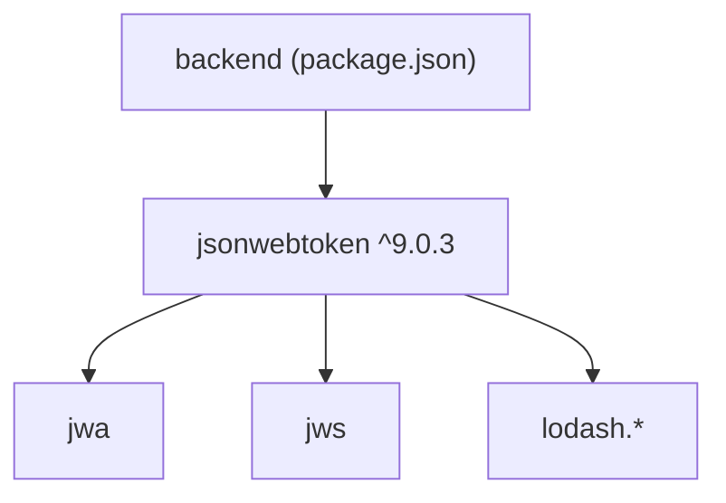

# JWT Token Management

<cite>
**Referenced Files in This Document**
- [package.json](file://package.json)
- [package-lock.json](file://package-lock.json)
- [src/index.js](file://src/index.js)
- [src/app.js](file://src/app.js)
- [src/utils/asyncHandler.js](file://src/utils/asyncHandler.js)
- [src/sockets/socketHandler.js](file://src/sockets/socketHandler.js)
- [node_modules/jsonwebtoken/sign.js](file://node_modules/jsonwebtoken/sign.js)
- [node_modules/jsonwebtoken/verify.js](file://node_modules/jsonwebtoken/verify.js)
- [node_modules/jsonwebtoken/decode.js](file://node_modules/jsonwebtoken/decode.js)
- [node_modules/jsonwebtoken/lib/TokenExpiredError.js](file://node_modules/jsonwebtoken/lib/TokenExpiredError.js)
- [node_modules/jsonwebtoken/lib/NotBeforeError.js](file://node_modules/jsonwebtoken/lib/NotBeforeError.js)
- [node_modules/jsonwebtoken/lib/JsonWebTokenError.js](file://node_modules/jsonwebtoken/lib/JsonWebTokenError.js)
</cite>

## Table of Contents
1. [Introduction](#introduction)
2. [Project Structure](#project-structure)
3. [Core Components](#core-components)
4. [Architecture Overview](#architecture-overview)
5. [Detailed Component Analysis](#detailed-component-analysis)
6. [Dependency Analysis](#dependency-analysis)
7. [Performance Considerations](#performance-considerations)
8. [Troubleshooting Guide](#troubleshooting-guide)
9. [Conclusion](#conclusion)
10. [Appendices](#appendices)

## Introduction
This document provides comprehensive guidance for implementing JWT-based authentication in the Task Management System. It covers token generation, validation, refresh strategies, secure storage recommendations, middleware usage, error handling, and best practices. The backend integrates jsonwebtoken for token operations and Express for routing and middleware. While the current repository snapshot does not include explicit JWT middleware or controller code, this guide outlines how to implement and secure JWT flows using the existing stack.

## Project Structure
The backend is structured around Express, with environment configuration via dotenv, and includes utilities for asynchronous request handling. The application initializes the server and connects to the database. Authentication middleware and route handlers are not present in the current snapshot but can be integrated alongside the existing app initialization and utility modules.

**Diagram sources**
- [src/index.js](file://src/index.js#L1-L18)
- [src/app.js](file://src/app.js#L1-L16)
- [src/utils/asyncHandler.js](file://src/utils/asyncHandler.js#L1-L7)
- [src/sockets/socketHandler.js](file://src/sockets/socketHandler.js#L1-L6)
- [package.json](file://package.json#L14-L23)

**Section sources**
- [src/index.js](file://src/index.js#L1-L18)
- [src/app.js](file://src/app.js#L1-L16)
- [package.json](file://package.json#L14-L23)

## Core Components
- Express application setup with CORS, JSON parsing, static assets, and cookie parsing.
- Asynchronous handler utility to wrap route handlers and propagate errors.
- Socket handler placeholder for real-time integrations.
- jsonwebtoken library for signing, verifying, and decoding JWTs.

Key integration points:
- Environment configuration via dotenv.
- Middleware registration order affects request parsing and authentication.
- Utility wrapper ensures consistent error handling across routes.

**Section sources**
- [src/app.js](file://src/app.js#L8-L13)
- [src/utils/asyncHandler.js](file://src/utils/asyncHandler.js#L1-L7)
- [src/sockets/socketHandler.js](file://src/sockets/socketHandler.js#L1-L6)
- [package.json](file://package.json#L14-L23)

## Architecture Overview
The JWT-enabled authentication architecture centers on three phases: sign-in (issue access token), protected route access (validate token), and session renewal (refresh token). The following diagram maps these phases to the application’s initialization and middleware layers.

[No sources needed since this diagram shows conceptual workflow, not actual code structure]

## Detailed Component Analysis

### JWT Library Internals
The jsonwebtoken library provides the core primitives for JWT operations. Understanding its internal behavior helps implement robust validation and error handling.

**Diagram sources**
- [node_modules/jsonwebtoken/sign.js](file://node_modules/jsonwebtoken/sign.js#L27-L98)
- [node_modules/jsonwebtoken/verify.js](file://node_modules/jsonwebtoken/verify.js#L20-L232)
- [node_modules/jsonwebtoken/decode.js](file://node_modules/jsonwebtoken/decode.js#L1-L10)
- [node_modules/jsonwebtoken/lib/TokenExpiredError.js](file://node_modules/jsonwebtoken/lib/TokenExpiredError.js#L1-L200)
- [node_modules/jsonwebtoken/lib/NotBeforeError.js](file://node_modules/jsonwebtoken/lib/NotBeforeError.js#L1-L200)
- [node_modules/jsonwebtoken/lib/JsonWebTokenError.js](file://node_modules/jsonwebtoken/lib/JsonWebTokenError.js#L1-L200)

**Section sources**
- [node_modules/jsonwebtoken/sign.js](file://node_modules/jsonwebtoken/sign.js#L27-L98)
- [node_modules/jsonwebtoken/verify.js](file://node_modules/jsonwebtoken/verify.js#L20-L232)
- [node_modules/jsonwebtoken/decode.js](file://node_modules/jsonwebtoken/decode.js#L1-L10)
- [node_modules/jsonwebtoken/lib/TokenExpiredError.js](file://node_modules/jsonwebtoken/lib/TokenExpiredError.js#L1-L200)
- [node_modules/jsonwebtoken/lib/NotBeforeError.js](file://node_modules/jsonwebtoken/lib/NotBeforeError.js#L1-L200)
- [node_modules/jsonwebtoken/lib/JsonWebTokenError.js](file://node_modules/jsonwebtoken/lib/JsonWebTokenError.js#L1-L200)

### Token Generation Flow
This sequence illustrates how to generate a signed JWT after successful authentication. It maps to the sign operation provided by the jsonwebtoken library.

[No sources needed since this diagram shows conceptual workflow, not actual code structure]

### Token Validation Flow
This sequence demonstrates runtime validation of incoming requests, including signature verification, expiration checks, and optional claim validations.

[No sources needed since this diagram shows conceptual workflow, not actual code structure]

### Token Decoding Flow
Decoding is useful for introspection and diagnostics without performing signature verification.

[No sources needed since this diagram shows conceptual workflow, not actual code structure]

### Refresh Token Strategy
Refresh tokens enable long-lived sessions without requiring frequent re-authentication. The following flow outlines a secure refresh mechanism.

[No sources needed since this diagram shows conceptual workflow, not actual code structure]

## Dependency Analysis
The project depends on jsonwebtoken for JWT operations. The lockfile confirms the installed version and its transitive dependencies.

**Diagram sources**
- [package.json](file://package.json#L14-L23)
- [package-lock.json](file://package-lock.json#L868-L896)

**Section sources**
- [package.json](file://package.json#L14-L23)
- [package-lock.json](file://package-lock.json#L868-L896)

## Performance Considerations
- Prefer short-lived access tokens (e.g., minutes) and long-lived refresh tokens (e.g., days/weeks) to minimize exposure windows.
- Offload token verification to CPU-optimized libraries; avoid unnecessary synchronous operations in middleware.
- Cache frequently accessed user claims to reduce repeated database lookups.
- Use efficient algorithms and keep payload minimal to reduce serialization overhead.

[No sources needed since this section provides general guidance]

## Troubleshooting Guide
Common JWT issues and resolutions:
- Invalid token structure: Ensure the token is a properly formatted JWT with three parts separated by dots.
- Signature verification failure: Confirm the signing secret matches the one used to sign the token.
- Expired token: Renew the token using a valid refresh token or prompt re-authentication.
- Incorrect algorithm or key mismatch: Align the algorithm and key used for signing with the verification parameters.
- Audience/issuer/subject mismatches: Validate that the token’s claims match the configured expectations.

Operational checks:
- Enable logging for token validation failures and inspect error types thrown by the library.
- Verify environment variables for secrets and algorithm settings.
- Test token decoding independently to confirm header and payload structure.

**Section sources**
- [node_modules/jsonwebtoken/verify.js](file://node_modules/jsonwebtoken/verify.js#L58-L232)
- [node_modules/jsonwebtoken/lib/TokenExpiredError.js](file://node_modules/jsonwebtoken/lib/TokenExpiredError.js#L1-L200)
- [node_modules/jsonwebtoken/lib/NotBeforeError.js](file://node_modules/jsonwebtoken/lib/NotBeforeError.js#L1-L200)
- [node_modules/jsonwebtoken/lib/JsonWebTokenError.js](file://node_modules/jsonwebtoken/lib/JsonWebTokenError.js#L1-L200)

## Conclusion
The Task Management System can adopt a robust JWT-based authentication model by leveraging the jsonwebtoken library and Express middleware. By implementing secure token generation, strict validation, and a refresh strategy, the system can maintain secure and seamless user sessions. Proper secret management, token lifecycle policies, and defensive error handling are essential for production readiness.

[No sources needed since this section summarizes without analyzing specific files]

## Appendices

### Practical Implementation Checklist
- Define token payload structure (subject, roles, issued at, expiration).
- Configure signing algorithm and secret management.
- Implement middleware to extract and validate tokens.
- Add protected route handlers guarded by the middleware.
- Integrate refresh token issuance and validation.
- Enforce HTTPS and secure cookie flags for web clients.
- Monitor and log authentication events and failures.

[No sources needed since this section provides general guidance]