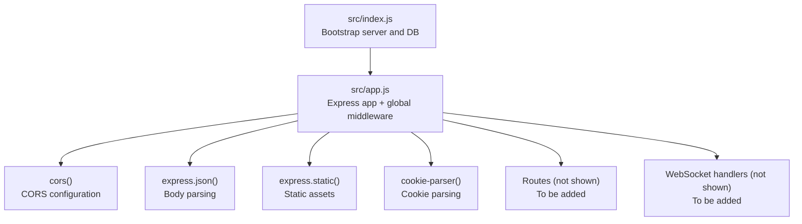
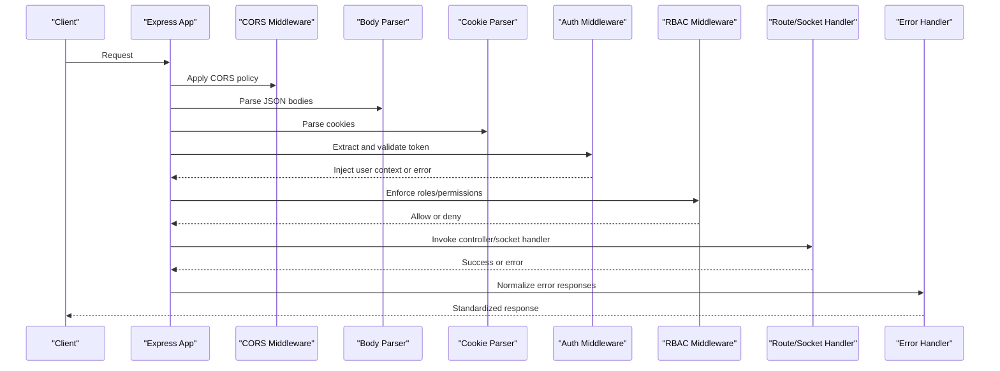
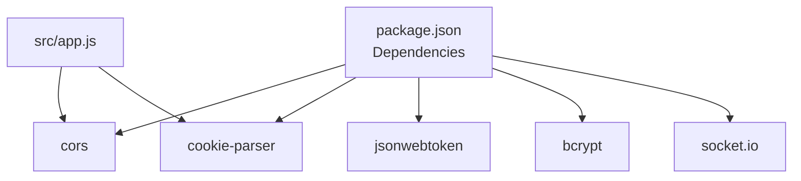

# Middleware Protection

<cite>
**Referenced Files in This Document**
- [src/app.js](file://src/app.js)
- [src/index.js](file://src/index.js)
- [src/utils/ApiError.js](file://src/utils/ApiError.js)
- [src/utils/ApiResponse.js](file://src/utils/ApiResponse.js)
- [src/utils/asyncHandler.js](file://src/utils/asyncHandler.js)
- [package.json](file://package.json)
</cite>

## Table of Contents
1. [Introduction](#introduction)
2. [Project Structure](#project-structure)
3. [Core Components](#core-components)
4. [Architecture Overview](#architecture-overview)
5. [Detailed Component Analysis](#detailed-component-analysis)
6. [Dependency Analysis](#dependency-analysis)
7. [Performance Considerations](#performance-considerations)
8. [Troubleshooting Guide](#troubleshooting-guide)
9. [Conclusion](#conclusion)
10. [Appendices](#appendices)

## Introduction
This document explains the middleware protection mechanisms currently present in the backend and how to extend them to secure API endpoints and WebSocket connections. It focuses on:
- Authentication middleware patterns for token extraction, validation, and user context injection
- Authorization middleware patterns for role-based access control and permission verification
- CORS middleware configuration for cross-origin resource sharing and security policy enforcement
- Error handling middleware for consistent error responses and exception management
- Practical middleware chain configuration, order of execution, and custom middleware development
- Performance considerations, caching strategies, and optimization techniques
- Testing approaches and debugging methodologies
- Troubleshooting guides for middleware conflicts, authentication failures, and authorization issues
- Best practices for composing middleware and building a modular security architecture

Note: The current repository includes basic Express middleware registration and shared utilities. Authentication, authorization, and WebSocket-specific middleware are not yet implemented in the repository and must be added according to the guidance below.

## Project Structure
The backend initializes Express, registers global middleware, and connects to the database. The middleware layer is currently minimal, with CORS and body parsing enabled globally. Authentication, authorization, and error handling middleware are not yet implemented and should be added to the middleware chain.

**Diagram sources**
- [src/index.js](file://src/index.js#L1-L18)
- [src/app.js](file://src/app.js#L1-L16)

**Section sources**
- [src/index.js](file://src/index.js#L1-L18)
- [src/app.js](file://src/app.js#L1-L16)

## Core Components
- Global middleware registration in the Express app
- Shared utilities for error and response handling
- Asynchronous handler wrapper for route controllers

Key observations:
- CORS is configured globally with origin from environment variable.
- Body parsing, static asset serving, and cookie parsing are registered globally.
- No authentication, authorization, or error handling middleware is currently defined in the repository.

**Section sources**
- [src/app.js](file://src/app.js#L1-L16)
- [src/utils/ApiError.js](file://src/utils/ApiError.js#L1-L22)
- [src/utils/ApiResponse.js](file://src/utils/ApiResponse.js#L1-L17)
- [src/utils/asyncHandler.js](file://src/utils/asyncHandler.js#L1-L8)

## Architecture Overview
The current architecture applies middleware at the application level. To secure APIs and WebSockets, middleware should be composed around route handlers and socket handlers. The recommended flow is:

[No sources needed since this diagram shows conceptual workflow, not actual code structure]

## Detailed Component Analysis

### CORS Middleware
- Purpose: Control cross-origin requests and enforce security policies.
- Current implementation: Globally enabled with origin from environment variable.
- Security considerations:
  - Set origin to a strict allowlist in production.
  - Configure allowed methods, headers, credentials, and exposed headers.
  - Limit max age and preflight caching appropriately.

Recommended configuration pattern:
- Define a dedicated middleware file exporting a CORS configuration function.
- Apply it before route registration.
- Use environment variables for origin, methods, headers, and credentials.

**Section sources**
- [src/app.js](file://src/app.js#L8-L10)

### Authentication Middleware
- Purpose: Extract tokens from Authorization header or cookies, validate them, and inject user context into the request.
- Implementation pattern:
  - Token extraction from Authorization header or cookies.
  - JWT validation using a secret or JWK set.
  - Load user profile and attach to req.user.
  - On failure, throw an error handled by the error middleware.

Common steps:
- Verify token signature and expiration.
- Optional: blacklist/jwt-revocation checks.
- Optional: session binding and IP/host checks.

[No sources needed since this section describes implementation patterns without analyzing specific files]

### Authorization Middleware (Role-Based Access Control)
- Purpose: Enforce role-based and permission-based access control after authentication.
- Implementation pattern:
  - Define roles and permissions (e.g., admin, user, manager).
  - Decorate routes with required roles/permissions.
  - Middleware checks req.user.roles/permissions against route requirements.
  - Deny access with appropriate error codes.

[No sources needed since this section describes implementation patterns without analyzing specific files]

### Error Handling Middleware
- Purpose: Centralize error normalization and response formatting.
- Implementation pattern:
  - Catch thrown errors and convert to standardized responses.
  - Distinguish between client errors (validation, unauthorized, forbidden) and server errors.
  - Optionally log structured errors with correlation IDs.

Current utilities:
- ApiError: Base error class with status code, message, and optional stack.
- ApiResponse: Base response class with status, data, and message.
- asyncHandler: Wrapper to catch asynchronous errors and forward to Express error middleware.

**Section sources**
- [src/utils/ApiError.js](file://src/utils/ApiError.js#L1-L22)
- [src/utils/ApiResponse.js](file://src/utils/ApiResponse.js#L1-L17)
- [src/utils/asyncHandler.js](file://src/utils/asyncHandler.js#L1-L8)

### WebSocket Middleware
- Purpose: Secure WebSocket connections with authentication and authorization.
- Implementation pattern:
  - Use Socket.IO middleware hooks to validate tokens during handshake.
  - Attach user context to socket connections.
  - Apply authorization per namespace/channel.

[No sources needed since this section describes implementation patterns without analyzing specific files]

### Practical Middleware Chain Configuration
- Order of execution:
  1) CORS
  2) Body parsing
  3) Cookie parsing
  4) Authentication
  5) Authorization
  6) Route/Socket handler
  7) Error handling
- Conditional middleware: Some middleware may be route-scoped or socket-scoped.

[No sources needed since this section provides general guidance]

### Custom Middleware Development
- Pattern: Function(req, res, next) with consistent error propagation.
- Best practices:
  - Keep middleware single-purpose.
  - Use early returns for skips.
  - Avoid blocking operations inside middleware.
  - Log and instrument middleware for observability.

[No sources needed since this section provides general guidance]

## Dependency Analysis
External dependencies relevant to middleware:
- cors: Cross-origin resource sharing
- cookie-parser: Parsing cookies for token extraction
- jsonwebtoken: JWT validation and claims extraction
- bcrypt: Password hashing (useful for auth flows)
- socket.io: WebSocket server (requires handshake middleware)

**Diagram sources**
- [package.json](file://package.json#L14-L26)
- [src/app.js](file://src/app.js#L1-L16)

**Section sources**
- [package.json](file://package.json#L14-L26)
- [src/app.js](file://src/app.js#L1-L16)

## Performance Considerations
- Middleware ordering: Place fast middleware earlier (CORS, body parsing, cookie parsing).
- Caching:
  - Cache JWT claims or user roles per request if safe.
  - Cache role/permission lookups for repeated checks.
- Avoid heavy synchronous work in middleware.
- Use streaming for large payloads and compress responses where appropriate.
- Rate-limit middleware should be placed close to the route to avoid unnecessary processing.

[No sources needed since this section provides general guidance]

## Troubleshooting Guide
- CORS failures:
  - Verify origin matches the requesting domain.
  - Check allowed methods/headers match the client’s requests.
  - Confirm credentials are allowed only when necessary.
- Authentication failures:
  - Confirm token presence and format.
  - Validate token signature and expiration.
  - Check token revocation/blacklist if applicable.
- Authorization issues:
  - Ensure roles/permissions are correctly attached to the user context.
  - Verify route decorators match the user’s assigned roles.
- Error handling:
  - Confirm error middleware is registered last.
  - Ensure thrown errors are instances of the error utility classes.

[No sources needed since this section provides general guidance]

## Conclusion
The backend currently registers basic global middleware and provides shared utilities for error and response handling. To achieve robust protection for APIs and WebSockets, implement dedicated authentication and authorization middleware, integrate them into the middleware chain, and complement with comprehensive error handling and CORS configuration. Follow the patterns and best practices outlined here to build a modular and maintainable security architecture.

[No sources needed since this section summarizes without analyzing specific files]

## Appendices

### Appendix A: Middleware Chain Template
- Global middleware (CORS, body parsing, cookie parsing)
- Authentication middleware (token extraction and validation)
- Authorization middleware (roles/permissions)
- Route handlers
- Error handling middleware

[No sources needed since this section provides general guidance]

### Appendix B: Environment Variables
- CORS origin for production hardening
- JWT secret or JWKS endpoint
- Cookie options (sameSite, secure, httpOnly)

[No sources needed since this section provides general guidance]