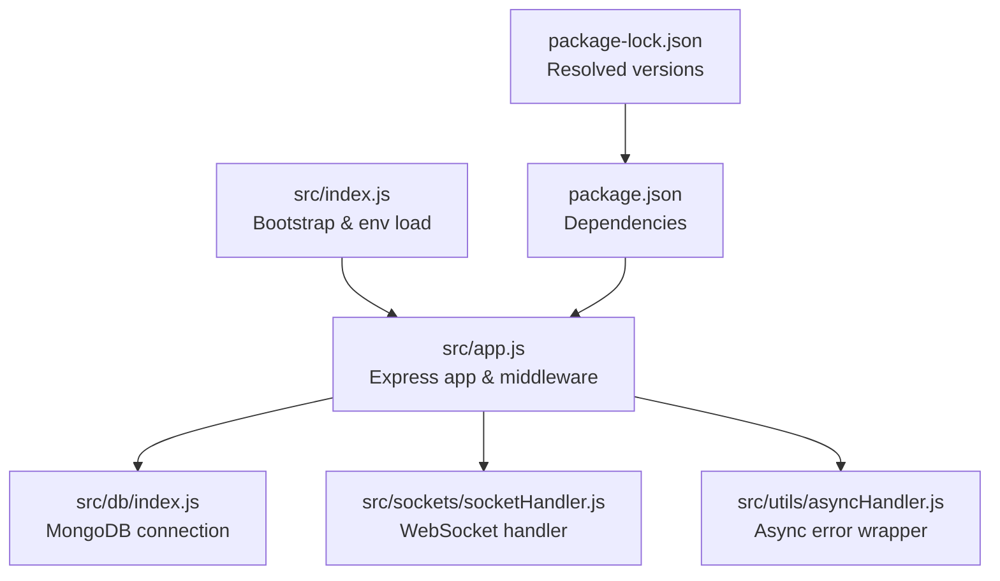
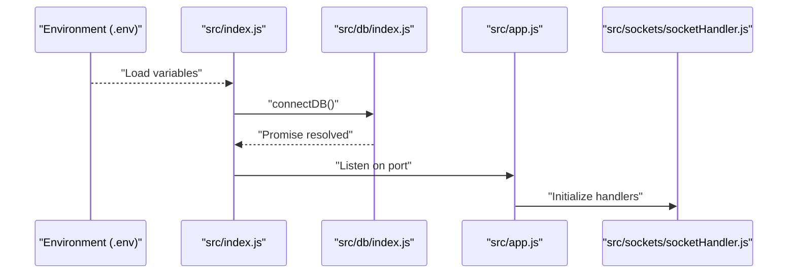
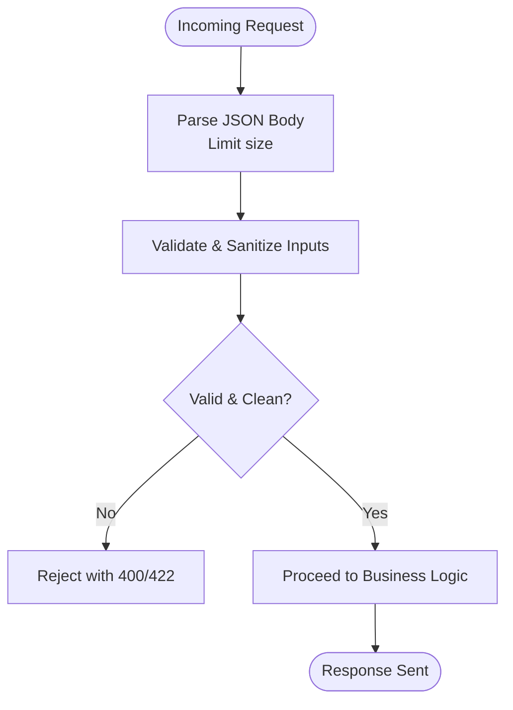
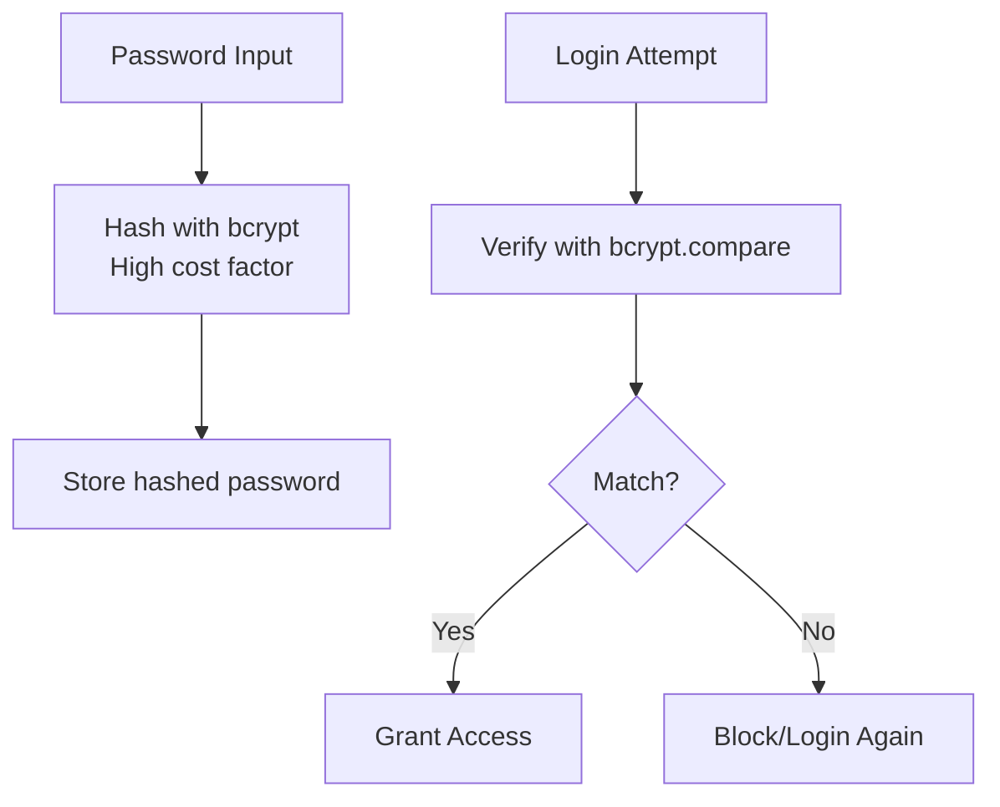
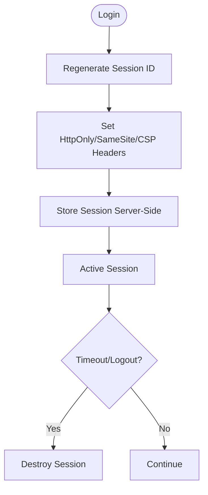
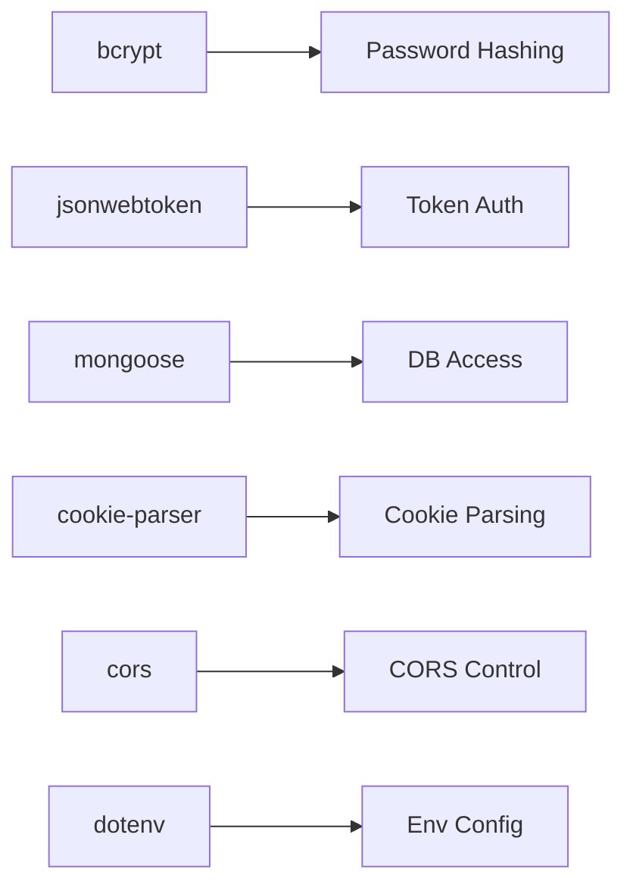

# Security Practices

<cite>
**Referenced Files in This Document**
- [src/app.js](file://src/app.js)
- [src/index.js](file://src/index.js)
- [src/db/index.js](file://src/db/index.js)
- [src/sockets/socketHandler.js](file://src/sockets/socketHandler.js)
- [src/utils/asyncHandler.js](file://src/utils/asyncHandler.js)
- [package.json](file://package.json)
- [package-lock.json](file://package-lock.json)
</cite>

## Table of Contents
1. [Introduction](#introduction)
2. [Project Structure](#project-structure)
3. [Core Components](#core-components)
4. [Architecture Overview](#architecture-overview)
5. [Detailed Component Analysis](#detailed-component-analysis)
6. [Dependency Analysis](#dependency-analysis)
7. [Performance Considerations](#performance-considerations)
8. [Troubleshooting Guide](#troubleshooting-guide)
9. [Conclusion](#conclusion)
10. [Appendices](#appendices)

## Introduction
This document consolidates security practices and best practices for the Task Management System backend. It focuses on input validation strategies, secure password handling, session security, encryption, security headers and CSP, secure communications, monitoring and auditing, security testing, incident response, and compliance considerations. Where applicable, the analysis references actual source files and dependencies present in the repository.

## Project Structure
The backend follows a modular Express application structure with environment-driven configuration, database connectivity via Mongoose, and optional WebSocket support. Key security-relevant areas include:
- Application bootstrap and middleware configuration
- Environment variable loading
- Database connection initialization
- Socket handler placeholder for real-time features
- Utility for async error handling

**Diagram sources**
- [src/index.js](file://src/index.js#L1-L18)
- [src/app.js](file://src/app.js#L1-L15)
- [src/db/index.js](file://src/db/index.js#L1-L14)
- [src/sockets/socketHandler.js](file://src/sockets/socketHandler.js#L1-L6)
- [src/utils/asyncHandler.js](file://src/utils/asyncHandler.js#L1-L7)
- [package.json](file://package.json#L1-L27)
- [package-lock.json](file://package-lock.json#L1-L928)

**Section sources**
- [src/index.js](file://src/index.js#L1-L18)
- [src/app.js](file://src/app.js#L1-L15)
- [src/db/index.js](file://src/db/index.js#L1-L14)
- [src/sockets/socketHandler.js](file://src/sockets/socketHandler.js#L1-L6)
- [src/utils/asyncHandler.js](file://src/utils/asyncHandler.js#L1-L7)
- [package.json](file://package.json#L1-L27)
- [package-lock.json](file://package-lock.json#L1-L928)

## Core Components
- Express application and middleware stack configured for CORS, JSON parsing, static assets, and cookie parsing.
- Environment-driven configuration via dotenv.
- MongoDB connection using Mongoose.
- Placeholder for WebSocket handler.
- Async error handling utility.

Security-relevant observations:
- JSON payload size limit is set, which helps mitigate certain denial-of-service vectors.
- CORS is enabled but configured via environment variable, allowing runtime control.
- Cookie parsing is enabled, indicating potential use of cookies for sessions.

**Section sources**
- [src/app.js](file://src/app.js#L1-L15)
- [src/index.js](file://src/index.js#L1-L18)
- [src/db/index.js](file://src/db/index.js#L1-L14)
- [src/sockets/socketHandler.js](file://src/sockets/socketHandler.js#L1-L6)
- [src/utils/asyncHandler.js](file://src/utils/asyncHandler.js#L1-L7)
- [package.json](file://package.json#L1-L27)

## Architecture Overview
The backend initializes environment variables, connects to MongoDB, and starts the Express server. Middleware configuration precedes route registration. Real-time features are supported via Socket.IO, with a dedicated handler module.

**Diagram sources**
- [src/index.js](file://src/index.js#L1-L18)
- [src/db/index.js](file://src/db/index.js#L1-L14)
- [src/app.js](file://src/app.js#L1-L15)
- [src/sockets/socketHandler.js](file://src/sockets/socketHandler.js#L1-L6)

## Detailed Component Analysis

### Input Validation and Sanitization
Current implementation highlights:
- JSON body parsing with a 16 KB limit, reducing risk from oversized payloads.
- Static asset serving and cookie parsing enabled.

Recommendations:
- Implement structured input validation and sanitization at the controller level using a robust library such as Joi, express-validator, or class-validator.
- Enforce strict schemas for all incoming requests and sanitize untrusted data before processing.
- Apply Content Security Policy (CSP) headers and escape HTML in views/templates to prevent XSS.
- Use parameterized queries or an ODM with built-in protection against NoSQL injection.

**Diagram sources**
- [src/app.js](file://src/app.js#L11-L13)

**Section sources**
- [src/app.js](file://src/app.js#L11-L13)

### Secure Password Handling
Current implementation highlights:
- bcrypt is included as a dependency, suitable for password hashing.

Recommendations:
- Hash passwords with bcrypt using a high cost factor appropriate for your environment.
- Never store plain-text or weakly hashed passwords.
- Enforce strong password policies (length, character variety, uniqueness).
- Implement account lockout or rate limiting after failed attempts.

**Diagram sources**
- [package.json](file://package.json#L14-L22)

**Section sources**
- [package.json](file://package.json#L14-L22)

### Session Security
Current implementation highlights:
- cookie-parser is enabled, indicating cookies are parsed.

Recommendations:
- Use secure, httpOnly, and sameSite cookies for session storage.
- Implement session regeneration after login to prevent fixation.
- Set reasonable session timeouts and sliding expiration.
- Store session identifiers server-side (e.g., in Redis/MongoDB) with TTL.

**Diagram sources**
- [src/app.js](file://src/app.js#L13)

**Section sources**
- [src/app.js](file://src/app.js#L13)

### Data Encryption
Current implementation highlights:
- No explicit encryption libraries observed in the provided files.

Recommendations:
- At rest: Encrypt sensitive documents in MongoDB using provider-side encryption or client-side encryption with a KMS.
- In transit: Enforce TLS 1.2+/1.3+ across all endpoints and internal services.
- Rotate keys regularly and manage secrets via environment variables or a secret manager.

[No sources needed since this section provides general guidance]

### Security Headers and CSP
Current implementation highlights:
- No explicit security headers are applied in the provided files.

Recommendations:
- Add helmet or equivalent middleware to set security headers (Strict-Transport-Security, X-Content-Type-Options, Referrer-Policy, etc.).
- Define a strong Content Security Policy (CSP) to mitigate XSS and data injection.
- Configure HSTS and frame-options appropriately.

[No sources needed since this section provides general guidance]

### Secure Communication Protocols
- Enforce HTTPS/TLS for all traffic.
- Use modern TLS versions and strong cipher suites.
- Configure reverse proxies/load balancers to handle TLS termination securely.

[No sources needed since this section provides general guidance]

### Security Monitoring, Logging, and Audit Trails
- Implement structured logging with redaction of sensitive fields.
- Centralize logs and monitor for anomalies (failed logins, repeated errors).
- Maintain audit trails for privileged actions and PII-related operations.

[No sources needed since this section provides general guidance]

### Security Testing Methodologies
- Conduct automated dependency scanning and SCA checks.
- Perform static application security testing (SAST) and interactive application security testing (IAST).
- Carry out penetration testing by authorized teams with signed agreements.
- Include security code reviews focusing on authentication, authorization, input validation, and error handling.

[No sources needed since this section provides general guidance]

### Incident Response Procedures
- Define escalation paths and communication plans.
- Isolate affected systems, rotate secrets, and patch vulnerabilities.
- Preserve forensic artifacts and coordinate with stakeholders per policy.

[No sources needed since this section provides general guidance]

### Compliance Considerations
- Align with data protection frameworks (e.g., GDPR, CCPA) where applicable.
- Implement data minimization, purpose limitation, and retention controls.
- Provide user rights mechanisms (access, erasure, data portability) where relevant.

[No sources needed since this section provides general guidance]

## Dependency Analysis
The backend relies on several key packages that influence security posture:
- bcrypt: for secure password hashing
- jsonwebtoken: for token-based authentication (ensure proper signing and verification)
- mongoose: for database access (ensure connection security and query safety)
- cookie-parser: for cookie parsing (combine with secure cookie settings)
- cors: for cross-origin control (configure origins carefully)
- dotenv: for environment configuration (ensure secrets are not committed)

**Diagram sources**
- [package.json](file://package.json#L14-L22)

**Section sources**
- [package.json](file://package.json#L14-L22)
- [package-lock.json](file://package-lock.json#L1-L928)

## Performance Considerations
- Keep payload sizes bounded to reduce memory pressure and parsing overhead.
- Use efficient hashing costs to balance security and performance.
- Employ connection pooling and indexing to minimize database latency.

[No sources needed since this section provides general guidance]

## Troubleshooting Guide
Common security-related issues and remedies:
- Authentication failures: verify bcrypt cost, token signing, and cookie attributes.
- CORS errors: confirm allowed origins and credentials handling.
- Database connection problems: check TLS settings and credentials.
- Unexpected 400 responses: validate payload limits and sanitization rules.

Operational tips:
- Use async error handling to centralize error responses.
- Log security events without exposing sensitive data.

**Section sources**
- [src/utils/asyncHandler.js](file://src/utils/asyncHandler.js#L1-L7)
- [src/app.js](file://src/app.js#L11-L13)

## Conclusion
The Task Management System backend establishes a foundation with environment-driven configuration, database connectivity, and middleware. To achieve robust security, integrate structured input validation and sanitization, enforce secure password handling with bcrypt, harden session management with secure cookies and timeouts, apply encryption at rest and in transit, configure security headers and CSP, and establish comprehensive monitoring, testing, and incident response processes aligned with applicable compliance requirements.

[No sources needed since this section summarizes without analyzing specific files]

## Appendices
- Review environment variables for secrets and ensure they are managed securely.
- Validate that CORS origins are restrictive and avoid wildcard configurations.
- Confirm TLS termination and cipher suite policies at the network boundary.

[No sources needed since this section provides general guidance]