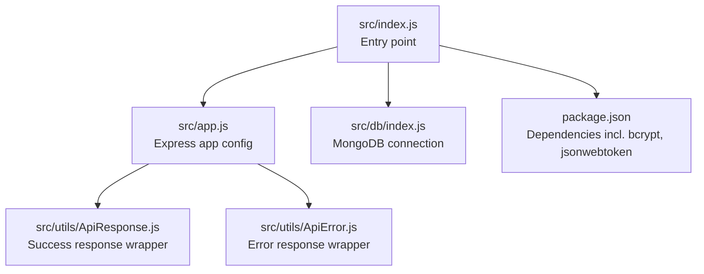
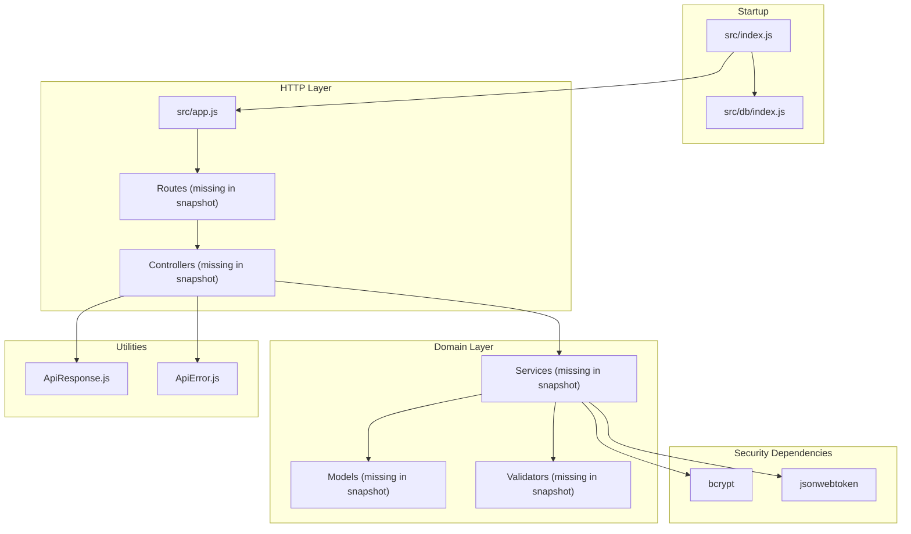
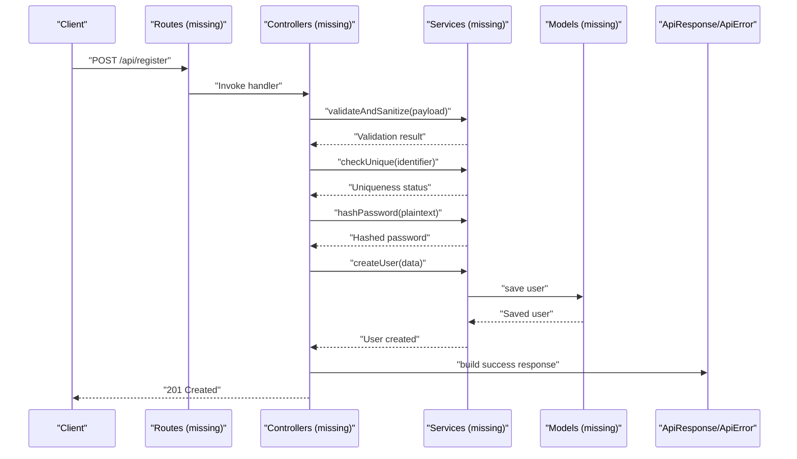
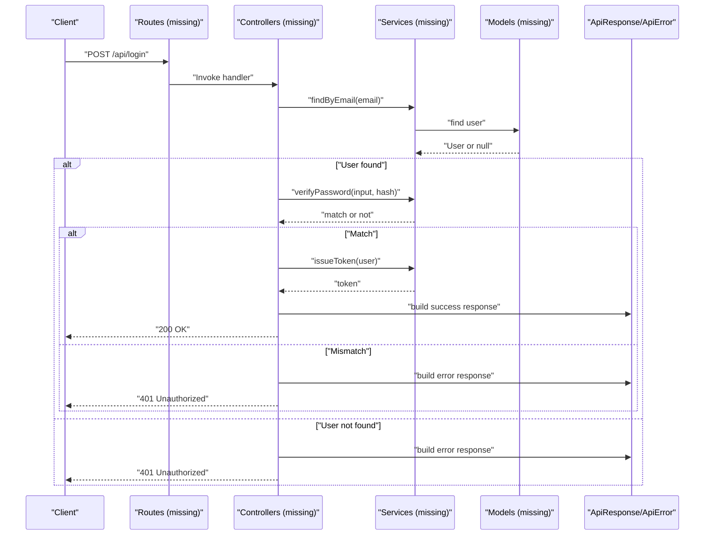
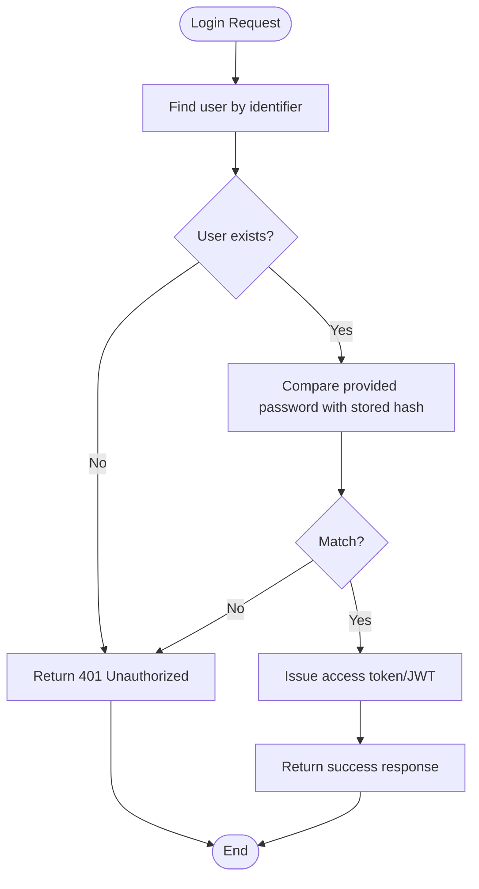
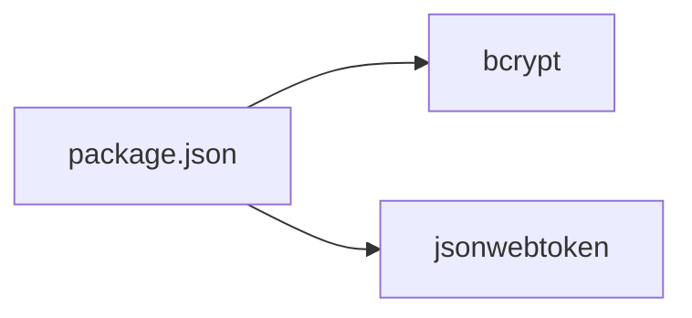

# User Registration & Login

<cite>
**Referenced Files in This Document**
- [src/app.js](file://src/app.js)
- [src/index.js](file://src/index.js)
- [src/db/index.js](file://src/db/index.js)
- [src/utils/ApiResponse.js](file://src/utils/ApiResponse.js)
- [src/utils/ApiError.js](file://src/utils/ApiError.js)
- [package.json](file://package.json)
</cite>

## Table of Contents
1. [Introduction](#introduction)
2. [Project Structure](#project-structure)
3. [Core Components](#core-components)
4. [Architecture Overview](#architecture-overview)
5. [Detailed Component Analysis](#detailed-component-analysis)
6. [Dependency Analysis](#dependency-analysis)
7. [Performance Considerations](#performance-considerations)
8. [Troubleshooting Guide](#troubleshooting-guide)
9. [Conclusion](#conclusion)

## Introduction
This document describes the user registration and login workflows for the Task Management System backend. It focuses on the foundational components that support authentication, including input validation, unique identifier enforcement, account creation, credential verification, password hashing with bcrypt, and response/error handling patterns. It also outlines session management approaches, security considerations, and troubleshooting guidance.

Note: The current repository snapshot does not include controller, model, route, service, middleware, or validator modules. Therefore, this document provides a framework and implementation guidance grounded in the existing utilities and dependencies, and it indicates where missing modules would integrate.

## Project Structure
The backend initializes Express, connects to MongoDB, and exposes shared utilities for consistent API responses and errors. Authentication-related modules (controllers, services, routes, validators, and models) are not present in this snapshot but are indicated as essential building blocks for the registration and login workflows.

**Diagram sources**
- [src/index.js](file://src/index.js#L1-L18)
- [src/app.js](file://src/app.js#L1-L16)
- [src/db/index.js](file://src/db/index.js#L1-L14)
- [src/utils/ApiResponse.js](file://src/utils/ApiResponse.js#L1-L17)
- [src/utils/ApiError.js](file://src/utils/ApiError.js#L1-L22)
- [package.json](file://package.json#L1-L28)

**Section sources**
- [src/index.js](file://src/index.js#L1-L18)
- [src/app.js](file://src/app.js#L1-L16)
- [src/db/index.js](file://src/db/index.js#L1-L14)
- [src/utils/ApiResponse.js](file://src/utils/ApiResponse.js#L1-L17)
- [src/utils/ApiError.js](file://src/utils/ApiError.js#L1-L22)
- [package.json](file://package.json#L1-L28)

## Core Components
- Express app initialization and middleware setup for CORS, JSON parsing, cookies, and static assets.
- MongoDB connection module for database connectivity.
- Utility classes for standardized API responses and errors.

Key capabilities:
- Input handling via Express JSON parser with size limits.
- Cookie parsing for session-related headers.
- Consistent error and success response formats for downstream handlers.

**Section sources**
- [src/app.js](file://src/app.js#L1-L16)
- [src/db/index.js](file://src/db/index.js#L1-L14)
- [src/utils/ApiResponse.js](file://src/utils/ApiResponse.js#L1-L17)
- [src/utils/ApiError.js](file://src/utils/ApiError.js#L1-L22)

## Architecture Overview
The authentication pipeline integrates the following layers:
- Entry point initializes environment and database.
- App configures middleware and routes.
- Controllers handle HTTP requests and delegate to services.
- Services encapsulate business logic and interact with models.
- Models define user schema and persistence.
- Validators enforce input rules.
- Utilities standardize responses and errors.

**Diagram sources**
- [src/index.js](file://src/index.js#L1-L18)
- [src/db/index.js](file://src/db/index.js#L1-L14)
- [src/app.js](file://src/app.js#L1-L16)
- [src/utils/ApiResponse.js](file://src/utils/ApiResponse.js#L1-L17)
- [src/utils/ApiError.js](file://src/utils/ApiError.js#L1-L22)
- [package.json](file://package.json#L14-L22)

## Detailed Component Analysis

### User Registration Workflow
This section documents the recommended flow for user registration, grounded in the available utilities and dependencies.

- Input validation
  - Enforce required fields and constraints using validators.
  - Sanitize inputs to prevent injection and normalize data.
- Unique identifier enforcement
  - Check uniqueness of identifiers (e.g., email) before creating an account.
- Account creation
  - Hash the plaintext password using bcrypt.
  - Persist the user record with hashed credentials.
- Response handling
  - Return success via ApiResponse on completion.
  - Return ApiError on validation or persistence failures.

**Diagram sources**
- [src/utils/ApiResponse.js](file://src/utils/ApiResponse.js#L1-L17)
- [src/utils/ApiError.js](file://src/utils/ApiError.js#L1-L22)
- [package.json](file://package.json#L14-L22)

Registration endpoint (conceptual):
- Method: POST
- Path: /api/register
- Request body fields:
  - email: string, required, unique, sanitized
  - password: string, required, validated for strength
  - name: string, optional
- Responses:
  - 201 Created: { message, data: { id, email, name } }
  - 400 Bad Request: { error: "Validation failed", details }
  - 409 Conflict: { error: "Identifier already exists" }
  - 500 Internal Server Error: { error: "Registration failed" }

Common validation rules:
- Email format and uniqueness.
- Password minimum length, character variety, and entropy checks.
- Optional sanitization of name and other fields.

Security considerations:
- Enforce rate limiting per IP/email.
- Implement brute force protection (e.g., exponential backoff).
- Reject weak passwords based on dictionary or common pattern checks.

**Section sources**
- [src/utils/ApiResponse.js](file://src/utils/ApiResponse.js#L1-L17)
- [src/utils/ApiError.js](file://src/utils/ApiError.js#L1-L22)
- [package.json](file://package.json#L14-L22)

### Login Workflow
This section documents the recommended flow for user login, including credential verification and session handling.

- Credential verification
  - Retrieve user by identifier (e.g., email).
  - Compare provided password with stored hash using bcrypt.
- Session management
  - On successful verification, issue a signed JWT or set a session cookie.
  - Optionally store a refresh token with expiration and revocation controls.
- Response handling
  - Return success via ApiResponse on authentication success.
  - Return ApiError on invalid credentials or server errors.

**Diagram sources**
- [src/utils/ApiResponse.js](file://src/utils/ApiResponse.js#L1-L17)
- [src/utils/ApiError.js](file://src/utils/ApiError.js#L1-L22)
- [package.json](file://package.json#L14-L22)

Login endpoint (conceptual):
- Method: POST
- Path: /api/login
- Request body fields:
  - email: string, required
  - password: string, required
- Responses:
  - 200 OK: { message, token, user: { id, email, name } }
  - 401 Unauthorized: { error: "Invalid credentials" }
  - 500 Internal Server Error: { error: "Login failed" }

Session management (conceptual):
- Access token issued on login with short TTL.
- Refresh token optionally issued with longer TTL and stored securely.
- Token revocation on logout or suspicious activity.

**Section sources**
- [src/utils/ApiResponse.js](file://src/utils/ApiResponse.js#L1-L17)
- [src/utils/ApiError.js](file://src/utils/ApiError.js#L1-L22)
- [package.json](file://package.json#L14-L22)

### Password Security Implementation
- Salt generation and hashing
  - Use bcrypt to generate a salt and compute the hash from the plaintext password.
  - Never store plaintext passwords.
- Hash comparison
  - On login, compare the provided password against the stored hash.
- Secure storage practices
  - Store only the bcrypt hash.
  - Use environment variables for secret keys and salts.
  - Avoid logging sensitive data.

**Diagram sources**
- [package.json](file://package.json#L14-L22)
- [src/utils/ApiResponse.js](file://src/utils/ApiResponse.js#L1-L17)
- [src/utils/ApiError.js](file://src/utils/ApiError.js#L1-L22)

**Section sources**
- [package.json](file://package.json#L14-L22)
- [src/utils/ApiResponse.js](file://src/utils/ApiResponse.js#L1-L17)
- [src/utils/ApiError.js](file://src/utils/ApiError.js#L1-L22)

### User Data Validation and Injection Protection
- Input validation
  - Define strict schemas for registration and login payloads.
  - Enforce presence, type, length, and format constraints.
- Sanitization
  - Normalize and sanitize inputs to remove or escape unsafe characters.
- Injection protection
  - Use parameterized queries or ODM methods to avoid injection.
  - Apply Content Security Policies and input filters.

[No sources needed since this section provides general guidance]

### Rate Limiting and Brute Force Protection
- Rate limiting
  - Limit requests per IP or per identifier within a sliding window.
- Brute force protection
  - Temporarily lock accounts or IPs after repeated failed attempts.
  - Implement exponential backoff for retries.

[No sources needed since this section provides general guidance]

## Dependency Analysis
The backend declares bcrypt for password hashing and jsonwebtoken for token-based sessions. These libraries underpin secure authentication.

**Diagram sources**
- [package.json](file://package.json#L14-L22)

**Section sources**
- [package.json](file://package.json#L14-L22)

## Performance Considerations
- Hash cost tuning
  - Adjust bcrypt cost factor to balance security and performance.
- Token size
  - Keep JWT payloads minimal to reduce bandwidth.
- Caching
  - Cache non-sensitive user metadata to reduce database load.
- Database indexing
  - Index unique identifiers (e.g., email) to speed up lookups.

[No sources needed since this section provides general guidance]

## Troubleshooting Guide

Common registration failures:
- Validation errors
  - Cause: Missing or invalid fields.
  - Resolution: Review request payload against validation rules.
- Identifier conflict
  - Cause: Duplicate email.
  - Resolution: Prompt user to use another identifier or reset password.
- Server errors
  - Cause: Database connectivity or internal failure.
  - Resolution: Check database logs and retry.

Common login issues:
- Invalid credentials
  - Cause: Wrong email or password.
  - Resolution: Prompt user to re-enter credentials.
- Token issuance failures
  - Cause: Signing key misconfiguration.
  - Resolution: Verify environment variables and restart service.

Account security problems:
- Compromised credentials
  - Action: Invalidate tokens, require password reset.
- Suspicious activity
  - Action: Enable rate limiting, temporarily lock account, notify user.

**Section sources**
- [src/utils/ApiError.js](file://src/utils/ApiError.js#L1-L22)
- [src/utils/ApiResponse.js](file://src/utils/ApiResponse.js#L1-L17)

## Conclusion
The Task Management System’s backend provides a solid foundation for authentication through Express configuration, MongoDB connectivity, and standardized response/error utilities. While the current snapshot lacks controllers, services, routes, validators, and models, the outlined workflows demonstrate how to implement secure user registration and login with bcrypt-based password hashing, JWT-based session handling, and robust validation and error management. Integrating the missing modules according to the documented patterns will deliver a production-ready authentication system.