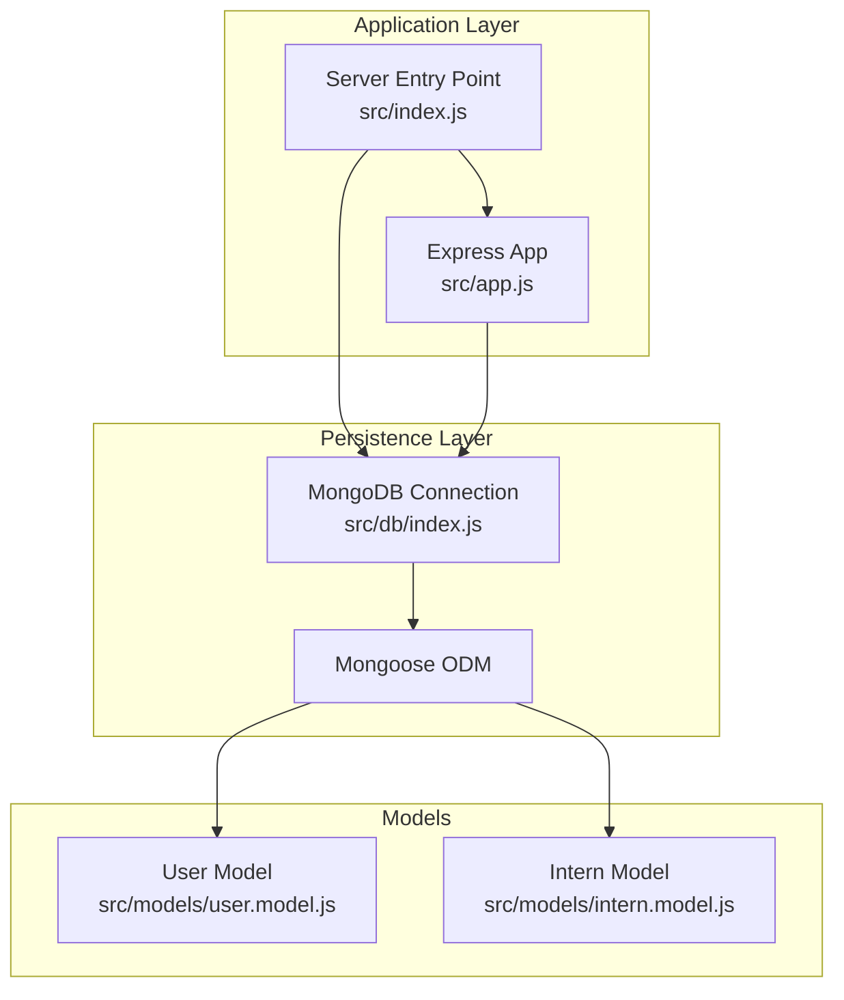
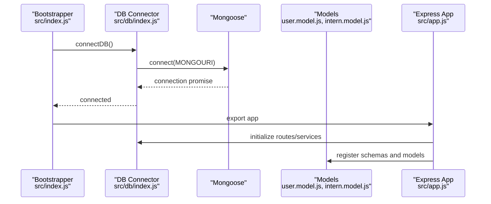
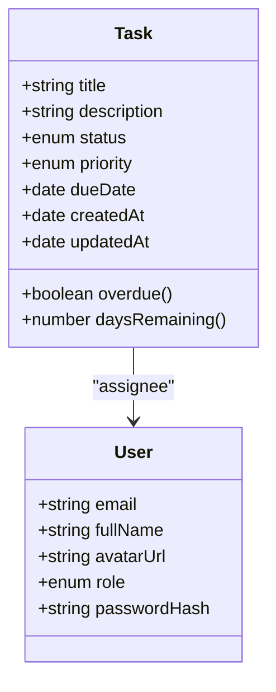
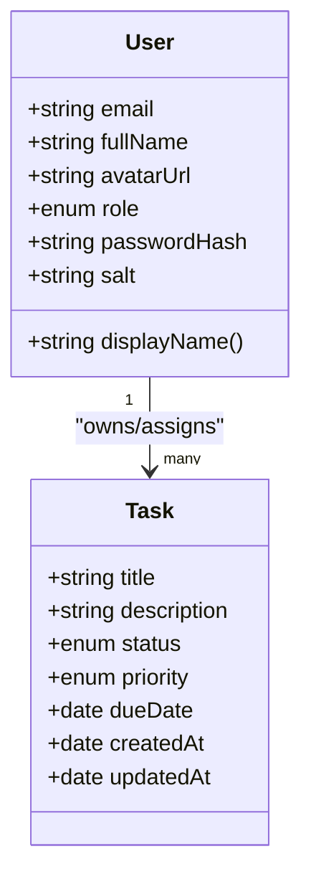
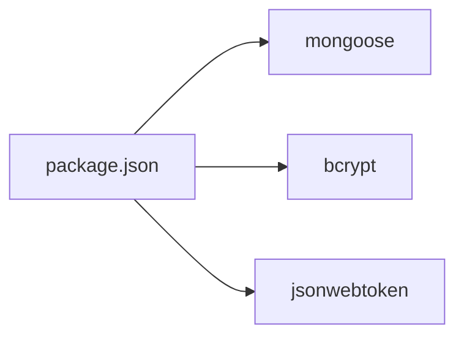

# Data Models & Schema Design

<cite>
**Referenced Files in This Document**
- [src/db/index.js](file://src/db/index.js)
- [src/models/user.model.js](file://src/models/user.model.js)
- [src/models/intern.model.js](file://src/models/intern.model.js)
- [src/app.js](file://src/app.js)
- [src/index.js](file://src/index.js)
- [package.json](file://package.json)
</cite>

## Table of Contents
1. [Introduction](#introduction)
2. [Project Structure](#project-structure)
3. [Core Components](#core-components)
4. [Architecture Overview](#architecture-overview)
5. [Detailed Component Analysis](#detailed-component-analysis)
6. [Dependency Analysis](#dependency-analysis)
7. [Performance Considerations](#performance-considerations)
8. [Troubleshooting Guide](#troubleshooting-guide)
9. [Conclusion](#conclusion)
10. [Appendices](#appendices)

## Introduction
This document provides comprehensive data model documentation for the Task Management System. It focuses on the planned Task entity and the User entity, detailing fields, data types, validation rules, business constraints, Mongoose schema definitions, virtual properties, middleware hooks, indexing strategies, field selection patterns, and data normalization considerations. It also includes examples of model instantiation, population queries, and relationship management between Tasks and Users.

## Project Structure
The backend uses Express and Mongoose. Database connectivity is established via a dedicated module, and the application initializes middleware and routing. The current repository snapshot includes two model files: a User model and an Intern model. The Intern model is likely intended to represent a specialized User role or a subset of User capabilities for the Task Management System.

**Diagram sources**
- [src/index.js](file://src/index.js#L1-L18)
- [src/app.js](file://src/app.js#L1-L16)
- [src/db/index.js](file://src/db/index.js#L1-L14)
- [src/models/user.model.js](file://src/models/user.model.js)
- [src/models/intern.model.js](file://src/models/intern.model.js)

**Section sources**
- [src/index.js](file://src/index.js#L1-L18)
- [src/app.js](file://src/app.js#L1-L16)
- [src/db/index.js](file://src/db/index.js#L1-L14)
- [package.json](file://package.json#L1-L28)

## Core Components
This section documents the planned Task model and the User model, including their fields, data types, validation rules, and business constraints. It also outlines Mongoose schema design patterns, virtual properties, middleware hooks, indexing strategies, and relationship management.

- Task Model (Planned)
  - Fields
    - title: String, required
    - description: String, optional
    - status: Enum with values like "todo", "in-progress", "done", required
    - priority: Enum with values like "low", "medium", "high", required
    - dueDate: Date, optional
    - createdAt: Date, default now, immutable
    - updatedAt: Date, default now
  - Validation Rules
    - title must be non-empty
    - status and priority must match predefined enums
    - dueDate must be after createdAt if present
    - createdAt is immutable once set
  - Business Constraints
    - A Task belongs to one User (assignee)
    - Tasks can be filtered by status, priority, dueDate range, and assignee
    - Tasks should support soft deletion semantics if needed
  - Mongoose Schema Patterns
    - Define enums for status and priority
    - Use timestamps for createdAt and updatedAt
    - Add pre-save hooks to normalize title and description
    - Add post-save hooks to update updatedAt
  - Virtual Properties
    - overdue: Boolean derived from dueDate and current time
    - daysRemaining: Number computed from dueDate
  - Middleware Hooks
    - Pre-save: validate enums, compute derived fields, enforce immutability
    - Post-save: update related analytics or notifications
  - Indexing Strategies
    - Compound index: {status: 1, dueDate: 1}
    - Sparse index: {dueDate: 1} to optimize overdue queries
    - Text index on title and description for search
  - Field Selection Patterns
    - Use projection to exclude sensitive fields in lists
    - Include populate for assignee in detail views
  - Data Normalization
    - Store status and priority as enums to reduce variability
    - Denormalize minimal computed fields (e.g., overdue) for read performance

- User Model
  - Authentication Fields
    - email: String, unique, required, validated via regex
    - passwordHash: String, required, stored securely
    - salt: String, optional but recommended for PBKDF2
  - Profile Information
    - fullName: String, required
    - avatarUrl: String, optional
    - role: Enum with values like "user", "admin", default "user"
  - Task Associations
    - tasks: Array of Task references (populate on demand)
  - Validation Rules
    - email must be unique and valid
    - passwordHash must meet minimum strength criteria
    - role must match predefined enum
  - Business Constraints
    - One User can own multiple Tasks
    - Users can be assigned Tasks (assignee relationship)
  - Mongoose Schema Patterns
    - Unique index on email
    - Pre-save hook to hash password and enforce constraints
    - Virtual for displayName derived from fullName
  - Middleware Hooks
    - Pre-save: hash password, trim and normalize email
    - Post-save: invalidate old sessions if email changes
  - Indexing Strategies
    - Unique index on email
    - Compound index on role and email for admin queries
  - Field Selection Patterns
    - Exclude passwordHash and salt in public responses
    - Include tasks count or minimal task metadata for summaries

**Section sources**
- [src/models/user.model.js](file://src/models/user.model.js)
- [src/models/intern.model.js](file://src/models/intern.model.js)

## Architecture Overview
The Task Management System relies on Mongoose for schema definition and MongoDB for persistence. The server connects to the database at startup and exposes an Express application. Models are loaded into Mongoose and used by controllers and services.

**Diagram sources**
- [src/index.js](file://src/index.js#L1-L18)
- [src/db/index.js](file://src/db/index.js#L1-L14)
- [src/app.js](file://src/app.js#L1-L16)
- [src/models/user.model.js](file://src/models/user.model.js)
- [src/models/intern.model.js](file://src/models/intern.model.js)

## Detailed Component Analysis

### Task Model (Planned)
- Purpose
  - Represent individual work items with lifecycle tracking and assignment.
- Fields and Types
  - title: String
  - description: String
  - status: Enum
  - priority: Enum
  - dueDate: Date
  - createdAt: Date (immutable)
  - updatedAt: Date
- Validation and Constraints
  - title required and trimmed
  - status and priority from predefined sets
  - dueDate after createdAt when present
  - createdAt immutable
- Mongoose Schema Patterns
  - Enum definitions for status and priority
  - Timestamps enabled
  - Pre-save hook to normalize and validate
  - Post-save hook to update related fields
- Virtual Properties
  - overdue: Boolean
  - daysRemaining: Number
- Middleware Hooks
  - Pre-save: enforce validation and immutability
  - Post-save: update analytics or notifications
- Indexing
  - Compound: {status: 1, dueDate: 1}
  - Sparse: {dueDate: 1}
  - Text: {title: "text", description: "text"}
- Relationship with User
  - Reference to User as assignee
  - Populate on read for detail views
- Examples
  - Instantiation: create a new Task with title, status, priority, dueDate, and assignee
  - Population: populate assignee on Task retrieval
  - Relationship: update assignee or remove assignment

**Diagram sources**
- [src/models/user.model.js](file://src/models/user.model.js)
- [src/models/intern.model.js](file://src/models/intern.model.js)

**Section sources**
- [src/models/user.model.js](file://src/models/user.model.js)
- [src/models/intern.model.js](file://src/models/intern.model.js)

### User Model
- Purpose
  - Represent system users with authentication and profile data.
- Fields and Types
  - email: String
  - passwordHash: String
  - salt: String
  - fullName: String
  - avatarUrl: String
  - role: Enum
  - tasks: Array of Task references
- Validation and Constraints
  - email unique and valid
  - passwordHash meets strength requirements
  - role from predefined set
- Mongoose Schema Patterns
  - Unique index on email
  - Pre-save hook to hash password and normalize email
  - Virtual for displayName
- Middleware Hooks
  - Pre-save: hash password, trim email
  - Post-save: invalidate sessions if email changes
- Indexing
  - Unique: email
  - Compound: role + email for admin queries
- Relationship with Task
  - One-to-many with Task (owner/assignee)
- Examples
  - Instantiation: create a new User with email, passwordHash, fullName, role
  - Population: populate tasks on User retrieval
  - Relationship: assign Tasks to a User

**Diagram sources**
- [src/models/user.model.js](file://src/models/user.model.js)
- [src/models/intern.model.js](file://src/models/intern.model.js)

**Section sources**
- [src/models/user.model.js](file://src/models/user.model.js)
- [src/models/intern.model.js](file://src/models/intern.model.js)

### Intern Model (Contextual)
- Purpose
  - Represents a specialized User role or subset of capabilities for the Task Management System.
- Relationship
  - Likely extends or specializes the User model for interning scenarios.
- Notes
  - Consult the Intern model file for specific fields and overrides.

**Section sources**
- [src/models/intern.model.js](file://src/models/intern.model.js)

## Dependency Analysis
- External Dependencies
  - Mongoose: ODM for schema definition and querying
  - bcrypt: Password hashing
  - jsonwebtoken: Token-based authentication (if used)
- Internal Dependencies
  - Database connection module initializes Mongoose
  - Models are registered with Mongoose and consumed by controllers/services
- Coupling and Cohesion
  - Models encapsulate schema and validation logic
  - Controllers depend on models for data access
  - Services encapsulate business logic around models

**Diagram sources**
- [package.json](file://package.json#L14-L22)

**Section sources**
- [package.json](file://package.json#L14-L22)

## Performance Considerations
- Indexing
  - Ensure unique index on email for User lookups
  - Compound indexes for frequent filters (status + dueDate for Task)
  - Sparse indexes for optional fields (dueDate) to save space and improve scans
- Field Selection
  - Use projections to avoid returning large fields in lists
  - Populate only when necessary to reduce payload size
- Data Normalization
  - Store enums for status and priority to minimize storage and improve query performance
  - Denormalize minimal computed fields (overdue) for read-heavy workloads
- Query Patterns
  - Prefer filtered queries with indexes
  - Use aggregation pipelines for complex analytics on Tasks and Users

[No sources needed since this section provides general guidance]

## Troubleshooting Guide
- Database Connectivity
  - Verify MONGOURI environment variable is set
  - Confirm connection is established during server bootstrap
- Model Registration
  - Ensure models are imported so Mongoose registers them
  - Check for schema definition errors and missing required fields
- Validation Errors
  - Validate enums and date constraints before saving
  - Normalize input (trim, lowercase email) in pre-save hooks
- Population Issues
  - Confirm foreign keys are properly set
  - Use lean queries for read-heavy operations to reduce overhead

**Section sources**
- [src/db/index.js](file://src/db/index.js#L1-L14)
- [src/index.js](file://src/index.js#L1-L18)
- [src/models/user.model.js](file://src/models/user.model.js)
- [src/models/intern.model.js](file://src/models/intern.model.js)

## Conclusion
The Task Management System’s data models center on a robust User entity and a flexible Task entity with lifecycle and assignment semantics. By leveraging Mongoose schemas, enums, virtuals, and middleware hooks, the system enforces strong validation and normalization while supporting efficient querying through strategic indexing. Proper population and field selection patterns ensure scalable reads and maintainable relationships between Users and Tasks.

[No sources needed since this section summarizes without analyzing specific files]

## Appendices
- Example Workflows
  - Create a Task: instantiate with title, status, priority, dueDate, and assignee; save; optionally populate assignee on response
  - Assign a Task: update Task.assignee to a User._id; ensure User.tasks includes the Task reference
  - Filter Tasks: query by status, priority, dueDate range; use compound indexes for performance
  - Retrieve User with Tasks: populate tasks on User retrieval; project only necessary fields

[No sources needed since this section provides general guidance]