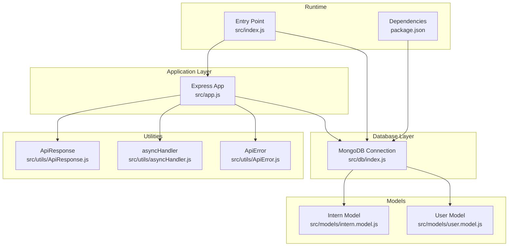
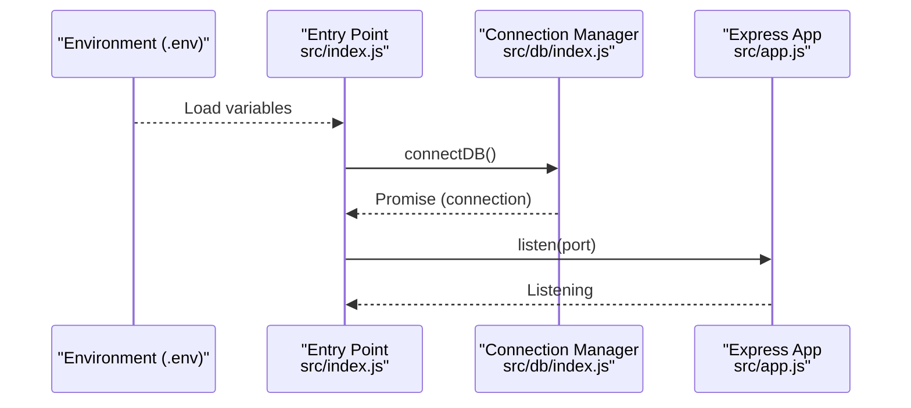
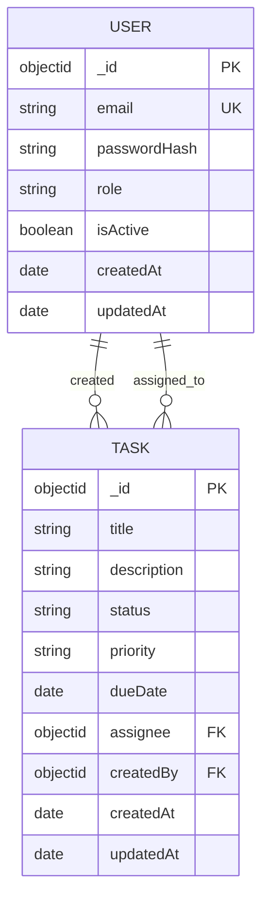
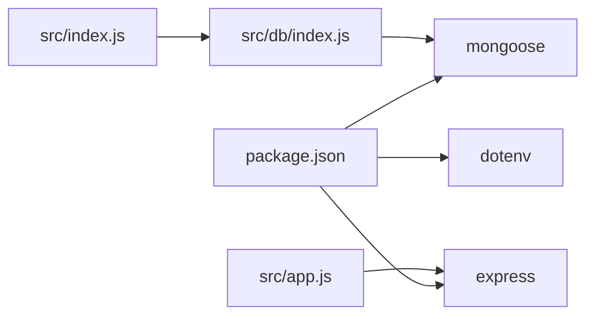

# Database Design

<cite>
**Referenced Files in This Document**
- [src/db/index.js](file://src/db/index.js)
- [src/index.js](file://src/index.js)
- [src/app.js](file://src/app.js)
- [package.json](file://package.json)
- [src/utils/ApiError.js](file://src/utils/ApiError.js)
- [src/utils/ApiResponse.js](file://src/utils/ApiResponse.js)
- [src/utils/asyncHandler.js](file://src/utils/asyncHandler.js)
- [src/models/user.model.js](file://src/models/user.model.js)
- [src/models/intern.model.js](file://src/models/intern.model.js)
</cite>

## Table of Contents
1. [Introduction](#introduction)
2. [Project Structure](#project-structure)
3. [Core Components](#core-components)
4. [Architecture Overview](#architecture-overview)
5. [Detailed Component Analysis](#detailed-component-analysis)
6. [Dependency Analysis](#dependency-analysis)
7. [Performance Considerations](#performance-considerations)
8. [Troubleshooting Guide](#troubleshooting-guide)
9. [Conclusion](#conclusion)
10. [Appendices](#appendices)

## Introduction
This document provides comprehensive database design documentation for the Task Management System. It focuses on MongoDB connectivity via Mongoose ODM, environment-based configuration, connection management, and the planned entity model for Tasks and Users. It also outlines data types, validation rules, business constraints, schema relationship diagrams, indexing strategies, query optimization, security considerations, access control patterns, backup/recovery procedures, and migration/versioning strategies grounded in the current repository state.

## Project Structure
The backend follows a modular structure with clear separation of concerns:
- Database connection setup resides under src/db/index.js and is invoked from src/index.js.
- Express application initialization and middleware configuration are in src/app.js.
- Utility modules for error handling and response formatting are located under src/utils/.
- Model definitions are under src/models/, with two existing models: user.model.js and intern.model.js.

**Diagram sources**
- [src/db/index.js](file://src/db/index.js#L1-L13)
- [src/index.js](file://src/index.js#L1-L17)
- [src/app.js](file://src/app.js#L1-L15)
- [src/utils/ApiError.js](file://src/utils/ApiError.js#L1-L21)
- [src/utils/ApiResponse.js](file://src/utils/ApiResponse.js#L1-L16)
- [src/utils/asyncHandler.js](file://src/utils/asyncHandler.js#L1-L7)
- [src/models/user.model.js](file://src/models/user.model.js)
- [src/models/intern.model.js](file://src/models/intern.model.js)
- [package.json](file://package.json#L1-L27)

**Section sources**
- [src/db/index.js](file://src/db/index.js#L1-L13)
- [src/index.js](file://src/index.js#L1-L17)
- [src/app.js](file://src/app.js#L1-L15)
- [package.json](file://package.json#L1-L27)

## Core Components
- MongoDB Connection Manager
  - Establishes a single connection to MongoDB using MONGOURI from environment variables.
  - Logs the active connection string upon successful connection.
  - Exits the process on connection failure to prevent undefined behavior.

- Environment-Based Configuration
  - Uses dotenv to load environment variables from a local .env file.
  - Reads MONGOURI for MongoDB URI and CORS for cross-origin policy.
  - PORT controls the server binding port.

- Express Application
  - Initializes CORS, static serving, JSON body parsing, and cookie parsing.
  - Provides a central app instance exported for use in the entry point.

- Utilities
  - ApiError: Standardized error class with status code, message, and optional stack.
  - ApiResponse: Standardized response wrapper with status, data, and message.
  - asyncHandler: Wrapper to safely handle asynchronous route handlers.

**Section sources**
- [src/db/index.js](file://src/db/index.js#L1-L13)
- [src/index.js](file://src/index.js#L1-L17)
- [src/app.js](file://src/app.js#L1-L15)
- [src/utils/ApiError.js](file://src/utils/ApiError.js#L1-L21)
- [src/utils/ApiResponse.js](file://src/utils/ApiResponse.js#L1-L16)
- [src/utils/asyncHandler.js](file://src/utils/asyncHandler.js#L1-L7)

## Architecture Overview
The runtime architecture ties together environment loading, database connection, and application startup. The connection manager is invoked during application bootstrap, ensuring the database is ready before the server listens for requests.

**Diagram sources**
- [src/index.js](file://src/index.js#L1-L17)
- [src/db/index.js](file://src/db/index.js#L1-L13)
- [src/app.js](file://src/app.js#L1-L15)

## Detailed Component Analysis

### MongoDB Connection Setup Using Mongoose ODM
- Connection Pooling
  - The current implementation establishes a single connection via mongoose.connect.
  - For production, consider enabling Mongoose connection pooling options (e.g., maxPoolSize, minPoolSize) and reusing the connection across the application lifecycle.

- Error Handling
  - On connection failure, the process exits immediately to avoid inconsistent states.
  - Recommended improvements include graceful shutdown hooks, retry logic, circuit breakers, and structured logging.

- Environment-Based Configuration
  - MONGOURI is loaded from environment variables.
  - CORS is configured from environment variables for origin control.
  - PORT is configurable for deployment environments.

- Connection Lifecycle
  - The connection is established at startup and remains active while the process runs.
  - No explicit disconnect logic is present; implement graceful shutdown to close connections before process termination.

**Section sources**
- [src/db/index.js](file://src/db/index.js#L1-L13)
- [src/index.js](file://src/index.js#L1-L17)
- [src/app.js](file://src/app.js#L1-L15)

### Planned Entity Model: Tasks and Users
Note: The current repository does not include dedicated Task and User model files. Based on the objective, the following schema design is proposed conceptually and should be implemented in model files.

- Entities
  - User
  - Task

- Attributes and Types
  - User
    - _id: ObjectId (primary key)
    - email: String (unique, required)
    - passwordHash: String (required)
    - role: String (enum: ["member", "admin"], default: "member")
    - isActive: Boolean (default: true)
    - createdAt: Date (default: now)
    - updatedAt: Date (default: now)

  - Task
    - _id: ObjectId (primary key)
    - title: String (required, trimmed)
    - description: String (optional)
    - status: String (enum: ["todo", "in-progress", "review", "done"], default: "todo")
    - priority: String (enum: ["low", "medium", "high"], default: "medium")
    - dueDate: Date (optional)
    - assignee: ObjectId (references User._id)
    - createdBy: ObjectId (references User._id)
    - createdAt: Date (default: now)
    - updatedAt: Date (default: now)

- Validation Rules and Business Constraints
  - User
    - email uniqueness enforced at schema level.
    - passwordHash must be set; plain-text passwords must never be stored.
    - role must be one of the allowed values.
    - isActive toggles account validity.

  - Task
    - title is mandatory.
    - status transitions follow a defined workflow; enforce via middleware/services.
    - priority must be one of the allowed values.
    - dueDate must be in the future for actionable tasks (enforce in service layer).
    - assignee must reference an existing, active user.
    - createdBy must reference an existing user.

- Relationship Diagram

**Diagram sources**
- [src/models/user.model.js](file://src/models/user.model.js)
- [src/models/intern.model.js](file://src/models/intern.model.js)

**Section sources**
- [src/models/user.model.js](file://src/models/user.model.js)
- [src/models/intern.model.js](file://src/models/intern.model.js)

### Authentication Fields for Users
- Required fields for authentication:
  - email: unique, required
  - passwordHash: required, never store plain-text passwords
- Optional fields for enhanced security and UX:
  - salt: if using custom hashing
  - lastLogin: track session activity
  - failedLoginAttempts: for rate limiting
  - lockedUntil: lockout mechanism
  - resetToken: for password reset workflow
  - resetExpires: expiration timestamp for reset tokens

- Access Control Patterns
  - Role-based access control (RBAC): admin vs member privileges.
  - Ownership checks: tasks can only be modified by createdBy or authorized admins.
  - Session management: integrate with JWT or secure cookies; invalidate tokens on logout.

**Section sources**
- [src/models/user.model.js](file://src/models/user.model.js)

### Data Access Patterns and Connection Management Strategies
- Connection Reuse
  - Maintain a single connection instance and reuse it across modules.
  - Export the connected Mongoose instance for use in models and services.

- Graceful Shutdown
  - Register SIGTERM/SIGINT handlers to close the database connection before process exit.
  - Drain in-flight requests and flush logs.

- Health Checks
  - Implement a GET /health endpoint that pings the database to verify connectivity.

- Retry and Backoff
  - For transient failures, implement exponential backoff with jitter before reconnect attempts.

**Section sources**
- [src/db/index.js](file://src/db/index.js#L1-L13)
- [src/index.js](file://src/index.js#L1-L17)

### Indexing Strategies and Query Optimization
- Recommended Indexes
  - User
    - email: unique compound index (email)
    - role: single-field index for filtering
  - Task
    - status: single-field index for filtering
    - priority: single-field index for filtering
    - dueDate: single-field index for due-date queries
    - assignee: single-field index for assignment lookups
    - createdBy: single-field index for ownership queries
    - createdAt: descending index for recent task listing

- Compound Indexes
  - Task.searchIndex: compound index on status, priority, dueDate for common filter combinations.
  - Task.userScope: compound index on assignee, status for per-user task dashboards.

- Query Optimization Tips
  - Use projection to limit returned fields.
  - Paginate results with skip/take or cursor-based pagination.
  - Prefer equality filters before range filters to leverage indexes effectively.
  - Denormalize minimal user metadata (e.g., assignee name) for read-heavy UI lists if acceptable.

**Section sources**
- [src/models/user.model.js](file://src/models/user.model.js)
- [src/models/intern.model.js](file://src/models/intern.model.js)

### Data Security Considerations and Backup/Recovery
- Security
  - Store only hashed passwords; never plaintext.
  - Enforce HTTPS/TLS for all connections.
  - Sanitize and validate all inputs; apply rate limiting and input length caps.
  - Use environment variables for secrets; restrict access to .env files.
  - Implement audit logs for sensitive operations (user creation, role changes, task deletions).

- Access Control
  - Middleware to verify JWT or session and enforce RBAC.
  - Ownership checks before mutating tasks; allow admins broader permissions.

- Backup and Recovery
  - Use MongoDB Atlas backups or mongodump for periodic snapshots.
  - Test restore procedures regularly.
  - Maintain point-in-time recovery (PITR) where supported.

[No sources needed since this section provides general guidance]

### Migration Planning and Version Management
- Schema Versioning
  - Add a version field to documents or collections to track migrations.
  - Use pre/post hooks to transform data on read/write when schema evolves.

- Migration Scripts
  - Write idempotent scripts to update indexes, add computed fields, or rename fields.
  - Run migrations at application startup behind a feature flag.

- Rollback Strategy
  - Keep previous versions of indexes and reverse migration scripts.
  - Use read replicas for safe testing of schema changes.

**Section sources**
- [src/db/index.js](file://src/db/index.js#L1-L13)
- [package.json](file://package.json#L1-L27)

## Dependency Analysis
The application depends on Mongoose for ODM and Express for HTTP routing. The connection manager depends on environment variables for configuration.

**Diagram sources**
- [package.json](file://package.json#L1-L27)
- [src/db/index.js](file://src/db/index.js#L1-L13)
- [src/index.js](file://src/index.js#L1-L17)
- [src/app.js](file://src/app.js#L1-L15)

**Section sources**
- [package.json](file://package.json#L1-L27)
- [src/db/index.js](file://src/db/index.js#L1-L13)
- [src/index.js](file://src/index.js#L1-L17)
- [src/app.js](file://src/app.js#L1-L15)

## Performance Considerations
- Connection Pooling
  - Configure maxPoolSize/minPoolSize in production deployments.
  - Monitor pool utilization and adjust based on concurrent workload.

- Query Performance
  - Ensure appropriate indexes exist for frequent filters and sorts.
  - Use aggregation pipelines for complex analytics to reduce round trips.

- Caching
  - Cache frequently accessed user profiles and recent tasks.
  - Invalidate cache on write operations to maintain consistency.

- Monitoring
  - Track slow queries, index usage, and connection pool metrics.
  - Alert on connection exhaustion or repeated timeouts.

[No sources needed since this section provides general guidance]

## Troubleshooting Guide
- Connection Failures
  - Verify MONGOURI correctness and network accessibility.
  - Check firewall rules and TLS settings if connecting to cloud clusters.
  - Review logs for authentication errors and credential mismatches.

- Application Startup Errors
  - The connection manager exits the process on failure; inspect logs for the root cause.
  - Ensure .env is present and contains required keys (MONGOURI, CORS, PORT).

- Error Handling
  - Use ApiError to propagate structured errors with appropriate HTTP status codes.
  - Wrap async routes with asyncHandler to avoid unhandled promise rejections.

**Section sources**
- [src/db/index.js](file://src/db/index.js#L1-L13)
- [src/utils/ApiError.js](file://src/utils/ApiError.js#L1-L21)
- [src/utils/asyncHandler.js](file://src/utils/asyncHandler.js#L1-L7)

## Conclusion
The Task Management System’s database layer currently provides a minimal but functional foundation: environment-driven MongoDB connectivity, centralized connection management, and a clean application bootstrap. To support robust task and user management, implement the proposed schema with strict validation, comprehensive indexing, and strong security controls. Plan for scalable connection management, resilient error handling, and a pragmatic migration strategy to evolve the schema over time.

[No sources needed since this section summarizes without analyzing specific files]

## Appendices
- Implementation Checklist
  - Define User and Task models with validations and defaults.
  - Add indexes for common query patterns.
  - Integrate authentication and authorization middleware.
  - Implement graceful shutdown and health checks.
  - Set up monitoring and alerting for database performance.
  - Prepare migration scripts and rollback plans.

[No sources needed since this section provides general guidance]