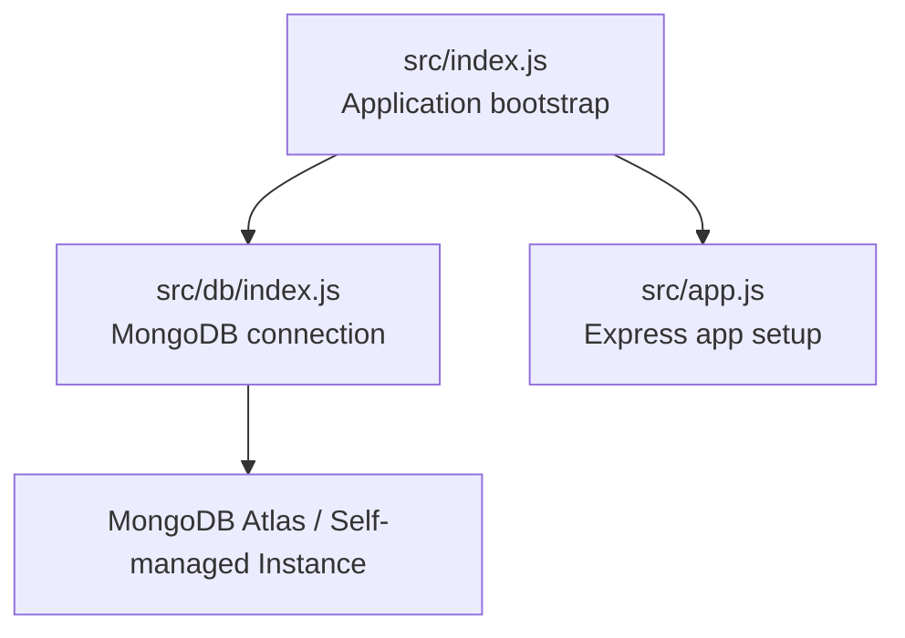
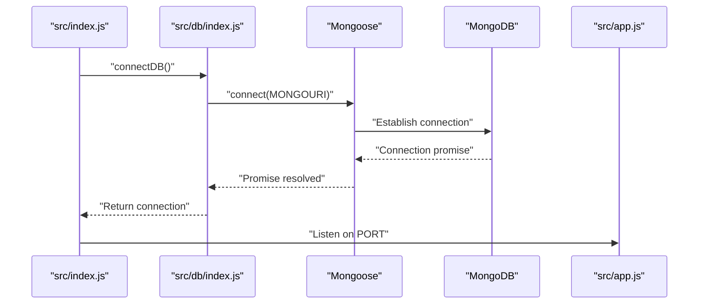
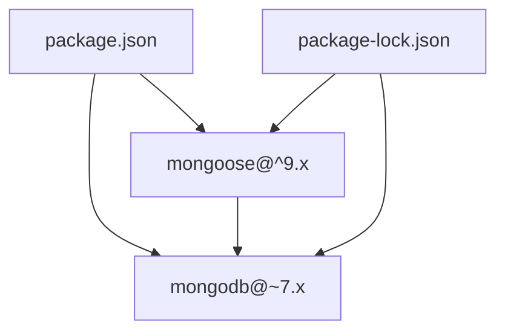

# Database Performance & Optimization

<cite>
**Referenced Files in This Document**
- [src/db/index.js](file://src/db/index.js)
- [src/app.js](file://src/app.js)
- [src/index.js](file://src/index.js)
- [package.json](file://package.json)
- [package-lock.json](file://package-lock.json)
</cite>

## Table of Contents
1. [Introduction](#introduction)
2. [Project Structure](#project-structure)
3. [Core Components](#core-components)
4. [Architecture Overview](#architecture-overview)
5. [Detailed Component Analysis](#detailed-component-analysis)
6. [Dependency Analysis](#dependency-analysis)
7. [Performance Considerations](#performance-considerations)
8. [Troubleshooting Guide](#troubleshooting-guide)
9. [Conclusion](#conclusion)
10. [Appendices](#appendices)

## Introduction
This document provides a comprehensive guide to MongoDB performance optimization and database management strategies tailored to the current backend codebase. It focuses on practical improvements grounded in the existing implementation, including connection configuration, operational patterns, and areas for enhancement such as indexing, aggregation, projections, connection pooling, monitoring, and scaling considerations. Where the codebase does not yet implement specific features, this document outlines recommended patterns and configurations to achieve robust performance and reliability.

## Project Structure
The backend initializes the Express application and connects to MongoDB via Mongoose. The database connection is established during application startup, and the server listens on the configured port. The project uses environment variables for configuration, including the MongoDB URI.

**Diagram sources**
- [src/index.js](file://src/index.js#L1-L18)
- [src/db/index.js](file://src/db/index.js#L1-L14)
- [src/app.js](file://src/app.js#L1-L16)

**Section sources**
- [src/index.js](file://src/index.js#L1-L18)
- [src/db/index.js](file://src/db/index.js#L1-L14)
- [src/app.js](file://src/app.js#L1-L16)

## Core Components
- Application bootstrap: Loads environment variables, connects to the database, and starts the HTTP server.
- Database connection: Establishes a Mongoose connection using the MongoDB URI from environment variables.
- Express app: Configures CORS, static assets, JSON payload limits, and cookie parsing middleware.

Key observations:
- The database connection is performed synchronously at startup and logs the resolved connection string.
- No explicit Mongoose connection options are set in the codebase; defaults apply.
- The Express app sets a JSON payload size limit and enables CORS based on environment configuration.

**Section sources**
- [src/index.js](file://src/index.js#L1-L18)
- [src/db/index.js](file://src/db/index.js#L1-L14)
- [src/app.js](file://src/app.js#L1-L16)

## Architecture Overview
The runtime architecture ties together the application initialization, database connectivity, and HTTP server lifecycle.

**Diagram sources**
- [src/index.js](file://src/index.js#L1-L18)
- [src/db/index.js](file://src/db/index.js#L1-L14)
- [src/app.js](file://src/app.js#L1-L16)

## Detailed Component Analysis

### Database Connection Layer
- Current behavior: Uses Mongoose to connect to the MongoDB URI provided via environment variable. On successful connection, the resolved connection string is logged; on failure, the process exits.
- Observations:
  - No explicit connection options (e.g., pool size, retry behavior, TLS settings) are configured in code.
  - The connection string is printed after connecting, which can aid in verification but should be restricted in production environments.

Recommended enhancements (to be implemented in the connection module):
- Configure connection options for resilience and performance:
  - Connection pooling: Set minimum/maximum pool sizes appropriate for workload concurrency.
  - Retry behavior: Enable automatic retry for transient errors.
  - TLS/SSL: Enforce TLS in production deployments.
  - Socket timeouts: Configure server selection and socket timeouts.
- Add connection event listeners for diagnostics (e.g., connected, disconnected, error).

Operational implications:
- Without explicit options, the driver defaults apply. Production systems should tune these based on traffic patterns and infrastructure.

**Section sources**
- [src/db/index.js](file://src/db/index.js#L1-L14)

### Express Application Layer
- Current behavior: Enables CORS, serves static assets, parses JSON up to a specified size, and reads cookies.
- Observations:
  - JSON payload size limit is set; ensure it aligns with expected request sizes.
  - CORS origin is configurable via environment variable.

Recommendations:
- Introduce structured logging for requests and database operations to facilitate performance monitoring.
- Consider adding middleware for request tracing or correlation IDs to track end-to-end latency.

**Section sources**
- [src/app.js](file://src/app.js#L1-L16)

### Startup and Environment Integration
- Current behavior: Loads environment variables, attempts to connect to the database, and starts the server on the configured port.
- Observations:
  - Error handling at startup prints a generic message on database connection failure and exits the process.

Recommendations:
- Improve error handling to distinguish between transient and permanent failures.
- Add health checks and readiness probes to support deployment platforms.

**Section sources**
- [src/index.js](file://src/index.js#L1-L18)

## Dependency Analysis
The project relies on Mongoose for ODM operations and MongoDB drivers under the hood. The lockfile confirms the versions of Mongoose and MongoDB packages.

**Diagram sources**
- [package.json](file://package.json#L14-L23)
- [package-lock.json](file://package-lock.json#L1098-L1137)

**Section sources**
- [package.json](file://package.json#L14-L23)
- [package-lock.json](file://package-lock.json#L1098-L1137)

## Performance Considerations

### Indexing Strategies
- Compound indexes: Design composite indexes aligned with frequent query patterns (equality, sorting, range filters). Ensure the order follows query predicates and sort keys.
- Text search indexes: Create text indexes for free-text search fields to enable $text queries and score-based sorting.
- TTL collections: Use time-to-live indexes for ephemeral data (e.g., logs, sessions) to automatically expire documents and reduce storage overhead.

Implementation guidance:
- Define indexes at the schema level using Mongoose index options or create them via MongoDB shell/migration scripts.
- Monitor index usage with database profiling and aggregation pipeline stages to validate effectiveness.

[No sources needed since this section provides general guidance]

### Query Optimization
- Selectivity: Prefer equality filters over range scans when possible.
- Projection: Limit returned fields to reduce payload size and network overhead.
- Pagination: Use cursor-based pagination (skip/take) or seek-based pagination for large datasets.

[No sources needed since this section provides general guidance]

### Aggregation Pipeline Patterns
- Filter early: Apply $match as early as possible to minimize downstream processing.
- Sort and limit: Place $sort before $limit when retrieving top-N results.
- Stage ordering: Reorder stages to leverage indexes and minimize intermediate result sets.

[No sources needed since this section provides general guidance]

### Projection Strategies
- Explicit field selection: Avoid returning entire documents unless necessary.
- Computed fields: Use $project to compute derived fields in aggregation rather than fetching raw documents and computing client-side.

[No sources needed since this section provides general guidance]

### Connection Pooling, Read Preferences, Write Concerns
- Connection pooling: Configure pool size, maxIdleTimeMS, and waitQueueTimeoutMS to match concurrent workload and response-time targets.
- Read preferences: Use nearest or secondaryPreferred for read-heavy workloads to distribute load.
- Write concerns: Tune w, j, and timeout settings to balance durability and latency.

[No sources needed since this section provides general guidance]

### Monitoring and Bottleneck Identification
- Enable command logging and slow query logs at the database level.
- Track application-level metrics (request latency, throughput, error rates) and correlate with database operations.
- Use database profiling to identify slow queries and missing indexes.

[No sources needed since this section provides general guidance]

### Caching, Partitioning, and Sharding
- Caching: Implement application-level caches (e.g., Redis/Memcached) for hotspots and repeated reads.
- Data partitioning: Use logical partitioning (sharding keys) to distribute data and queries across shards.
- Sharding: Plan shard key design carefully to avoid hotspots and skewed distribution.

[No sources needed since this section provides general guidance]

### Backup and Recovery, Export/Import, Disaster Recovery
- Backups: Schedule regular logical backups and validate restore procedures periodically.
- Export/import: Use tools like mongodump/mongorestore for bulk operations and ETL pipelines.
- DR: Maintain cross-region replicas and automate failover testing.

[No sources needed since this section provides general guidance]

### Maintenance, Index Optimization, Query Tuning
- Regular maintenance: Rebuild stale indexes, compact collections, and update statistics.
- Index optimization: Drop unused indexes and consolidate overlapping ones.
- Query tuning: Analyze slow query logs and adjust indexes and query plans accordingly.

[No sources needed since this section provides general guidance]

## Troubleshooting Guide
Common issues and remedies:
- Connection failures: Verify the MongoDB URI, network connectivity, and credentials. Check for firewall restrictions and TLS configuration.
- Slow queries: Enable profiling, analyze query plans, and add appropriate indexes.
- Memory pressure: Review connection pool sizing, aggregation pipeline efficiency, and document sizes.
- Operational errors: Add structured logging around database operations and implement circuit breakers for transient failures.

[No sources needed since this section provides general guidance]

## Conclusion
The current codebase establishes a solid foundation for MongoDB connectivity and Express application bootstrapping. To achieve optimal performance and reliability, introduce explicit connection options, implement robust monitoring, adopt indexing and query optimization practices, and plan for scalability through caching, partitioning, and sharding. These enhancements will improve responsiveness, reduce operational overhead, and support long-term growth.

## Appendices

### Appendix A: Recommended Mongoose Connection Options (Conceptual)
- Connection pooling: minPoolSize, maxPoolSize, maxIdleTimeMS, waitQueueTimeoutMS
- Resilience: retryWrites, retryReads, serverSelectionTimeoutMS
- Security: tls, ssl, tlsCAFile, tlsCertificateKeyFile
- Performance: maxConnecting, connectTimeoutMS, socketTimeoutMS

[No sources needed since this section provides general guidance]

### Appendix B: Environment Variables (Conceptual)
- MONGOURI: MongoDB connection string
- CORS: Allowed origins for cross-origin requests
- PORT: Application listen port

[No sources needed since this section provides general guidance]