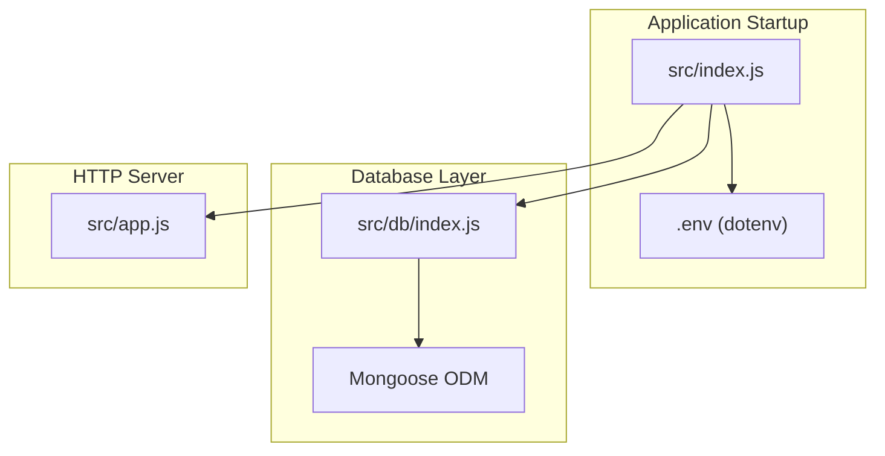
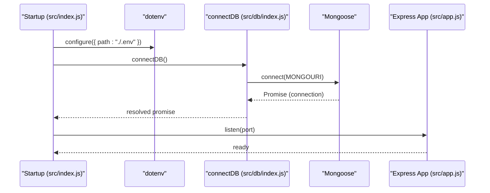
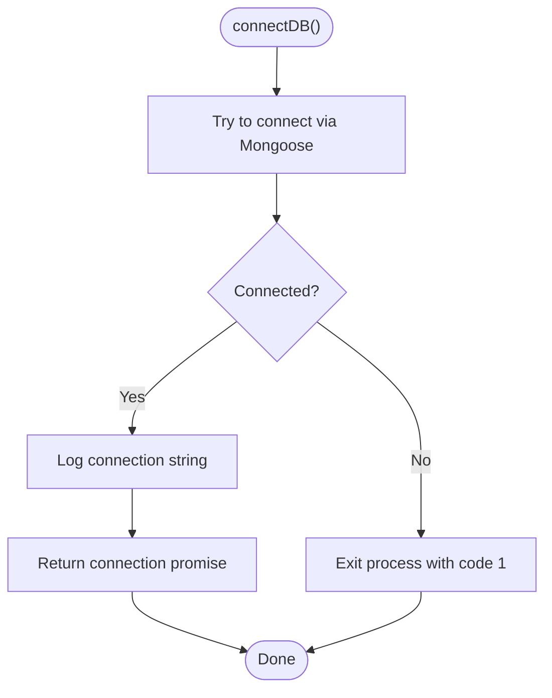
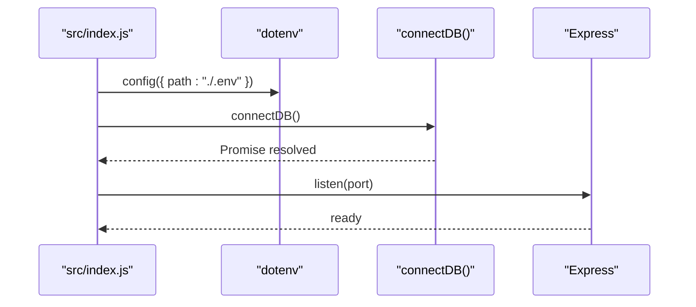
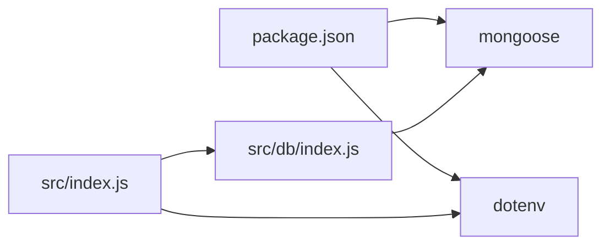

# MongoDB Connection Setup

<cite>
**Referenced Files in This Document**
- [src/db/index.js](file://src/db/index.js)
- [src/index.js](file://src/index.js)
- [src/app.js](file://src/app.js)
- [package.json](file://package.json)
- [src/utils/asyncHandler.js](file://src/utils/asyncHandler.js)
- [src/utils/ApiError.js](file://src/utils/ApiError.js)
</cite>

## Table of Contents
1. [Introduction](#introduction)
2. [Project Structure](#project-structure)
3. [Core Components](#core-components)
4. [Architecture Overview](#architecture-overview)
5. [Detailed Component Analysis](#detailed-component-analysis)
6. [Dependency Analysis](#dependency-analysis)
7. [Performance Considerations](#performance-considerations)
8. [Troubleshooting Guide](#troubleshooting-guide)
9. [Conclusion](#conclusion)
10. [Appendices](#appendices)

## Introduction
This document explains how MongoDB is connected in the backend using Mongoose ODM. It covers the connection configuration process, environment variable usage, connection lifecycle, error handling, and operational best practices. It also provides guidance for configuring connection strings, authentication, SSL/TLS, replica sets, and connection monitoring. The goal is to help developers set up reliable connections across development, staging, and production environments while preventing leaks and ensuring graceful shutdowns.

## Project Structure
The MongoDB connection is encapsulated in a dedicated module and wired into the application startup sequence. Environment variables are loaded via dotenv, and the Express server is initialized after a successful database connection.

**Diagram sources**
- [src/index.js](file://src/index.js#L1-L18)
- [src/db/index.js](file://src/db/index.js#L1-L14)
- [src/app.js](file://src/app.js#L1-L16)

**Section sources**
- [src/index.js](file://src/index.js#L1-L18)
- [src/db/index.js](file://src/db/index.js#L1-L14)
- [src/app.js](file://src/app.js#L1-L16)

## Core Components
- Database connection module: Provides a single async function to establish a MongoDB connection using Mongoose and logs the effective connection string.
- Application bootstrap: Loads environment variables, connects to the database, and starts the HTTP server.
- Express app: Defines middleware and CORS policy using environment variables.

Key responsibilities:
- Load environment variables early during startup.
- Establish a persistent MongoDB connection before serving requests.
- Gracefully handle connection failures and propagate errors.

**Section sources**
- [src/db/index.js](file://src/db/index.js#L1-L14)
- [src/index.js](file://src/index.js#L1-L18)
- [src/app.js](file://src/app.js#L1-L16)

## Architecture Overview
The connection flow begins with loading environment variables, followed by connecting to MongoDB via Mongoose, and finally starting the HTTP server.

**Diagram sources**
- [src/index.js](file://src/index.js#L1-L18)
- [src/db/index.js](file://src/db/index.js#L1-L14)
- [src/app.js](file://src/app.js#L1-L16)

## Detailed Component Analysis

### Database Connection Module
The connection module:
- Imports Mongoose.
- Exposes an async function that attempts to connect to MongoDB using the URI from the MONGOURI environment variable.
- Logs the resolved connection string for observability.
- Terminates the process on connection failure.

Operational notes:
- The function returns a Promise that resolves to the Mongoose connection instance.
- On failure, the process exits immediately, which prevents the server from starting without a working database connection.

**Diagram sources**
- [src/db/index.js](file://src/db/index.js#L1-L14)

**Section sources**
- [src/db/index.js](file://src/db/index.js#L1-L14)

### Application Bootstrap
The bootstrap script:
- Loads environment variables from a local .env file.
- Calls the database connection function.
- Starts the Express server on a configured or default port.
- Handles connection errors by logging a message.

Operational notes:
- Uses a synchronous dotenv configuration with a specific path.
- The server listens only after a successful database connection.
- Errors during connection are logged, but the application does not attempt retries.

**Diagram sources**
- [src/index.js](file://src/index.js#L1-L18)

**Section sources**
- [src/index.js](file://src/index.js#L1-L18)

### Express App Configuration
The Express app:
- Enables CORS using an environment variable.
- Serves static assets.
- Parses JSON payloads up to a specified size.
- Adds cookie parsing middleware.

Operational notes:
- CORS origin is controlled by an environment variable.
- No database-specific middleware is present here; database connectivity is handled independently.

**Section sources**
- [src/app.js](file://src/app.js#L1-L16)

### Error Handling Utilities
- Async wrapper utility: Wraps route handlers to safely forward Promise rejections to Express error middleware.
- API error class: Extends the base Error class with status code, message, and optional stack.

These utilities support robust error propagation in the application, complementing the database connection’s fail-fast behavior.

**Section sources**
- [src/utils/asyncHandler.js](file://src/utils/asyncHandler.js#L1-L8)
- [src/utils/ApiError.js](file://src/utils/ApiError.js#L1-L22)

## Dependency Analysis
The project relies on Mongoose for MongoDB connectivity and dotenv for environment variable loading. The bootstrap script orchestrates initialization order.

**Diagram sources**
- [package.json](file://package.json#L1-L28)
- [src/index.js](file://src/index.js#L1-L18)
- [src/db/index.js](file://src/db/index.js#L1-L14)

**Section sources**
- [package.json](file://package.json#L1-L28)
- [src/index.js](file://src/index.js#L1-L18)
- [src/db/index.js](file://src/db/index.js#L1-L14)

## Performance Considerations
Connection pooling and timeouts:
- Mongoose uses the underlying MongoDB driver, which manages a connection pool internally. Tune pool size and timeouts at the connection string level for optimal performance.
- Prefer a single persistent connection per process for simplicity and resource efficiency.
- Avoid excessive concurrent connections to reduce overhead and potential throttling.

Timeouts:
- Set socket, server discovery, and connection timeouts in the connection string to prevent hanging operations under network latency or unresponsive servers.

SSL/TLS:
- Enable TLS by adding appropriate options in the connection string. Verify certificates and hostnames to avoid insecure configurations.

Replica sets:
- Provide a replica set connection string to enable automatic failover and high availability. Ensure read preferences and write concerns are aligned with your workload.

Monitoring:
- Log the effective connection string after successful connection to confirm the target server and credentials.
- Add periodic health checks to detect stale connections and trigger reconnects if needed.

[No sources needed since this section provides general guidance]

## Troubleshooting Guide
Common issues and remedies:
- Missing MONGOURI: Ensure the environment variable is defined in .env and loaded by dotenv before calling connectDB.
- Authentication failures: Verify username, password, and authSource in the connection string. Confirm the user exists and has appropriate roles.
- Network connectivity: Test reachability to the MongoDB host and port. Check firewall rules and VPC/security group settings.
- SSL/TLS handshake errors: Confirm certificate validity and hostname verification. Use proper CA bundles and disable strict verification only for testing.
- Replica set configuration: Ensure the replica set name matches and that the primary is reachable. Check member status and oplog availability.
- Connection leaks: Avoid creating multiple connections unintentionally. Keep a single connection instance and reuse it across the app.
- Graceful shutdown: Close the database connection before exiting the process to flush pending operations and free resources.

Operational tips:
- Log the resolved connection string after connecting to confirm the target host and credentials.
- Wrap route handlers with the async handler utility to centralize error forwarding to Express error middleware.
- Use structured logging and metrics to track connection health and latency.

**Section sources**
- [src/db/index.js](file://src/db/index.js#L1-L14)
- [src/index.js](file://src/index.js#L1-L18)
- [src/utils/asyncHandler.js](file://src/utils/asyncHandler.js#L1-L8)

## Conclusion
The backend establishes a MongoDB connection using Mongoose with a minimal, fail-fast approach. Environment variables are loaded early, and the server starts only after a successful database connection. For production readiness, augment the connection setup with robust retry logic, connection string tuning, SSL/TLS verification, replica set configuration, and health monitoring. Centralize error handling and adopt a single persistent connection pattern to prevent leaks and simplify lifecycle management.

[No sources needed since this section summarizes without analyzing specific files]

## Appendices

### Environment Variables and Configuration
- MONGOURI: The MongoDB connection string used by Mongoose to connect to the database.
- PORT: Optional HTTP server port; defaults to a fixed value if not set.
- CORS: Origin used by the CORS middleware to control allowed clients.

Ensure these variables are defined in your .env file and loaded before invoking connectDB.

**Section sources**
- [src/db/index.js](file://src/db/index.js#L1-L14)
- [src/index.js](file://src/index.js#L1-L18)
- [src/app.js](file://src/app.js#L1-L16)

### Connection String Format and Authentication
- Format: The connection string should include protocol, host(s), database name, and credentials when required.
- Authentication: Include username and password in the connection string or rely on external auth mechanisms supported by your deployment.
- Options: Add driver-specific options for timeouts, SSL/TLS, replica set name, read/write concerns, and pool settings.

[No sources needed since this section provides general guidance]

### SSL/TLS Settings
- Enable TLS in the connection string for encrypted traffic.
- Configure certificate verification and CA bundle paths as needed.
- Validate hostnames and disable strict verification only for development.

[No sources needed since this section provides general guidance]

### Replica Set Configurations
- Provide a replica set connection string with multiple seeds.
- Align read preferences and write concerns with your application needs.
- Monitor replica set health and handle primary elections gracefully.

[No sources needed since this section provides general guidance]

### Connection Lifecycle Management and Graceful Shutdown
- Keep a single connection instance per process.
- Close the connection before shutting down the server to flush pending operations.
- Implement health checks to detect stale connections and trigger reconnects if necessary.

[No sources needed since this section provides general guidance]