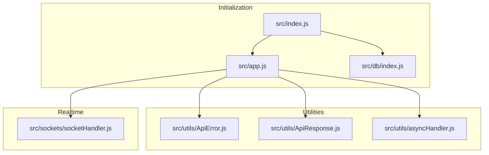
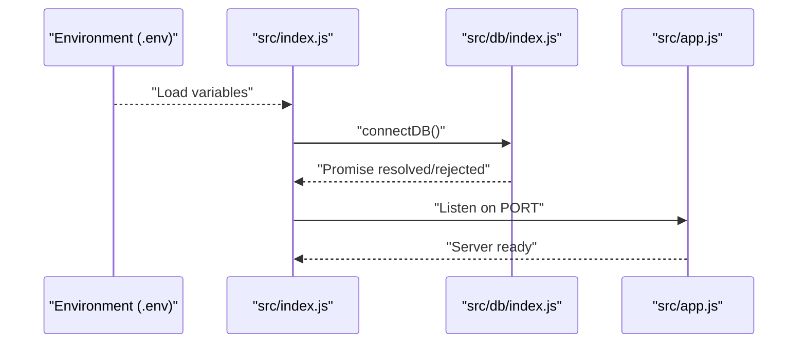
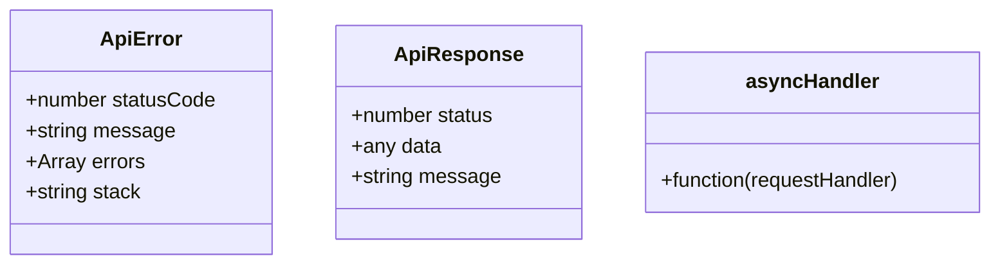
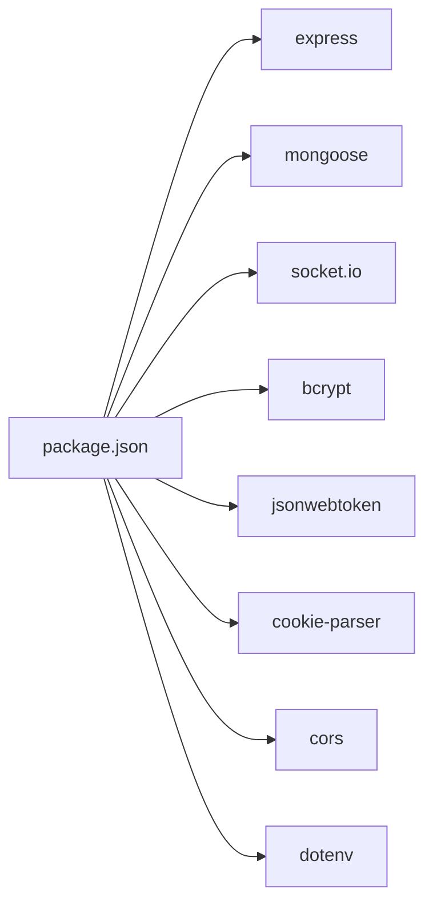

# Development Guidelines

<cite>
**Referenced Files in This Document**
- [package.json](file://package.json)
- [src/index.js](file://src/index.js)
- [src/app.js](file://src/app.js)
- [src/db/index.js](file://src/db/index.js)
- [src/utils/ApiError.js](file://src/utils/ApiError.js)
- [src/utils/ApiResponse.js](file://src/utils/ApiResponse.js)
- [src/utils/asyncHandler.js](file://src/utils/asyncHandler.js)
- [src/sockets/socketHandler.js](file://src/sockets/socketHandler.js)
</cite>

## Table of Contents
1. [Introduction](#introduction)
2. [Project Structure](#project-structure)
3. [Core Components](#core-components)
4. [Architecture Overview](#architecture-overview)
5. [Detailed Component Analysis](#detailed-component-analysis)
6. [Dependency Analysis](#dependency-analysis)
7. [Performance Considerations](#performance-considerations)
8. [Troubleshooting Guide](#troubleshooting-guide)
9. [Code Style Standards](#code-style-standards)
10. [Testing Strategy](#testing-strategy)
11. [Environment Variable Management](#environment-variable-management)
12. [Deployment Configuration](#deployment-configuration)
13. [Contribution Guidelines](#contribution-guidelines)
14. [Conclusion](#conclusion)

## Introduction
This document provides comprehensive development guidelines for the Task Management System Backend. It covers code style standards, testing strategy, environment management, deployment configuration, coding conventions, debugging/logging, performance optimization, and contribution workflows. The backend follows an ES module architecture with Express, integrates MongoDB via Mongoose, and supports real-time features through Socket.IO.

## Project Structure
The backend is organized into feature-focused modules with clear separation of concerns:
- Configuration and initialization: src/index.js, src/app.js, src/db/index.js
- Utilities: src/utils/* (error handling, response formatting, async wrapper)
- Real-time support: src/sockets/socketHandler.js
- Placeholder directories for future expansion: src/controllers, src/models, src/routes, src/middlewares, src/services, src/parser, src/validator

**Diagram sources**
- [src/index.js](file://src/index.js#L1-L18)
- [src/app.js](file://src/app.js#L1-L16)
- [src/db/index.js](file://src/db/index.js#L1-L14)
- [src/utils/ApiError.js](file://src/utils/ApiError.js#L1-L22)
- [src/utils/ApiResponse.js](file://src/utils/ApiResponse.js#L1-L17)
- [src/utils/asyncHandler.js](file://src/utils/asyncHandler.js#L1-L8)
- [src/sockets/socketHandler.js](file://src/sockets/socketHandler.js#L1-L7)

**Section sources**
- [src/index.js](file://src/index.js#L1-L18)
- [src/app.js](file://src/app.js#L1-L16)
- [src/db/index.js](file://src/db/index.js#L1-L14)
- [src/utils/ApiError.js](file://src/utils/ApiError.js#L1-L22)
- [src/utils/ApiResponse.js](file://src/utils/ApiResponse.js#L1-L17)
- [src/utils/asyncHandler.js](file://src/utils/asyncHandler.js#L1-L8)
- [src/sockets/socketHandler.js](file://src/sockets/socketHandler.js#L1-L7)

## Core Components
- Application bootstrap: Loads environment variables, connects to the database, and starts the server.
- Express app configuration: CORS, static assets, JSON parsing, and cookie parsing.
- Database connection: Mongoose connection with graceful error handling.
- Utility classes: ApiError and ApiResponse for consistent error/response handling.
- Async wrapper: Simplifies error propagation in async route handlers.
- Socket handler: Placeholder for real-time event handling.

Key implementation references:
- Environment loading and server startup: [src/index.js](file://src/index.js#L1-L18)
- Express configuration and middleware: [src/app.js](file://src/app.js#L1-L16)
- Database connection: [src/db/index.js](file://src/db/index.js#L1-L14)
- Error class: [src/utils/ApiError.js](file://src/utils/ApiError.js#L1-L22)
- Response class: [src/utils/ApiResponse.js](file://src/utils/ApiResponse.js#L1-L17)
- Async handler wrapper: [src/utils/asyncHandler.js](file://src/utils/asyncHandler.js#L1-L8)
- Socket handler: [src/sockets/socketHandler.js](file://src/sockets/socketHandler.js#L1-L7)

**Section sources**
- [src/index.js](file://src/index.js#L1-L18)
- [src/app.js](file://src/app.js#L1-L16)
- [src/db/index.js](file://src/db/index.js#L1-L14)
- [src/utils/ApiError.js](file://src/utils/ApiError.js#L1-L22)
- [src/utils/ApiResponse.js](file://src/utils/ApiResponse.js#L1-L17)
- [src/utils/asyncHandler.js](file://src/utils/asyncHandler.js#L1-L8)
- [src/sockets/socketHandler.js](file://src/sockets/socketHandler.js#L1-L7)

## Architecture Overview
The backend initializes the application, establishes a database connection, and exposes an HTTP server with optional real-time capabilities.

**Diagram sources**
- [src/index.js](file://src/index.js#L1-L18)
- [src/db/index.js](file://src/db/index.js#L1-L14)
- [src/app.js](file://src/app.js#L1-L16)

## Detailed Component Analysis

### Express App Configuration
- Enables CORS with origin from environment.
- Serves static assets from the public directory.
- Parses JSON payloads up to a specified size.
- Parses cookies.

Implementation reference:
- [src/app.js](file://src/app.js#L1-L16)

**Section sources**
- [src/app.js](file://src/app.js#L1-L16)

### Database Connection
- Connects to MongoDB using MONGOURI from environment.
- Logs the connection string upon successful connection.
- Exits the process on connection failure.

Implementation reference:
- [src/db/index.js](file://src/db/index.js#L1-L14)

**Section sources**
- [src/db/index.js](file://src/db/index.js#L1-L14)

### Application Bootstrap
- Loads environment variables from .env.
- Determines the port from environment or defaults.
- Starts the server after connecting to the database.

Implementation reference:
- [src/index.js](file://src/index.js#L1-L18)

**Section sources**
- [src/index.js](file://src/index.js#L1-L18)

### Error Handling Utilities
- ApiError: Extends native Error with status code, message, errors array, and optional stack.
- ApiResponse: Standardized response shape with status, data, and message.
- asyncHandler: Wraps async route handlers to forward errors to Express error-handling middleware.

Implementation references:
- [src/utils/ApiError.js](file://src/utils/ApiError.js#L1-L22)
- [src/utils/ApiResponse.js](file://src/utils/ApiResponse.js#L1-L17)
- [src/utils/asyncHandler.js](file://src/utils/asyncHandler.js#L1-L8)

**Diagram sources**
- [src/utils/ApiError.js](file://src/utils/ApiError.js#L1-L22)
- [src/utils/ApiResponse.js](file://src/utils/ApiResponse.js#L1-L17)
- [src/utils/asyncHandler.js](file://src/utils/asyncHandler.js#L1-L8)

**Section sources**
- [src/utils/ApiError.js](file://src/utils/ApiError.js#L1-L22)
- [src/utils/ApiResponse.js](file://src/utils/ApiResponse.js#L1-L17)
- [src/utils/asyncHandler.js](file://src/utils/asyncHandler.js#L1-L8)

### Socket Handler
- Placeholder module for real-time event handling.

Implementation reference:
- [src/sockets/socketHandler.js](file://src/sockets/socketHandler.js#L1-L7)

**Section sources**
- [src/sockets/socketHandler.js](file://src/sockets/socketHandler.js#L1-L7)

## Dependency Analysis
External dependencies include Express, Mongoose, Socket.IO, bcrypt, jsonwebtoken, cookie-parser, cors, and dotenv. Development dependencies include nodemon for hot reloading during development.

**Diagram sources**
- [package.json](file://package.json#L14-L26)

**Section sources**
- [package.json](file://package.json#L1-L28)

## Performance Considerations
- Limit payload sizes to prevent resource exhaustion (configured for JSON parsing).
- Use environment-driven configuration for database and server tuning.
- Leverage asyncHandler to avoid unhandled promise rejections and reduce error overhead.
- Monitor database connection logs for performance insights.
- Keep static assets optimized and served efficiently.

[No sources needed since this section provides general guidance]

## Troubleshooting Guide
Common issues and resolutions:
- Database connection failures: Verify MONGOURI and network connectivity; check logs for connection string and error messages.
- Port binding conflicts: Change PORT or ensure the port is free.
- CORS errors: Confirm CORS origin matches the frontend domain.
- Environment variables missing: Ensure .env exists and contains required keys.

Operational references:
- [src/index.js](file://src/index.js#L1-L18)
- [src/db/index.js](file://src/db/index.js#L1-L14)
- [src/app.js](file://src/app.js#L1-L16)

**Section sources**
- [src/index.js](file://src/index.js#L1-L18)
- [src/db/index.js](file://src/db/index.js#L1-L14)
- [src/app.js](file://src/app.js#L1-L16)

## Code Style Standards
- Language: ES6+ modules with import/export syntax.
- Formatting: Use Prettier for consistent formatting across the codebase.
- Linting: Configure ESLint to enforce style rules and catch common issues.
- Naming: Use camelCase for variables and functions, PascalCase for constructors/classes, UPPER_SNAKE_CASE for constants.
- File organization: Place shared utilities under src/utils, feature-specific modules under feature folders (controllers, models, routes, services), and middleware under src/middlewares.
- Module structure: Keep modules cohesive and single-responsibility; export default where appropriate.

[No sources needed since this section provides general guidance]

## Testing Strategy
- Unit tests: Test individual functions and utilities (e.g., asyncHandler, ApiResponse, ApiError) in isolation.
- Integration tests: Validate database connections, route handlers, and middleware behavior end-to-end.
- Coverage: Aim for high coverage (>80%) with tools like Jest or Vitest; ensure critical paths are covered.
- Mocking: Mock external dependencies (database, third-party APIs) to isolate units.
- Continuous testing: Run tests on every commit and pre-deploy.

[No sources needed since this section provides general guidance]

## Environment Variable Management
- Local development: Define variables in .env with sensible defaults.
- Staging: Mirror production secrets with staging-specific values.
- Production: Store secrets in secure environment stores; avoid committing secrets to version control.
- Required variables: PORT, MONGOURI, CORS, JWT_SECRET (as applicable).

Operational references:
- [src/index.js](file://src/index.js#L1-L18)
- [src/app.js](file://src/app.js#L1-L16)
- [src/db/index.js](file://src/db/index.js#L1-L14)

**Section sources**
- [src/index.js](file://src/index.js#L1-L18)
- [src/app.js](file://src/app.js#L1-L16)
- [src/db/index.js](file://src/db/index.js#L1-L14)

## Deployment Configuration
- Containerization: Package the application with Docker; define a minimal base image, copy dependencies, set working directory, and expose the configured port.
- Environment setup: Provide a .env.example with placeholders for all required variables; mount secrets securely at runtime.
- CI/CD: Automate linting, testing, building, and pushing images; deploy to staging and production environments with approval gates.

[No sources needed since this section provides general guidance]

## Contribution Guidelines
- Branching: Use feature branches for new work; keep main clean and deployable.
- Commits: Write clear, concise commit messages; group related changes.
- PRs: Open pull requests early; include testing and documentation updates.
- Code review: Focus on correctness, maintainability, and adherence to style.
- Version control: Follow semantic versioning for releases; tag versions appropriately.

[No sources needed since this section provides general guidance]

## Conclusion
These guidelines establish a consistent foundation for developing, testing, deploying, and maintaining the Task Management System Backend. By adhering to the outlined conventions and leveraging the provided components, contributors can build scalable, reliable features while ensuring a smooth developer experience.

[No sources needed since this section summarizes without analyzing specific files]