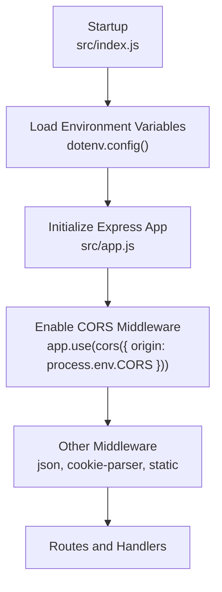
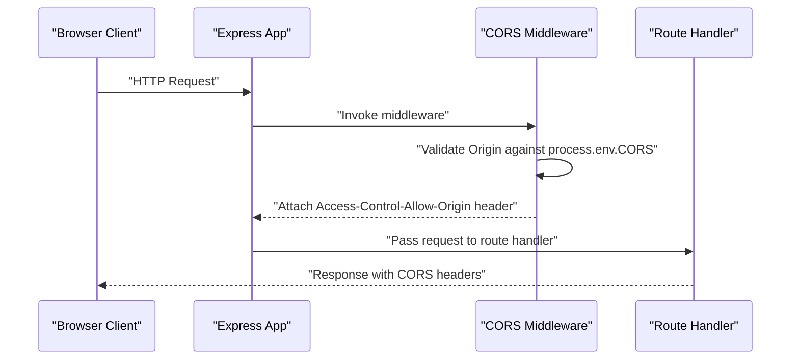
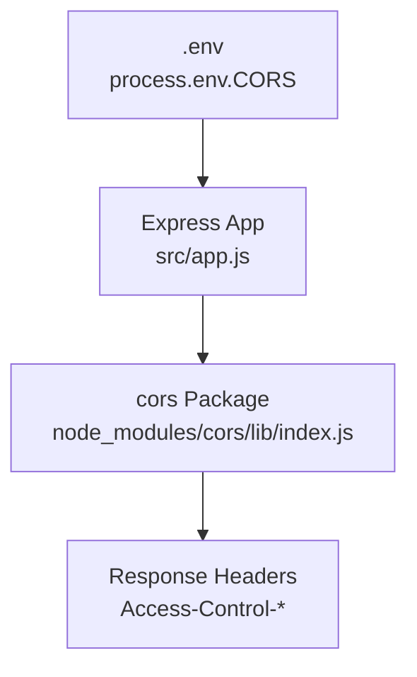

# CORS Configuration

<cite>
**Referenced Files in This Document**
- [src/app.js](file://src/app.js)
- [src/index.js](file://src/index.js)
- [package.json](file://package.json)
- [node_modules/cors/lib/index.js](file://node_modules/cors/lib/index.js)
</cite>

## Table of Contents
1. [Introduction](#introduction)
2. [Project Structure](#project-structure)
3. [Core Components](#core-components)
4. [Architecture Overview](#architecture-overview)
5. [Detailed Component Analysis](#detailed-component-analysis)
6. [Dependency Analysis](#dependency-analysis)
7. [Performance Considerations](#performance-considerations)
8. [Troubleshooting Guide](#troubleshooting-guide)
9. [Conclusion](#conclusion)

## Introduction
This document explains the Cross-Origin Resource Sharing (CORS) configuration in the Task Management System backend. It focuses on how the CORS middleware is initialized, how origin validation works, and how environment variables control allowed origins. It also covers security implications, practical configuration examples for development, staging, and production, and provides troubleshooting guidance for common CORS issues.

## Project Structure
The CORS configuration is applied at the Express application level and controlled via an environment variable. The application loads environment variables early in the startup process and initializes the Express app with the CORS middleware.

**Diagram sources**
- [src/index.js](file://src/index.js#L1-L18)
- [src/app.js](file://src/app.js#L1-L16)

**Section sources**
- [src/index.js](file://src/index.js#L1-L18)
- [src/app.js](file://src/app.js#L1-L16)

## Core Components
- CORS middleware initialization: The Express app enables CORS globally by passing an options object to the middleware. The allowed origin is configured via the environment variable CORS.
- Environment variable usage: The origin option is set to the value of process.env.CORS, allowing dynamic configuration per environment.
- Middleware order: The CORS middleware is registered before other body parsing and cookie-related middleware, ensuring preflight and regular requests receive appropriate headers.

Key implementation references:
- CORS middleware registration and origin configuration
- Environment loading prior to app initialization

**Section sources**
- [src/app.js](file://src/app.js#L8-L10)
- [src/index.js](file://src/index.js#L5-L7)

## Architecture Overview
The CORS configuration is part of the global middleware stack. Requests originating from browsers are validated against the configured origin, and appropriate response headers are added to satisfy same-origin policy requirements.

**Diagram sources**
- [src/app.js](file://src/app.js#L8-L10)
- [node_modules/cors/lib/index.js](file://node_modules/cors/lib/index.js#L35-L61)

## Detailed Component Analysis

### CORS Middleware Setup and Options
- Global enablement: The application enables CORS for all routes by registering the middleware at the top level.
- Origin validation: The origin option is bound to process.env.CORS. The underlying library supports:
  - Exact match for string origins
  - Array of allowed origins
  - Regular expressions for pattern-based matching
  - Boolean true/false for dynamic behavior
- Credential handling: The current configuration does not explicitly set credentials-related options. If credentials (cookies, authorization headers) are required from browsers, additional options should be considered.
- Preflight requests: The middleware handles OPTIONS preflight requests automatically when origin validation is enabled.

Implementation references:
- Middleware registration and origin binding
- Underlying origin validation logic and preflight handling

**Section sources**
- [src/app.js](file://src/app.js#L8-L10)
- [node_modules/cors/lib/index.js](file://node_modules/cors/lib/index.js#L18-L31)
- [node_modules/cors/lib/index.js](file://node_modules/cors/lib/index.js#L35-L61)
- [node_modules/cors/lib/index.js](file://node_modules/cors/lib/index.js#L158-L209)

### Environment Variable Configuration
- Variable name: CORS
- Purpose: Controls the Access-Control-Allow-Origin header dynamically per environment.
- Supported formats:
  - Single origin string (e.g., https://app.example.com)
  - Array of origins (e.g., ["https://app.example.com", "https://admin.example.com"])
  - Regular expression string (e.g., "^https://.*\\.example\\.com$")
  - Wildcard-like behavior depends on the underlying library’s interpretation of boolean true/false

Practical examples (conceptual):
- Development: Set to the frontend URL (e.g., http://localhost:3000)
- Staging: Set to staging frontend domain(s)
- Production: Set to production frontend domain(s); avoid wildcards unless absolutely necessary

Environment loading occurs before the app starts listening, ensuring the CORS configuration is active from startup.

**Section sources**
- [src/app.js](file://src/app.js#L9-L9)
- [src/index.js](file://src/index.js#L5-L7)

### Allowed Methods, Headers, Credentials, and Exposed Headers
Observed behavior:
- Allowed methods: Not explicitly configured; defaults apply based on the underlying library.
- Allowed headers: Not explicitly configured; defaults apply.
- Credentials: Not explicitly configured; defaults apply.
- Exposed headers: Not explicitly configured; defaults apply.

Recommendations:
- To support credentials (cookies, Authorization), configure credentials-related options explicitly.
- To restrict methods and headers, define allowedMethods and allowedHeaders.
- To expose specific headers to clients, configure exposedHeaders.

Note: These recommendations are for hardening and aligning with security best practices. The current implementation relies on default behavior.

**Section sources**
- [src/app.js](file://src/app.js#L8-L10)
- [node_modules/cors/lib/index.js](file://node_modules/cors/lib/index.js#L202-L209)

### Practical Deployment Scenarios

- Development
  - Set CORS to the local frontend origin (e.g., http://localhost:3000).
  - Keep credentials disabled unless testing authenticated flows locally.
  - Example path reference: [Environment variable usage](file://src/app.js#L9-L9)

- Staging
  - Set CORS to the staging frontend domain(s).
  - Avoid wildcard origins; prefer explicit domains.
  - Example path reference: [Environment variable usage](file://src/app.js#L9-L9)

- Production
  - Set CORS to approved production frontend domains.
  - Disable credentials unless required by design.
  - Example path reference: [Environment variable usage](file://src/app.js#L9-L9)

## Dependency Analysis
The application depends on the cors package for middleware functionality. The package exposes the middleware factory and implements origin validation and preflight handling internally.

**Diagram sources**
- [src/app.js](file://src/app.js#L8-L10)
- [node_modules/cors/lib/index.js](file://node_modules/cors/lib/index.js#L158-L209)
- [package.json](file://package.json#L17-L17)

**Section sources**
- [package.json](file://package.json#L17-L17)
- [node_modules/cors/lib/index.js](file://node_modules/cors/lib/index.js#L158-L209)

## Performance Considerations
- Origin validation cost: The middleware performs origin checks per request. Using arrays or regexes increases overhead compared to single-string comparisons.
- Preflight caching: Browsers cache preflight responses based on Access-Control-Max-Age; ensure appropriate caching behavior for frequent OPTIONS requests.
- Middleware ordering: Place CORS early to avoid unnecessary processing for invalid origins.

[No sources needed since this section provides general guidance]

## Troubleshooting Guide

Common symptoms and causes:
- Preflight blocked: Occurs when the browser sends an OPTIONS request that is not handled or allowed by the server. Verify that the origin is included in the configured list and that the request method/headers are permitted.
- Credentials not working: If cookies or Authorization headers are required, ensure credentials-related options are configured appropriately.
- Wildcard origin issues: Using broad patterns can cause unexpected allowances. Prefer explicit origins for security.

Diagnostic steps:
- Inspect network tab in browser devtools for preflight OPTIONS requests and their responses.
- Confirm Access-Control-Allow-Origin header presence and correctness.
- Validate environment variable CORS value and ensure it matches the requesting origin.
- Review middleware order to ensure CORS runs before route handlers.

Security checklist:
- Avoid wildcard origins in production.
- Limit allowed methods and headers to the minimum required.
- Enable credentials only when necessary and secure.

**Section sources**
- [src/app.js](file://src/app.js#L8-L10)
- [node_modules/cors/lib/index.js](file://node_modules/cors/lib/index.js#L35-L61)
- [node_modules/cors/lib/index.js](file://node_modules/cors/lib/index.js#L18-L31)

## Conclusion
The Task Management System applies CORS globally using process.env.CORS to control allowed origins. While the current setup is minimal and environment-driven, expanding the configuration to explicitly define allowed methods, headers, credentials, and exposed headers will improve security and predictability. Use environment-specific values for development, staging, and production, and follow the troubleshooting steps to diagnose and resolve common CORS issues.