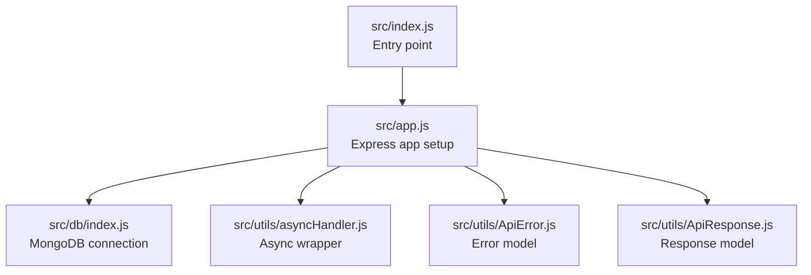
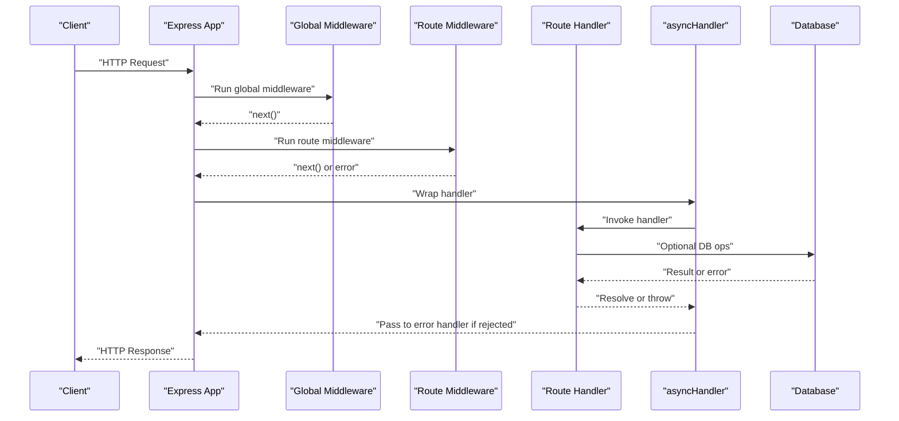
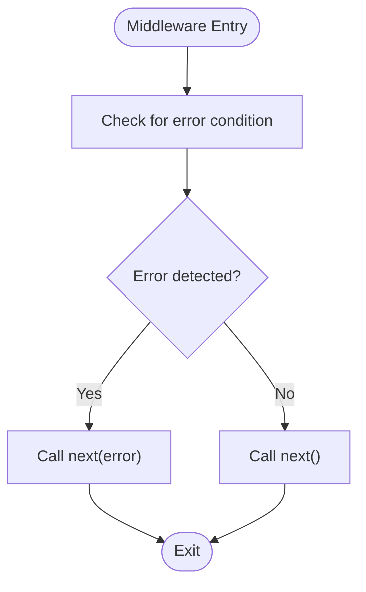
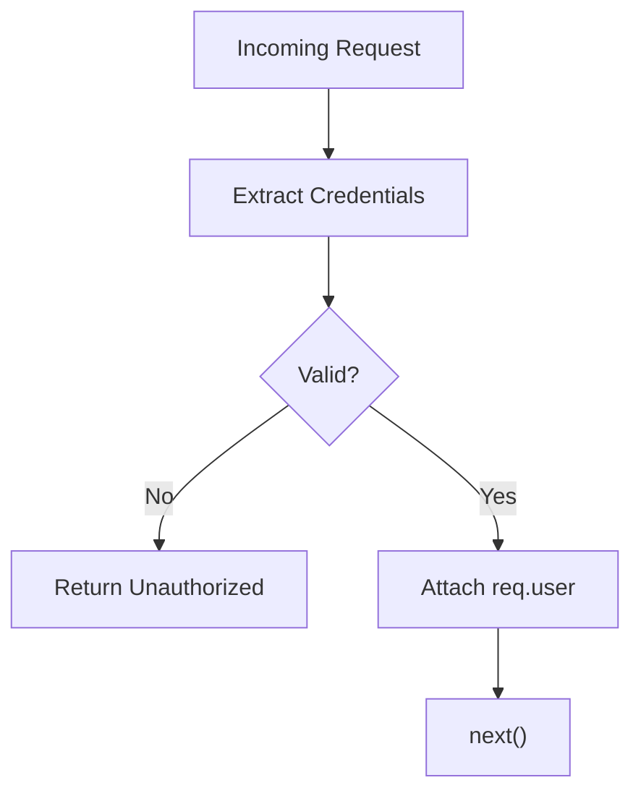
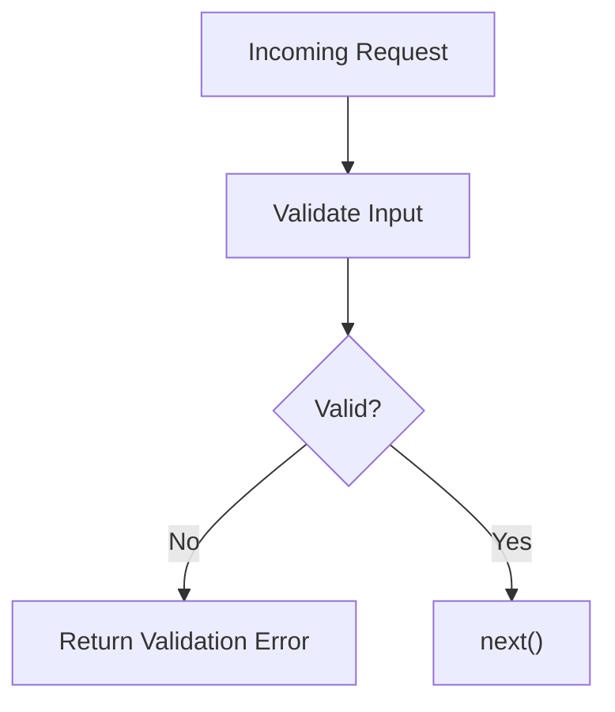
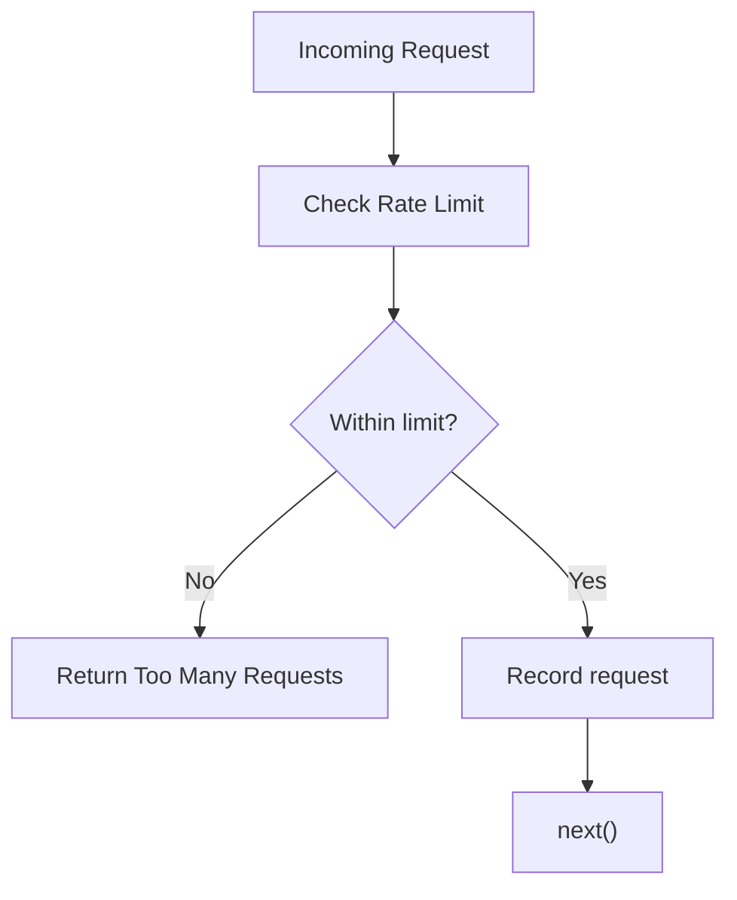
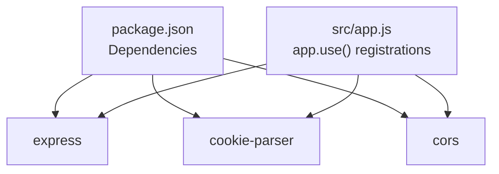

# Custom Middleware Development

<cite>
**Referenced Files in This Document**
- [src/app.js](file://src/app.js)
- [src/index.js](file://src/index.js)
- [src/utils/asyncHandler.js](file://src/utils/asyncHandler.js)
- [src/utils/ApiError.js](file://src/utils/ApiError.js)
- [src/utils/ApiResponse.js](file://src/utils/ApiResponse.js)
- [src/db/index.js](file://src/db/index.js)
- [package.json](file://package.json)
</cite>

## Table of Contents
1. [Introduction](#introduction)
2. [Project Structure](#project-structure)
3. [Core Components](#core-components)
4. [Architecture Overview](#architecture-overview)
5. [Detailed Component Analysis](#detailed-component-analysis)
6. [Dependency Analysis](#dependency-analysis)
7. [Performance Considerations](#performance-considerations)
8. [Troubleshooting Guide](#troubleshooting-guide)
9. [Conclusion](#conclusion)
10. [Appendices](#appendices)

## Introduction
This document provides comprehensive guidance for developing custom middleware in the Task Management System backend. It focuses on Express middleware patterns, function signatures, the next() callback mechanism, request/response manipulation, error propagation, and best practices for building robust, reusable middleware. It also covers composition, testing strategies, and troubleshooting techniques grounded in the current codebase.

## Project Structure
The backend is organized around Express application initialization, database connectivity, and utility helpers for asynchronous handling and standardized error/data responses. Middleware is integrated via Express’s app.use() and route-specific middleware registration.

**Diagram sources**
- [src/index.js](file://src/index.js#L1-L18)
- [src/app.js](file://src/app.js#L1-L16)
- [src/db/index.js](file://src/db/index.js#L1-L14)
- [src/utils/asyncHandler.js](file://src/utils/asyncHandler.js#L1-L8)
- [src/utils/ApiError.js](file://src/utils/ApiError.js#L1-L22)
- [src/utils/ApiResponse.js](file://src/utils/ApiResponse.js#L1-L17)

**Section sources**
- [src/index.js](file://src/index.js#L1-L18)
- [src/app.js](file://src/app.js#L1-L16)
- [src/db/index.js](file://src/db/index.js#L1-L14)
- [src/utils/asyncHandler.js](file://src/utils/asyncHandler.js#L1-L8)
- [src/utils/ApiError.js](file://src/utils/ApiError.js#L1-L22)
- [src/utils/ApiResponse.js](file://src/utils/ApiResponse.js#L1-L17)

## Core Components
- Express app initialization and middleware pipeline:
  - CORS configuration, static asset serving, JSON body parsing, and cookie parsing are registered globally via app.use().
- Utility helpers:
  - asyncHandler wraps route handlers to convert synchronous or asynchronous logic into a Promise-based flow, forwarding caught errors to Express’s error-handling middleware via next().
  - ApiError and ApiResponse provide structured error and response models used across the application.

These components form the foundation for middleware development and integration.

**Section sources**
- [src/app.js](file://src/app.js#L1-L16)
- [src/utils/asyncHandler.js](file://src/utils/asyncHandler.js#L1-L8)
- [src/utils/ApiError.js](file://src/utils/ApiError.js#L1-L22)
- [src/utils/ApiResponse.js](file://src/utils/ApiResponse.js#L1-L17)

## Architecture Overview
The middleware ecosystem integrates with Express’s request-response lifecycle. Global middleware (CORS, JSON parsing, cookies) runs before route-specific middleware and handlers. Route handlers are wrapped with asyncHandler to ensure uncaught exceptions propagate to the error handler.

**Diagram sources**
- [src/app.js](file://src/app.js#L8-L13)
- [src/utils/asyncHandler.js](file://src/utils/asyncHandler.js#L1-L8)
- [src/db/index.js](file://src/db/index.js#L3-L11)

## Detailed Component Analysis

### Express Middleware Fundamentals
- Function signature pattern:
  - req: incoming request object
  - res: outgoing response object
  - next: continuation function to pass control to the next middleware or route handler
- Execution context:
  - Middleware executes in the order registered. Use next() to continue the chain or call res.send()/res.json() to short-circuit.
- Error propagation:
  - Throw or pass an error to next() to trigger Express’s error-handling flow.

**Section sources**
- [src/app.js](file://src/app.js#L8-L13)
- [src/utils/asyncHandler.js](file://src/utils/asyncHandler.js#L1-L8)

### Request/Response Manipulation
- Modify req (e.g., attach user info, parsed tokens) for downstream middleware and handlers.
- Use res.status(), res.json(), or res.send() to send responses directly from middleware to short-circuit the chain.
- Respect next() to continue normal flow.

**Section sources**
- [src/app.js](file://src/app.js#L8-L13)

### Error Propagation Patterns
- Use next(error) to forward errors to Express’s error middleware.
- Wrap handlers with asyncHandler to convert thrown errors into next(error) automatically.

**Diagram sources**
- [src/utils/asyncHandler.js](file://src/utils/asyncHandler.js#L1-L8)

**Section sources**
- [src/utils/asyncHandler.js](file://src/utils/asyncHandler.js#L1-L8)
- [src/utils/ApiError.js](file://src/utils/ApiError.js#L1-L22)

### Authentication Verification Middleware Pattern
- Typical steps:
  - Extract credentials from Authorization header or cookies.
  - Validate token/signature.
  - Attach user identity to req.user.
  - Call next() or return unauthorized response.
- Composition:
  - Place early in the middleware chain to protect downstream routes.

[No sources needed since this diagram shows conceptual workflow, not actual code structure]

### Input Validation Middleware Pattern
- Typical steps:
  - Validate req.body, req.params, req.query against schema.
  - On invalid input, call next(new ApiError(...)) or return a validation error response.
  - On valid input, call next().

**Diagram sources**
- [src/utils/ApiError.js](file://src/utils/ApiError.js#L1-L22)

**Section sources**
- [src/utils/ApiError.js](file://src/utils/ApiError.js#L1-L22)

### Rate Limiting Middleware Pattern
- Typical steps:
  - Track requests per IP or user ID.
  - Enforce limits (e.g., max requests per window).
  - On limit exceeded, call next(new ApiError(...)) or return a rate-limited response.
  - On allowed, call next().

**Diagram sources**
- [src/utils/ApiError.js](file://src/utils/ApiError.js#L1-L22)

**Section sources**
- [src/utils/ApiError.js](file://src/utils/ApiError.js#L1-L22)

### Request Sanitization Middleware Pattern
- Typical steps:
  - Normalize and sanitize input fields (trim, escape, normalize whitespace).
  - Replace req.body/params/query with sanitized values.
  - Call next().

**Section sources**
- [src/app.js](file://src/app.js#L12-L13)

### Middleware Composition and Chaining
- Register multiple middleware functions in order; each can call next() or terminate the chain.
- Use route-level middleware to apply specific middleware sets to subsets of routes.
- Combine global middleware (CORS, JSON parsing) with route-level middleware for layered behavior.

**Section sources**
- [src/app.js](file://src/app.js#L8-L13)

### Testing Strategies and Unit Testing Approaches
- Test middleware independently:
  - Mock req/res/next and assert behavior (e.g., next called, res.json called, error passed).
- Use asyncHandler-aware tests:
  - Simulate thrown errors and ensure they reach the error handler path.
- Integration tests:
  - Mount middleware on a minimal Express app and assert end-to-end behavior.

[No sources needed since this section provides general guidance]

### Reusability, Configuration, and Modular Patterns
- Keep middleware stateless where possible; accept configuration via parameters.
- Export middleware as standalone functions for reuse across routes.
- Encapsulate shared logic (e.g., token extraction, validation) into helper modules.

[No sources needed since this section provides general guidance]

## Dependency Analysis
The application depends on Express and several middleware packages configured globally. These dependencies influence how middleware behaves and integrate with the request pipeline.

**Diagram sources**
- [package.json](file://package.json#L14-L26)
- [src/app.js](file://src/app.js#L8-L13)

**Section sources**
- [package.json](file://package.json#L14-L26)
- [src/app.js](file://src/app.js#L8-L13)

## Performance Considerations
- Minimize synchronous work inside middleware; prefer asynchronous operations and caching.
- Avoid heavy computations in global middleware; consider per-route middleware for specialized tasks.
- Use efficient validation libraries and cache validated/sanitized data when appropriate.
- Monitor middleware execution time and database queries to identify bottlenecks.

[No sources needed since this section provides general guidance]

## Troubleshooting Guide
- Debugging middleware:
  - Add logging at the start and end of middleware to trace execution order and data mutations.
  - Inspect req and res objects to confirm middleware transformations.
- Error handling:
  - Ensure async errors are forwarded via next(); otherwise, they may not reach the error handler.
  - Use ApiError consistently to standardize error responses.
- Database connectivity:
  - Confirm database connection is established before registering routes that depend on DB access.

**Section sources**
- [src/utils/asyncHandler.js](file://src/utils/asyncHandler.js#L1-L8)
- [src/utils/ApiError.js](file://src/utils/ApiError.js#L1-L22)
- [src/db/index.js](file://src/db/index.js#L3-L11)

## Conclusion
Custom middleware in the Task Management System follows Express’s standard function signature and next() callback pattern. By leveraging asyncHandler for error propagation, ApiError/ApiResponse for consistent responses, and integrating middleware via app.use(), developers can build robust, composable middleware for authentication, validation, rate limiting, and sanitization. Adopting modular patterns, thorough testing, and performance-conscious design ensures maintainable and scalable middleware.

## Appendices
- Practical examples:
  - Authentication verification: extract and validate credentials, attach user to req, and continue or block.
  - Input validation: validate request parameters and either call next() or return a structured error.
  - Rate limiting: track requests and enforce limits, returning an appropriate error when exceeded.
  - Request sanitization: normalize and sanitize inputs before they reach route handlers.

[No sources needed since this section provides general guidance]