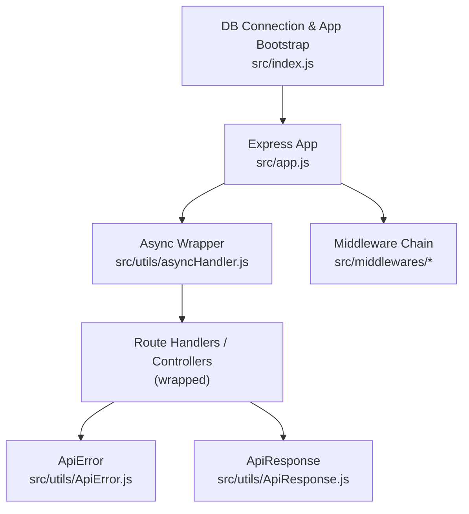
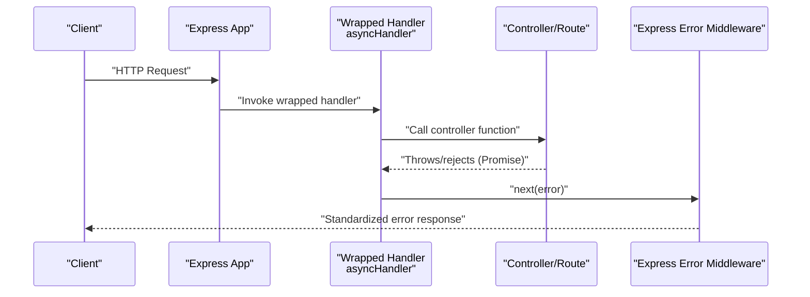
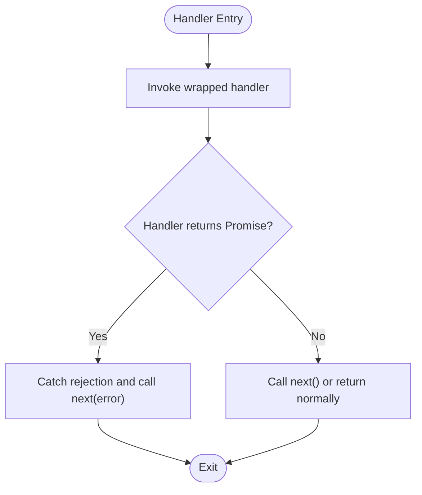
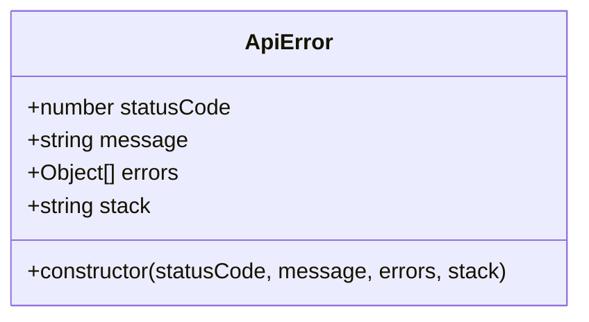
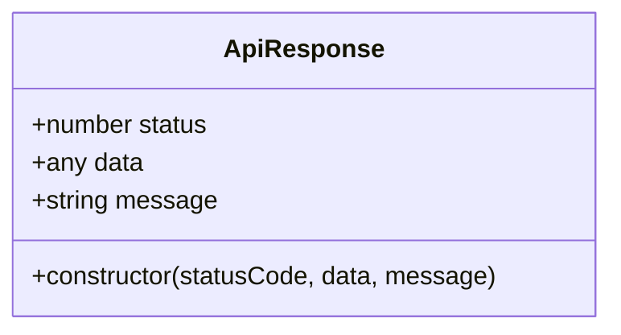
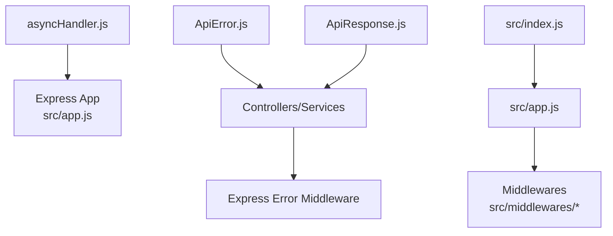

# Error Handling Middleware

<cite>
**Referenced Files in This Document**
- [asyncHandler.js](file://src/utils/asyncHandler.js)
- [ApiError.js](file://src/utils/ApiError.js)
- [ApiResponse.js](file://src/utils/ApiResponse.js)
- [app.js](file://src/app.js)
- [index.js](file://src/index.js)
- [auth.middleware.js](file://src/middlewares/auth.middleware.js)
- [multer.middleware.js](file://src/middlewares/multer.middleware.js)
</cite>

## Table of Contents
1. [Introduction](#introduction)
2. [Project Structure](#project-structure)
3. [Core Components](#core-components)
4. [Architecture Overview](#architecture-overview)
5. [Detailed Component Analysis](#detailed-component-analysis)
6. [Dependency Analysis](#dependency-analysis)
7. [Performance Considerations](#performance-considerations)
8. [Troubleshooting Guide](#troubleshooting-guide)
9. [Conclusion](#conclusion)
10. [Appendices](#appendices)

## Introduction
This document provides comprehensive documentation for the error handling middleware and utilities in the Task Management System backend. It focuses on:
- The asyncHandler wrapper for promise-based error catching in Express middleware and route handlers
- The ApiError class for structured error representation with status codes, messages, and nested errors
- The ApiResponse utility for consistent success response formatting
- Centralized error handling strategies and propagation through Express middleware chains
- Practical patterns for validation, database, and authentication-related errors
- Logging, debugging, and monitoring approaches
- Guidelines for creating custom error types, categorizing errors, and crafting user-friendly messages
- Best practices for async error handling and middleware error management

## Project Structure
The error handling utilities reside under src/utils and are integrated into the Express application via src/app.js. The asyncHandler wrapper is designed to wrap controller and route handler functions so that thrown or rejected promises are caught and passed to Express’s error-handling middleware via next(error). The ApiError class standardizes error objects, while ApiResponse provides a consistent success response envelope.

**Diagram sources**
- [app.js](file://src/app.js#L1-L16)
- [asyncHandler.js](file://src/utils/asyncHandler.js#L1-L8)
- [ApiError.js](file://src/utils/ApiError.js#L1-L22)
- [ApiResponse.js](file://src/utils/ApiResponse.js#L1-L17)
- [index.js](file://src/index.js#L1-L18)

**Section sources**
- [app.js](file://src/app.js#L1-L16)
- [index.js](file://src/index.js#L1-L18)

## Core Components
- asyncHandler: A thin wrapper that turns async route/controller functions into a form that Express can reliably pass exceptions to the error-handling middleware via next(error).
- ApiError: A structured error class carrying HTTP status codes, human-readable messages, optional nested errors array, and optionally a stack trace.
- ApiResponse: A lightweight response envelope for success responses, carrying status code, data payload, and message.

Key characteristics:
- asyncHandler ensures that any unhandled promise rejections or synchronous throws inside wrapped handlers are forwarded to Express’s error middleware.
- ApiError enables consistent error responses across the API by encapsulating status, message, and error details.
- ApiResponse provides a uniform shape for success responses, simplifying client consumption.

**Section sources**
- [asyncHandler.js](file://src/utils/asyncHandler.js#L1-L8)
- [ApiError.js](file://src/utils/ApiError.js#L1-L22)
- [ApiResponse.js](file://src/utils/ApiResponse.js#L1-L17)

## Architecture Overview
The error handling architecture leverages Express’s standard error middleware signature. When a route/controller throws or returns a rejected promise, asyncHandler catches the error and forwards it to next(error). An Express error-handling middleware (not shown here) receives the error and responds using ApiError or ApiResponse patterns.

**Diagram sources**
- [asyncHandler.js](file://src/utils/asyncHandler.js#L1-L8)

## Detailed Component Analysis

### asyncHandler Implementation
Purpose:
- Wrap route/controller functions to convert thrown exceptions and rejected promises into a single error channel for Express error middleware.

Behavior:
- Returns a function that invokes the provided handler with req, res, next.
- Treats the handler’s return value as a Promise and catches any rejection, forwarding it to next(error).

Usage pattern:
- Wrap all route handlers and async controller functions with asyncHandler to ensure consistent error propagation.

**Diagram sources**
- [asyncHandler.js](file://src/utils/asyncHandler.js#L1-L8)

**Section sources**
- [asyncHandler.js](file://src/utils/asyncHandler.js#L1-L8)

### ApiError Class
Structure:
- Extends the native Error class.
- Stores HTTP status code, message, optional nested errors array, and optional stack trace.

Design intent:
- Standardize error objects across the application for predictable serialization and response formatting.

Common usage:
- Throw ApiError instances from controllers/services when encountering validation failures, business rule violations, or server-side errors.
- Populate the errors array for multi-field validation errors.

**Diagram sources**
- [ApiError.js](file://src/utils/ApiError.js#L1-L22)

**Section sources**
- [ApiError.js](file://src/utils/ApiError.js#L1-L22)

### ApiResponse Utility
Structure:
- Provides a consistent success response envelope with status code, data payload, and message.

Design intent:
- Simplify success responses and ensure uniformity across endpoints.

Usage:
- Instantiate ApiResponse with appropriate status, data, and message for successful outcomes.

**Diagram sources**
- [ApiResponse.js](file://src/utils/ApiResponse.js#L1-L17)

**Section sources**
- [ApiResponse.js](file://src/utils/ApiResponse.js#L1-L17)

### Middleware Integration Points
- Authentication middleware: Intended to validate tokens and attach user info to requests. Errors during authentication should be thrown as ApiError to leverage centralized error handling.
- Multer middleware: Handles file uploads. Errors during upload or parsing should be standardized using ApiError.

Note: The current middleware files are placeholders. Ensure that any real middleware logic throws ApiError on failure so that asyncHandler and the error middleware can handle them consistently.

**Section sources**
- [auth.middleware.js](file://src/middlewares/auth.middleware.js#L1-L1)
- [multer.middleware.js](file://src/middlewares/multer.middleware.js#L1-L1)

## Dependency Analysis
- asyncHandler depends on the Express next callback to propagate errors.
- ApiError and ApiResponse are standalone utilities used by controllers/services to produce structured responses.
- The Express app initialization and middleware chain (including CORS, JSON parsing, cookies) set up the environment for error propagation.

**Diagram sources**
- [asyncHandler.js](file://src/utils/asyncHandler.js#L1-L8)
- [ApiError.js](file://src/utils/ApiError.js#L1-L22)
- [ApiResponse.js](file://src/utils/ApiResponse.js#L1-L17)
- [app.js](file://src/app.js#L1-L16)
- [index.js](file://src/index.js#L1-L18)

**Section sources**
- [app.js](file://src/app.js#L1-L16)
- [index.js](file://src/index.js#L1-L18)

## Performance Considerations
- Prefer throwing ApiError early in the request lifecycle to avoid unnecessary downstream processing.
- Keep error messages concise and avoid leaking sensitive internal details; include an error identifier or code for client-friendly support.
- Avoid wrapping every synchronous operation in asyncHandler unless it is truly asynchronous; only wrap handlers that may throw or return rejected promises.
- Minimize deep nesting of try/catch blocks; rely on asyncHandler to centralize error propagation.

## Troubleshooting Guide
Common issues and resolutions:
- Uncaught exceptions in route handlers: Ensure handlers are wrapped with asyncHandler so that next(error) is invoked for Express error middleware.
- Missing error middleware: Add an Express error-handling middleware after all routes to catch errors and respond with standardized ApiError envelopes.
- Validation errors: Throw ApiError with appropriate status code and populate the errors array for field-specific details.
- Database errors: Convert driver-specific errors to ApiError with consistent status codes and sanitized messages.
- Authentication failures: Throw ApiError from auth middleware to trigger centralized error handling.
- Logging and monitoring: Capture error.stack and metadata in the error middleware; emit metrics for error codes and routes.

Debugging tips:
- Temporarily log error.stack and request context in the error middleware to diagnose failures.
- Use unique error codes or identifiers to correlate logs with client reports.
- For asyncHandler-wrapped functions, verify that the handler returns a Promise or throws synchronously.

**Section sources**
- [asyncHandler.js](file://src/utils/asyncHandler.js#L1-L8)
- [ApiError.js](file://src/utils/ApiError.js#L1-L22)

## Conclusion
The Task Management System’s error handling strategy centers on three pillars:
- asyncHandler for consistent error propagation from route handlers
- ApiError for standardized error representation
- ApiResponse for uniform success responses

By adopting these utilities and ensuring all middleware and controllers throw ApiError on failure, the system achieves centralized, predictable error handling across the entire request lifecycle.

## Appendices

### Practical Error Handling Patterns

- Validation errors
  - Throw ApiError with a user-friendly message and populate the errors array with field-level details.
  - Example reference: [ApiError.js](file://src/utils/ApiError.js#L1-L22)

- Database errors
  - Catch driver-specific errors and translate them into ApiError with appropriate status codes.
  - Example reference: [ApiError.js](file://src/utils/ApiError.js#L1-L22)

- Authentication failures
  - From auth middleware, throw ApiError to signal unauthorized or invalid credentials.
  - Example reference: [auth.middleware.js](file://src/middlewares/auth.middleware.js#L1-L1), [ApiError.js](file://src/utils/ApiError.js#L1-L22)

- Upload errors (Multer)
  - From multer middleware, throw ApiError for file size limits, unsupported types, or parse errors.
  - Example reference: [multer.middleware.js](file://src/middlewares/multer.middleware.js#L1-L1), [ApiError.js](file://src/utils/ApiError.js#L1-L22)

- Consistent success responses
  - Use ApiResponse to return structured success payloads.
  - Example reference: [ApiResponse.js](file://src/utils/ApiResponse.js#L1-L17)

### Creating Custom Error Types
Guidelines:
- Extend ApiError for domain-specific errors (e.g., ResourceNotFoundError, ValidationError).
- Assign semantic HTTP status codes aligned with REST conventions.
- Include an errors array for multi-field validation or detailed diagnostics.
- Keep messages user-friendly; store technical details in metadata or logs.

Example reference for structure: [ApiError.js](file://src/utils/ApiError.js#L1-L22)

### Error Categorization and User-Friendly Messages
- Categorize by domain: authentication, authorization, validation, business rules, infrastructure.
- Use status codes consistently: 400 for bad input, 401/403 for auth issues, 404 for missing resources, 500 for unexpected server errors.
- Provide actionable messages and optional error codes for clients to present contextual help.

### Best Practices for Async Operations and Middleware
- Always wrap async route handlers with asyncHandler.
- Avoid mixing sync and async logic without proper error handling; prefer async/await and Promise-based flows.
- Centralize error responses in Express error middleware; avoid ad-hoc res.status(...).json(...) inside controllers.
- Log errors with correlation IDs and minimal PII; include sanitized error messages in responses.