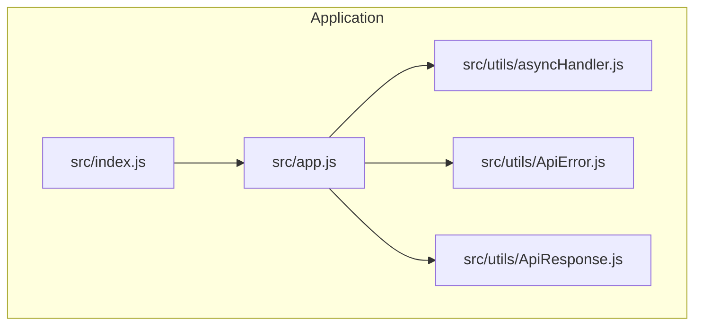
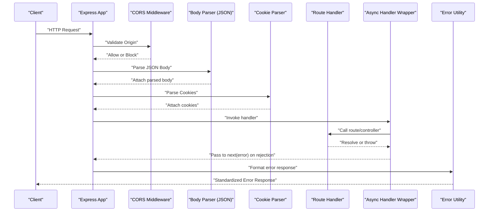
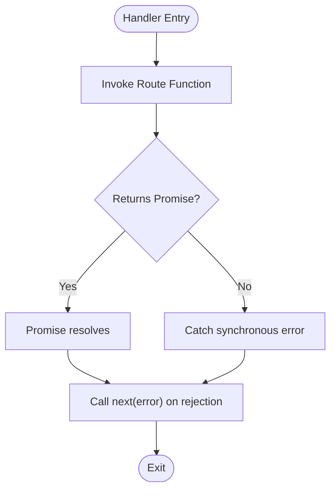
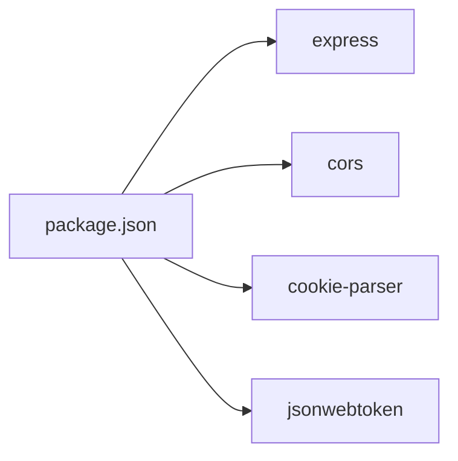

# Middleware & Interceptors

<cite>
**Referenced Files in This Document**
- [src/app.js](file://src/app.js)
- [src/index.js](file://src/index.js)
- [src/utils/asyncHandler.js](file://src/utils/asyncHandler.js)
- [src/utils/ApiError.js](file://src/utils/ApiError.js)
- [src/utils/ApiResponse.js](file://src/utils/ApiResponse.js)
- [package.json](file://package.json)
</cite>

## Table of Contents
1. [Introduction](#introduction)
2. [Project Structure](#project-structure)
3. [Core Components](#core-components)
4. [Architecture Overview](#architecture-overview)
5. [Detailed Component Analysis](#detailed-component-analysis)
6. [Dependency Analysis](#dependency-analysis)
7. [Performance Considerations](#performance-considerations)
8. [Troubleshooting Guide](#troubleshooting-guide)
9. [Conclusion](#conclusion)
10. [Appendices](#appendices)

## Introduction
This document explains the middleware and interceptor system of the Task Management System backend. It focuses on CORS configuration, the request processing pipeline (JSON parsing, cookies, authentication verification, and error handling), and patterns for building custom middleware. It also covers async handler implementation for promise-based error handling, consistent error response formatting, middleware ordering, performance optimization, logging integration, debugging techniques, security middleware patterns, and testing guidelines.

## Project Structure
The backend is an Express application initialized in the main entry point and configured with essential middleware early in the pipeline. The application exposes a minimal set of built-in middleware and utility helpers for error handling and response formatting.

**Diagram sources**
- [src/index.js](file://src/index.js#L1-L18)
- [src/app.js](file://src/app.js#L1-L15)
- [src/utils/asyncHandler.js](file://src/utils/asyncHandler.js#L1-L8)
- [src/utils/ApiError.js](file://src/utils/ApiError.js#L1-L22)
- [src/utils/ApiResponse.js](file://src/utils/ApiResponse.js#L1-L17)

**Section sources**
- [src/index.js](file://src/index.js#L1-L18)
- [src/app.js](file://src/app.js#L1-L15)

## Core Components
- CORS middleware: Configured via environment variable for origin control.
- JSON body parser: Enforces a 16 KB limit.
- Cookie parser: Parses cookies from incoming requests.
- Static asset serving: Serves static files from the public directory.
- Async error handling wrapper: Converts sync/async handlers into a unified error-propagating pattern.
- Error and response utilities: Base classes for structured error and response objects.

Key configuration and initialization points:
- CORS origin is controlled by the environment variable referenced in the application setup.
- JSON parsing and cookie parsing are registered globally before route handlers.

**Section sources**
- [src/app.js](file://src/app.js#L8-L13)
- [src/utils/asyncHandler.js](file://src/utils/asyncHandler.js#L1-L8)
- [src/utils/ApiError.js](file://src/utils/ApiError.js#L1-L22)
- [src/utils/ApiResponse.js](file://src/utils/ApiResponse.js#L1-L17)

## Architecture Overview
The request lifecycle begins at the Express server, which applies middleware in the order registered. Built-in middleware handle cross-origin requests, JSON bodies, and cookies. Route handlers and controllers can leverage the async error handler wrapper to centralize error propagation. Errors are normalized using the error utility, while successful responses use the response utility.

**Diagram sources**
- [src/app.js](file://src/app.js#L8-L13)
- [src/utils/asyncHandler.js](file://src/utils/asyncHandler.js#L1-L8)
- [src/utils/ApiError.js](file://src/utils/ApiError.js#L1-L22)

## Detailed Component Analysis

### CORS Configuration
- Origin validation: Controlled by the environment variable referenced in the application setup. Requests from origins outside the allowed list are blocked by the CORS middleware.
- Credentials and preflight: The current configuration does not explicitly set credentials or preflight options. If your deployment requires credentials or custom preflight behavior, update the CORS configuration accordingly.

Practical guidance:
- Set the environment variable to a single origin or a list compatible with your frontend deployment.
- If credentials are required, configure the middleware to explicitly allow credentials and adjust preflight timeouts as needed.

**Section sources**
- [src/app.js](file://src/app.js#L8-L10)

### Request Processing Pipeline
- JSON parsing: Enabled with a 16 KB limit to prevent oversized payloads.
- Cookie handling: Cookies are parsed and attached to the request object for downstream handlers.
- Static assets: Public directory is served statically.

Ordering considerations:
- Keep JSON and cookie parsers before route handlers.
- Place CORS before JSON/body parsing if you need CORS headers included in preflight responses.

**Section sources**
- [src/app.js](file://src/app.js#L11-L13)

### Authentication Verification
- Token-based authentication is supported by the presence of the JWT library in dependencies. Typical patterns include extracting tokens from Authorization headers or cookies, verifying signatures, and attaching user identity to the request context.
- Implement an authentication middleware that validates tokens and calls next() with an error if invalid.

Note: The current application setup does not include an authentication middleware. Add it after CORS and body parsing but before route handlers.

**Section sources**
- [package.json](file://package.json#L14-L26)

### Error Handling Middleware
- Centralized error handling: Use a dedicated error-handling middleware after all routes to catch thrown or rejected errors.
- Consistent response formatting: Use the response utility for success and the error utility for failures to maintain a uniform API contract.

Patterns:
- Throw errors from route handlers or pass them to next().
- Ensure async handlers wrap route logic so rejections propagate to the error middleware.

**Section sources**
- [src/utils/asyncHandler.js](file://src/utils/asyncHandler.js#L1-L8)
- [src/utils/ApiError.js](file://src/utils/ApiError.js#L1-L22)
- [src/utils/ApiResponse.js](file://src/utils/ApiResponse.js#L1-L17)

### Async Handler Implementation
- Purpose: Normalize async/sync route handlers so uncaught exceptions and rejections are forwarded to Express’s error middleware.
- Usage: Wrap route/controller functions with the async handler before exporting or registering them.

**Diagram sources**
- [src/utils/asyncHandler.js](file://src/utils/asyncHandler.js#L1-L8)

**Section sources**
- [src/utils/asyncHandler.js](file://src/utils/asyncHandler.js#L1-L8)

### Custom Middleware Development Patterns
- Signature: Middleware functions accept three arguments: request, response, next. They may mutate the request/response, call next(), or call next(error).
- next() usage: Call next() to continue the pipeline, next(error) to trigger error handling, or return to stop further processing.
- Error propagation: Always forward errors to next(error) so they reach the centralized error handler.

Middleware ordering:
- Place CORS before JSON parsing if preflight responses require CORS headers.
- Place authentication after body parsing and before routes.
- Place logging before authentication to capture all requests.
- Place error handling last.

[No sources needed since this section provides general guidance]

### Security Middleware Patterns
- Input validation: Integrate a validation library to sanitize and validate request bodies and parameters. Apply validation middleware before route handlers.
- Rate limiting: Use a rate-limiting middleware to protect endpoints from abuse. Place it before sensitive routes.
- Request sanitization: Sanitize inputs to mitigate injection risks. Combine with validation for defense-in-depth.

[No sources needed since this section provides general guidance]

### Practical Examples
- Middleware chain execution: CORS → JSON parser → Cookie parser → Authentication → Routes → Error handler.
- Creating a custom middleware: Define a function with the standard signature, attach it via app.use(), and ensure proper ordering.
- Middleware ordering considerations: Changing the order affects header availability, authentication readiness, and error coverage.

[No sources needed since this section provides general guidance]

## Dependency Analysis
The application depends on Express and several middleware packages. The CORS and cookie-parser libraries are directly used in the application setup. The async handler utility and error/response utilities are used to standardize asynchronous error handling and response formatting.

**Diagram sources**
- [package.json](file://package.json#L14-L26)

**Section sources**
- [package.json](file://package.json#L14-L26)

## Performance Considerations
- Middleware ordering: Place lightweight middleware earlier (e.g., CORS pre-checks) and heavier ones later (e.g., authentication).
- Body limits: Keep JSON limits reasonable to avoid memory pressure.
- Logging overhead: Use leveled logging and avoid expensive operations in hot paths.
- Error handling: Centralize error handling to reduce repeated checks and formatting logic.

[No sources needed since this section provides general guidance]

## Troubleshooting Guide
- CORS issues: Verify the origin environment variable and ensure it matches the client origin. Confirm the middleware order and that preflight requests are handled.
- JSON parse errors: Check payload sizes against the configured limit and ensure Content-Type headers are correct.
- Authentication failures: Confirm token presence, validity, and signing algorithm alignment.
- Unhandled errors: Ensure async handlers wrap route logic and that an error-handling middleware is registered last.

**Section sources**
- [src/app.js](file://src/app.js#L8-L13)
- [src/utils/asyncHandler.js](file://src/utils/asyncHandler.js#L1-L8)
- [src/utils/ApiError.js](file://src/utils/ApiError.js#L1-L22)

## Conclusion
The Task Management System initializes essential middleware for CORS, JSON parsing, and cookies. By adopting the async handler wrapper and structured error/response utilities, the system can scale to include robust authentication, validation, rate limiting, and comprehensive error handling. Proper middleware ordering and performance-conscious design ensure a reliable and maintainable request pipeline.

[No sources needed since this section summarizes without analyzing specific files]

## Appendices
- Environment variables: Configure CORS origin via the environment variable referenced in the application setup.
- Testing guidelines: Mock middleware behavior, isolate async handlers, and assert standardized error and success responses.

[No sources needed since this section provides general guidance]