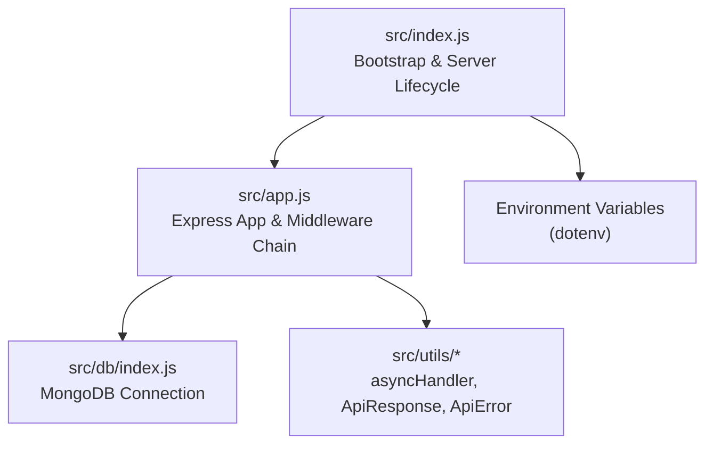
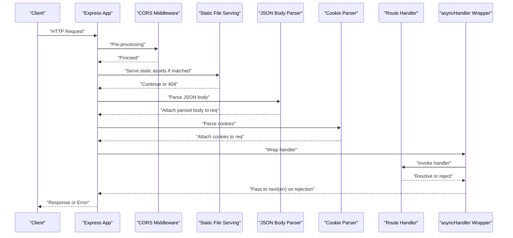
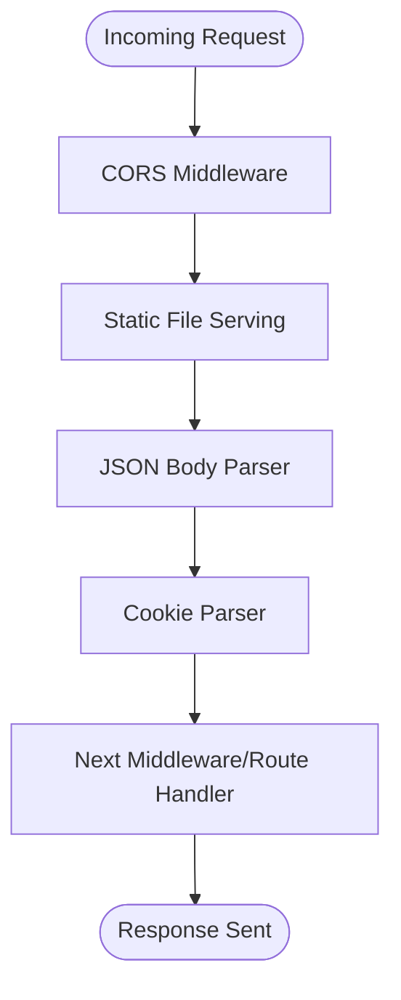
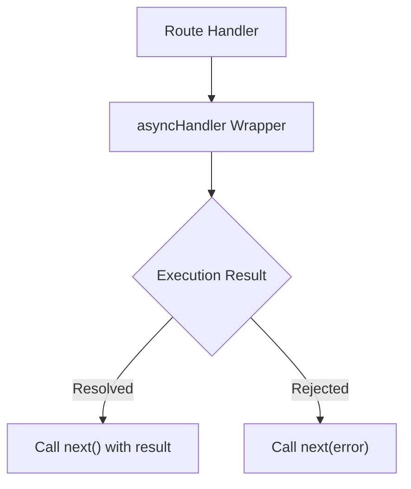
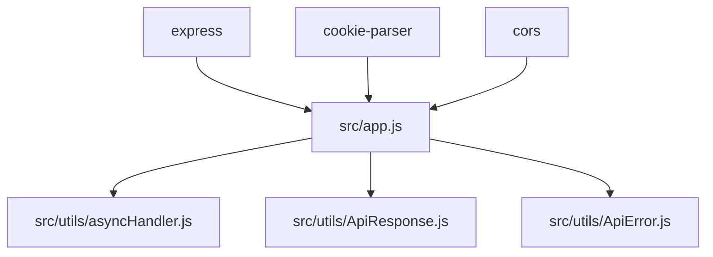

# Request Processing Pipeline

<cite>
**Referenced Files in This Document**
- [src/app.js](file://src/app.js)
- [src/index.js](file://src/index.js)
- [src/db/index.js](file://src/db/index.js)
- [src/utils/asyncHandler.js](file://src/utils/asyncHandler.js)
- [src/utils/ApiResponse.js](file://src/utils/ApiResponse.js)
- [src/utils/ApiError.js](file://src/utils/ApiError.js)
- [package.json](file://package.json)
</cite>

## Table of Contents
1. [Introduction](#introduction)
2. [Project Structure](#project-structure)
3. [Core Components](#core-components)
4. [Architecture Overview](#architecture-overview)
5. [Detailed Component Analysis](#detailed-component-analysis)
6. [Dependency Analysis](#dependency-analysis)
7. [Performance Considerations](#performance-considerations)
8. [Troubleshooting Guide](#troubleshooting-guide)
9. [Conclusion](#conclusion)

## Introduction
This document explains the Express.js request processing pipeline in the Task Management System backend. It focuses on the middleware chain execution order, request preprocessing (body parsing, cookies, content-type validation), and response processing (status codes, headers, and error propagation). It also documents the asyncHandler utility for consistent error handling and outlines best practices for adding new middleware while preserving optimal execution order.

## Project Structure
The backend follows a modular Express application layout:
- Application bootstrap and server lifecycle are handled in the main entry file.
- Express app configuration and middleware registration are centralized.
- Database connection is initialized before the server starts.
- Utility modules provide standardized async error handling and response/error models.

**Diagram sources**
- [src/index.js](file://src/index.js#L1-L18)
- [src/app.js](file://src/app.js#L1-L16)
- [src/db/index.js](file://src/db/index.js#L1-L14)
- [src/utils/asyncHandler.js](file://src/utils/asyncHandler.js#L1-L8)
- [src/utils/ApiResponse.js](file://src/utils/ApiResponse.js#L1-L17)
- [src/utils/ApiError.js](file://src/utils/ApiError.js#L1-L22)

**Section sources**
- [src/index.js](file://src/index.js#L1-L18)
- [src/app.js](file://src/app.js#L1-L16)
- [src/db/index.js](file://src/db/index.js#L1-L14)
- [package.json](file://package.json#L1-L28)

## Core Components
- Express app initialization and middleware chain registration.
- Async error handling wrapper for route handlers.
- Standardized response and error models for consistent API contracts.

Key responsibilities:
- Configure CORS, static file serving, JSON body parsing, and cookie parsing.
- Provide a uniform way to handle asynchronous route handlers and propagate errors.
- Enforce consistent response shape and error metadata.

**Section sources**
- [src/app.js](file://src/app.js#L1-L16)
- [src/utils/asyncHandler.js](file://src/utils/asyncHandler.js#L1-L8)
- [src/utils/ApiResponse.js](file://src/utils/ApiResponse.js#L1-L17)
- [src/utils/ApiError.js](file://src/utils/ApiError.js#L1-L22)

## Architecture Overview
The request processing pipeline is defined by the middleware chain registered on the Express app. Requests flow through middleware in the order they are registered, then reach route handlers (when routes are mounted), and finally responses are processed through the same chain in reverse during error scenarios.

**Diagram sources**
- [src/app.js](file://src/app.js#L8-L13)
- [src/utils/asyncHandler.js](file://src/utils/asyncHandler.js#L1-L8)

## Detailed Component Analysis

### Middleware Chain Execution Order
The Express app registers middleware in the following order:
1. CORS configuration
2. Static file serving for the public directory
3. JSON body parsing with a size limit
4. Cookie parsing

This order ensures:
- Cross-origin requests are permitted early.
- Static assets are served efficiently before body parsing.
- Request bodies are parsed only when needed.
- Cookies are available to downstream handlers.

**Diagram sources**
- [src/app.js](file://src/app.js#L8-L13)

**Section sources**
- [src/app.js](file://src/app.js#L8-L13)

### Request Preprocessing Steps
- Body parsing: JSON payload is parsed with a configured size limit.
- Cookie extraction: Cookies are parsed and attached to the request object.
- Content-type validation: While not explicitly enforced here, JSON parsing implies application/json content-type expectations.

These steps occur before route handlers execute, ensuring handlers receive structured data and parsed cookies.

**Section sources**
- [src/app.js](file://src/app.js#L11-L13)

### Response Processing Pipeline
- Status code handling: Route handlers set HTTP status codes on the response.
- Header management: CORS middleware sets appropriate headers for cross-origin requests.
- Error propagation: Unhandled exceptions in route handlers are caught by the asyncHandler wrapper and forwarded to Express error-handling middleware.

Note: The current middleware chain does not include a dedicated error-handling middleware. Errors thrown inside route handlers are forwarded to Express’s default error handler unless a custom error-handling middleware is added.

**Section sources**
- [src/app.js](file://src/app.js#L8-L13)
- [src/utils/asyncHandler.js](file://src/utils/asyncHandler.js#L1-L8)

### asyncHandler Utility
The asyncHandler utility wraps route handlers to convert thrown errors into Express error callbacks, enabling consistent error propagation and avoiding unhandled promise rejections.

Usage pattern:
- Wrap route handlers with asyncHandler to ensure errors are forwarded to the error-handling middleware.
- Handlers can return promises; any rejection is caught and passed to next(error).

**Diagram sources**
- [src/utils/asyncHandler.js](file://src/utils/asyncHandler.js#L1-L8)

**Section sources**
- [src/utils/asyncHandler.js](file://src/utils/asyncHandler.js#L1-L8)

### Response and Error Models
- ApiResponse: Provides a consistent response envelope with status code, data payload, and message.
- ApiError: Standardizes error objects with status code, message, and optional error details.

These models support predictable client-server contracts and simplify response formatting in route handlers.

**Section sources**
- [src/utils/ApiResponse.js](file://src/utils/ApiResponse.js#L1-L17)
- [src/utils/ApiError.js](file://src/utils/ApiError.js#L1-L22)

### Practical Examples of Middleware Chain Execution Flow
- Static asset request: The static middleware serves files from the public directory before reaching any route handlers.
- JSON API request: The JSON parser attaches the parsed body to the request object; subsequent handlers can access it.
- Cookie-aware request: Cookies are parsed and attached to the request object for downstream logic.

These behaviors are determined by the middleware registration order.

**Section sources**
- [src/app.js](file://src/app.js#L11-L13)

### Adding New Middleware to the Pipeline
Guidelines:
- Place CORS near the top to avoid unnecessary work for blocked origins.
- Keep static file serving early to short-circuit asset requests quickly.
- Register JSON parsing before route handlers that expect parsed bodies.
- Add cookie parsing after JSON parsing but before route-specific logic.
- Mount route handlers after preprocessing middleware.
- Add error-handling middleware last to catch errors from earlier stages and handlers.

Ordering is critical for performance and correctness.

**Section sources**
- [src/app.js](file://src/app.js#L8-L13)

## Dependency Analysis
External dependencies relevant to the request pipeline:
- Express: Core framework for routing and middleware.
- cookie-parser: Parses cookies from requests.
- cors: Enables cross-origin requests.

Internal dependencies:
- asyncHandler: Ensures consistent error propagation for route handlers.
- ApiResponse/ApiError: Provide standardized response and error structures.

**Diagram sources**
- [package.json](file://package.json#L14-L26)
- [src/app.js](file://src/app.js#L1-L16)
- [src/utils/asyncHandler.js](file://src/utils/asyncHandler.js#L1-L8)
- [src/utils/ApiResponse.js](file://src/utils/ApiResponse.js#L1-L17)
- [src/utils/ApiError.js](file://src/utils/ApiError.js#L1-L22)

**Section sources**
- [package.json](file://package.json#L14-L26)
- [src/app.js](file://src/app.js#L1-L16)

## Performance Considerations
- Middleware ordering: Place fast, selective middleware (like static file serving) early to minimize overhead for non-matching requests.
- JSON body size limits: Configure reasonable limits to prevent large payloads from consuming memory unnecessarily.
- Cookie parsing cost: Enable only when route handlers require cookies.
- Error handling: Use asyncHandler to avoid unhandled promise rejections and reduce error-handling overhead by centralizing error propagation.

[No sources needed since this section provides general guidance]

## Troubleshooting Guide
- Debugging middleware execution:
  - Add logging in each middleware to trace the request flow.
  - Temporarily reorder middleware to isolate issues.
- Inspecting request data:
  - Verify req.body and req.cookies after middleware registration.
- Error diagnosis:
  - Confirm asyncHandler is wrapping route handlers to ensure errors are forwarded.
  - Add a dedicated error-handling middleware to capture and log errors consistently.

**Section sources**
- [src/app.js](file://src/app.js#L8-L13)
- [src/utils/asyncHandler.js](file://src/utils/asyncHandler.js#L1-L8)

## Conclusion
The Task Management System’s Express pipeline is intentionally minimal and efficient, focusing on essential preprocessing (CORS, static files, JSON parsing, cookies) followed by route handlers wrapped with asyncHandler for robust error propagation. By adhering to the documented middleware ordering and leveraging the provided response/error models, developers can extend the pipeline predictably while maintaining performance and reliability.