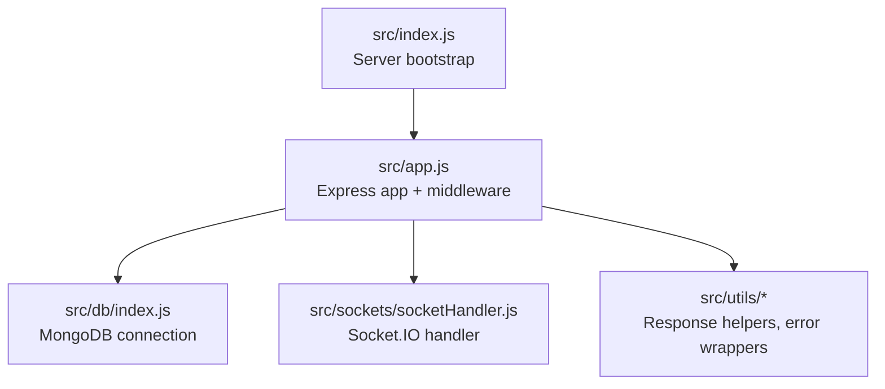
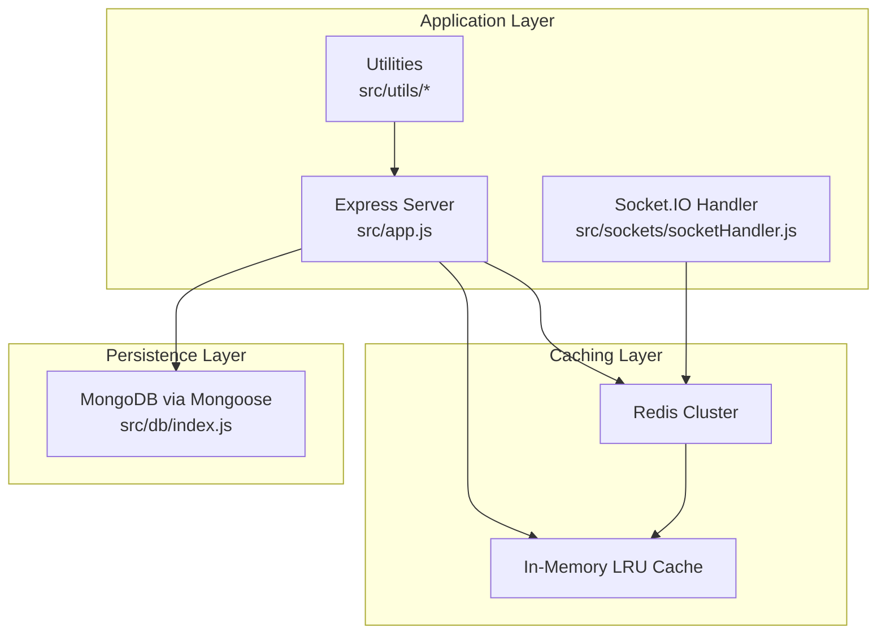
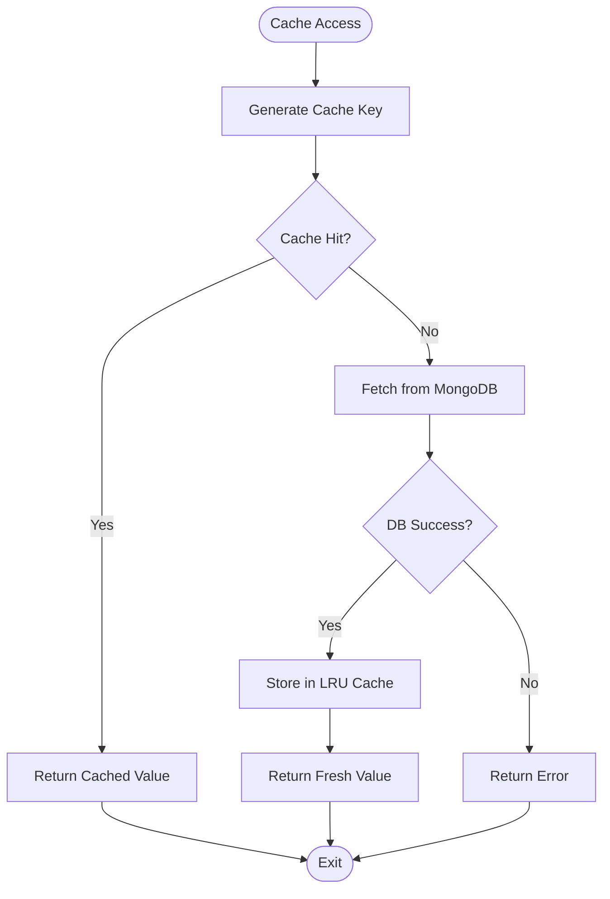
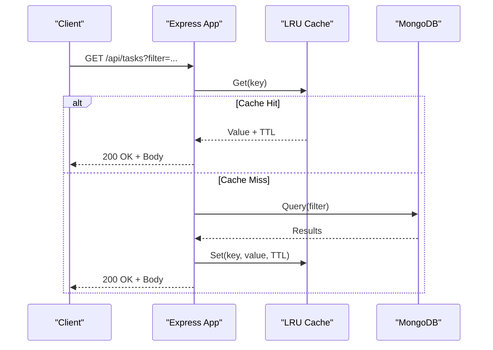
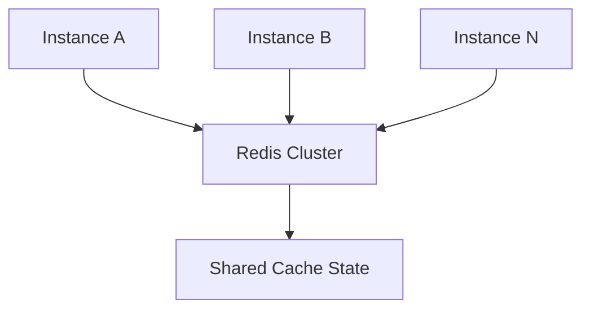
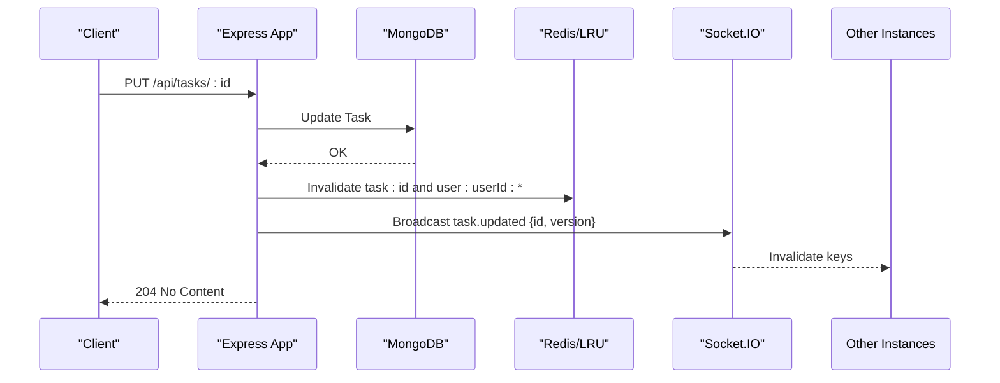
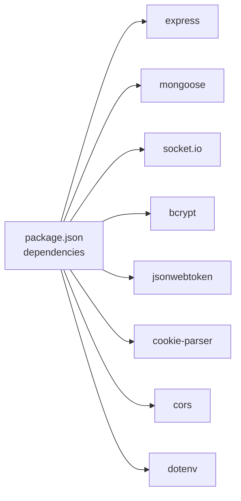

# Caching Strategies

<cite>
**Referenced Files in This Document**
- [package.json](file://package.json)
- [src/app.js](file://src/app.js)
- [src/index.js](file://src/index.js)
- [src/db/index.js](file://src/db/index.js)
- [src/utils/ApiResponse.js](file://src/utils/ApiResponse.js)
- [src/utils/ApiError.js](file://src/utils/ApiError.js)
- [src/utils/asyncHandler.js](file://src/utils/asyncHandler.js)
- [src/sockets/socketHandler.js](file://src/sockets/socketHandler.js)
</cite>

## Table of Contents
1. [Introduction](#introduction)
2. [Project Structure](#project-structure)
3. [Core Components](#core-components)
4. [Architecture Overview](#architecture-overview)
5. [Detailed Component Analysis](#detailed-component-analysis)
6. [Dependency Analysis](#dependency-analysis)
7. [Performance Considerations](#performance-considerations)
8. [Troubleshooting Guide](#troubleshooting-guide)
9. [Conclusion](#conclusion)
10. [Appendices](#appendices)

## Introduction
This document defines a comprehensive caching strategy for the Task Management System backend. It covers in-memory caching, API response caching patterns, Redis integration for distributed caching, cache warming, coherency and partitioning, failure handling, performance monitoring, security, and operational guidelines. The current codebase does not include explicit caching libraries or cache-specific modules; therefore, this document proposes a pragmatic, layered caching approach that integrates cleanly with the existing Express server, Socket.IO real-time layer, and MongoDB persistence.

## Project Structure
The backend is a minimal Express server with environment-driven configuration, database connectivity via Mongoose, and a Socket.IO handler. There are no existing caching modules in the current dependency graph.

**Diagram sources**
- [src/index.js](file://src/index.js#L1-L18)
- [src/app.js](file://src/app.js#L1-L16)
- [src/db/index.js](file://src/db/index.js#L1-L14)
- [src/sockets/socketHandler.js](file://src/sockets/socketHandler.js)

**Section sources**
- [src/index.js](file://src/index.js#L1-L18)
- [src/app.js](file://src/app.js#L1-L16)
- [src/db/index.js](file://src/db/index.js#L1-L14)

## Core Components
- Express server and middleware pipeline: CORS, static assets, JSON parsing, cookie parsing.
- Database connectivity via Mongoose for persistent storage.
- Socket.IO handler for real-time updates.
- Utility modules for standardized responses and error handling.

These components form the foundation upon which caching layers will be integrated.

**Section sources**
- [src/app.js](file://src/app.js#L1-L16)
- [src/db/index.js](file://src/db/index.js#L1-L14)
- [src/sockets/socketHandler.js](file://src/sockets/socketHandler.js)
- [src/utils/ApiResponse.js](file://src/utils/ApiResponse.js)
- [src/utils/ApiError.js](file://src/utils/ApiError.js)
- [src/utils/asyncHandler.js](file://src/utils/asyncHandler.js)

## Architecture Overview
The caching architecture is layered and environment-aware:
- In-memory cache for hot data (tasks and user profiles) using an LRU cache library.
- API response caching with cache headers and cache keys derived from request parameters.
- Redis-backed distributed cache for multi-instance deployments, cache warming, and coherency.
- Cache invalidation via write-through and event-driven invalidation hooks.
- Monitoring and metrics collection for hit/miss ratios, cache size, and memory utilization.
- Security controls for sensitive data protection and cache poisoning prevention.

**Diagram sources**
- [src/app.js](file://src/app.js#L1-L16)
- [src/db/index.js](file://src/db/index.js#L1-L14)
- [src/sockets/socketHandler.js](file://src/sockets/socketHandler.js)
- [src/utils/ApiResponse.js](file://src/utils/ApiResponse.js)
- [src/utils/ApiError.js](file://src/utils/ApiError.js)
- [src/utils/asyncHandler.js](file://src/utils/asyncHandler.js)

## Detailed Component Analysis

### In-Memory Caching with LRU
- Purpose: Accelerate reads for frequently accessed tasks and user data.
- Implementation pattern:
  - Use an LRU cache library to maintain bounded memory footprint.
  - Configure TTL per key and global max entries.
  - Separate namespaces for tasks and users to simplify invalidation.
- Cache key generation:
  - Combine resource type, identifiers, and query parameters (e.g., filters, pagination).
  - Normalize keys to avoid collisions from whitespace or ordering differences.
- Cache invalidation:
  - Write-through: update cache after successful database writes.
  - Event-driven invalidation: invalidate keys on task/user mutations via Socket.IO events.
  - Bulk invalidation: invalidate by prefix for user-scoped data.

**Section sources**
- [src/db/index.js](file://src/db/index.js#L1-L14)
- [src/app.js](file://src/app.js#L1-L16)

### API Response Caching Patterns
- Cache headers:
  - Use standard headers such as Cache-Control, ETag, and Last-Modified.
  - Implement conditional requests with ETag/If-None-Match to reduce payload size.
- Cache key generation:
  - Derive keys from URL, method, and serialized query string.
  - Include user ID for private responses; exclude for public endpoints.
- Expiration policies:
  - Short TTL for personal dashboards, longer TTL for static lists.
  - Stale-while-revalidate to keep responses responsive under load.

**Section sources**
- [src/app.js](file://src/app.js#L1-L16)
- [src/db/index.js](file://src/db/index.js#L1-L14)

### Redis Integration for Distributed Caching
- Use Redis for multi-instance coherency and warm-up.
- Cluster mode for high availability; sentinel or managed service recommended.
- Serialization strategy:
  - Store JSON payloads with metadata (ETag, TTL, version).
  - Use Redis hashes for composite keys to group related data.
- Cache warming:
  - Preload popular tasks/users during startup or off-peak hours.
  - Warm on demand for new users or trending queries.
- Partitioning:
  - Namespace keys by tenant/user ID to prevent cross-instance leakage.
  - Sharding by hash of user ID for horizontal scaling.

**Section sources**
- [package.json](file://package.json#L14-L26)

### Cache Coherency and Invalidation
- Write-through: after successful DB writes, update cache.
- Event-driven invalidation: broadcast invalidation events via Socket.IO; each instance purges affected keys.
- Prefix-based invalidation: invalidate by namespace/prefix for bulk operations.
- Versioning: include a version number in cache keys; increment on updates.

**Section sources**
- [src/sockets/socketHandler.js](file://src/sockets/socketHandler.js)
- [src/db/index.js](file://src/db/index.js#L1-L14)

### Cache Failure Handling
- Fallback to database on cache errors to preserve availability.
- Circuit breaker for Redis failures to prevent cascading timeouts.
- Graceful degradation: serve stale data with warnings when caches are down.

**Section sources**
- [src/utils/ApiError.js](file://src/utils/ApiError.js)
- [src/utils/ApiResponse.js](file://src/utils/ApiResponse.js)

### Cache Security Considerations
- Sensitive data protection:
  - Do not cache PII or tokens; mask or omit in cached responses.
  - Encrypt at rest for persisted cache segments.
- Cache poisoning prevention:
  - Validate and sanitize cache keys; reject malformed inputs.
  - Use signed keys or HMAC to prevent tampering.
- Transport security:
  - Enforce TLS for Redis connections.
  - Apply strict CORS and rate limiting to mitigate abuse.

**Section sources**
- [src/app.js](file://src/app.js#L8-L13)

### Implementation Guidelines
- Cache tiers:
  - L1: Local in-process LRU for hot keys.
  - L2: Redis for cross-instance sharing.
- Warming procedures:
  - Warm top-N tasks/users by recency and popularity.
  - Schedule periodic warming jobs.
- Maintenance schedules:
  - Monitor hit/miss ratios; adjust TTL and capacity.
  - Periodic cache audits to remove orphaned keys.

[No sources needed since this section provides general guidance]

## Dependency Analysis
Current runtime dependencies include Express, Mongoose, Socket.IO, bcrypt, JWT, cookie-parser, and CORS. There are no explicit caching libraries present. Redis integration would require adding a Redis client library and cluster support.

**Diagram sources**
- [package.json](file://package.json#L14-L26)

**Section sources**
- [package.json](file://package.json#L1-L28)

## Performance Considerations
- Hit/miss ratio monitoring:
  - Instrument cache access and compute rolling averages.
- Cache size tracking:
  - Track key counts and approximate memory usage.
- Memory utilization analysis:
  - Use LRU eviction statistics to tune capacity and TTL.
- Workload optimization:
  - Batch reads for list endpoints; coalesce invalidations.
  - Use streaming responses for large datasets to reduce memory pressure.

[No sources needed since this section provides general guidance]

## Troubleshooting Guide
- Symptoms and diagnostics:
  - Sudden latency spikes: inspect cache miss rates and TTL misconfiguration.
  - Data staleness: verify invalidation events and write-through logic.
  - Out-of-memory: review LRU capacity and key normalization.
- Debugging techniques:
  - Enable cache instrumentation logs.
  - Add cache tracing around hot endpoints.
  - Validate cache keys and serialization formats.
- Recovery actions:
  - Force cache refresh for problematic tenants.
  - Temporarily disable cache for specific endpoints to isolate issues.

**Section sources**
- [src/utils/ApiError.js](file://src/utils/ApiError.js)
- [src/utils/ApiResponse.js](file://src/utils/ApiResponse.js)

## Conclusion
By layering in-memory LRU caching with Redis-backed distributed caching, implementing robust invalidation and coherency strategies, and enforcing strong security and monitoring practices, the Task Management System can achieve high performance and reliability. The proposed approach integrates seamlessly with the existing Express and Socket.IO architecture while providing clear operational boundaries for maintenance and troubleshooting.

## Appendices
- Recommended Redis client and cluster libraries for Node.js.
- Example cache key schemas for tasks and users.
- Operational runbooks for cache warming, failure recovery, and capacity planning.

[No sources needed since this section provides general guidance]