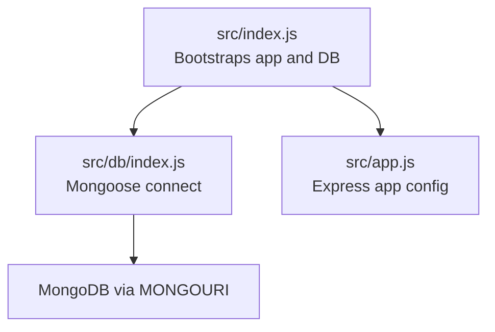
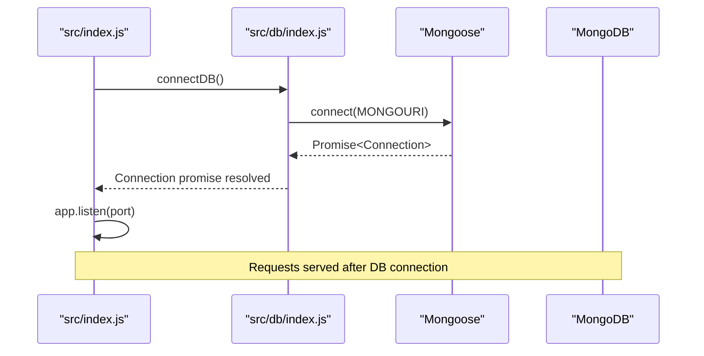
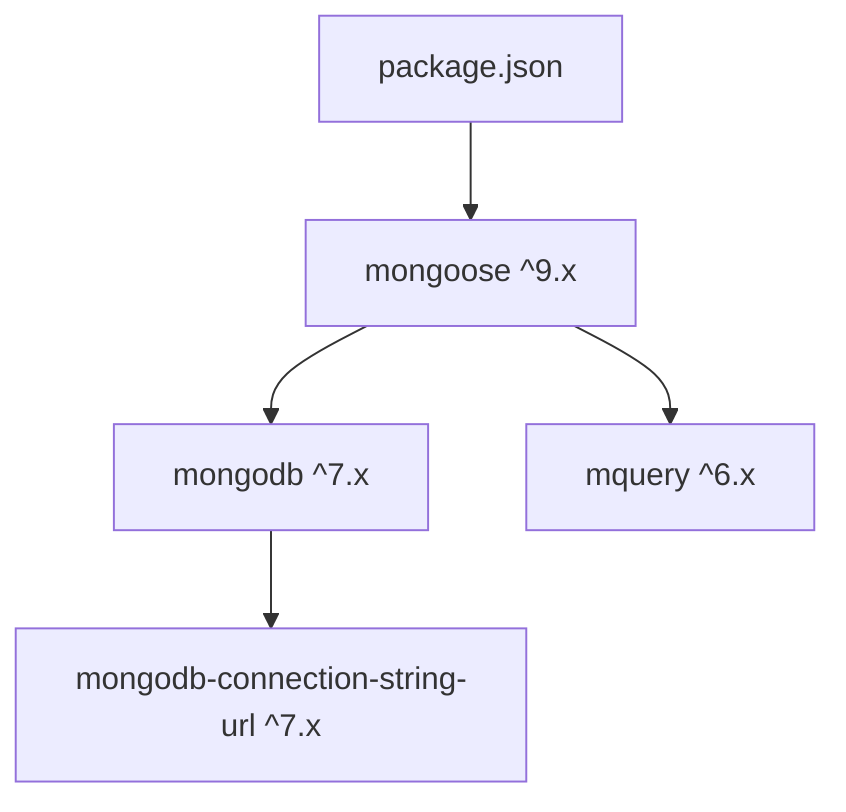

# Database Optimization

<cite>
**Referenced Files in This Document**
- [src/db/index.js](file://src/db/index.js)
- [src/index.js](file://src/index.js)
- [src/app.js](file://src/app.js)
- [package.json](file://package.json)
- [package-lock.json](file://package-lock.json)
</cite>

## Table of Contents
1. [Introduction](#introduction)
2. [Project Structure](#project-structure)
3. [Core Components](#core-components)
4. [Architecture Overview](#architecture-overview)
5. [Detailed Component Analysis](#detailed-component-analysis)
6. [Dependency Analysis](#dependency-analysis)
7. [Performance Considerations](#performance-considerations)
8. [Troubleshooting Guide](#troubleshooting-guide)
9. [Conclusion](#conclusion)

## Introduction
This document provides database optimization guidance tailored to the MongoDB/Mongoose implementation in the Task Management System. It focuses on connection pooling configuration, connection string optimization, database URI management, query optimization techniques, indexing strategies, replica configuration, write concerns, timeouts, monitoring, scaling patterns, and production tuning. Where applicable, the guidance references the current codebase and highlights areas for improvement to achieve robust, scalable, and performant database operations.

## Project Structure
The backend initializes the Express application and connects to MongoDB via Mongoose. The database connection is established early in the boot process, and the Express server starts after a successful connection.

**Diagram sources**
- [src/index.js](file://src/index.js#L1-L18)
- [src/db/index.js](file://src/db/index.js#L1-L14)
- [src/app.js](file://src/app.js#L1-L16)

**Section sources**
- [src/index.js](file://src/index.js#L1-L18)
- [src/db/index.js](file://src/db/index.js#L1-L14)
- [src/app.js](file://src/app.js#L1-L16)

## Core Components
- Database connection module: Establishes a single Mongoose connection using the environment variable for the MongoDB URI.
- Application bootstrap: Loads environment variables, connects to the database, and starts the Express server.
- Express configuration: Sets CORS, static assets, JSON payload limits, and cookie parsing middleware.

Key observations:
- The connection uses a single Mongoose connection initialized at startup.
- No explicit connection options are passed to Mongoose, leaving defaults in place.
- Environment variables are loaded via dotenv before connecting.

**Section sources**
- [src/db/index.js](file://src/db/index.js#L1-L14)
- [src/index.js](file://src/index.js#L1-L18)
- [src/app.js](file://src/app.js#L1-L16)

## Architecture Overview
The runtime flow ties the Express application lifecycle to the database connection lifecycle. The application listens for requests only after a successful database connection.

**Diagram sources**
- [src/index.js](file://src/index.js#L1-L18)
- [src/db/index.js](file://src/db/index.js#L1-L14)

## Detailed Component Analysis

### Connection Pooling and Connection String Optimization
Current state:
- Single Mongoose connection is created at startup.
- The connection string is read from the MONGOURI environment variable.
- No explicit connection options are provided to Mongoose.

Recommendations:
- Connection pooling
  - Configure maxPoolSize and minPoolSize to align with expected concurrency and workload.
  - Set maxIdleTimeMS and ttl to manage idle connections and prevent stale connections.
- Connection string optimization
  - Add recommended options to the URI: retryWrites, w=majority, and appropriate readConcern/readPreference for your deployment.
  - Use a replica set connection string for high availability and read scaling.
- URI management
  - Centralize URI composition and validation.
  - Support optional TLS parameters and authentication credentials in the URI.
  - Keep sensitive parts of the URI out of logs; mask or redact during logging.

Operational notes:
- The current code logs the connection string; sanitize logs to avoid exposing secrets.

**Section sources**
- [src/db/index.js](file://src/db/index.js#L1-L14)
- [src/index.js](file://src/index.js#L1-L18)

### Query Optimization Techniques
Efficient find operations:
- Use lean() for read-only queries to reduce overhead.
- Apply projections to limit returned fields.
- Paginate results with skip()/limit() or cursor-based pagination for large datasets.

Projection optimization:
- Define strict projections to minimize document size and network transfer.
- Avoid returning entire documents when only identifiers or a few fields are needed.

Aggregation pipeline performance:
- Filter early with $match and $or combinations carefully.
- Use $project to compute only necessary fields.
- Prefer $bucket/$bucketAuto for histograms and analytics.
- Use $lookup with $match inside the pipeline to reduce intermediate document sizes.

Indexes:
- Create targeted single-field indexes for frequent filters and sorts.
- Use compound indexes for multi-key filters and sort orders.
- Consider partial indexes for filtered datasets and wildcard indexes for evolving schemas.

Maintenance:
- Periodically rebuild stale indexes during low-traffic windows.
- Monitor index size and selectivity; remove unused indexes.

[No sources needed since this section provides general guidance]

### Indexing Strategies
Single-field indexes:
- For task collection: ensure indexes on frequently queried fields such as userId, status, createdAt, dueDate.
- For user collection: ensure indexes on email and any join keys.

Compound indexes:
- For task collection: combine userId + status, userId + dueDate, status + createdAt.
- For user collection: combine email + isActive for authentication flows.

Wildcard and partial indexes:
- Wildcard indexes for dynamic task metadata fields.
- Partial indexes for active tasks or recent activity.

Monitoring:
- Track index usage with database profiling and explainOutput.
- Review slow query logs for missing index patterns.

[No sources needed since this section provides general guidance]

### Replica Set and Read Replicas
Replica set configuration:
- Use a replica set connection string for automatic failover and read scaling.
- Configure readPreference to distribute reads across secondaries for read-heavy workloads.

Write concerns:
- Use w=majority for strong consistency in critical updates.
- Tune wtimeout for predictable write latency guarantees.

Timeouts:
- Configure socket settings (serverSelectionTimeoutMS, heartbeatFrequencyMS) for resilient topology discovery.
- Set maxTimeMS on long-running queries to prevent runaway operations.

[No sources needed since this section provides general guidance]

### Monitoring and Observability
Mongoose connection events:
- Listen for connection events (connected, disconnected, error) to trigger alerts and health checks.
- Log topology changes and reconnections for diagnostics.

Query execution time tracking:
- Wrap queries with timing instrumentation to capture p95/p99 latencies.
- Correlate slow queries with indexes and aggregation bottlenecks.

Slow query identification:
- Enable slow query log thresholds in MongoDB.
- Use database profiling modes (1 or 2) temporarily for analysis.

[No sources needed since this section provides general guidance]

### Scaling Patterns
Sharding considerations:
- Shard by a high-cardinality field (e.g., tenant or user identifier) to distribute load.
- Ensure shard key selection supports common query patterns.

Replica sets:
- Deploy 3-node replica sets for high availability.
- Use read replicas for reporting and background jobs.

Horizontal partitioning:
- Partition by time (time-series data) or domain boundaries.
- Use separate collections or databases for isolated workloads.

[No sources needed since this section provides general guidance]

### Production Tuning Guidelines
Connection pool sizing:
- Size pools based on concurrent request volume and worker threads.
- Adjust timeouts to match SLAs and network conditions.

Memory optimization:
- Use streaming cursors for large result sets.
- Prefer projections and pagination to reduce memory footprint.
- Monitor heap usage and tune garbage collection for Node.js.

[No sources needed since this section provides general guidance]

## Dependency Analysis
The backend relies on Mongoose and MongoDB driver versions compatible with Node.js 20+. The Mongoose version used depends on the MongoDB driver and mquery.

**Diagram sources**
- [package.json](file://package.json#L14-L23)
- [package-lock.json](file://package-lock.json#L1098-L1137)

**Section sources**
- [package.json](file://package.json#L14-L23)
- [package-lock.json](file://package-lock.json#L1098-L1137)

## Performance Considerations
- Align connection pool size with expected concurrency and response time targets.
- Use appropriate read preferences and write concerns for your workload profile.
- Optimize queries with projections, indexes, and aggregation stages.
- Monitor and iterate on slow queries and index usage.
- Plan for horizontal scaling via sharding and replica sets.

[No sources needed since this section provides general guidance]

## Troubleshooting Guide
Common issues and remedies:
- Connection failures
  - Verify MONGOURI correctness and network reachability.
  - Confirm replica set connectivity and credentials.
- Slow queries
  - Add missing indexes or adjust existing ones.
  - Refactor aggregations to filter earlier and reduce intermediate documents.
- Memory pressure
  - Switch to streaming cursors and lean queries.
  - Reduce payload sizes with projections and pagination.

Operational tips:
- Log sanitized connection strings and environment variables for diagnostics.
- Use Mongoose connection events to detect topology changes and reconnections.

**Section sources**
- [src/db/index.js](file://src/db/index.js#L1-L14)
- [src/index.js](file://src/index.js#L1-L18)

## Conclusion
The Task Management System currently establishes a single Mongoose connection at startup and serves requests afterward. To achieve robust, scalable, and performant database operations, incorporate explicit connection pooling and URI options, adopt query and aggregation best practices, implement targeted indexing strategies, configure replica sets and read replicas, and establish comprehensive monitoring. These steps will improve reliability, throughput, and maintainability for production deployments.