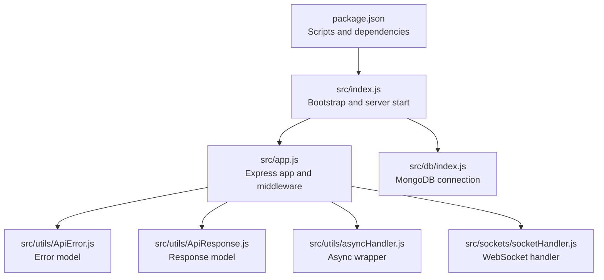
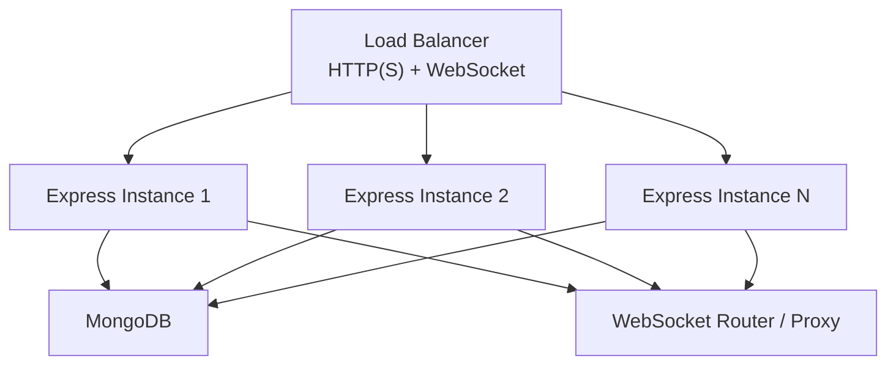
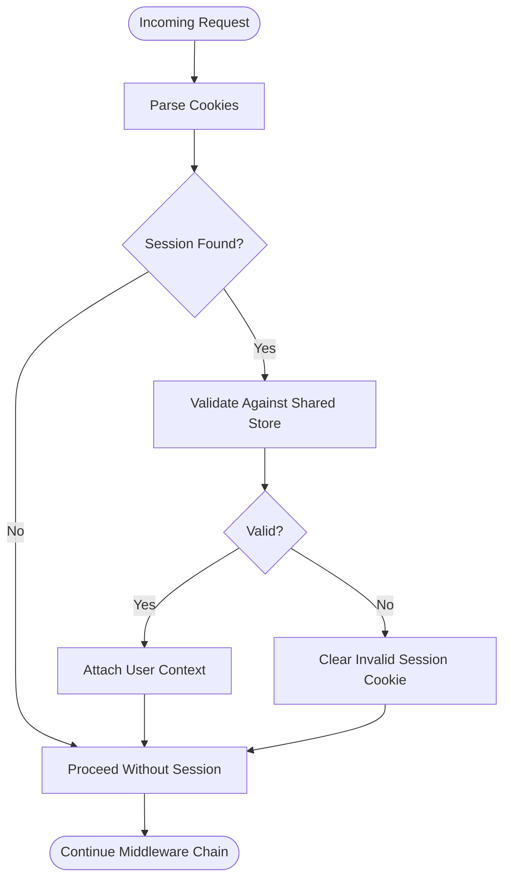
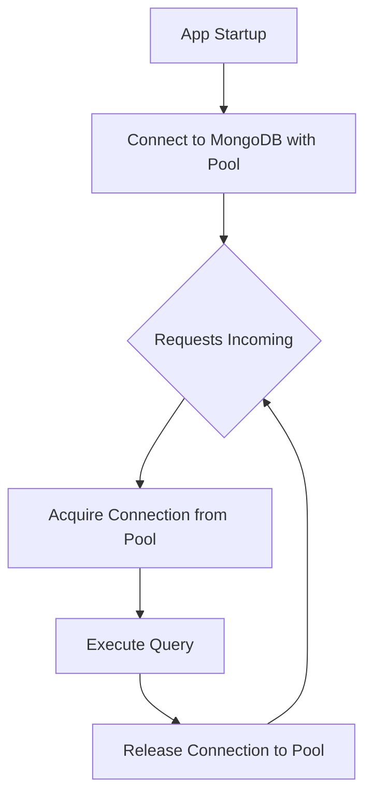
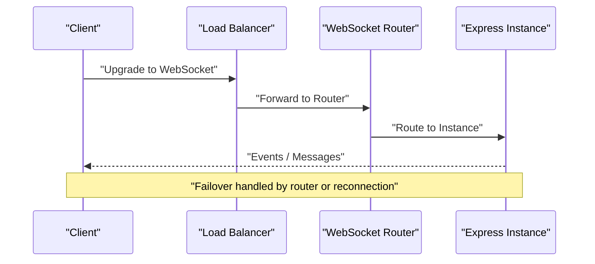
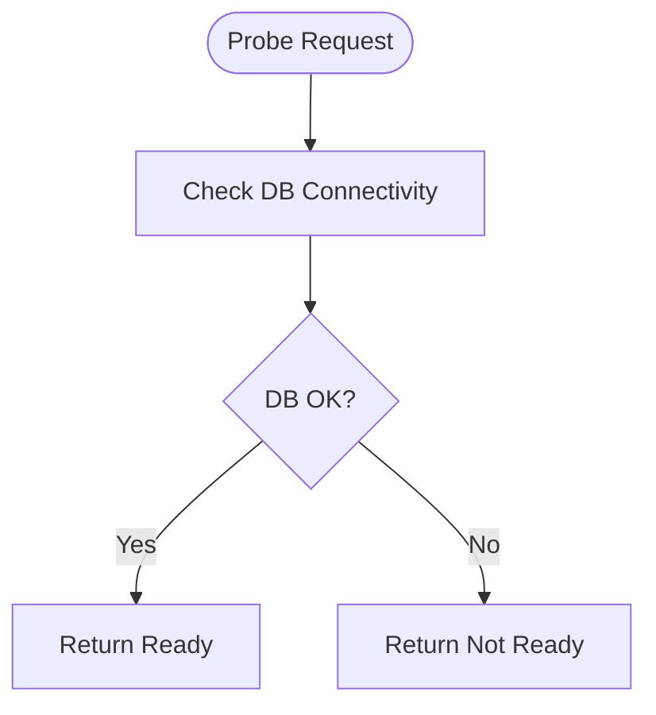
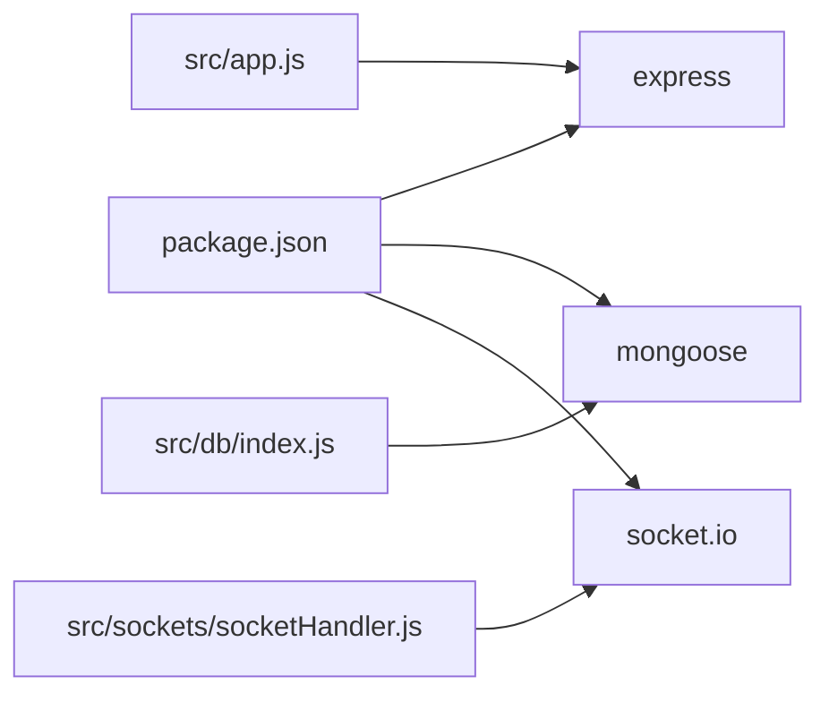
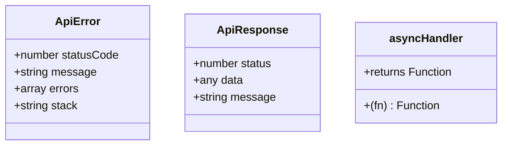

# Load Balancing & Scaling

<cite>
**Referenced Files in This Document**
- [src/index.js](file://src/index.js)
- [src/app.js](file://src/app.js)
- [src/db/index.js](file://src/db/index.js)
- [src/utils/ApiError.js](file://src/utils/ApiError.js)
- [src/utils/ApiResponse.js](file://src/utils/ApiResponse.js)
- [src/utils/asyncHandler.js](file://src/utils/asyncHandler.js)
- [src/sockets/socketHandler.js](file://src/sockets/socketHandler.js)
- [package.json](file://package.json)
</cite>

## Table of Contents
1. [Introduction](#introduction)
2. [Project Structure](#project-structure)
3. [Core Components](#core-components)
4. [Architecture Overview](#architecture-overview)
5. [Detailed Component Analysis](#detailed-component-analysis)
6. [Dependency Analysis](#dependency-analysis)
7. [Performance Considerations](#performance-considerations)
8. [Troubleshooting Guide](#troubleshooting-guide)
9. [Conclusion](#conclusion)
10. [Appendices](#appendices)

## Introduction
This document provides comprehensive guidance for deploying and scaling the Express.js backend behind a load balancer and in containerized environments. It focuses on horizontal scaling strategies, stateless architecture patterns, load balancer configuration, health checks, failover, container orchestration, auto-scaling, session management, infrastructure scaling, capacity planning, monitoring, deployment automation, and cost optimization. The guidance is grounded in the current backend structure and leverages widely adopted best practices for Express.js applications.

## Project Structure
The backend follows a minimal but effective Express.js layout:
- Application bootstrap and environment configuration
- Express server initialization with middleware
- Database connection via Mongoose
- Utility modules for error handling, response formatting, and async wrappers
- WebSocket handler module placeholder
- Package scripts for development and production startup

**Diagram sources**
- [src/index.js](file://src/index.js#L1-L18)
- [src/app.js](file://src/app.js#L1-L16)
- [src/db/index.js](file://src/db/index.js#L1-L14)
- [src/utils/ApiError.js](file://src/utils/ApiError.js#L1-L22)
- [src/utils/ApiResponse.js](file://src/utils/ApiResponse.js#L1-L17)
- [src/utils/asyncHandler.js](file://src/utils/asyncHandler.js#L1-L8)
- [src/sockets/socketHandler.js](file://src/sockets/socketHandler.js#L1-L7)
- [package.json](file://package.json#L1-L28)

**Section sources**
- [src/index.js](file://src/index.js#L1-L18)
- [src/app.js](file://src/app.js#L1-L16)
- [src/db/index.js](file://src/db/index.js#L1-L14)
- [src/utils/ApiError.js](file://src/utils/ApiError.js#L1-L22)
- [src/utils/ApiResponse.js](file://src/utils/ApiResponse.js#L1-L17)
- [src/utils/asyncHandler.js](file://src/utils/asyncHandler.js#L1-L8)
- [src/sockets/socketHandler.js](file://src/sockets/socketHandler.js#L1-L7)
- [package.json](file://package.json#L1-L28)

## Core Components
- Bootstrap and server lifecycle: Initializes environment, connects to MongoDB, and starts the Express server.
- Express app: Configures CORS, static assets, JSON parsing, and cookie parsing.
- Database connectivity: Establishes a persistent connection to MongoDB using environment variables.
- Utilities: Provide structured error and response handling, and a safe async wrapper for route handlers.
- WebSocket handler: Placeholder for real-time features; requires careful state and routing considerations in clustered deployments.

Key implications for scaling:
- Stateless design: Keep sessions and ephemeral state out of process memory.
- Shared state: Use external stores for sessions and pub/sub.
- Health and readiness: Implement explicit endpoints for load balancers and orchestrators.
- Scalability hooks: Prepare for horizontal scaling with environment-driven configuration and modular middleware.

**Section sources**
- [src/index.js](file://src/index.js#L1-L18)
- [src/app.js](file://src/app.js#L1-L16)
- [src/db/index.js](file://src/db/index.js#L1-L14)
- [src/utils/ApiError.js](file://src/utils/ApiError.js#L1-L22)
- [src/utils/ApiResponse.js](file://src/utils/ApiResponse.js#L1-L17)
- [src/utils/asyncHandler.js](file://src/utils/asyncHandler.js#L1-L8)
- [src/sockets/socketHandler.js](file://src/sockets/socketHandler.js#L1-L7)
- [package.json](file://package.json#L1-L28)

## Architecture Overview
The backend is a stateless HTTP service with optional WebSocket support. For horizontal scaling, place multiple instances behind a load balancer and ensure:
- Stateless request processing
- Shared session storage
- Centralized database access
- Optional centralized WebSocket routing or stateful WebSocket proxies

[No sources needed since this diagram shows conceptual workflow, not actual code structure]

## Detailed Component Analysis

### Stateless Design and Session Management
- Current state: Sessions and ephemeral state are not configured in the provided code.
- Recommended pattern:
  - Use signed cookies for small, non-sensitive state or externalize sessions to a shared store (e.g., Redis).
  - Ensure all instances share the same session store to maintain session affinity or avoid strict affinity.
  - For JWT-based auth, keep tokens client-managed and stateless on the server.

[No sources needed since this diagram shows conceptual workflow, not actual code structure]

### Database Connections and Scaling
- Current state: Single persistent connection established at startup.
- Recommended pattern:
  - Use a connection pool with limits appropriate for instance concurrency.
  - Configure retry/backoff and circuit breaker behavior for transient failures.
  - Scale horizontally by adding instances; each instance maintains its own pool sized for concurrent requests.

**Diagram sources**
- [src/db/index.js](file://src/db/index.js#L1-L14)

**Section sources**
- [src/db/index.js](file://src/db/index.js#L1-L14)

### WebSocket Handling in a Cluster
- Current state: WebSocket handler is a placeholder.
- Recommended pattern:
  - Use a dedicated WebSocket router/proxy (e.g., sticky sessions or stateful proxy) to manage connections.
  - Alternatively, centralize event routing via Redis or a message broker so any instance can serve a client’s events.
  - Ensure clients reconnect and rehydrate state after failover.

[No sources needed since this diagram shows conceptual workflow, not actual code structure]

### Health Checks and Readiness
- Implement a readiness probe that verifies database connectivity and key system dependencies.
- Implement a liveness probe that confirms the process is running.
- Expose a lightweight endpoint for load balancers to check service health.

[No sources needed since this diagram shows conceptual workflow, not actual code structure]

### Auto-Scaling Policies
- Target metrics: CPU utilization, memory usage, request latency, and error rates.
- Scale-out triggers: sustained high latency or queue depth; scale-in during sustained low load.
- Pod/container sizing: Right-size based on observed concurrency and memory footprint.

[No sources needed since this section provides general guidance]

### Blue-Green Deployment
- Maintain two identical environments (green and blue).
- Route traffic to the green environment; deploy updates to the blue environment.
- Switch traffic to blue after validation; decommission green.

[No sources needed since this section provides general guidance]

### Capacity Planning and Traffic Forecasting
- Baseline per-instance throughput and latency under load.
- Project growth and seasonality; factor in burst capacity.
- Plan headroom for spikes and background tasks.

[No sources needed since this section provides general guidance]

## Dependency Analysis
The backend relies on Express, Mongoose, and Socket.IO. These influence scaling characteristics:
- Express: Stateless HTTP server; scales horizontally with load balancing.
- Mongoose: Requires connection pooling and robust error handling.
- Socket.IO: Adds stateful concerns; requires careful routing or shared state.

**Diagram sources**
- [package.json](file://package.json#L14-L23)
- [src/app.js](file://src/app.js#L1-L16)
- [src/db/index.js](file://src/db/index.js#L1-L14)
- [src/sockets/socketHandler.js](file://src/sockets/socketHandler.js#L1-L7)

**Section sources**
- [package.json](file://package.json#L14-L23)
- [src/app.js](file://src/app.js#L1-L16)
- [src/db/index.js](file://src/db/index.js#L1-L14)
- [src/sockets/socketHandler.js](file://src/sockets/socketHandler.js#L1-L7)

## Performance Considerations
- Stateless design: Avoid storing user/session state in process memory.
- Connection pooling: Tune pool sizes per instance and monitor wait times.
- Middleware order: Place heavy middleware later; leverage caching and compression.
- Static assets: Serve via CDN or reverse proxy for reduced load.
- Timeouts: Set appropriate socket and request timeouts to prevent resource leaks.

[No sources needed since this section provides general guidance]

## Troubleshooting Guide
- Error handling utilities:
  - Structured error class for consistent error responses.
  - Structured response class for uniform API responses.
  - Async wrapper to safely handle asynchronous route handlers.
- Database connectivity:
  - On connection failure, the application exits; ensure restart/recovery via orchestrator.
- Logging and observability:
  - Add structured logs for request traces and error breadcrumbs.
  - Export metrics for latency, error rate, and throughput.

**Diagram sources**
- [src/utils/ApiError.js](file://src/utils/ApiError.js#L1-L22)
- [src/utils/ApiResponse.js](file://src/utils/ApiResponse.js#L1-L17)
- [src/utils/asyncHandler.js](file://src/utils/asyncHandler.js#L1-L8)

**Section sources**
- [src/utils/ApiError.js](file://src/utils/ApiError.js#L1-L22)
- [src/utils/ApiResponse.js](file://src/utils/ApiResponse.js#L1-L17)
- [src/utils/asyncHandler.js](file://src/utils/asyncHandler.js#L1-L8)
- [src/db/index.js](file://src/db/index.js#L1-L14)

## Conclusion
To scale the Express.js backend effectively:
- Keep the application stateless and externalize sessions and ephemeral state.
- Use a load balancer with health checks and sticky or centralized WebSocket routing.
- Employ connection pooling for MongoDB and implement robust error handling and retries.
- Adopt containerization and orchestration with auto-scaling based on metrics.
- Implement monitoring, alerting, and blue-green deployments for safe rollouts.
- Continuously refine capacity planning and cost optimization strategies.

[No sources needed since this section summarizes without analyzing specific files]

## Appendices

### Environment Variables and Ports
- Port binding: The server listens on a configurable port.
- Database URI: Provided via environment variable for secure configuration.
- CORS origin: Controlled via environment variable for flexible deployment domains.

**Section sources**
- [src/index.js](file://src/index.js#L9-L9)
- [src/db/index.js](file://src/db/index.js#L5-L5)
- [src/app.js](file://src/app.js#L8-L10)

### Container and Orchestration Checklist
- Container image: Multi-stage build, non-root user, minimal base image.
- Entrypoint: Use production script from package.json.
- Health checks: Implement readiness and liveness probes.
- Secrets management: Store sensitive values in environment variables or secret managers.
- Horizontal scaling: Deploy multiple replicas behind a load balancer.
- Auto-scaling: Configure CPU/memory-based HPA with target metrics.

[No sources needed since this section provides general guidance]

### Monitoring and Alerting
- Metrics: Latency, error rate, throughput, connection pool saturation, GC pauses.
- Logs: Structured logs with correlation IDs.
- Alerts: Threshold-based alerts for latency, error rate, and resource exhaustion.

[No sources needed since this section provides general guidance]

### Rollback Procedures
- Maintain immutable images and versioned releases.
- Use blue-green or canary strategies to minimize risk.
- Automate rollback to the previous healthy version.

[No sources needed since this section provides general guidance]

### Cost Optimization Strategies
- Right-size containers and nodes; use preeminent or spot instances where applicable.
- Optimize database connection pools and idle timeouts.
- Reduce cold starts by keeping containers warm with minimal activity.
- Use managed services for databases and messaging to reduce operational overhead.

[No sources needed since this section provides general guidance]