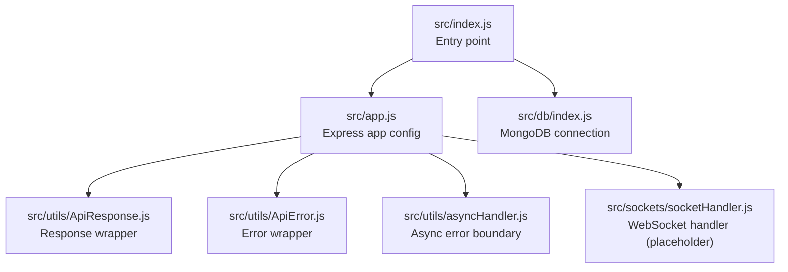
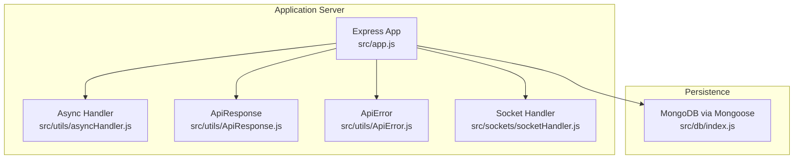
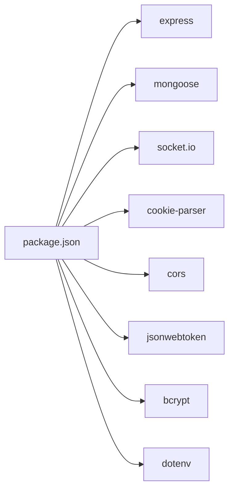

# Performance & Scaling

<cite>
**Referenced Files in This Document**
- [src/app.js](file://src/app.js)
- [src/db/index.js](file://src/db/index.js)
- [src/index.js](file://src/index.js)
- [src/utils/ApiResponse.js](file://src/utils/ApiResponse.js)
- [src/utils/ApiError.js](file://src/utils/ApiError.js)
- [src/utils/asyncHandler.js](file://src/utils/asyncHandler.js)
- [src/sockets/socketHandler.js](file://src/sockets/socketHandler.js)
- [package.json](file://package.json)
</cite>

## Table of Contents
1. [Introduction](#introduction)
2. [Project Structure](#project-structure)
3. [Core Components](#core-components)
4. [Architecture Overview](#architecture-overview)
5. [Detailed Component Analysis](#detailed-component-analysis)
6. [Dependency Analysis](#dependency-analysis)
7. [Performance Considerations](#performance-considerations)
8. [Troubleshooting Guide](#troubleshooting-guide)
9. [Conclusion](#conclusion)
10. [Appendices](#appendices)

## Introduction
This document provides comprehensive performance and scaling guidance for the Task Management System Backend. It focuses on database optimization, WebSocket performance, caching strategies, load balancing, monitoring, memory management, API optimization, and scalability planning. Where applicable, the guidance references actual code locations in the repository to anchor recommendations to the current implementation.

## Project Structure
The backend follows a modular Express-based structure with configuration, database connection, utilities, and placeholder WebSocket handler. The application initializes environment variables, connects to MongoDB via Mongoose, and starts an HTTP server.

**Diagram sources**
- [src/index.js](file://src/index.js#L1-L18)
- [src/app.js](file://src/app.js#L1-L16)
- [src/db/index.js](file://src/db/index.js#L1-L14)
- [src/utils/ApiResponse.js](file://src/utils/ApiResponse.js#L1-L17)
- [src/utils/ApiError.js](file://src/utils/ApiError.js#L1-L22)
- [src/utils/asyncHandler.js](file://src/utils/asyncHandler.js#L1-L8)
- [src/sockets/socketHandler.js](file://src/sockets/socketHandler.js#L1-L7)

**Section sources**
- [src/index.js](file://src/index.js#L1-L18)
- [src/app.js](file://src/app.js#L1-L16)
- [src/db/index.js](file://src/db/index.js#L1-L14)
- [src/utils/ApiResponse.js](file://src/utils/ApiResponse.js#L1-L17)
- [src/utils/ApiError.js](file://src/utils/ApiError.js#L1-L22)
- [src/utils/asyncHandler.js](file://src/utils/asyncHandler.js#L1-L8)
- [src/sockets/socketHandler.js](file://src/sockets/socketHandler.js#L1-L7)

## Core Components
- Express application configuration with CORS, static assets, JSON body parsing, and cookie parsing.
- MongoDB connection using Mongoose with environment-driven URI.
- Utility wrappers for consistent API responses and standardized error handling.
- Async error boundary middleware to prevent unhandled promise rejections.
- Placeholder WebSocket handler module indicating future real-time capabilities.

Key implementation anchors:
- Application initialization and middleware stack: [src/app.js](file://src/app.js#L1-L16)
- Database connection function: [src/db/index.js](file://src/db/index.js#L1-L14)
- Entry point wiring app and DB: [src/index.js](file://src/index.js#L1-L18)
- Response wrapper: [src/utils/ApiResponse.js](file://src/utils/ApiResponse.js#L1-L17)
- Error wrapper: [src/utils/ApiError.js](file://src/utils/ApiError.js#L1-L22)
- Async error boundary: [src/utils/asyncHandler.js](file://src/utils/asyncHandler.js#L1-L8)
- WebSocket handler: [src/sockets/socketHandler.js](file://src/sockets/socketHandler.js#L1-L7)

**Section sources**
- [src/app.js](file://src/app.js#L1-L16)
- [src/db/index.js](file://src/db/index.js#L1-L14)
- [src/index.js](file://src/index.js#L1-L18)
- [src/utils/ApiResponse.js](file://src/utils/ApiResponse.js#L1-L17)
- [src/utils/ApiError.js](file://src/utils/ApiError.js#L1-L22)
- [src/utils/asyncHandler.js](file://src/utils/asyncHandler.js#L1-L8)
- [src/sockets/socketHandler.js](file://src/sockets/socketHandler.js#L1-L7)

## Architecture Overview
The runtime architecture is a single-process Express server connecting to MongoDB and optionally supporting WebSocket connections. The current implementation does not include explicit caching, load balancers, or advanced monitoring.

**Diagram sources**
- [src/app.js](file://src/app.js#L1-L16)
- [src/utils/asyncHandler.js](file://src/utils/asyncHandler.js#L1-L8)
- [src/utils/ApiResponse.js](file://src/utils/ApiResponse.js#L1-L17)
- [src/utils/ApiError.js](file://src/utils/ApiError.js#L1-L22)
- [src/sockets/socketHandler.js](file://src/sockets/socketHandler.js#L1-L7)
- [src/db/index.js](file://src/db/index.js#L1-L14)

## Detailed Component Analysis

### Database Optimization Strategies
Current state:
- MongoDB connection established via Mongoose with environment-driven URI.
- No explicit connection pool configuration observed in the codebase.

Recommended optimizations anchored to production-grade practices:
- Connection pooling
  - Configure connection pool size and timeouts at the Mongoose level to match workload characteristics.
  - Ensure idle connection limits and eviction policies are tuned for concurrent request bursts.
- Query optimization
  - Add indexes on frequently queried fields and composite indexes for common filters/sorts.
  - Use projection to limit returned fields and avoid fetching unnecessary data.
  - Prefer aggregation pipelines for complex analytics to reduce round trips.
- Indexing strategies
  - Create single-field indexes for equality filters and compound indexes for range queries.
  - Use text indexes for free-text search fields.
  - Monitor slow queries and missing indexes using database profiling tools.
- Read/write scaling patterns
  - Separate read replicas for read-heavy workloads; route reads to replica set members.
  - Use write sharding for large collections; choose shard keys carefully to distribute load evenly.
  - Implement eventual consistency patterns for non-critical reads to improve throughput.

Implementation anchors:
- Database connection function: [src/db/index.js](file://src/db/index.js#L1-L14)

**Section sources**
- [src/db/index.js](file://src/db/index.js#L1-L14)

### WebSocket Performance Optimization
Current state:
- WebSocket handler exists as a placeholder; no real-time event handling is implemented.

Recommended optimizations anchored to best practices:
- Connection management
  - Use connection keep-alive and ping/pong mechanisms to detect dead peers.
  - Implement exponential backoff for reconnection attempts and circuit breaker logic under failure storms.
- Message batching
  - Batch frequent updates (e.g., task status changes) and emit at intervals to reduce network overhead.
  - Use compression for large payloads sent over the wire.
- Real-time communication efficiency
  - Employ event partitioning by user/project/task identifiers to scale horizontally.
  - Use presence tracking to avoid sending events to disconnected clients.
  - Implement rate limiting per-connection to prevent abuse.

Implementation anchors:
- WebSocket handler module: [src/sockets/socketHandler.js](file://src/sockets/socketHandler.js#L1-L7)

**Section sources**
- [src/sockets/socketHandler.js](file://src/sockets/socketHandler.js#L1-L7)

### Caching Strategies
Current state:
- No caching layer (Redis or in-memory) is present in the codebase.

Recommended strategies anchored to practical deployment patterns:
- Frequently accessed data caching
  - Cache user profiles, task metadata, and lookup tables in Redis with TTLs aligned to data volatility.
  - Use cache-aside pattern for read-heavy resources; invalidate on write.
- API response caching
  - Cache GET responses for stable endpoints with appropriate max-age and stale-if-error directives.
  - Tag cache entries by URL and query parameters; support cache invalidation on related writes.
- In-memory caching (single-instance)
  - For development or small deployments, use an in-memory store with bounded size and LRU eviction.

Implementation anchors:
- Express app configuration: [src/app.js](file://src/app.js#L1-L16)

**Section sources**
- [src/app.js](file://src/app.js#L1-L16)

### Load Balancing and Horizontal Scaling
Current state:
- Single-process Express server; no explicit load balancer or clustering.

Recommended approaches anchored to containerized and cloud-native patterns:
- Horizontal scaling
  - Run multiple instances behind a reverse proxy or platform load balancer.
  - Use sticky sessions only when stateful sessions are required; otherwise prefer stateless designs.
- Session affinity considerations
  - For stateless APIs, avoid sticky sessions; rely on external state stores (Redis) for session data.
  - If sticky sessions are unavoidable, configure health checks and graceful draining during deploys.
- Distributed architecture patterns
  - Separate concerns into microservices (authentication, task orchestration, notifications) for independent scaling.
  - Use message queues for asynchronous tasks to decouple request processing.

[No sources needed since this section provides general guidance]

### Performance Monitoring and Bottleneck Identification
Current state:
- Minimal instrumentation present; logging is basic.

Recommended techniques anchored to observability frameworks:
- Metrics collection
  - Expose Prometheus-compatible metrics for request rates, latency, error rates, and database query durations.
  - Track GC pauses and heap usage for Node.js-specific insights.
- Logging analysis
  - Centralize logs with structured JSON; tag requests with correlation IDs for end-to-end tracing.
  - Use sampling for high-volume endpoints to reduce noise while preserving anomalies.
- Bottleneck identification
  - Correlate metrics with database slow query logs and WebSocket connection counts.
  - Profile CPU and memory usage during peak loads to identify hotspots.

[No sources needed since this section provides general guidance]

### Memory Management and Resource Cleanup
Current state:
- No explicit resource cleanup hooks observed.

Recommended practices anchored to Node.js lifecycle:
- Memory management
  - Monitor heap size and GC metrics; tune Node.js flags for long-running servers.
  - Avoid closures capturing large objects; prefer streaming for large payloads.
- Garbage collection optimization
  - Minimize object churn in hot paths; reuse buffers and arrays where safe.
- Resource cleanup strategies
  - Close database connections gracefully on shutdown signals.
  - Clear timers and intervals; close WebSocket connections and cleanup listeners.

[No sources needed since this section provides general guidance]

### API Performance Optimization
Current state:
- JSON body parsing with a 16KB limit; no compression or pagination utilities present.

Recommended optimizations anchored to Express and transport-level improvements:
- Response compression
  - Enable gzip/deflate compression for text-based responses.
- Pagination strategies
  - Implement cursor-based pagination for large datasets to avoid deep offsets.
- Efficient data serialization
  - Use field projections to minimize payload sizes; avoid nested objects when not needed.
  - Consider binary formats (MessagePack) for internal microservice communication.

Implementation anchors:
- Body parsing configuration: [src/app.js](file://src/app.js#L1-L16)

**Section sources**
- [src/app.js](file://src/app.js#L1-L16)

### Scalability Planning and Capacity Planning
Current state:
- No scaling configuration or environment variables for concurrency.

Recommended planning anchored to workload modeling:
- Traffic growth
  - Model request volume, peak concurrency, and database read/write ratios.
  - Plan for 2–3x headroom for spikes; provision buffer for background jobs.
- Capacity planning
  - Estimate per-instance memory and CPU needs; size database tiers accordingly.
  - Account for WebSocket connections and their memory footprint.
- Infrastructure requirements
  - Use auto-scaling groups with target tracking policies; monitor saturation metrics.
  - Provision separate read replicas and caching clusters for predictable performance.

[No sources needed since this section provides general guidance]

### Benchmarking and Validation
Current state:
- No test scripts or benchmarking utilities present.

Recommended methodologies anchored to repeatable practices:
- Benchmarking methodologies
  - Use tools like Artillery or k6 to simulate realistic workloads; measure p50/p95 latency and error rates.
- Performance testing strategies
  - Test database query plans under load; validate index effectiveness.
  - Stress-test WebSocket handlers with concurrent connections and message rates.
- Optimization validation
  - Compare metrics before and after changes; confirm monotonic improvements in latency and throughput.

[No sources needed since this section provides general guidance]

## Dependency Analysis
External dependencies include Express, Mongoose, Socket.IO, and supporting libraries. These form the foundation for performance tuning and scaling.

**Diagram sources**
- [package.json](file://package.json#L1-L28)

**Section sources**
- [package.json](file://package.json#L1-L28)

## Performance Considerations
- Database
  - Tune Mongoose connection pool settings and enable connection timeouts.
  - Add indexes for common filters and sorts; monitor slow queries.
- Transport
  - Enable compression for HTTP responses; consider HTTP/2 for multiplexing.
- Real-time
  - Implement connection keep-alives and batching; compress large messages.
- Caching
  - Introduce Redis cache for hot data and API responses; adopt cache-aside strategy.
- Observability
  - Instrument endpoints, database queries, and WebSocket events; centralize metrics and logs.

[No sources needed since this section provides general guidance]

## Troubleshooting Guide
- Database connectivity
  - Verify environment variables for the database URI; check network ACLs and replica set configuration.
- Error handling
  - Use standardized error responses and async error boundaries to surface actionable logs.
- WebSocket stability
  - Confirm client-side reconnection logic and server-side ping/pong configuration.

Implementation anchors:
- Standardized error wrapper: [src/utils/ApiError.js](file://src/utils/ApiError.js#L1-L22)
- Async error boundary: [src/utils/asyncHandler.js](file://src/utils/asyncHandler.js#L1-L8)

**Section sources**
- [src/utils/ApiError.js](file://src/utils/ApiError.js#L1-L22)
- [src/utils/asyncHandler.js](file://src/utils/asyncHandler.js#L1-L8)

## Conclusion
The Task Management System Backend currently provides a minimal foundation requiring enhancements for robust performance and scalability. By implementing database pooling and indexing, optimizing WebSocket handling, introducing caching, adopting load balancing, and establishing comprehensive monitoring, the system can achieve predictable performance at scale. The referenced code locations serve as anchors for applying these improvements systematically.

## Appendices
- Environment variables to consider:
  - Database URI and credentials
  - Port and CORS origins
  - WebSocket heartbeat and timeout settings
  - Cache host/port/TTL and compression preferences

[No sources needed since this section provides general guidance]