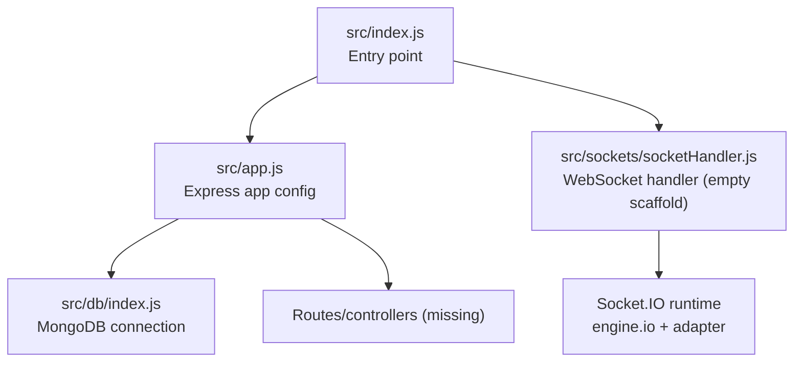
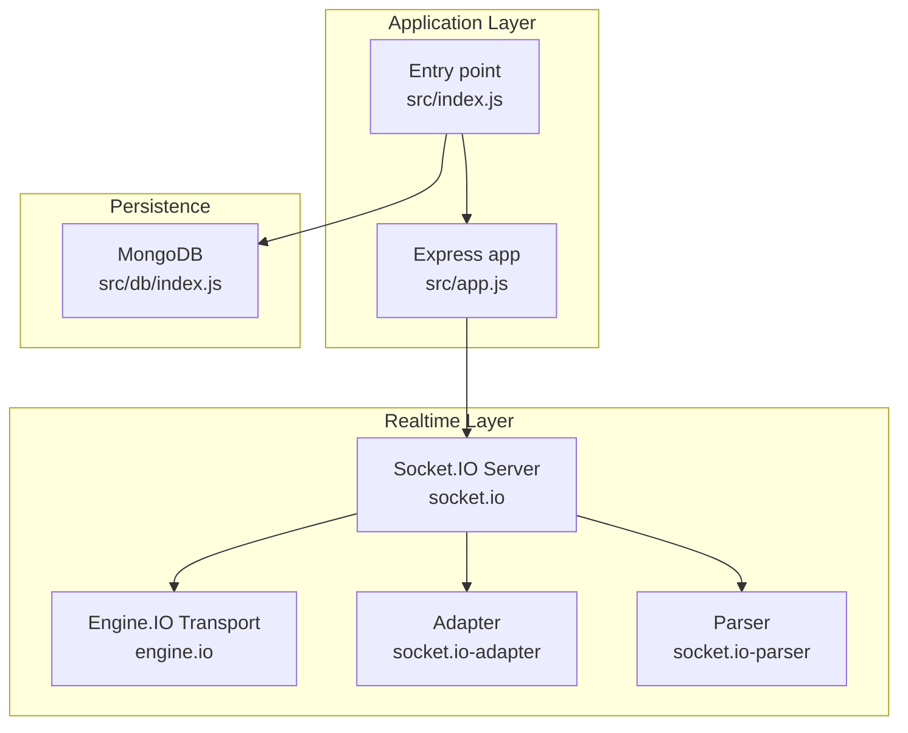
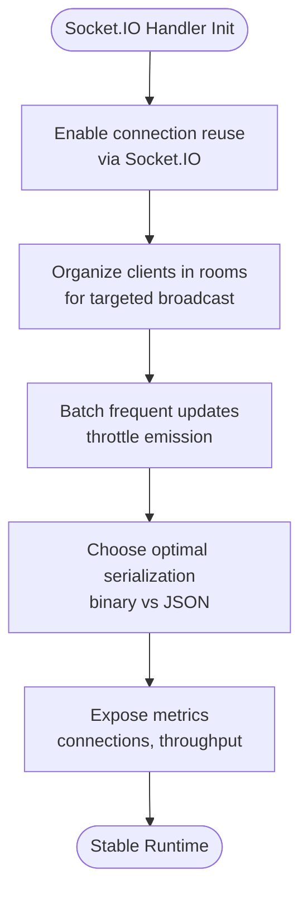
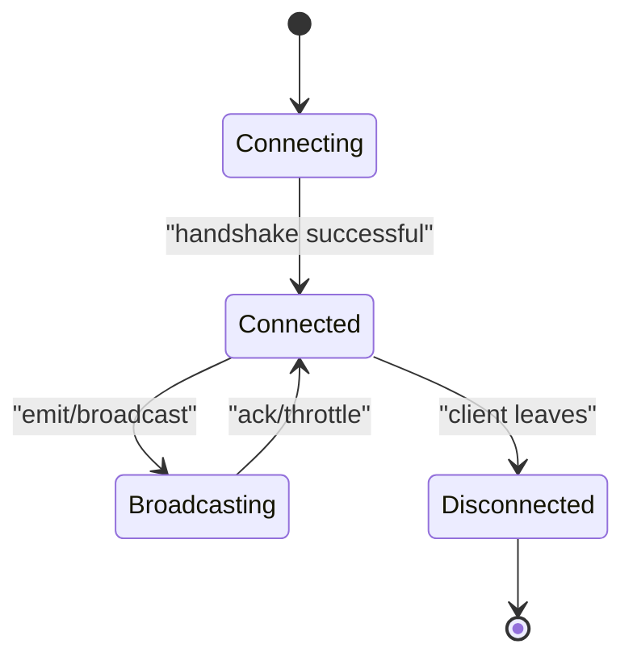
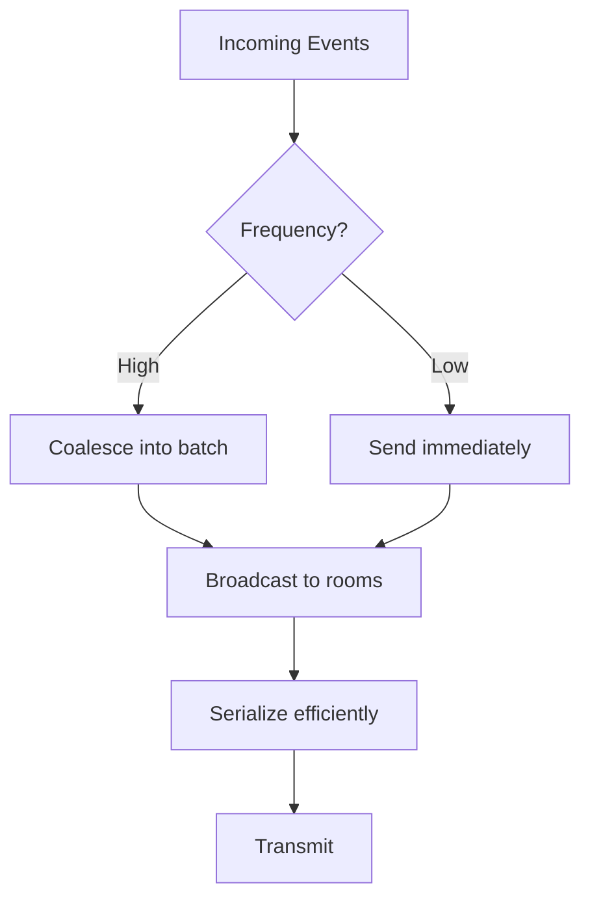
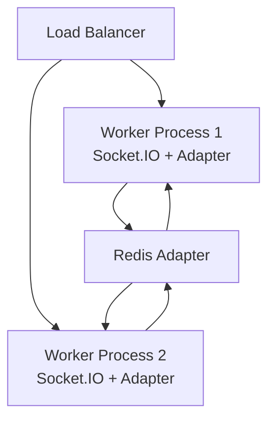
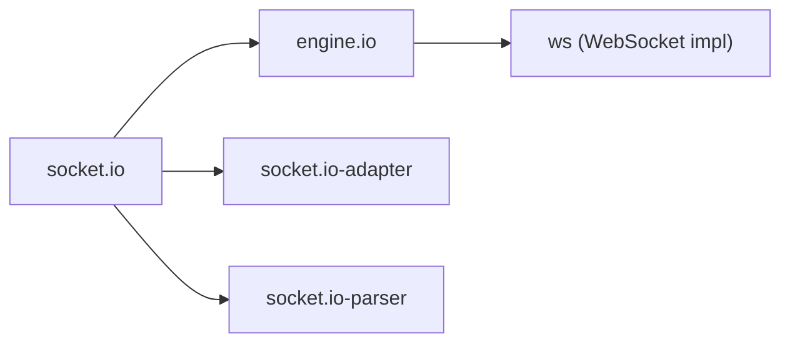

# WebSocket Performance

<cite>
**Referenced Files in This Document**
- [package.json](file://package.json)
- [src/index.js](file://src/index.js)
- [src/app.js](file://src/app.js)
- [src/db/index.js](file://src/db/index.js)
- [src/sockets/socketHandler.js](file://src/sockets/socketHandler.js)
- [src/utils/ApiError.js](file://src/utils/ApiError.js)
- [src/utils/ApiResponse.js](file://src/utils/ApiResponse.js)
- [src/utils/asyncHandler.js](file://src/utils/asyncHandler.js)
</cite>

## Table of Contents
1. [Introduction](#introduction)
2. [Project Structure](#project-structure)
3. [Core Components](#core-components)
4. [Architecture Overview](#architecture-overview)
5. [Detailed Component Analysis](#detailed-component-analysis)
6. [Dependency Analysis](#dependency-analysis)
7. [Performance Considerations](#performance-considerations)
8. [Troubleshooting Guide](#troubleshooting-guide)
9. [Conclusion](#conclusion)
10. [Appendices](#appendices)

## Introduction
This document provides comprehensive WebSocket performance guidance tailored to the Socket.IO implementation present in the backend. It focuses on connection lifecycle management, batching and broadcasting strategies, serialization optimization, cluster and sticky session configuration, memory management, monitoring, scalability, and debugging. The current repository includes the Socket.IO dependency and minimal scaffolding; the guidance below outlines how to configure and optimize performance in alignment with the installed engine and adapter stack.

## Project Structure
The backend is structured around Express, with modularized concerns for configuration, database connectivity, and WebSocket handler scaffolding. The WebSocket handler file exists but is currently empty, indicating an opportunity to implement connection management, event handling, and performance optimizations.

**Diagram sources**
- [src/index.js](file://src/index.js#L1-L18)
- [src/app.js](file://src/app.js#L1-L16)
- [src/db/index.js](file://src/db/index.js#L1-L14)
- [src/sockets/socketHandler.js](file://src/sockets/socketHandler.js#L1-L7)

**Section sources**
- [src/index.js](file://src/index.js#L1-L18)
- [src/app.js](file://src/app.js#L1-L16)
- [src/db/index.js](file://src/db/index.js#L1-L14)
- [src/sockets/socketHandler.js](file://src/sockets/socketHandler.js#L1-L7)

## Core Components
- Socket.IO runtime: Installed via the package manifest, enabling WebSocket transport with fallbacks and built-in parsing/serialization.
- Express application: Provides HTTP server hosting for Socket.IO.
- MongoDB connection: Database connectivity for persistence (not directly part of WebSocket performance, but relevant for application context).
- WebSocket handler scaffold: Empty module ready to receive connection and event logic.

Key performance-relevant packages:
- socket.io: Provides the Socket.IO server and client integration.
- engine.io: Low-level transport and framing used by Socket.IO.
- socket.io-adapter: Adapter layer for broadcasting and room management.
- socket.io-parser: Packet encoding/decoding and binary attachment handling.

**Section sources**
- [package.json](file://package.json#L14-L27)
- [src/sockets/socketHandler.js](file://src/sockets/socketHandler.js#L1-L7)

## Architecture Overview
Socket.IO operates on top of an HTTP server (Express) and uses Engine.IO for transport. The adapter layer manages cross-process broadcasting. The current codebase does not yet wire Socket.IO to the Express app; this is a critical step to enable performance monitoring and lifecycle controls.

**Diagram sources**
- [package.json](file://package.json#L14-L27)
- [src/index.js](file://src/index.js#L1-L18)
- [src/app.js](file://src/app.js#L1-L16)
- [src/db/index.js](file://src/db/index.js#L1-L14)

## Detailed Component Analysis

### Socket.IO Handler Implementation Guidance
The current handler file is a placeholder. To optimize WebSocket performance, implement:
- Connection pooling and reuse: Leverage Socket.IO’s internal pooling and avoid redundant connections.
- Lifecycle hooks: Manage join/leave events, handle disconnects gracefully, and clean up resources.
- Room-based broadcasting: Use rooms to minimize fan-out and reduce unnecessary sends.
- Binary vs text: Prefer binary frames for large payloads; use parser attachments judiciously.
- Acknowledgements and timeouts: Apply acks with timeouts to detect slow consumers and prevent backpressure.

[No sources needed since this diagram shows conceptual workflow, not actual code structure]

**Section sources**
- [src/sockets/socketHandler.js](file://src/sockets/socketHandler.js#L1-L7)

### Connection Lifecycle Management
- Connect: Initialize namespace and join rooms.
- Emit: Use rooms for targeted delivery; apply throttling for high-frequency events.
- Ack: For request-response semantics, set timeouts to avoid indefinite waits.
- Disconnect: Remove from rooms, clear timers, and release references.

[No sources needed since this diagram shows conceptual workflow, not actual code structure]

### Message Batching and Efficient Broadcasting
- Batch small events: Coalesce frequent emits into fewer packets.
- Use rooms: Reduce fan-out by grouping clients.
- Binary attachments: For large data, leverage parser attachments to avoid base64 overhead.
- Compression: Enable compression selectively for large JSON payloads.

[No sources needed since this diagram shows conceptual workflow, not actual code structure]

### Serialization Optimization
- Prefer binary frames for large payloads.
- Minimize payload sizes: Use compact field names and avoid nested structures when possible.
- Use typed arrays for numeric data.
- Avoid unnecessary deep cloning; reuse buffers where safe.

[No sources needed since this section provides general guidance]

### Cluster Mode, Sticky Sessions, and Load Balancing
- Sticky sessions: Route clients to the same process to preserve stateful rooms.
- Cross-process broadcast: Use a Redis adapter to propagate events across workers.
- Health checks: Expose metrics for connection counts and latency.

[No sources needed since this diagram shows conceptual workflow, not actual code structure]

### Memory Management and Resource Leak Prevention
- Remove listeners and timers on disconnect.
- Clear intervals and timeouts associated with sockets.
- Avoid retaining references to disconnected clients.
- Periodically prune idle rooms and stale state.

[No sources needed since this section provides general guidance]

### Performance Monitoring and Metrics
- Track connection count, message rates, and latency.
- Expose metrics endpoint for health checks.
- Monitor room sizes and broadcast costs.

[No sources needed since this section provides general guidance]

### Scalability Patterns and Graceful Degradation
- Horizontal scaling: Add workers behind a load balancer with sticky sessions.
- Degradation: Downgrade to polling if WebSocket fails; monitor reconnection attempts.
- Limits: Enforce per-socket and per-room limits to protect resources.

[No sources needed since this section provides general guidance]

### Mobile and Low-Bandwidth Optimizations
- Reduce payload sizes and frequency.
- Use compression for large messages.
- Adjust ping/pong intervals for battery life.
- Prefer binary frames for media or large datasets.

[No sources needed since this section provides general guidance]

### Debugging Techniques
- Enable debug logs for Socket.IO and Engine.IO.
- Inspect connection states and transport selection.
- Monitor disconnect reasons and reconnection loops.

[No sources needed since this section provides general guidance]

## Dependency Analysis
The Socket.IO ecosystem comprises several modules that influence performance. Understanding their roles helps in tuning behavior and mitigating bottlenecks.

**Diagram sources**
- [package.json](file://package.json#L14-L27)

**Section sources**
- [package.json](file://package.json#L14-L27)

## Performance Considerations
- Connection pooling and reuse: Socket.IO manages pooled connections internally; avoid creating multiple namespaces unnecessarily.
- Throttling and batching: Coalesce frequent updates to reduce overhead.
- Binary vs text: Use binary frames for large payloads; reserve JSON for structured data.
- Room-based broadcasting: Minimize fan-out by organizing clients into rooms.
- Serialization: Keep payloads compact; avoid excessive nesting.
- Cluster and adapter: Use a scalable adapter (e.g., Redis) for multi-process deployments.
- Memory hygiene: Clean up listeners, timers, and references on disconnect.
- Monitoring: Track connection counts, throughput, and latency; alert on anomalies.

[No sources needed since this section provides general guidance]

## Troubleshooting Guide
Common issues and remedies:
- Frequent disconnects: Investigate ping/pong intervals, timeouts, and network stability.
- Slow broadcasts: Verify room sizes and payload sizes; consider batching.
- Memory growth: Ensure cleanup routines run on disconnect; avoid closures capturing sockets.
- Reconnection storms: Tune reconnection backoff and detect client-side instability.

[No sources needed since this section provides general guidance]

## Conclusion
The repository includes the Socket.IO dependency and Express scaffolding. To achieve robust WebSocket performance, implement a full Socket.IO integration with lifecycle hooks, batching, room-based broadcasting, and a scalable adapter for clustering. Combine these with careful memory management, monitoring, and platform-specific optimizations for mobile and low-bandwidth environments.

[No sources needed since this section summarizes without analyzing specific files]

## Appendices

### Appendix A: Utility Modules Reference
These modules support request handling and error management, which complement WebSocket operations by ensuring consistent error reporting and response patterns.

**Section sources**
- [src/utils/ApiError.js](file://src/utils/ApiError.js#L1-L22)
- [src/utils/ApiResponse.js](file://src/utils/ApiResponse.js#L1-L17)
- [src/utils/asyncHandler.js](file://src/utils/asyncHandler.js#L1-L8)