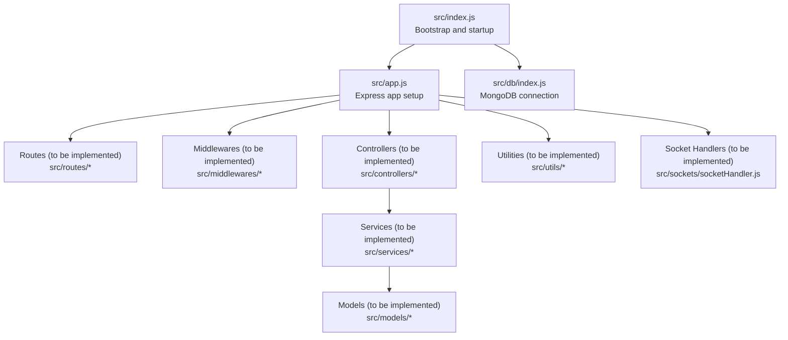
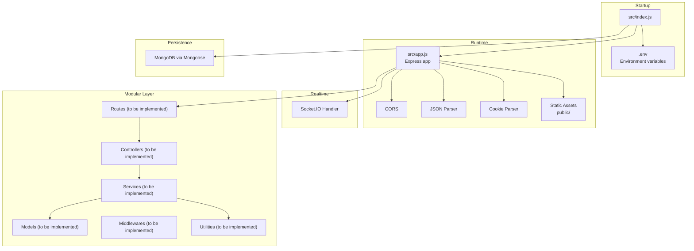
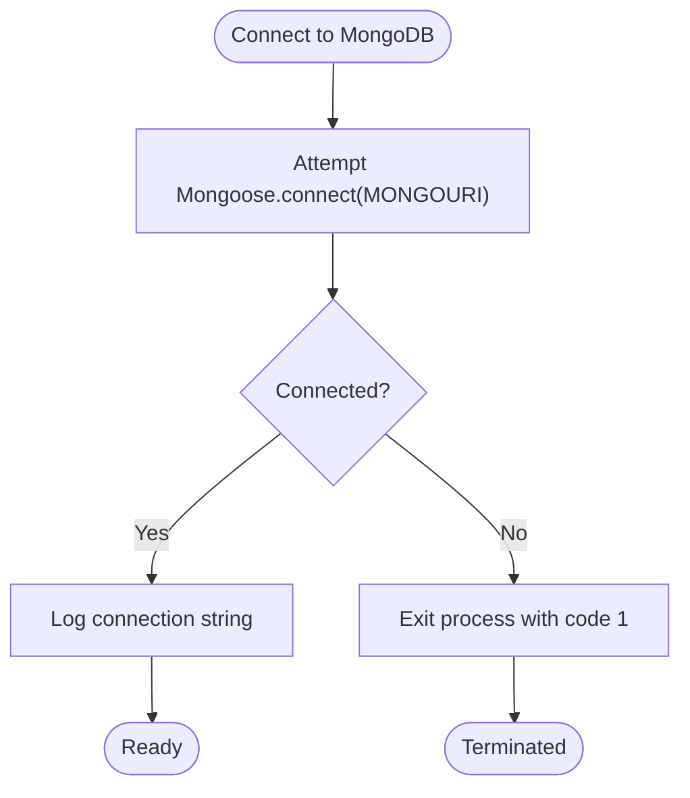
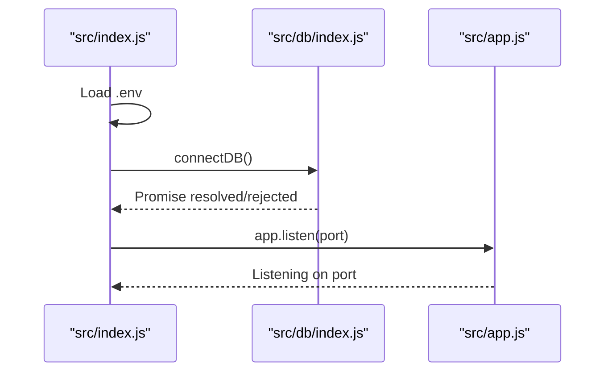
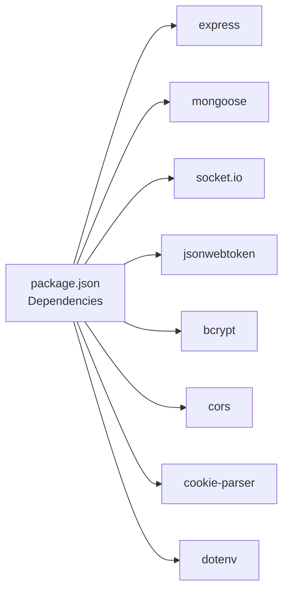

# Project Overview

<cite>
**Referenced Files in This Document**
- [package.json](file://package.json)
- [src/index.js](file://src/index.js)
- [src/app.js](file://src/app.js)
- [src/db/index.js](file://src/db/index.js)
- [src/sockets/socketHandler.js](file://src/sockets/socketHandler.js)
- [src/utils/asyncHandler.js](file://src/utils/asyncHandler.js)
</cite>

## Table of Contents
1. [Introduction](#introduction)
2. [Project Structure](#project-structure)
3. [Core Components](#core-components)
4. [Architecture Overview](#architecture-overview)
5. [Detailed Component Analysis](#detailed-component-analysis)
6. [Dependency Analysis](#dependency-analysis)
7. [Performance Considerations](#performance-considerations)
8. [Troubleshooting Guide](#troubleshooting-guide)
9. [Conclusion](#conclusion)

## Introduction
This document provides a comprehensive overview of the Task Management System Backend project. It is a Node.js-based RESTful API service built with Express.js, designed to support task management functionality. The backend integrates MongoDB/Mongoose for persistent data storage, Socket.IO for real-time communication, JWT-based authentication, and Bcrypt for secure password hashing. The system follows a modular architecture with clear separation of concerns aligned with MVC-like patterns, enabling maintainability and scalability.

## Project Structure
The backend is organized into a modular structure that separates concerns across configuration, routing, controllers, services, models, middleware, utilities, validators, and sockets. The application bootstraps via a central entry point that loads environment configuration, connects to the database, and starts the Express server. Static assets are served from a public directory, and CORS is enabled for cross-origin requests.

**Diagram sources**
- [src/index.js](file://src/index.js#L1-L18)
- [src/app.js](file://src/app.js#L1-L16)
- [src/db/index.js](file://src/db/index.js#L1-L14)
- [src/sockets/socketHandler.js](file://src/sockets/socketHandler.js#L1-L7)

**Section sources**
- [src/index.js](file://src/index.js#L1-L18)
- [src/app.js](file://src/app.js#L1-L16)
- [src/db/index.js](file://src/db/index.js#L1-L14)

## Core Components
- Express application initialization and middleware configuration
- MongoDB/Mongoose connection management
- Environment-driven configuration and static asset serving
- Utility helpers for asynchronous error handling
- Socket.IO handler placeholder for real-time features

Key implementation references:
- Application bootstrap and server startup
- Express app configuration including CORS, JSON parsing, cookies, and static assets
- MongoDB connection with environment URI
- Socket.IO handler placeholder
- Async error handling utility

**Section sources**
- [src/index.js](file://src/index.js#L1-L18)
- [src/app.js](file://src/app.js#L1-L16)
- [src/db/index.js](file://src/db/index.js#L1-L14)
- [src/sockets/socketHandler.js](file://src/sockets/socketHandler.js#L1-L7)
- [src/utils/asyncHandler.js](file://src/utils/asyncHandler.js#L1-L7)

## Architecture Overview
The backend follows a layered architecture:
- Entry point initializes environment variables, connects to the database, and starts the Express server.
- Express app configures middleware and prepares the runtime environment.
- Routes define the API surface; controllers handle request logic; services encapsulate business logic; models manage data access; middlewares enforce cross-cutting concerns.
- Real-time features are integrated via Socket.IO handlers.
- Utilities provide reusable helpers for consistent error handling and async patterns.

**Diagram sources**
- [src/index.js](file://src/index.js#L1-L18)
- [src/app.js](file://src/app.js#L1-L16)
- [src/db/index.js](file://src/db/index.js#L1-L14)
- [src/sockets/socketHandler.js](file://src/sockets/socketHandler.js#L1-L7)

## Detailed Component Analysis

### Express Application Setup
The Express application is configured with:
- CORS enabled for origins defined by environment variables
- Static asset serving from the public directory
- JSON payload parsing with a 16KB limit
- Cookie parsing for session and token handling

These settings establish a foundation for REST API consumption and static resource delivery.

**Section sources**
- [src/app.js](file://src/app.js#L1-L16)

### Database Connectivity
The application connects to MongoDB using Mongoose with a URI sourced from environment variables. On successful connection, the connection string is logged; on failure, the process exits with a non-zero status.

**Diagram sources**
- [src/db/index.js](file://src/db/index.js#L1-L14)

**Section sources**
- [src/db/index.js](file://src/db/index.js#L1-L14)

### Bootstrapping and Startup
The application loads environment variables, establishes a database connection, and starts the Express server. On connection success, the server listens on the configured port; on failure, an error is logged.

**Diagram sources**
- [src/index.js](file://src/index.js#L1-L18)
- [src/db/index.js](file://src/db/index.js#L1-L14)
- [src/app.js](file://src/app.js#L1-L16)

**Section sources**
- [src/index.js](file://src/index.js#L1-L18)

### Socket.IO Handler
A placeholder for Socket.IO logic exists under the sockets directory. This component will integrate real-time features such as live updates for tasks and notifications.

**Section sources**
- [src/sockets/socketHandler.js](file://src/sockets/socketHandler.js#L1-L7)

### Asynchronous Error Handling Utility
A utility wraps request handlers to convert synchronous logic into promises, ensuring consistent error propagation to Express error-handlers.

**Section sources**
- [src/utils/asyncHandler.js](file://src/utils/asyncHandler.js#L1-L7)

## Dependency Analysis
The backend relies on the following core technologies:
- Express 5.2.1 for HTTP server and routing
- MongoDB/Mongoose for data persistence
- Socket.IO 4.8.3 for real-time bidirectional communication
- JWT for authentication and authorization
- Bcrypt for secure password hashing
- Additional middleware for CORS, cookie parsing, and environment configuration

**Diagram sources**
- [package.json](file://package.json#L14-L26)

**Section sources**
- [package.json](file://package.json#L14-L26)

## Performance Considerations
- Keep JSON payload sizes reasonable; the current limit is set to 16KB.
- Ensure database queries are efficient and indexed appropriately.
- Use environment-specific configurations for production deployments.
- Monitor Socket.IO connections and implement graceful disconnect handling.
- Apply rate limiting and input validation to protect endpoints.

## Troubleshooting Guide
Common issues and resolutions:
- Database connection failures: Verify the MONGOURI environment variable and network access to the MongoDB instance.
- Port conflicts: Change the PORT environment variable to an available port.
- CORS errors: Confirm the CORS origin setting aligns with client-side origin.
- Socket.IO not connecting: Ensure the Socket.IO handler is wired into the server and clients use compatible transports.

Operational references:
- Database connection and error handling
- Application startup and port binding
- Middleware configuration for JSON and cookies

**Section sources**
- [src/db/index.js](file://src/db/index.js#L1-L14)
- [src/index.js](file://src/index.js#L1-L18)
- [src/app.js](file://src/app.js#L1-L16)

## Conclusion
The Task Management System Backend is structured to support scalable task management through a clean, modular architecture. It leverages Express for HTTP services, Mongoose for data persistence, Socket.IO for real-time features, and JWT/Bcrypt for authentication and security. The modular layout enables clear separation of concerns, facilitating development, testing, and maintenance. As the system evolves, implementing routes, controllers, services, models, and middleware will complete the MVC-style structure and deliver robust task management capabilities.