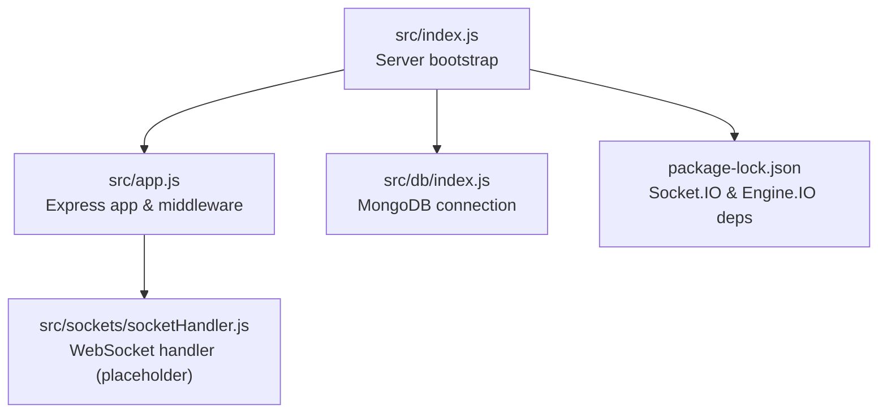
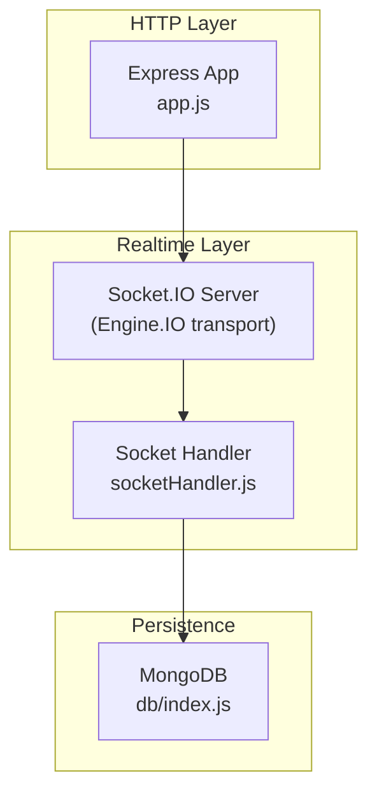
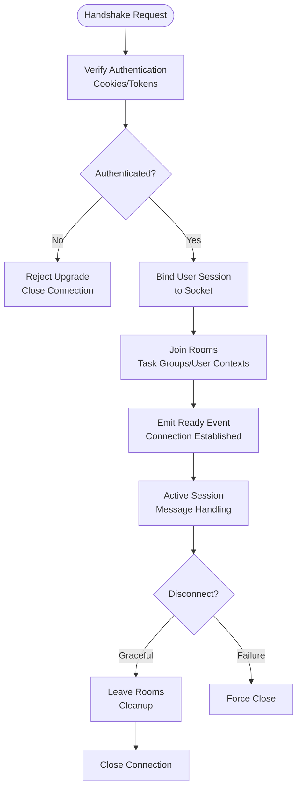
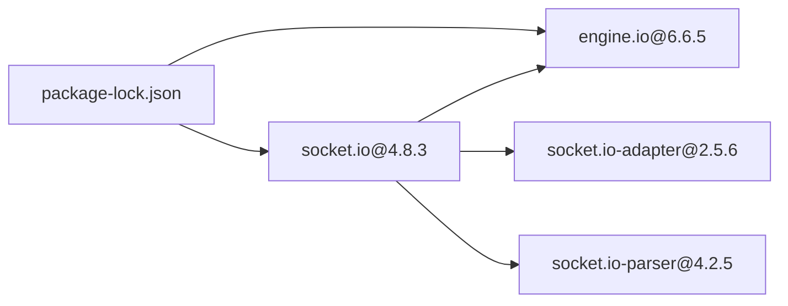

# Client Connection Management

<cite>
**Referenced Files in This Document**
- [index.js](file://src/index.js)
- [app.js](file://src/app.js)
- [socketHandler.js](file://src/sockets/socketHandler.js)
- [db/index.js](file://src/db/index.js)
- [package-lock.json](file://package-lock.json)
</cite>

## Table of Contents
1. [Introduction](#introduction)
2. [Project Structure](#project-structure)
3. [Core Components](#core-components)
4. [Architecture Overview](#architecture-overview)
5. [Detailed Component Analysis](#detailed-component-analysis)
6. [Dependency Analysis](#dependency-analysis)
7. [Performance Considerations](#performance-considerations)
8. [Troubleshooting Guide](#troubleshooting-guide)
9. [Conclusion](#conclusion)

## Introduction
This document explains client connection management in the WebSocket implementation for the Task Management System backend. It focuses on connection establishment, authentication verification during the WebSocket handshake, session management for authenticated users, lifecycle management (creation, maintenance, graceful disconnection), room-based communication patterns, connection state tracking, presence indicators, health monitoring, scaling and load balancing strategies, failure handling, and troubleshooting guidance. The current repository snapshot includes foundational infrastructure for Express, MongoDB connectivity, and Socket.IO dependencies, but the WebSocket handler implementation is currently empty and requires extension to support the described features.

## Project Structure
The backend follows a modular structure with clear separation of concerns:
- Application bootstrap and server initialization
- Express configuration and middleware setup
- Database connection module
- WebSocket handler module placeholder
- Utility modules for error handling and response formatting

**Diagram sources**
- [index.js](file://src/index.js#L1-L18)
- [app.js](file://src/app.js#L1-L16)
- [db/index.js](file://src/db/index.js#L1-L14)
- [socketHandler.js](file://src/sockets/socketHandler.js#L1-L6)
- [package-lock.json](file://package-lock.json#L1562-L1579)

**Section sources**
- [index.js](file://src/index.js#L1-L18)
- [app.js](file://src/app.js#L1-L16)
- [db/index.js](file://src/db/index.js#L1-L14)
- [socketHandler.js](file://src/sockets/socketHandler.js#L1-L6)
- [package-lock.json](file://package-lock.json#L1562-L1579)

## Core Components
- Server bootstrap: Initializes environment variables, connects to the database, and starts the Express server.
- Express app: Configures CORS, static assets, JSON parsing, and cookie parsing.
- Database connector: Establishes a MongoDB connection using Mongoose.
- WebSocket handler: Placeholder for Socket.IO integration and connection management logic.
- Dependencies: Socket.IO and Engine.IO are included via package-lock.json, indicating the technology stack for real-time communication.

Key implementation references:
- Server bootstrap and listener: [index.js](file://src/index.js#L9-L17)
- Express app configuration: [app.js](file://src/app.js#L8-L13)
- MongoDB connection: [db/index.js](file://src/db/index.js#L3-L10)
- Socket.IO and Engine.IO dependencies: [package-lock.json](file://package-lock.json#L1562-L1579)

**Section sources**
- [index.js](file://src/index.js#L9-L17)
- [app.js](file://src/app.js#L8-L13)
- [db/index.js](file://src/db/index.js#L3-L10)
- [package-lock.json](file://package-lock.json#L1562-L1579)

## Architecture Overview
The WebSocket architecture integrates Socket.IO over Engine.IO. The current repository includes Socket.IO and Engine.IO as dependencies, but the WebSocket handler module is empty. To implement client connection management, the handler must be extended to:
- Initialize Socket.IO with Engine.IO transport
- Verify authentication during the handshake
- Bind user sessions to sockets
- Manage rooms and namespaces
- Track connection state and presence
- Monitor health and handle graceful disconnects

**Diagram sources**
- [app.js](file://src/app.js#L1-L16)
- [socketHandler.js](file://src/sockets/socketHandler.js#L1-L6)
- [db/index.js](file://src/db/index.js#L1-L14)
- [package-lock.json](file://package-lock.json#L1562-L1579)

## Detailed Component Analysis

### WebSocket Handler Implementation Plan
The WebSocket handler module is currently empty and needs to be expanded to support:
- Initialization of Socket.IO server with Engine.IO transport
- Authentication verification during handshake using cookies or tokens
- Session binding to sockets after successful authentication
- Room-based communication for tasks, user contexts, and notifications
- Connection lifecycle management (join, leave, disconnect)
- Presence tracking and health monitoring

[No sources needed since this diagram shows conceptual workflow, not actual code structure]

### Connection Establishment Procedures
- Initialize Socket.IO server on top of the Express app.
- Configure Engine.IO options for transports, upgrades, and timeouts.
- Set up handshake middleware to extract authentication credentials.
- Validate credentials and create a session-bound socket.

References:
- Express app initialization: [app.js](file://src/app.js#L1-L16)
- Socket.IO dependency: [package-lock.json](file://package-lock.json#L1562-L1579)

**Section sources**
- [app.js](file://src/app.js#L1-L16)
- [package-lock.json](file://package-lock.json#L1562-L1579)

### Authentication Verification During WebSocket Handshake
- Extract authentication token from cookies or Authorization header.
- Validate token against stored sessions or JWT signature.
- On success, attach user identity to the socket namespace.
- On failure, reject the upgrade request.

References:
- Cookie parsing enabled: [app.js](file://src/app.js#L12-L13)
- Socket.IO and Engine.IO dependencies: [package-lock.json](file://package-lock.json#L1562-L1579)

**Section sources**
- [app.js](file://src/app.js#L12-L13)
- [package-lock.json](file://package-lock.json#L1562-L1579)

### Session Management for Authenticated Users
- Bind authenticated user to the socket instance.
- Store socket ID in user session for targeted messaging.
- Clean up session bindings on disconnect or timeout.

References:
- Empty handler placeholder: [socketHandler.js](file://src/sockets/socketHandler.js#L1-L6)

**Section sources**
- [socketHandler.js](file://src/sockets/socketHandler.js#L1-L6)

### Connection Lifecycle Management
- Creation: On successful handshake, initialize socket and join default rooms.
- Maintenance: Heartbeat/ping-pong, reconnection handling, and room updates.
- Graceful Disconnection: Leave rooms, clear bindings, and emit presence updates.

References:
- Express server startup: [index.js](file://src/index.js#L11-L14)
- Socket.IO dependency: [package-lock.json](file://package-lock.json#L1562-L1579)

**Section sources**
- [index.js](file://src/index.js#L11-L14)
- [package-lock.json](file://package-lock.json#L1562-L1579)

### Room-Based Communication Patterns
- Task Groups: Join/leave per task assignment.
- User Contexts: Personal channels for direct messages.
- Notification Channels: Broadcast updates to subscribed users.

References:
- Socket.IO adapter and rooms: [package-lock.json](file://package-lock.json#L1580-L1589)

**Section sources**
- [package-lock.json](file://package-lock.json#L1580-L1589)

### Connection State Tracking, Presence Indicators, and Health Monitoring
- Track connected sockets per user and presence status.
- Emit presence events on join/leave/disconnect.
- Monitor ping intervals and handle unhealthy connections.

References:
- Socket.IO parser and adapter: [package-lock.json](file://package-lock.json#L1590-L1602)

**Section sources**
- [package-lock.json](file://package-lock.json#L1590-L1602)

### Practical Examples
- Token Validation During Upgrade: Extract token from cookies or headers, validate against stored sessions, and bind user to socket.
- User Session Binding: Persist socket ID in user session and update presence indicators.
- Room Organization: Join task-specific rooms and broadcast updates to subscribed members.

References:
- Cookie parsing: [app.js](file://src/app.js#L12-L13)
- Socket.IO and Engine.IO: [package-lock.json](file://package-lock.json#L1562-L1579)

**Section sources**
- [app.js](file://src/app.js#L12-L13)
- [package-lock.json](file://package-lock.json#L1562-L1579)

## Dependency Analysis
Socket.IO and Engine.IO are declared as dependencies, enabling WebSocket-based real-time communication. The handler module must integrate with these libraries to implement the connection management features.

**Diagram sources**
- [package-lock.json](file://package-lock.json#L1562-L1579)
- [package-lock.json](file://package-lock.json#L1580-L1589)
- [package-lock.json](file://package-lock.json#L1590-L1602)

**Section sources**
- [package-lock.json](file://package-lock.json#L1562-L1579)
- [package-lock.json](file://package-lock.json#L1580-L1589)
- [package-lock.json](file://package-lock.json#L1590-L1602)

## Performance Considerations
- Use efficient room management to minimize broadcast overhead.
- Implement heartbeat monitoring to detect and remove stale connections.
- Scale horizontally using multiple server instances with shared state or pub/sub.
- Tune Engine.IO polling and WebSocket upgrade thresholds for optimal throughput.

[No sources needed since this section provides general guidance]

## Troubleshooting Guide
- Connection Refused: Verify server is listening and firewall allows WebSocket traffic.
- Authentication Failures: Confirm token extraction and validation logic during handshake.
- Room Join Errors: Ensure room names are consistent and users have appropriate permissions.
- Memory Leaks: Regularly clean up socket listeners and room memberships on disconnect.
- Reconnection Strategies: Implement exponential backoff and retry limits on the client side.

[No sources needed since this section provides general guidance]

## Conclusion
The Task Management System backend includes foundational infrastructure for Express, MongoDB, and Socket.IO/Engine.IO dependencies. To enable robust client connection management, the WebSocket handler module must be implemented to support authentication during handshake, session binding, room-based communication, lifecycle management, presence tracking, and health monitoring. Scaling and troubleshooting strategies should be considered alongside the implementation to ensure reliable real-time communication.