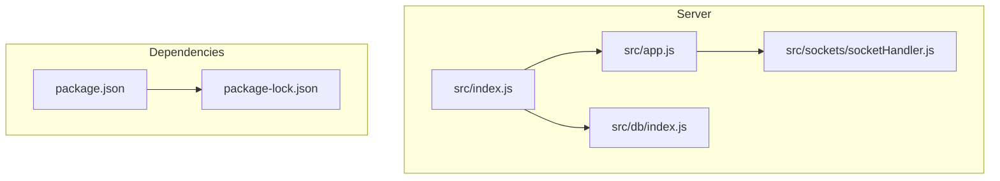
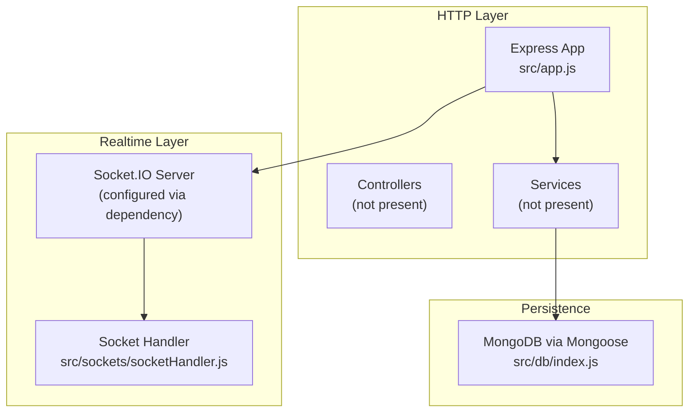
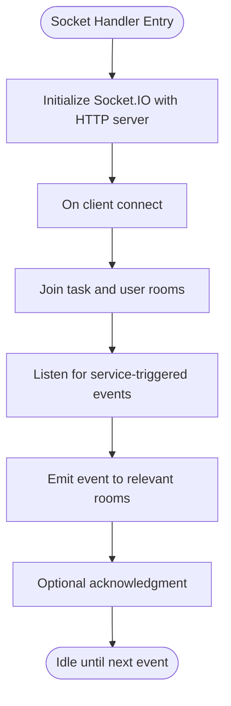
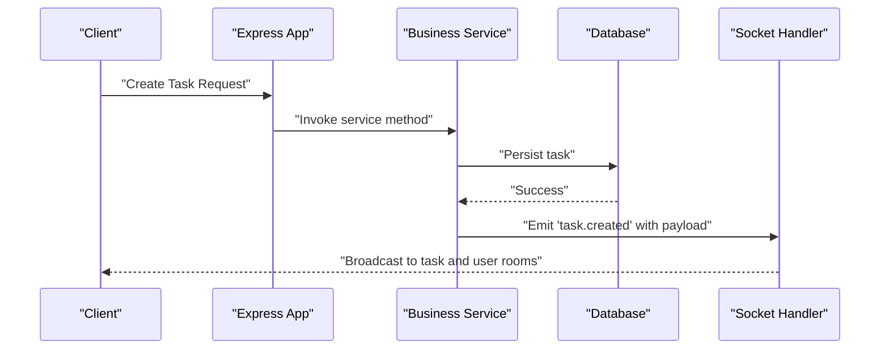
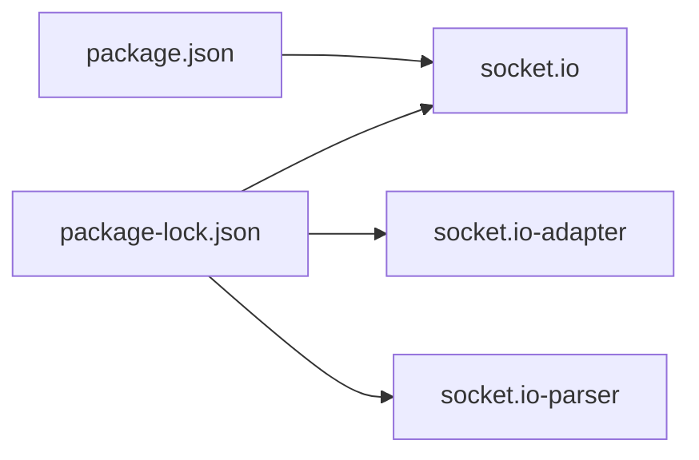

# Event Broadcasting System

<cite>
**Referenced Files in This Document**
- [src/index.js](file://src/index.js)
- [src/app.js](file://src/app.js)
- [src/db/index.js](file://src/db/index.js)
- [src/sockets/socketHandler.js](file://src/sockets/socketHandler.js)
- [package.json](file://package.json)
- [package-lock.json](file://package-lock.json)
</cite>

## Table of Contents
1. [Introduction](#introduction)
2. [Project Structure](#project-structure)
3. [Core Components](#core-components)
4. [Architecture Overview](#architecture-overview)
5. [Detailed Component Analysis](#detailed-component-analysis)
6. [Dependency Analysis](#dependency-analysis)
7. [Performance Considerations](#performance-considerations)
8. [Troubleshooting Guide](#troubleshooting-guide)
9. [Conclusion](#conclusion)
10. [Appendices](#appendices)

## Introduction
This document describes the event broadcasting system for the Task Management System with a focus on enabling real-time communication via WebSocket. It explains the event-driven architecture pattern used for live task updates, notification delivery, and collaborative features. It documents how events are structured, emitted, and received across connected clients, the relationship between business logic services and WebSocket event emission, and outlines common event types such as task creation, updates, deletions, and status changes. Practical examples of event emission patterns, payload structures, and client-side handling are included, along with guidelines for room-based communication, ordering guarantees, reliability mechanisms, error handling, and extending the system with new notification types.

## Project Structure
The backend is organized around Express for HTTP and Socket.IO for real-time bidirectional communication. The current repository snapshot includes:
- Application bootstrap and server wiring
- Database connection module
- Socket handler placeholder
- Dependencies including Socket.IO

**Diagram sources**
- [src/index.js](file://src/index.js#L1-L18)
- [src/app.js](file://src/app.js#L1-L16)
- [src/db/index.js](file://src/db/index.js#L1-L14)
- [src/sockets/socketHandler.js](file://src/sockets/socketHandler.js#L1-L7)
- [package.json](file://package.json#L1-L28)
- [package-lock.json](file://package-lock.json#L1562-L1573)

**Section sources**
- [src/index.js](file://src/index.js#L1-L18)
- [src/app.js](file://src/app.js#L1-L16)
- [src/db/index.js](file://src/db/index.js#L1-L14)
- [src/sockets/socketHandler.js](file://src/sockets/socketHandler.js#L1-L7)
- [package.json](file://package.json#L1-L28)

## Core Components
- Application bootstrap and server lifecycle
  - Initializes environment, connects to the database, and starts the HTTP server.
- HTTP application
  - Configures middleware (CORS, static assets, JSON parsing, cookies).
- Database connection
  - Establishes MongoDB connection using Mongoose.
- Socket handler
  - Placeholder for WebSocket initialization and event emission logic.
- Dependencies
  - Includes Socket.IO and related engine/adapters/parsers.

Key observations:
- The Socket.IO integration is declared as a dependency but the handler file is currently empty. Real-time event emission and room management are not yet implemented in the repository snapshot.
- Business logic services and controllers are not present in the snapshot; therefore, event emission from services is not observable here.

**Section sources**
- [src/index.js](file://src/index.js#L1-L18)
- [src/app.js](file://src/app.js#L1-L16)
- [src/db/index.js](file://src/db/index.js#L1-L14)
- [src/sockets/socketHandler.js](file://src/sockets/socketHandler.js#L1-L7)
- [package.json](file://package.json#L14-L23)

## Architecture Overview
The system follows an event-driven architecture:
- HTTP layer handles REST requests and authentication.
- WebSocket layer manages persistent connections for real-time updates.
- Event emitters publish domain events to subscribed clients.
- Rooms enable scoping updates to task-specific channels and user-specific notifications.

**Diagram sources**
- [src/app.js](file://src/app.js#L1-L16)
- [src/db/index.js](file://src/db/index.js#L1-L14)
- [src/sockets/socketHandler.js](file://src/sockets/socketHandler.js#L1-L7)
- [package.json](file://package.json#L22-L22)

## Detailed Component Analysis

### Socket Handler Implementation
The current socket handler is a placeholder. To implement event broadcasting:
- Initialize Socket.IO with the HTTP server from the Express app.
- Define event namespaces and rooms (e.g., task-specific and user-specific).
- Emit events from service-layer triggers after successful persistence operations.
- Handle client joins/leaves and maintain room membership.

**Diagram sources**
- [src/sockets/socketHandler.js](file://src/sockets/socketHandler.js#L1-L7)
- [src/app.js](file://src/app.js#L1-L16)
- [package.json](file://package.json#L22-L22)

**Section sources**
- [src/sockets/socketHandler.js](file://src/sockets/socketHandler.js#L1-L7)

### Event Emission Patterns from Services
Recommended pattern:
- After a successful write operation in a service method, emit a domain event with a payload containing the affected entity and metadata (actor, timestamp, action type).
- Emit to task-scoped rooms and user-scoped rooms when applicable.
- Use acknowledgments for critical events requiring confirmation.

[No sources needed since this diagram shows conceptual workflow, not actual code structure]

### Payload Structures
Common event payloads should include:
- Event name (e.g., task.created, task.updated, task.deleted, task.status.changed)
- Affected entity (e.g., task ID, partial task fields)
- Actor (user ID who triggered the change)
- Timestamp (UTC ISO string)
- Metadata (operation type, previous state snapshot if applicable)

Example payload outline:
- name: "task.created"
- data: { taskId, title, description, status, assignees, createdAt, createdBy }
- actor: "userId"
- timestamp: "2025-01-01T00:00:00Z"

Room-based targeting:
- Task room: "task:{taskId}"
- User room: "user:{userId}"

[No sources needed since this section provides conceptual payload structures]

### Client-Side Event Handling
Client-side recommendations:
- Connect to the Socket.IO server with appropriate namespace.
- Join task and user rooms upon authentication.
- Subscribe to event listeners for each event type.
- Update local state and UI reactively.
- Handle reconnection and retry logic gracefully.

[No sources needed since this section provides general guidance]

### Room-Based Communication
Rooms enable efficient and secure broadcasting:
- Task-specific channels: broadcast updates to all watchers of a task.
- User-specific channels: deliver notifications and mentions to a user.
- Dynamic room membership: join/leave rooms on authentication, navigation, and permissions changes.

[No sources needed since this section provides general guidance]

### Event Ordering Guarantees and Reliability
- Ordering: per-room ordering is guaranteed by Socket.IO; cross-room ordering is not guaranteed.
- Reliability: implement idempotent event handlers and optional acknowledgments for critical operations.
- Persistence: persist events alongside database writes to support replay and recovery.

[No sources needed since this section provides general guidance]

### Error Handling in Event Broadcasting
- Socket errors: log and reconnect; notify clients on disconnection.
- Handler errors: wrap event handlers in try/catch; avoid crashing the server.
- Validation: validate payloads before emitting; reject malformed events.

[No sources needed since this section provides general guidance]

## Dependency Analysis
Socket.IO is declared as a runtime dependency. Its adapter and parser are resolved transitively.

**Diagram sources**
- [package.json](file://package.json#L22-L22)
- [package-lock.json](file://package-lock.json#L1562-L1573)
- [package-lock.json](file://package-lock.json#L1580-L1589)
- [package-lock.json](file://package-lock.json#L1590-L1602)

**Section sources**
- [package.json](file://package.json#L14-L23)
- [package-lock.json](file://package-lock.json#L1562-L1602)

## Performance Considerations
- Minimize payload sizes; send only necessary fields.
- Batch frequent updates (debounce/throttle) when appropriate.
- Scale horizontally with clustering and sticky sessions if needed.
- Monitor memory usage and connection counts; prune idle rooms.

[No sources needed since this section provides general guidance]

## Troubleshooting Guide
- Socket.IO not initializing: verify the HTTP server instance passed to Socket.IO and that the handler is invoked during app startup.
- Events not reaching clients: confirm room names match client joins and that the handler emits to the correct rooms.
- Duplicate events: implement idempotency keys and deduplicate on the client.
- Connection drops: implement exponential backoff and rejoin rooms on reconnect.

[No sources needed since this section provides general guidance]

## Conclusion
The Task Management System is prepared to support real-time collaboration through Socket.IO. While the socket handler is currently a placeholder, the foundation is in place to implement robust event broadcasting with room-based communication, reliable delivery, and extensible event types. By structuring events consistently, emitting from service-layer operations, and handling rooms and errors carefully, the system can provide live task updates, notifications, and collaborative features effectively.

## Appendices

### Practical Extension Guidelines
- Add a Socket.IO server instance bound to the Express app.
- Implement room join/leave logic in the socket handler.
- Emit events from service methods after successful persistence.
- Define standardized event names and payloads.
- Add acknowledgment and retry logic for critical events.
- Integrate with authentication to derive user and task rooms.

[No sources needed since this section provides general guidance]