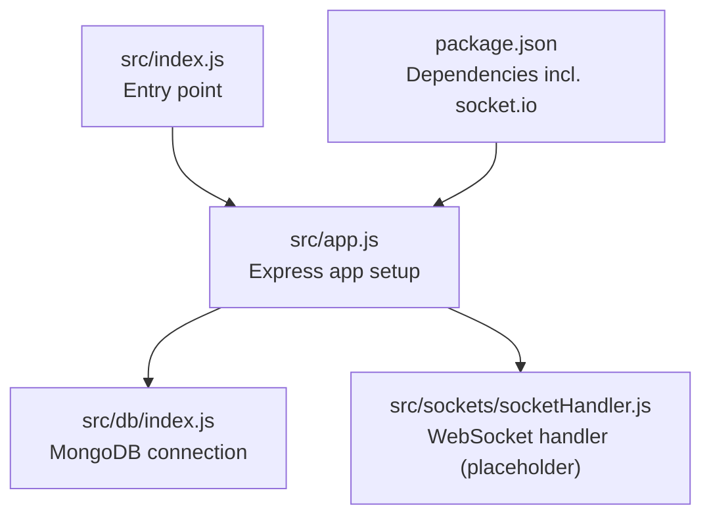
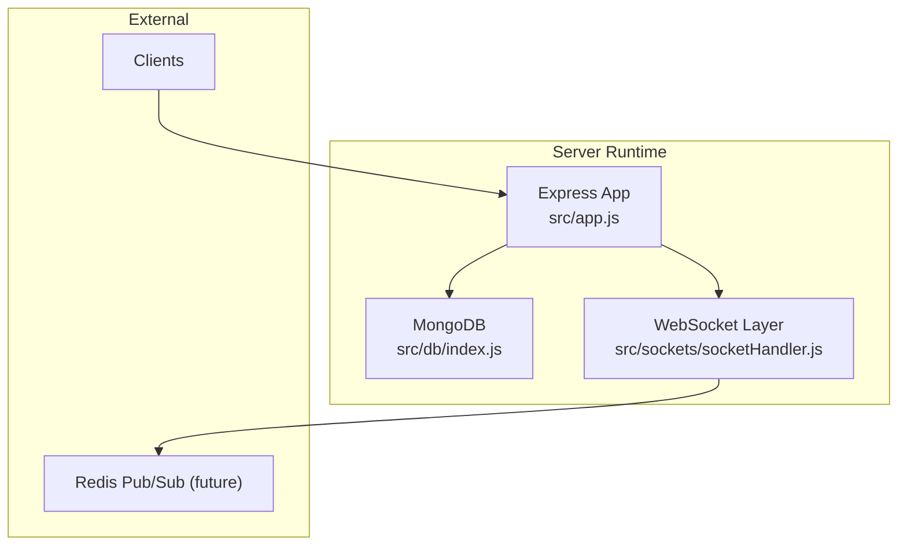
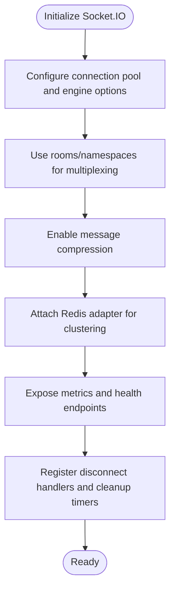
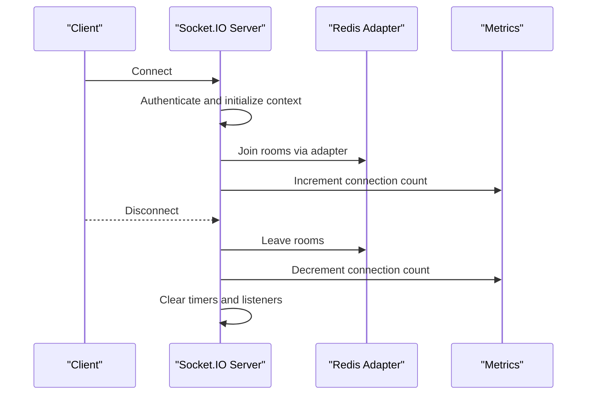
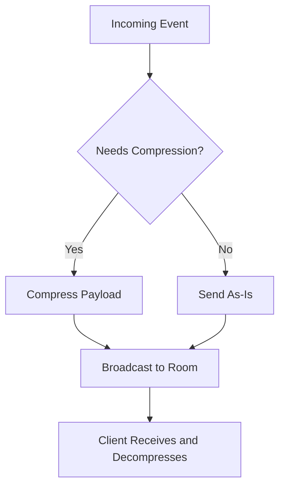
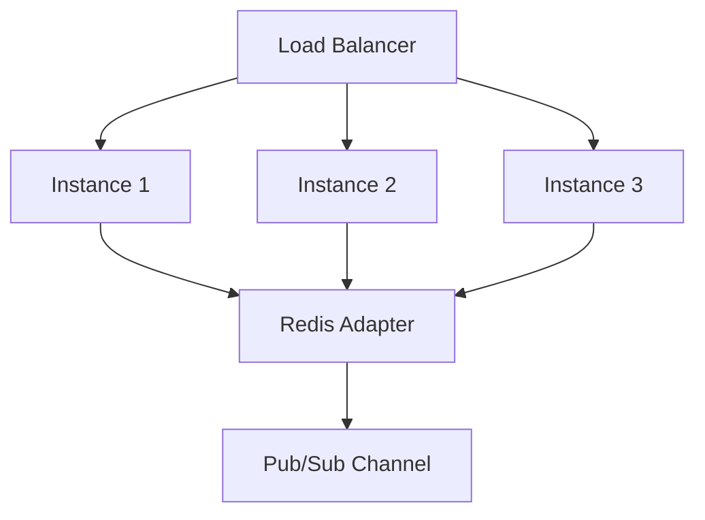
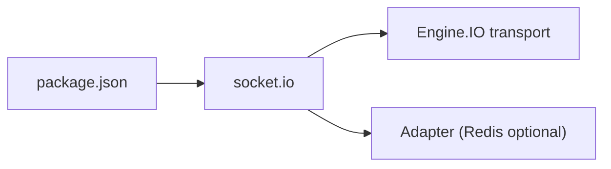

# Performance and Scalability

<cite>
**Referenced Files in This Document**
- [package.json](file://package.json)
- [src/index.js](file://src/index.js)
- [src/app.js](file://src/app.js)
- [src/db/index.js](file://src/db/index.js)
- [src/sockets/socketHandler.js](file://src/sockets/socketHandler.js)
</cite>

## Table of Contents
1. [Introduction](#introduction)
2. [Project Structure](#project-structure)
3. [Core Components](#core-components)
4. [Architecture Overview](#architecture-overview)
5. [Detailed Component Analysis](#detailed-component-analysis)
6. [Dependency Analysis](#dependency-analysis)
7. [Performance Considerations](#performance-considerations)
8. [Troubleshooting Guide](#troubleshooting-guide)
9. [Conclusion](#conclusion)
10. [Appendices](#appendices)

## Introduction
This document focuses on WebSocket performance optimization and scalability for the Task Management System backend. The current codebase integrates Socket.IO and exposes a minimal WebSocket handler placeholder. This guide provides actionable strategies for connection pooling, memory and CPU optimization, load balancing, compression and multiplexing, monitoring and metrics, horizontal scaling with Redis pub/sub, cleanup and leak prevention, benchmarking and capacity planning, and troubleshooting for performance issues.

## Project Structure
The backend is structured around Express, with modularized initialization and a placeholder for WebSocket handling. Socket.IO is present as a dependency, indicating a future WebSocket layer.

**Diagram sources**
- [src/index.js](file://src/index.js#L1-L18)
- [src/app.js](file://src/app.js#L1-L16)
- [src/db/index.js](file://src/db/index.js#L1-L14)
- [src/sockets/socketHandler.js](file://src/sockets/socketHandler.js#L1-L7)
- [package.json](file://package.json#L1-L28)

**Section sources**
- [src/index.js](file://src/index.js#L1-L18)
- [src/app.js](file://src/app.js#L1-L16)
- [src/db/index.js](file://src/db/index.js#L1-L14)
- [src/sockets/socketHandler.js](file://src/sockets/socketHandler.js#L1-L7)
- [package.json](file://package.json#L1-L28)

## Core Components
- Express application bootstrap and middleware configuration
- MongoDB connection manager
- Placeholder for WebSocket handler

Key observations:
- The Express app initializes CORS, static assets, JSON body parsing with a small limit, and cookie parsing.
- The database connection uses Mongoose and logs the connection string upon successful connection.
- The WebSocket handler file exists but is currently empty, indicating an opportunity to implement connection pooling, message handling, and lifecycle management.

**Section sources**
- [src/app.js](file://src/app.js#L1-L16)
- [src/db/index.js](file://src/db/index.js#L1-L14)
- [src/sockets/socketHandler.js](file://src/sockets/socketHandler.js#L1-L7)

## Architecture Overview
The runtime architecture centers on an Express server hosting REST endpoints and a future WebSocket layer via Socket.IO. The current WebSocket handler is a stub and requires implementation to support connection pooling, multiplexing, and scalable message delivery.

**Diagram sources**
- [src/app.js](file://src/app.js#L1-L16)
- [src/db/index.js](file://src/db/index.js#L1-L14)
- [src/sockets/socketHandler.js](file://src/sockets/socketHandler.js#L1-L7)
- [package.json](file://package.json#L1-L28)

## Detailed Component Analysis

### WebSocket Handler Implementation Plan
The current handler file is a placeholder. To enable performance and scalability:
- Initialize Socket.IO with engine options tuned for large concurrency
- Implement connection pooling via rooms and namespaces
- Add message compression and batching
- Integrate Redis adapter for multi-instance coordination
- Add lifecycle hooks for connection cleanup and metrics emission

[No sources needed since this diagram shows conceptual workflow, not actual code structure]

### Connection Lifecycle and Cleanup
- On connection: validate credentials, assign user/session context, register room joins
- On disconnect: remove listeners, clear timers, evict from rooms, release buffers
- Periodic cleanup: prune idle rooms, clear stale subscriptions

[No sources needed since this diagram shows conceptual workflow, not actual code structure]

### Message Compression and Multiplexing
- Enable compression at the engine level to reduce payload sizes
- Batch frequent updates (e.g., task list diffs) to minimize frames
- Use rooms/namespaces to separate channels and reduce broadcast fan-out

[No sources needed since this diagram shows conceptual workflow, not actual code structure]

### Horizontal Scaling with Redis Pub/Sub
- Use Redis adapter to synchronize rooms across instances
- Persist session metadata and presence in Redis for resilience
- Distribute load via reverse proxy or load balancer with sticky sessions if needed

[No sources needed since this diagram shows conceptual workflow, not actual code structure]

## Dependency Analysis
Socket.IO is included as a dependency. Its adapter and engine options are key levers for performance and scalability.

**Diagram sources**
- [package.json](file://package.json#L1-L28)

**Section sources**
- [package.json](file://package.json#L1-L28)

## Performance Considerations

### Connection Pooling Strategies
- Tune engine options for max HTTP polling duration, heartbeat intervals, and per-message limits
- Use rooms to shard workloads and reduce contention
- Implement graceful degradation under overload (backpressure, throttling)

### Memory Management for Large Numbers of Concurrent Connections
- Avoid retaining references to disconnected clients
- Use streaming or chunked messages for large payloads
- Prefer binary frames for numeric data and compact encodings

### CPU Optimization Techniques
- Minimize synchronous operations in event handlers
- Defer heavy computations to worker threads or microservices
- Use efficient serialization formats (e.g., binary) and disable unnecessary logging in hot paths

### Load Balancing Approaches
- Place a reverse proxy or load balancer in front of instances
- Use sticky sessions if stateful sessions are required; otherwise, rely on Redis adapter for stateless scaling
- Monitor instance CPU and connection counts to rebalance traffic

### Message Compression, Multiplexing, and Bandwidth Optimization
- Enable compression in engine options
- Batch frequent updates and send deltas instead of full payloads
- Use rooms/namespaces to target broadcasts precisely

### Practical Examples of Performance Monitoring and Metrics
- Track total connections, active rooms, and messages per second
- Measure latency distributions and error rates
- Observe GC pauses and heap growth under load
- Use metrics to trigger autoscaling and alert on anomalies

### Horizontal Scaling Patterns with Redis Pub/Sub
- Configure Redis adapter to synchronize rooms across nodes
- Store session metadata and presence in Redis for cross-instance visibility
- Use pub/sub channels for global notifications and cache invalidation

### Connection Cleanup, Leak Prevention, and Resource Cleanup
- Remove all listeners on disconnect
- Clear timeouts and intervals
- Evict from rooms and invalidate session tokens
- Ensure buffers are dereferenced promptly

### Benchmarking Methodologies and Capacity Planning
- Run controlled load tests simulating concurrent clients and message rates
- Measure throughput, latency percentiles, and failure rates
- Plan capacity based on observed headroom and SLOs
- Factor in network overhead and compression gains

[No sources needed since this section provides general guidance]

## Troubleshooting Guide

Common symptoms and mitigations:
- Connection storms
  - Mitigation: Rate-limit reconnections, enforce exponential backoff, and drop excess connections gracefully
- Resource exhaustion
  - Mitigation: Set per-message and total payload limits, monitor memory and CPU, scale out horizontally
- Stuck connections
  - Mitigation: Configure heartbeat and ping intervals; implement idle disconnect policies
- Message loss or duplication
  - Mitigation: Use acknowledgments, idempotent handlers, and Redis adapter for reliable delivery

[No sources needed since this section provides general guidance]

## Conclusion
The Task Management System backend currently includes Socket.IO as a dependency and an Express server with a minimal WebSocket handler. To achieve robust performance and scalability:
- Implement the WebSocket handler with engine tuning, rooms/namespaces, compression, and Redis adapter
- Establish monitoring and metrics collection
- Plan horizontal scaling and capacity based on benchmarks
- Enforce strict connection lifecycle management and cleanup
- Prepare for load storms and resource exhaustion with safeguards

[No sources needed since this section summarizes without analyzing specific files]

## Appendices

### Recommended Socket.IO Engine Options (Conceptual)
- Max HTTP polling duration
- Heartbeat timeout and interval
- Per-message and total payload limits
- Compression settings
- Transport selection (websocket, polling)

[No sources needed since this section provides general guidance]