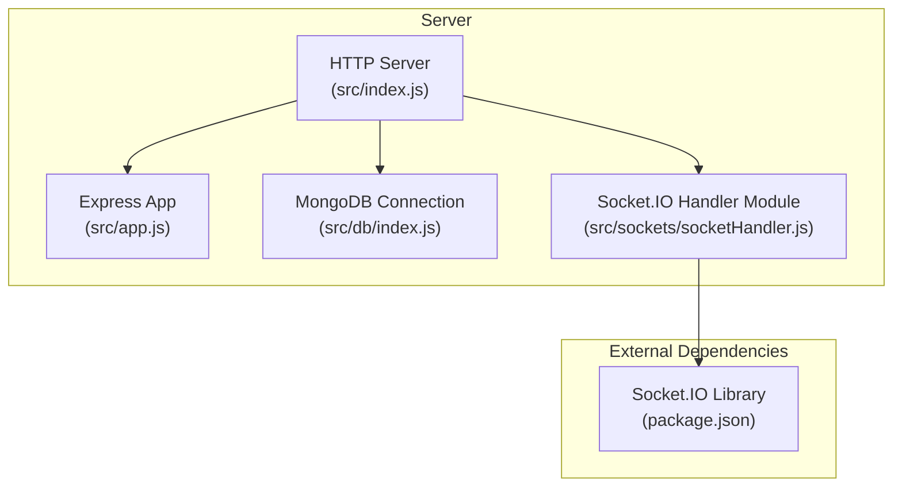
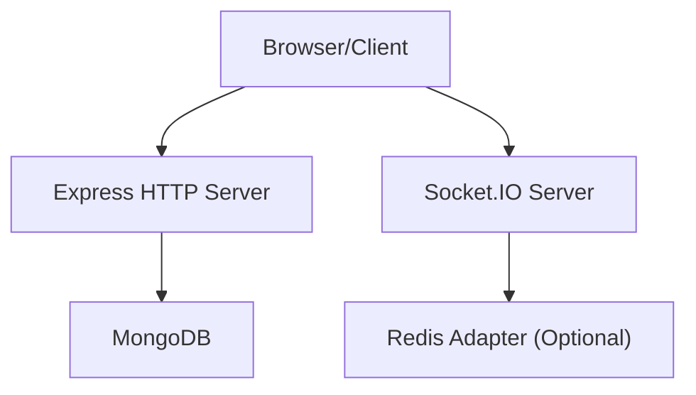
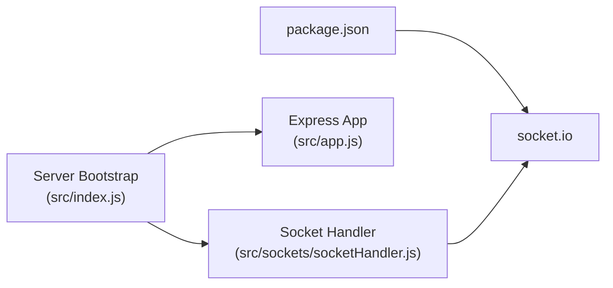

# Real-time Communication

<cite>
**Referenced Files in This Document**
- [package.json](file://package.json)
- [src/index.js](file://src/index.js)
- [src/app.js](file://src/app.js)
- [src/db/index.js](file://src/db/index.js)
- [src/sockets/socketHandler.js](file://src/sockets/socketHandler.js)
</cite>

## Table of Contents
1. [Introduction](#introduction)
2. [Project Structure](#project-structure)
3. [Core Components](#core-components)
4. [Architecture Overview](#architecture-overview)
5. [Detailed Component Analysis](#detailed-component-analysis)
6. [Dependency Analysis](#dependency-analysis)
7. [Performance Considerations](#performance-considerations)
8. [Troubleshooting Guide](#troubleshooting-guide)
9. [Conclusion](#conclusion)

## Introduction
This document explains the real-time communication capabilities of the Task Management System using Socket.IO. It covers WebSocket setup and configuration, server initialization, connection handling, event-driven architecture, broadcast mechanisms for live updates and notifications, client connection lifecycle (authentication, rooms, disconnections), and practical communication patterns. It also addresses scaling, load balancing, performance optimization, debugging, monitoring, and security considerations for real-time features.

## Project Structure
The backend is structured around Express for HTTP and a placeholder module for Socket.IO handlers. The WebSocket integration is currently minimal and requires implementation to enable real-time features.

**Diagram sources**
- [src/index.js](file://src/index.js#L1-L18)
- [src/app.js](file://src/app.js#L1-L15)
- [src/db/index.js](file://src/db/index.js#L1-L14)
- [src/sockets/socketHandler.js](file://src/sockets/socketHandler.js#L1-L7)
- [package.json](file://package.json#L14-L22)

**Section sources**
- [src/index.js](file://src/index.js#L1-L18)
- [src/app.js](file://src/app.js#L1-L15)
- [src/db/index.js](file://src/db/index.js#L1-L14)
- [src/sockets/socketHandler.js](file://src/sockets/socketHandler.js#L1-L7)
- [package.json](file://package.json#L14-L22)

## Core Components
- Express application and HTTP server bootstrap
- MongoDB connection management
- Socket.IO handler module (placeholder for WebSocket logic)
- CORS and JSON parsing middleware

Key observations:
- Socket.IO is declared as a dependency but the handler module is empty and not wired into the server.
- The HTTP server listens on a configurable port and connects to MongoDB before starting.

Practical implications:
- Real-time features are not yet active. Implementing Socket.IO integration is required to enable live task updates, notifications, and collaboration.

**Section sources**
- [src/index.js](file://src/index.js#L1-L18)
- [src/app.js](file://src/app.js#L1-L15)
- [src/db/index.js](file://src/db/index.js#L1-L14)
- [src/sockets/socketHandler.js](file://src/sockets/socketHandler.js#L1-L7)
- [package.json](file://package.json#L14-L22)

## Architecture Overview
The current architecture initializes the Express app, connects to MongoDB, and starts the HTTP server. Socket.IO is present as a dependency but not integrated. A typical real-time architecture would involve:
- An HTTP server (Express) hosting REST APIs and serving static assets
- A WebSocket server (Socket.IO) layered on top of the HTTP server
- A Socket.IO handler module managing connections, rooms, and events
- Optional Redis adapter for multi-instance scaling

[No sources needed since this diagram shows conceptual workflow, not actual code structure]

## Detailed Component Analysis

### Socket.IO Handler Module
The module exists but is not implemented. To enable real-time features, implement:
- Server initialization with Socket.IO
- Connection handling and authentication verification
- Room-based communication for tasks/projects
- Event broadcasting for task updates and notifications
- Disconnection cleanup

Current state:
- Empty module file indicates missing WebSocket logic.

Recommended implementation outline:
- Initialize Socket.IO on the HTTP server
- Define authentication middleware to verify tokens/cookies
- Join clients to task-specific rooms
- Emit events for task status changes, assignments, and collaboration actions
- Handle disconnects and leave rooms

**Section sources**
- [src/sockets/socketHandler.js](file://src/sockets/socketHandler.js#L1-L7)

### HTTP Server and Express App
- Express app sets up CORS, static serving, JSON parsing, and cookie parsing.
- The server starts after successful MongoDB connection.
- No explicit WebSocket server is initialized in the current code.

Operational flow:
- On startup, connect to MongoDB, then listen on the configured port.
- REST endpoints and static assets are served via Express.

**Section sources**
- [src/app.js](file://src/app.js#L1-L15)
- [src/index.js](file://src/index.js#L1-L18)
- [src/db/index.js](file://src/db/index.js#L1-L14)

### Database Connection
- MongoDB connection is established during server boot.
- Logging confirms the connection string used.

**Section sources**
- [src/db/index.js](file://src/db/index.js#L1-L14)

## Dependency Analysis
Socket.IO is included as a runtime dependency. Its presence enables WebSocket-based real-time communication, but the handler module must be implemented and wired into the server.

**Diagram sources**
- [package.json](file://package.json#L14-L22)
- [src/index.js](file://src/index.js#L1-L18)
- [src/app.js](file://src/app.js#L1-L15)
- [src/sockets/socketHandler.js](file://src/sockets/socketHandler.js#L1-L7)

**Section sources**
- [package.json](file://package.json#L14-L22)
- [src/index.js](file://src/index.js#L1-L18)
- [src/app.js](file://src/app.js#L1-L15)
- [src/sockets/socketHandler.js](file://src/sockets/socketHandler.js#L1-L7)

## Performance Considerations
- Use a Redis adapter for horizontal scaling across multiple server instances.
- Optimize event payload sizes; send only necessary fields.
- Implement rate limiting and throttle frequent updates (e.g., task progress).
- Monitor memory usage and connection counts; close idle connections.
- Use compression for large payloads if needed.
- Consider connection pooling and efficient database queries for real-time updates.

[No sources needed since this section provides general guidance]

## Troubleshooting Guide
Common issues and remedies:
- No real-time updates: Verify Socket.IO is initialized and the handler module is implemented and wired.
- CORS errors: Ensure the frontend origin matches the configured CORS settings.
- Authentication failures: Confirm token/cookie validation logic is implemented in the Socket.IO handler.
- High memory usage: Investigate open connections and room memberships; implement cleanup on disconnect.
- Scaling problems: Add a Redis adapter for multi-instance deployments.

**Section sources**
- [src/app.js](file://src/app.js#L8-L10)
- [src/sockets/socketHandler.js](file://src/sockets/socketHandler.js#L1-L7)

## Conclusion
The Task Management System includes Socket.IO as a dependency but lacks an implemented WebSocket handler. To enable real-time task updates, notifications, and collaboration:
- Implement the Socket.IO handler module to initialize the WebSocket server, manage connections, authenticate clients, join rooms, emit events, and handle disconnections.
- Integrate the handler with the existing Express server and ensure MongoDB connectivity remains intact.
- Plan for scaling with a Redis adapter and apply performance and security best practices.

[No sources needed since this section summarizes without analyzing specific files]