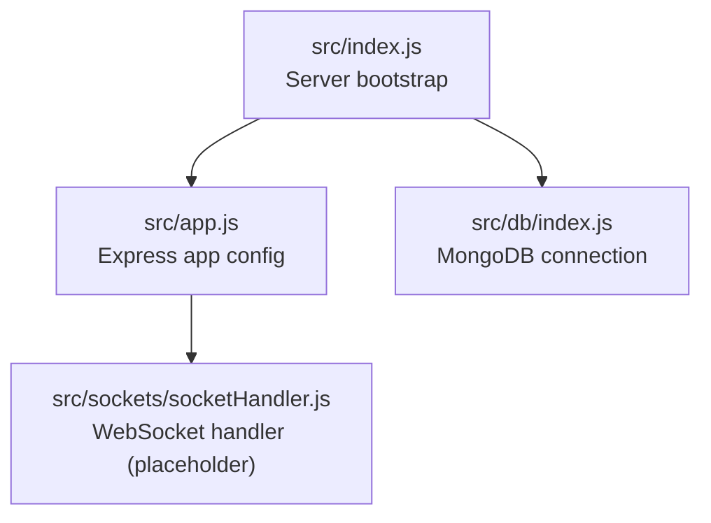
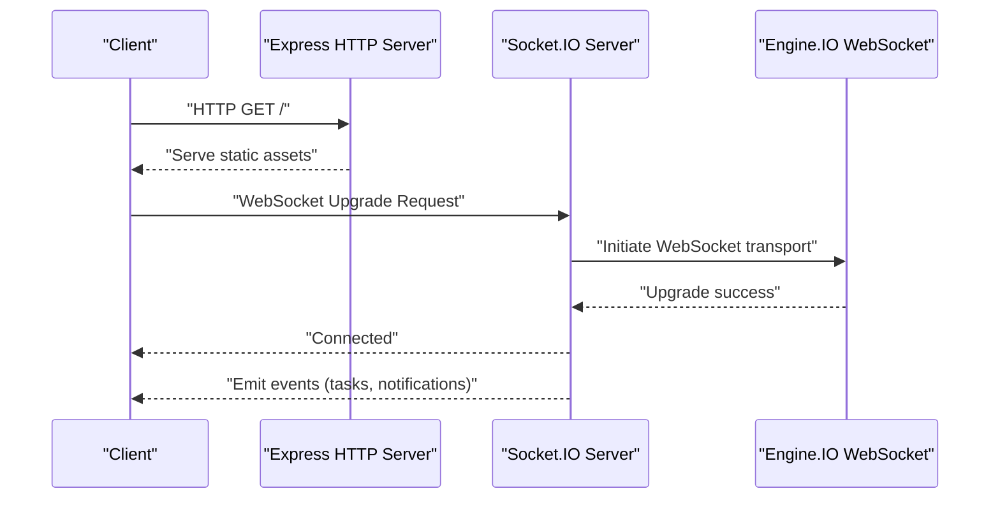
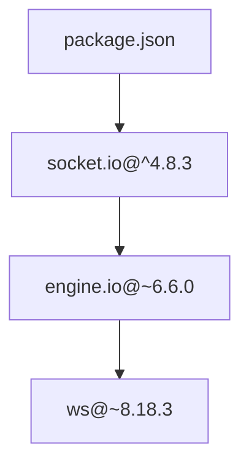

# WebSocket Setup and Configuration

<cite>
**Referenced Files in This Document**
- [src/index.js](file://src/index.js)
- [src/app.js](file://src/app.js)
- [src/db/index.js](file://src/db/index.js)
- [src/sockets/socketHandler.js](file://src/sockets/socketHandler.js)
- [package.json](file://package.json)
</cite>

## Table of Contents
1. [Introduction](#introduction)
2. [Project Structure](#project-structure)
3. [Core Components](#core-components)
4. [Architecture Overview](#architecture-overview)
5. [Detailed Component Analysis](#detailed-component-analysis)
6. [Dependency Analysis](#dependency-analysis)
7. [Performance Considerations](#performance-considerations)
8. [Troubleshooting Guide](#troubleshooting-guide)
9. [Conclusion](#conclusion)

## Introduction
This document explains the WebSocket server setup and configuration for the Task Management System backend. It focuses on the current state of the codebase, clarifies the absence of an active WebSocket server implementation, and provides practical guidance for integrating a production-ready Socket.IO server with the existing Express application. It also covers configuration options, connection upgrade mechanisms, handshake and protocol negotiation, CORS settings, timeouts, and troubleshooting steps.

## Project Structure
The backend is organized around an Express application with modularized concerns:
- Application bootstrap and server lifecycle
- Express configuration (CORS, static assets, JSON parsing, cookies)
- Database connection
- WebSocket handler module placeholder



**Diagram sources**
- [src/index.js](file://src/index.js#L1-L18)
- [src/app.js](file://src/app.js#L1-L16)
- [src/db/index.js](file://src/db/index.js#L1-L14)
- [src/sockets/socketHandler.js](file://src/sockets/socketHandler.js#L1-L7)

**Section sources**
- [src/index.js](file://src/index.js#L1-L18)
- [src/app.js](file://src/app.js#L1-L16)
- [src/db/index.js](file://src/db/index.js#L1-L14)
- [src/sockets/socketHandler.js](file://src/sockets/socketHandler.js#L1-L7)

## Core Components
- Express application configured with CORS, static assets, JSON body parsing, and cookie parsing.
- MongoDB connection via Mongoose.
- Placeholder for WebSocket handler module.

Key observations:
- No active Socket.IO server is initialized in the current codebase.
- The Express app is started independently of any WebSocket server instance.
- The WebSocket handler module exists but is currently empty.

Practical implications:
- To enable real-time communication, integrate a Socket.IO server bound to the Express HTTP server.
- Ensure CORS is configured consistently for both HTTP and WebSocket upgrades.
- Define connection limits and timeouts at the Socket.IO engine level.

**Section sources**
- [src/app.js](file://src/app.js#L1-L16)
- [src/db/index.js](file://src/db/index.js#L1-L14)
- [src/sockets/socketHandler.js](file://src/sockets/socketHandler.js#L1-L7)

## Architecture Overview
The current architecture separates HTTP and WebSocket concerns. A typical integration pattern binds Socket.IO to the existing Express app so both HTTP routes and WebSocket events share the same server instance.

```mermaid
graph TB
subgraph "HTTP Layer"
E["Express App<br/>src/app.js"]
F["Routes & Controllers"]
end
subgraph "Realtime Layer"
G["Socket.IO Server<br/>to be integrated"]
H["Engine.IO Transport<br/>WebSocket + Polling"]
end
subgraph "Infrastructure"
I["MongoDB<br/>src/db/index.js"]
end
E --> F
E <- --> G
G --> H
E --> I
```

**Diagram sources**
- [src/app.js](file://src/app.js#L1-L16)
- [src/db/index.js](file://src/db/index.js#L1-L14)

## Detailed Component Analysis

### Express Application Configuration
- CORS is enabled with origin controlled by an environment variable.
- Static assets served from the public directory.
- JSON payload size limit and cookie parsing middleware are applied.

Operational notes:
- CORS origin must match frontend origins to avoid cross-origin upgrade failures.
- Cookie parsing supports session-based authentication for WebSocket connections.

**Section sources**
- [src/app.js](file://src/app.js#L1-L16)

### Database Connection
- Mongoose connects to MongoDB using a URI from environment variables.
- On successful connection, logs the connection string; on failure, exits the process.

Operational notes:
- Ensure the database is reachable before starting the server.
- Use environment variables for connection URIs and credentials.

**Section sources**
- [src/db/index.js](file://src/db/index.js#L1-L14)

### WebSocket Handler Module
- The module exports a function that currently performs no operations.
- This is the integration point for Socket.IO initialization and event handlers.

Recommended implementation outline:
- Initialize Socket.IO with the Express app instance.
- Configure transports, upgrade mechanism, and CORS for WebSocket upgrades.
- Implement connection event handlers and room/channel logic.
- Add authentication middleware for validating sessions or tokens.

**Section sources**
- [src/sockets/socketHandler.js](file://src/sockets/socketHandler.js#L1-L7)

### Socket.IO Initialization and Integration
While the current codebase does not initialize Socket.IO, here is the recommended integration pattern:

- Create a Socket.IO server instance bound to the Express app’s HTTP server.
- Configure transports to include WebSocket and polling if needed.
- Set CORS for WebSocket upgrades to align with the Express CORS policy.
- Define connection limits, ping intervals, and timeouts.
- Register event handlers for join/leave rooms, emit updates, and handle disconnects.



[No sources needed since this diagram shows conceptual workflow, not actual code structure]

## Dependency Analysis
The backend depends on Socket.IO for real-time capabilities. The dependency tree includes Socket.IO, Engine.IO, and the ws library for WebSocket transport.



**Diagram sources**
- [package.json](file://package.json#L14-L27)

**Section sources**
- [package.json](file://package.json#L14-L27)

## Performance Considerations
- Transports: Prefer WebSocket for low-latency communication; keep polling as fallback for environments blocking WebSocket.
- Connection limits: Configure max number of concurrent connections per process and per cluster.
- Timeouts: Set ping intervals and ping timeouts to detect stale connections efficiently.
- Backpressure: Use batching and throttling for frequent updates; leverage rooms to minimize broadcast overhead.
- Scaling: Use sticky sessions with load balancers or a stateless design with a shared adapter for multi-instance deployments.

[No sources needed since this section provides general guidance]

## Troubleshooting Guide
Common issues and resolutions:
- Cross-origin upgrade failures
  - Cause: CORS origin mismatch between HTTP and WebSocket upgrade.
  - Resolution: Align Express CORS origin with frontend origin and configure Socket.IO CORS accordingly.
- Network/firewall restrictions
  - Cause: Load balancer or proxy not forwarding WebSocket upgrades.
  - Resolution: Enable WebSocket upgrade passthrough and appropriate headers.
- Browser compatibility
  - Cause: Legacy browsers without native WebSocket support.
  - Resolution: Rely on Engine.IO’s polling fallback; test across supported browsers.
- Authentication and session validation
  - Cause: Missing session or token verification during upgrade.
  - Resolution: Implement Socket.IO authentication middleware and validate sessions/tokens.
- Timeout and disconnects
  - Cause: Ping timeout or long garbage collection pauses.
  - Resolution: Tune ping intervals and timeouts; monitor server health metrics.

[No sources needed since this section provides general guidance]

## Conclusion
The Task Management System backend currently lacks an active WebSocket server. Integrating Socket.IO with the existing Express app is straightforward: bind the Socket.IO server to the Express HTTP server, configure CORS for upgrades, define transport and timeout policies, and implement connection and event handlers. With proper configuration and monitoring, the system can support scalable real-time features for tasks and notifications.