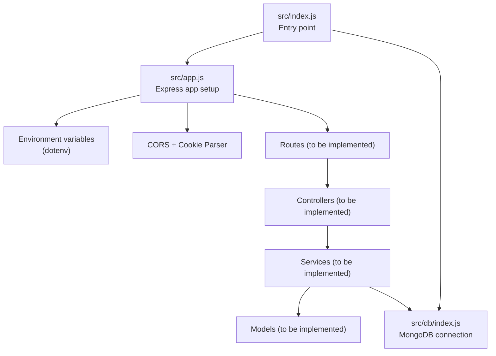
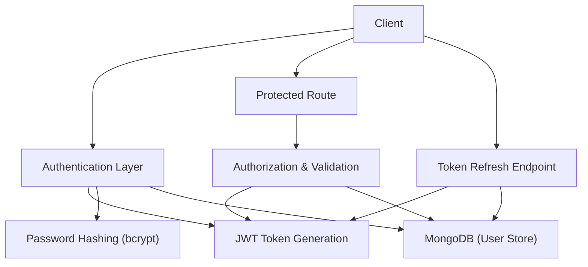
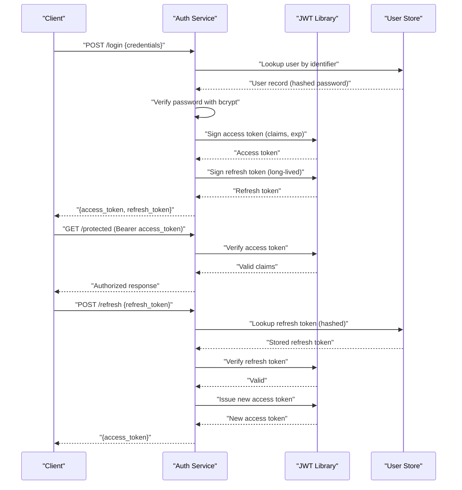
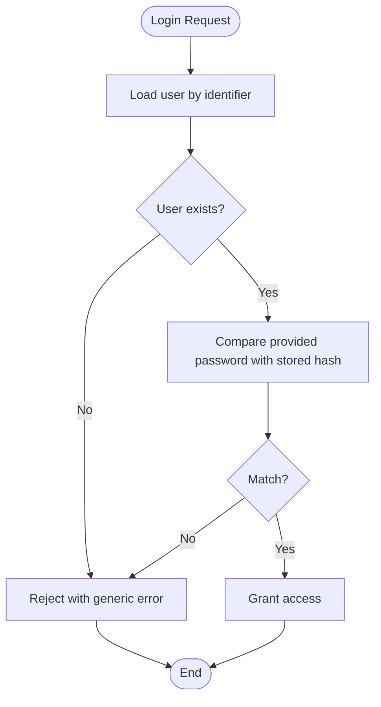
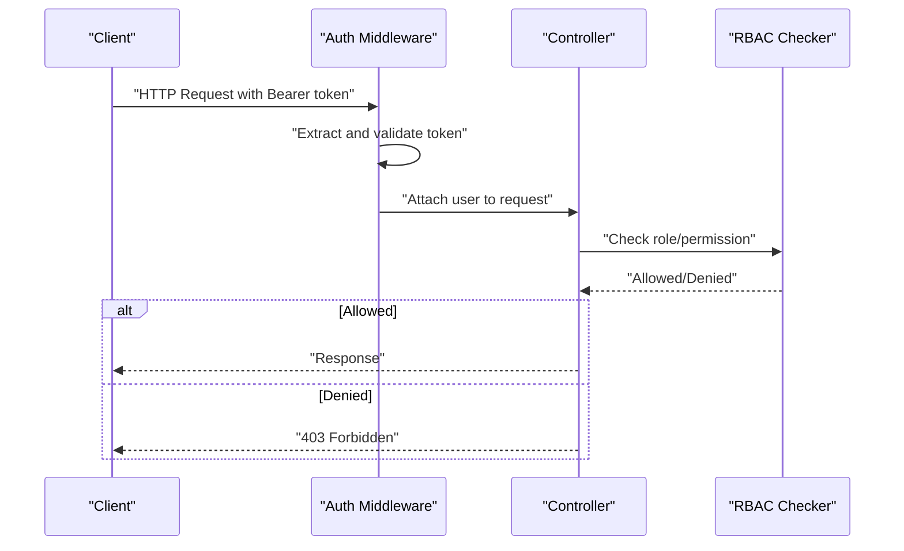
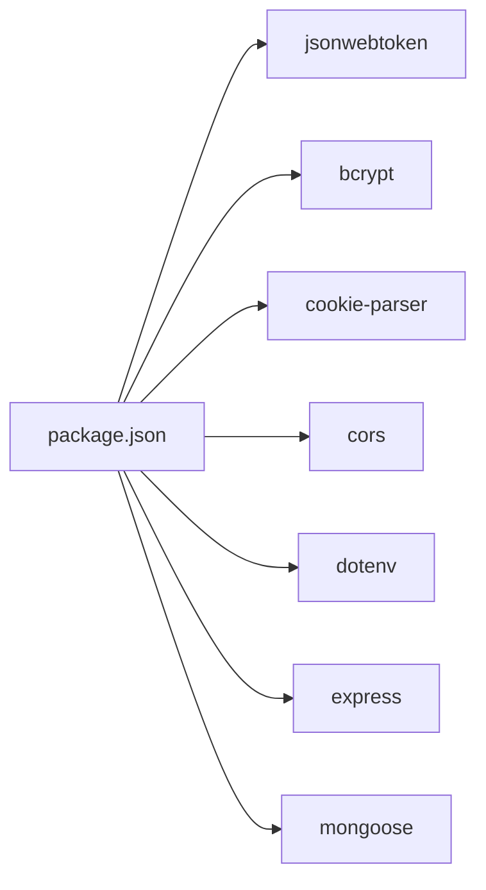

# Authentication Security

<cite>
**Referenced Files in This Document**
- [src/app.js](file://src/app.js)
- [src/index.js](file://src/index.js)
- [src/db/index.js](file://src/db/index.js)
- [package.json](file://package.json)
- [package-lock.json](file://package-lock.json)
</cite>

## Table of Contents
1. [Introduction](#introduction)
2. [Project Structure](#project-structure)
3. [Core Components](#core-components)
4. [Architecture Overview](#architecture-overview)
5. [Detailed Component Analysis](#detailed-component-analysis)
6. [Dependency Analysis](#dependency-analysis)
7. [Performance Considerations](#performance-considerations)
8. [Troubleshooting Guide](#troubleshooting-guide)
9. [Conclusion](#conclusion)
10. [Appendices](#appendices)

## Introduction
This document provides comprehensive authentication security documentation for the Task Management System Backend. It focuses on JWT token lifecycle (generation, validation, refresh, and expiration), password security with bcrypt, session management strategies, authentication middleware, and best practices for secure token storage, transmission, and renewal. It also covers common vulnerabilities such as token theft, replay attacks, and brute force prevention, along with secure workflow examples for login, logout, and password reset.

## Project Structure
The backend is structured around Express.js with environment-driven configuration, MongoDB connectivity via Mongoose, and security-related libraries for JWT, bcrypt, and cookie parsing. The application initializes environment variables, connects to the database, and starts the server.

**Diagram sources**
- [src/index.js](file://src/index.js#L1-L18)
- [src/app.js](file://src/app.js#L1-L16)
- [src/db/index.js](file://src/db/index.js#L1-L14)

**Section sources**
- [src/index.js](file://src/index.js#L1-L18)
- [src/app.js](file://src/app.js#L1-L16)
- [src/db/index.js](file://src/db/index.js#L1-L14)

## Core Components
- Express application initialization and middleware stack
- Environment configuration via dotenv
- MongoDB connection using Mongoose
- Security libraries present in dependencies:
  - jsonwebtoken for JWT operations
  - bcrypt for password hashing
  - cookie-parser for cookie handling

Security-relevant setup:
- CORS enabled with environment-controlled origin
- JSON body parsing with size limits
- Cookie parsing support
- Static asset serving

**Section sources**
- [src/app.js](file://src/app.js#L1-L16)
- [src/index.js](file://src/index.js#L1-L18)
- [src/db/index.js](file://src/db/index.js#L1-L14)
- [package.json](file://package.json#L14-L22)

## Architecture Overview
The authentication architecture integrates JWT-based stateless sessions with bcrypt-based password hashing. Passwords are hashed and stored securely, while JWT tokens are generated upon successful authentication and validated on protected routes. Refresh mechanisms and expiration handling are designed to minimize exposure windows and prevent replay attacks.

[No sources needed since this diagram shows conceptual workflow, not actual code structure]

## Detailed Component Analysis

### JWT Token Implementation
JWT is used for stateless authentication. The following outlines the recommended implementation pattern for token generation, validation, refresh, and expiration handling.

- Token generation
  - Payload should include minimal claims (e.g., user identifier, roles).
  - Signing algorithm should be a strong algorithm (e.g., RS256 or HS256 with a strong secret).
  - Issuer and audience should be set when applicable.
  - Expiration time should be short-lived (e.g., minutes) for access tokens.

- Token validation
  - Verify signature and claims (issuer, audience, expiration).
  - Reject tokens with invalid or missing claims.
  - Enforce clock tolerance for time-based claims.

- Refresh mechanism
  - Issue a long-lived refresh token (e.g., days/weeks) with a distinct signing method.
  - Store refresh tokens securely (hashed form) and associate with user identifiers.
  - Validate refresh tokens against stored records and revoke on misuse.

- Expiration handling
  - Access tokens expire quickly; clients renew via refresh tokens.
  - Implement sliding expiration policies carefully to avoid session fixation.
  - On logout, invalidate associated refresh tokens.

[No sources needed since this diagram shows conceptual workflow, not actual code structure]

Best practices for JWT:
- Use HTTPS/TLS for all token transmission.
- Store access tokens in memory only (not localStorage) to mitigate XSS.
- Persist refresh tokens in secure, httpOnly cookies with SameSite and Secure flags.
- Rotate secrets regularly and invalidate compromised tokens.
- Limit claims to essentials; avoid sensitive data in JWT payloads.

Common vulnerabilities addressed:
- Token theft: mitigate via secure cookies, short-lived access tokens, and TLS.
- Replay attacks: enforce strict signature verification and per-request nonce/token binding.
- Brute force: implement rate limiting and account lockout policies.

### Password Security Practices
Password security relies on bcrypt for hashing and secure storage.

- Hashing and salt generation
  - Use bcrypt with a high cost factor to slow down computation.
  - Allow bcrypt to generate and embed salts automatically.
  - Never store plain-text passwords.

- Secure password storage
  - Store only the hashed password.
  - Consider adding a unique salt per user if extending bcrypt behavior.
  - Protect database backups and access controls.

- Verification
  - On login, hash the provided password with the stored hash using bcrypt compare.
  - Immediately discard raw password after comparison.

[No sources needed since this diagram shows conceptual workflow, not actual code structure]

### Session Management Strategies
Secure session management reduces risk of token theft and session hijacking.

- Token rotation
  - Rotate access tokens frequently; issue new tokens on successful refresh.
  - Invalidate old tokens immediately upon rotation.

- Secure cookie settings
  - Use httpOnly cookies for refresh tokens to prevent client-side script access.
  - Set Secure flag for cookies transmitted over HTTPS.
  - Apply SameSite (strict or Lax) to reduce CSRF risks.
  - Set appropriate domain and path attributes.

- Session timeout configuration
  - Short access token TTL; longer refresh token TTL.
  - Implement idle timeouts and forced re-authentication after extended inactivity.
  - Log out users on sensitive operations if desired.

- Logout handling
  - Invalidate refresh tokens on logout.
  - Clear cookies on the client side.
  - Optionally maintain a revocation list for active access tokens.

### Authentication Middleware Implementation
Authentication middleware enforces protection on routes and supports role-based access control (RBAC).

- Protected route handling
  - Extract Authorization header and validate bearer token.
  - Verify token signature and claims.
  - Attach user identity to request context for downstream handlers.

- Role-based access control
  - Define roles and permissions in user model/store.
  - Enforce RBAC checks in middleware before controller execution.
  - Deny access for insufficient privileges.

- Permission validation
  - Validate resource ownership where applicable.
  - Support hierarchical permissions and composite roles.

[No sources needed since this diagram shows conceptual workflow, not actual code structure]

### Security Best Practices for Token Storage, Transmission, and Renewal
- Storage
  - Access tokens: keep in memory only; avoid persistent storage.
  - Refresh tokens: store hashed in database; bind to user and device if possible.
- Transmission
  - Always use HTTPS/TLS.
  - Send tokens via Authorization header for APIs; use secure cookies for browser apps.
- Renewal
  - Renew access tokens using refresh tokens.
  - Re-authenticate users periodically for sensitive actions.

### Common Authentication Vulnerabilities and Mitigations
- Token theft
  - Mitigation: secure cookies, short-lived tokens, TLS, least privilege scopes.
- Replay attacks
  - Mitigation: strict signature verification, per-request challenges, token binding.
- Brute force
  - Mitigation: rate limiting, exponential backoff, account lockout, CAPTCHA for high-risk endpoints.

### Implementation Examples (Conceptual)
- Login workflow
  - Validate credentials against stored hash.
  - Issue short-lived access token and long-lived refresh token.
  - Return tokens via secure cookies (refresh) and memory (access) for SPA.
- Logout workflow
  - Invalidate refresh token in store.
  - Clear cookies on client.
  - Optional: add access token to a revocation list.
- Password reset workflow
  - Verify identity via secure channel.
  - Generate time-limited reset token and send securely.
  - Replace password with bcrypt hash upon completion.

[No sources needed since this section provides general guidance]

## Dependency Analysis
The backend depends on libraries that enable JWT, bcrypt, and cookie handling. These dependencies underpin the authentication implementation.

**Diagram sources**
- [package.json](file://package.json#L14-L22)

**Section sources**
- [package.json](file://package.json#L14-L22)
- [package-lock.json](file://package-lock.json#L868-L889)

## Performance Considerations
- JWT verification overhead is low compared to database lookups; cache frequently accessed user metadata if needed.
- Bcrypt cost factor affects login latency; balance security and performance (e.g., moderate cost factors).
- Rate limiting and circuit breakers protect against brute force and DDoS.
- Use efficient database indexing for user lookups and refresh token retrieval.

[No sources needed since this section provides general guidance]

## Troubleshooting Guide
- Database connection failures
  - Confirm environment variables for database URI are set.
  - Verify network connectivity and credentials.
- JWT errors
  - Validate issuer, audience, and expiration claims.
  - Ensure signing keys match between generation and verification.
- Password mismatch during login
  - Confirm bcrypt cost factors and hashing consistency.
  - Check for encoding issues in credential handling.
- CORS or cookie issues
  - Verify CORS origin configuration and cookie SameSite/Secure flags.
  - Ensure cookies are sent with correct domain/path.

**Section sources**
- [src/db/index.js](file://src/db/index.js#L1-L14)
- [src/app.js](file://src/app.js#L8-L13)
- [src/index.js](file://src/index.js#L5-L17)

## Conclusion
The Task Management System Backend establishes a solid foundation for secure authentication using JWT and bcrypt. By implementing robust token lifecycle management, secure cookie practices, and middleware-based authorization, the system can mitigate common vulnerabilities and provide a resilient authentication framework. Adhering to the outlined best practices ensures confidentiality, integrity, and availability of user credentials and session tokens.

[No sources needed since this section summarizes without analyzing specific files]

## Appendices
- Environment variables to configure
  - Database URI for MongoDB connection
  - JWT secret or key pair for signing
  - CORS origin for cross-origin requests
  - Cookie security flags and SameSite policy
- Recommended operational controls
  - Regular rotation of signing keys
  - Monitoring and alerting for failed authentication attempts
  - Audit logs for login, logout, and sensitive operations

[No sources needed since this section provides general guidance]