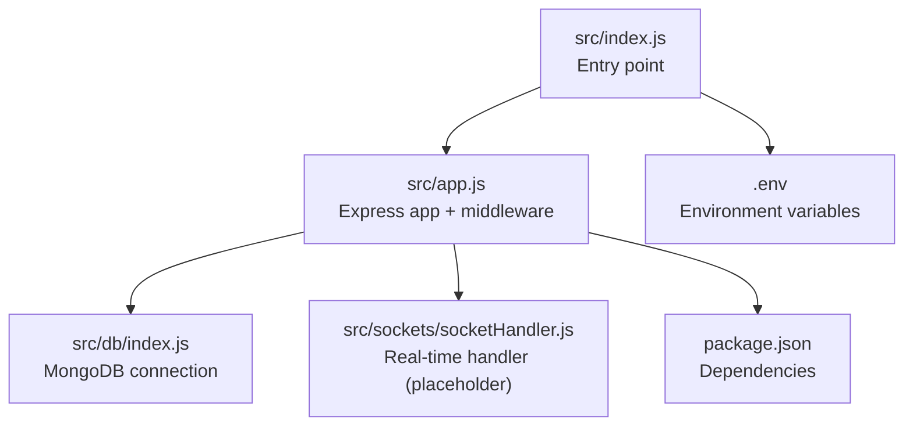
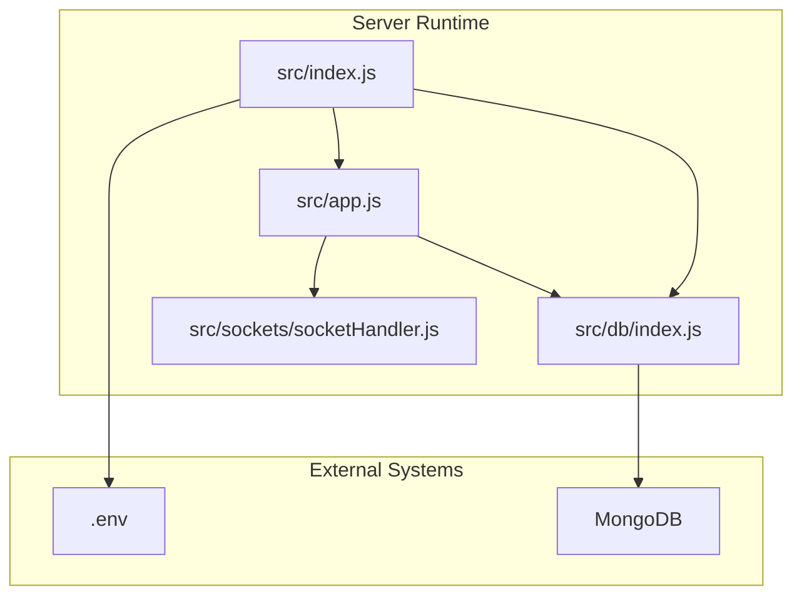
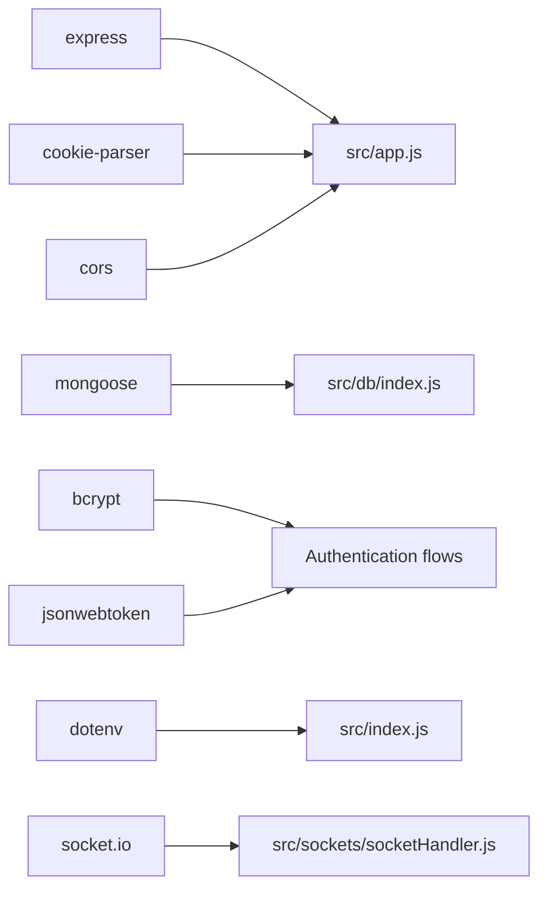

# Data Protection

<cite>
**Referenced Files in This Document**
- [src/app.js](file://src/app.js)
- [src/index.js](file://src/index.js)
- [src/db/index.js](file://src/db/index.js)
- [src/sockets/socketHandler.js](file://src/sockets/socketHandler.js)
- [package.json](file://package.json)
</cite>

## Table of Contents
1. [Introduction](#introduction)
2. [Project Structure](#project-structure)
3. [Core Components](#core-components)
4. [Architecture Overview](#architecture-overview)
5. [Detailed Component Analysis](#detailed-component-analysis)
6. [Dependency Analysis](#dependency-analysis)
7. [Performance Considerations](#performance-considerations)
8. [Troubleshooting Guide](#troubleshooting-guide)
9. [Conclusion](#conclusion)
10. [Appendices](#appendices)

## Introduction
This document provides comprehensive data protection guidance for the Task Management System Backend. It focuses on encryption at rest, secure transmission, sensitive data handling, CORS security, database security, data retention, audit logging, and compliance considerations. Where applicable, implementation examples are referenced via file paths and line ranges to help teams enforce secure practices consistently across the application lifecycle.

## Project Structure
The backend is a minimal Express server with environment-driven configuration, MongoDB connectivity, and a placeholder for real-time features. Security-relevant configuration surfaces include:
- CORS origin controlled by an environment variable
- JSON payload size limits
- Cookie parsing
- Environment variable loading
- MongoDB connection string from environment

**Diagram sources**
- [src/index.js](file://src/index.js#L1-L18)
- [src/app.js](file://src/app.js#L1-L15)
- [src/db/index.js](file://src/db/index.js#L1-L14)
- [src/sockets/socketHandler.js](file://src/sockets/socketHandler.js#L1-L7)
- [package.json](file://package.json#L1-L28)

**Section sources**
- [src/index.js](file://src/index.js#L1-L18)
- [src/app.js](file://src/app.js#L1-L15)
- [src/db/index.js](file://src/db/index.js#L1-L14)
- [src/sockets/socketHandler.js](file://src/sockets/socketHandler.js#L1-L7)
- [package.json](file://package.json#L1-L28)

## Core Components
- Express application initialization and middleware pipeline
- Environment-driven CORS configuration
- JSON body parsing with size limits
- Cookie parsing
- MongoDB connection using Mongoose
- Socket handler placeholder for future real-time security controls

Security-relevant observations:
- CORS origin is configurable via environment variable, enabling strict origin enforcement when set appropriately.
- JSON payload size limit reduces risk of resource exhaustion attacks.
- Cookie parsing is enabled; secure cookie flags should be configured at the application level when issuing cookies.
- MongoDB connection relies on a URI from environment variables; secrets should be managed securely.

**Section sources**
- [src/app.js](file://src/app.js#L1-L15)
- [src/index.js](file://src/index.js#L1-L18)
- [src/db/index.js](file://src/db/index.js#L1-L14)
- [src/sockets/socketHandler.js](file://src/sockets/socketHandler.js#L1-L7)
- [package.json](file://package.json#L1-L28)

## Architecture Overview
The runtime architecture centers on the Express server, which loads environment variables, connects to MongoDB, and exposes endpoints. Real-time features are present but currently lack security-specific handlers.

**Diagram sources**
- [src/index.js](file://src/index.js#L1-L18)
- [src/app.js](file://src/app.js#L1-L15)
- [src/db/index.js](file://src/db/index.js#L1-L14)
- [src/sockets/socketHandler.js](file://src/sockets/socketHandler.js#L1-L7)

## Detailed Component Analysis

### CORS Configuration Security
Current state:
- Origin is controlled by an environment variable.
- No credentials policy, exposed headers, allowed methods, or allowed headers are explicitly configured.

Recommended hardening:
- Set the origin to a strict allowlist of trusted domains.
- Configure allowed methods and headers to the minimum necessary.
- Add credentials support only when required and validated.
- Define exposed headers and preflight caching windows carefully.

Implementation references:
- [src/app.js](file://src/app.js#L8-L10)

**Section sources**
- [src/app.js](file://src/app.js#L8-L10)

### Secure Transmission Protocols
Observations:
- The server runs an HTTP endpoint; HTTPS/TLS termination is not configured in the provided code.
- No explicit HSTS, CSP, or other transport-layer protections are present.

Recommendations:
- Terminate TLS at the server or reverse proxy with modern TLS versions and strong cipher suites.
- Enforce HTTPS redirects and HSTS headers.
- Configure Content-Security-Policy and other security headers as needed.

Implementation references:
- [src/index.js](file://src/index.js#L9-L17)

**Section sources**
- [src/index.js](file://src/index.js#L9-L17)

### Encryption at Rest
Observations:
- MongoDB connection uses a URI from environment variables; encryption at rest depends on MongoDB deployment settings.
- File storage security is not implemented in the current codebase.

Recommendations:
- Enable MongoDB encryption-at-rest at the cluster/storage level.
- For file uploads, encrypt data at rest using platform-native or KMS-backed encryption.
- Store encryption keys separately from application code and rotate periodically.

Implementation references:
- [src/db/index.js](file://src/db/index.js#L5)
- [src/index.js](file://src/index.js#L5-L7)

**Section sources**
- [src/db/index.js](file://src/db/index.js#L5)
- [src/index.js](file://src/index.js#L5-L7)

### Sensitive Data Handling Practices
Observations:
- Password hashing library is present; bcrypt is commonly used for credential hashing.
- JWT library is present; tokens should be handled securely (signing, expiration, secure flags).
- Cookie parsing is enabled; secure flags and SameSite attributes should be configured when issuing cookies.

Recommendations:
- Hash all passwords with a strong salt and cost factor.
- Issue JWTs with short-lived expiration and refresh token rotation.
- Use HttpOnly, Secure, and SameSite cookies for session tokens.
- Mask or avoid logging sensitive fields; sanitize logs at the application level.

Implementation references:
- [package.json](file://package.json#L14-L22)

**Section sources**
- [package.json](file://package.json#L14-L22)

### Database Security
Observations:
- MongoDB connection uses a URI from environment variables.
- No query security measures (parameterized queries, aggregation pipeline safeguards) are visible in the provided code.

Recommendations:
- Use environment-based URIs with least-privilege credentials.
- Sanitize and validate inputs; prefer parameterized queries or ODM-safe operations.
- Apply role-based access control (RBAC) and network-level restrictions on the database.
- Audit and monitor database access and changes.

Implementation references:
- [src/db/index.js](file://src/db/index.js#L5)

**Section sources**
- [src/db/index.js](file://src/db/index.js#L5)

### Data Retention Policies, Audit Logging, and Compliance
Observations:
- No explicit data retention or audit logging mechanisms are present in the provided code.

Recommendations:
- Define data retention periods per data category and automate deletion schedules.
- Implement structured audit logs for authentication, authorization, and data access events.
- Ensure compliance with applicable regulations (e.g., privacy laws) by incorporating consent, access rights, and erasure mechanisms.

[No sources needed since this section provides general guidance]

### Secure Deletion Procedures
Recommendations:
- Implement soft delete patterns with tombstones and scheduled hard deletes.
- For PII, ensure cryptographic erasure or secure overwrite where applicable.
- Log deletion events with timestamps and actor identification.

[No sources needed since this section provides general guidance]

### Implementation Examples Across the Application Lifecycle
- Environment configuration: Load variables early and fail closed on missing secrets.
  - [src/index.js](file://src/index.js#L5-L7)
- Server startup and error handling: Ensure graceful failure and logging.
  - [src/index.js](file://src/index.js#L11-L17)
- CORS hardening: Restrict origins and configure allowed methods/headers.
  - [src/app.js](file://src/app.js#L8-L10)
- Transport security: Add HTTPS/TLS termination and HSTS.
  - [src/index.js](file://src/index.js#L9-L17)
- Data at rest: Use encrypted storage and KMS-backed keys.
  - [src/db/index.js](file://src/db/index.js#L5)
- Authentication and sessions: Use bcrypt for passwords and secure JWT handling.
  - [package.json](file://package.json#L14-L22)

**Section sources**
- [src/index.js](file://src/index.js#L5-L17)
- [src/app.js](file://src/app.js#L8-L10)
- [src/db/index.js](file://src/db/index.js#L5)
- [package.json](file://package.json#L14-L22)

## Dependency Analysis
The backend depends on Express, Mongoose, bcrypt, jsonwebtoken, cookie-parser, cors, dotenv, and socket.io. These libraries enable routing, database connectivity, authentication, and real-time features. Security posture depends on correct configuration and usage of these dependencies.

**Diagram sources**
- [package.json](file://package.json#L14-L22)
- [src/app.js](file://src/app.js#L1-L15)
- [src/db/index.js](file://src/db/index.js#L1-L14)
- [src/index.js](file://src/index.js#L1-L18)
- [src/sockets/socketHandler.js](file://src/sockets/socketHandler.js#L1-L7)

**Section sources**
- [package.json](file://package.json#L14-L22)
- [src/app.js](file://src/app.js#L1-L15)
- [src/db/index.js](file://src/db/index.js#L1-L14)
- [src/index.js](file://src/index.js#L1-L18)
- [src/sockets/socketHandler.js](file://src/sockets/socketHandler.js#L1-L7)

## Performance Considerations
- Limit JSON payload sizes to prevent memory pressure.
- Use efficient authentication libraries and cache tokens where appropriate.
- Monitor database query performance and apply indexing strategies.
- Scale horizontally behind a load balancer with proper health checks.

[No sources needed since this section provides general guidance]

## Troubleshooting Guide
Common issues and mitigations:
- CORS errors: Verify the origin environment variable matches the client origin and credentials are configured appropriately.
  - [src/app.js](file://src/app.js#L8-L10)
- Database connection failures: Confirm the MongoDB URI and network connectivity; ensure credentials are not logged.
  - [src/db/index.js](file://src/db/index.js#L5)
- Startup errors: Review environment loading and port binding; ensure dotenv is loaded before accessing environment variables.
  - [src/index.js](file://src/index.js#L5-L7)

**Section sources**
- [src/app.js](file://src/app.js#L8-L10)
- [src/db/index.js](file://src/db/index.js#L5)
- [src/index.js](file://src/index.js#L5-L7)

## Conclusion
The Task Management System Backend currently provides a minimal Express server with environment-driven CORS and MongoDB connectivity. To achieve robust data protection, teams should:
- Harden CORS and implement HTTPS/TLS
- Enforce encryption at rest and secure secret management
- Strengthen authentication and session handling
- Implement audit logging, data retention, and secure deletion
- Apply database security best practices and monitor access

[No sources needed since this section summarizes without analyzing specific files]

## Appendices
- Example references for secure configuration:
  - [src/app.js](file://src/app.js#L8-L10)
  - [src/db/index.js](file://src/db/index.js#L5)
  - [src/index.js](file://src/index.js#L5-L7)
  - [package.json](file://package.json#L14-L22)