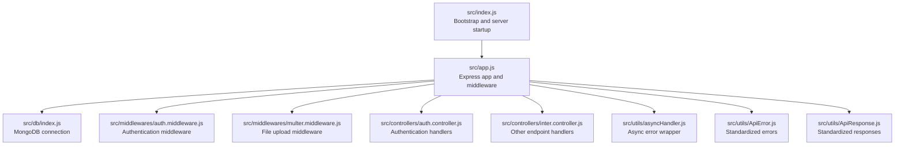
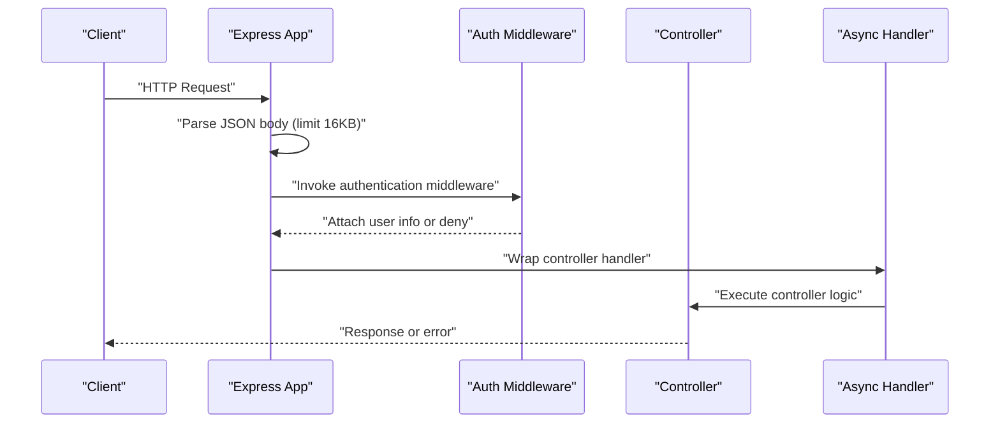
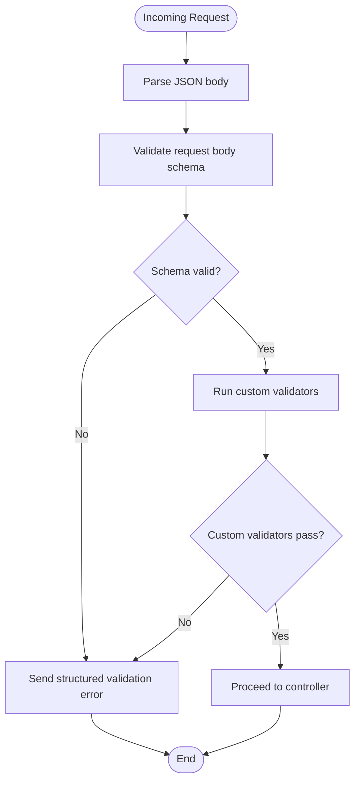
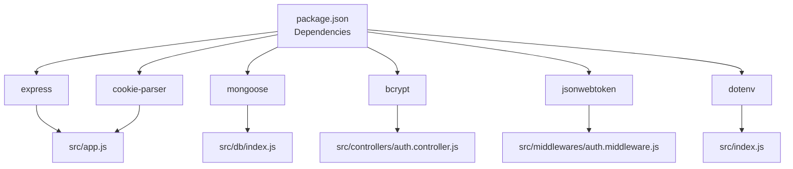

# Input Validation

<cite>
**Referenced Files in This Document**
- [src/app.js](file://src/app.js)
- [src/index.js](file://src/index.js)
- [src/db/index.js](file://src/db/index.js)
- [src/middlewares/auth.middleware.js](file://src/middlewares/auth.middleware.js)
- [src/middlewares/multer.middleware.js](file://src/middlewares/multer.middleware.js)
- [src/controllers/auth.controller.js](file://src/controllers/auth.controller.js)
- [src/controllers/inter.controller.js](file://src/controllers/inter.controller.js)
- [src/utils/asyncHandler.js](file://src/utils/asyncHandler.js)
- [src/utils/ApiError.js](file://src/utils/ApiError.js)
- [src/utils/ApiResponse.js](file://src/utils/ApiResponse.js)
- [package.json](file://package.json)
</cite>

## Table of Contents
1. [Introduction](#introduction)
2. [Project Structure](#project-structure)
3. [Core Components](#core-components)
4. [Architecture Overview](#architecture-overview)
5. [Detailed Component Analysis](#detailed-component-analysis)
6. [Dependency Analysis](#dependency-analysis)
7. [Performance Considerations](#performance-considerations)
8. [Troubleshooting Guide](#troubleshooting-guide)
9. [Conclusion](#conclusion)

## Introduction
This document provides a comprehensive guide to input validation in the Task Management System Backend. It focuses on:
- Request body sanitization strategies for JSON payloads and parameters
- Validation middleware patterns, including custom validators and schema validation
- Error handling for invalid inputs
- XSS prevention techniques (HTML escaping, content security policies, script filtering)
- SQL injection prevention via parameterized queries and input sanitization
- Validation rule definitions for task creation, user registration, and authentication endpoints
- Examples of common validation scenarios and implementation patterns
- Performance optimization and caching strategies for frequently validated inputs

The backend is built with Express and uses Mongoose for MongoDB interactions. Security middleware and utilities are present to support robust input validation and sanitization.

## Project Structure
The backend follows a modular structure with clear separation of concerns:
- Application bootstrap and middleware setup in the Express app
- Database connection module
- Authentication and file upload middleware
- Controllers for authentication and other endpoints
- Utility modules for async error handling and standardized API responses
- Package dependencies define runtime behavior (JSON parsing limits, CORS, cookies, bcrypt, JWT, Mongoose, Socket.IO)

**Diagram sources**
- [src/index.js](file://src/index.js#L1-L18)
- [src/app.js](file://src/app.js#L1-L16)
- [src/db/index.js](file://src/db/index.js#L1-L14)
- [src/middlewares/auth.middleware.js](file://src/middlewares/auth.middleware.js)
- [src/middlewares/multer.middleware.js](file://src/middlewares/multer.middleware.js)
- [src/controllers/auth.controller.js](file://src/controllers/auth.controller.js)
- [src/controllers/inter.controller.js](file://src/controllers/inter.controller.js)
- [src/utils/asyncHandler.js](file://src/utils/asyncHandler.js#L1-L7)
- [src/utils/ApiError.js](file://src/utils/ApiError.js)
- [src/utils/ApiResponse.js](file://src/utils/ApiResponse.js)

**Section sources**
- [src/index.js](file://src/index.js#L1-L18)
- [src/app.js](file://src/app.js#L1-L16)
- [src/db/index.js](file://src/db/index.js#L1-L14)
- [package.json](file://package.json#L1-L28)

## Core Components
This section outlines the core components involved in input validation and sanitization:

- Express app initialization and middleware pipeline
  - JSON body parsing with a 16 KB limit
  - CORS configuration
  - Cookie parsing
  - Static asset serving

- Middleware stack
  - Authentication middleware for protected routes
  - Multer-based file upload middleware for multipart/form-data

- Controllers
  - Authentication controller for login/register flows
  - Other endpoint controller for shared logic

- Utilities
  - Async handler wrapper to safely handle asynchronous route handlers
  - Standardized error and response utilities

These components collectively form the foundation for applying input validation consistently across endpoints.

**Section sources**
- [src/app.js](file://src/app.js#L8-L13)
- [src/middlewares/auth.middleware.js](file://src/middlewares/auth.middleware.js)
- [src/middlewares/multer.middleware.js](file://src/middlewares/multer.middleware.js)
- [src/controllers/auth.controller.js](file://src/controllers/auth.controller.js)
- [src/controllers/inter.controller.js](file://src/controllers/inter.controller.js)
- [src/utils/asyncHandler.js](file://src/utils/asyncHandler.js#L1-L7)
- [src/utils/ApiError.js](file://src/utils/ApiError.js)
- [src/utils/ApiResponse.js](file://src/utils/ApiResponse.js)

## Architecture Overview
The input validation architecture integrates early HTTP body parsing, middleware-based validation, and controller-level logic. The flow below illustrates a typical request lifecycle for an authenticated route:

**Diagram sources**
- [src/app.js](file://src/app.js#L8-L13)
- [src/middlewares/auth.middleware.js](file://src/middlewares/auth.middleware.js)
- [src/utils/asyncHandler.js](file://src/utils/asyncHandler.js#L1-L7)
- [src/controllers/auth.controller.js](file://src/controllers/auth.controller.js)

## Detailed Component Analysis

### JSON Payload Validation and Parameter Extraction
- Body parsing
  - The Express app enables JSON parsing with a 16 KB limit, reducing risk from oversized payloads and mitigating potential denial-of-service vectors.
  - Cookies are parsed to support session-like tokens and CSRF protection mechanisms.

- Parameter extraction
  - Extract required fields from the request body in controllers.
  - Validate presence and types of parameters before proceeding to business logic.

- Malicious input detection
  - Enforce field-specific constraints (length, allowed characters, numeric ranges).
  - Reject unexpected fields to prevent prototype pollution and injection attacks.
  - Normalize and trim whitespace-sensitive inputs.

Implementation pattern references:
- Body parsing and middleware setup: [src/app.js](file://src/app.js#L8-L13)
- Controller-level parameter extraction and validation: [src/controllers/auth.controller.js](file://src/controllers/auth.controller.js), [src/controllers/inter.controller.js](file://src/controllers/inter.controller.js)

**Section sources**
- [src/app.js](file://src/app.js#L8-L13)
- [src/controllers/auth.controller.js](file://src/controllers/auth.controller.js)
- [src/controllers/inter.controller.js](file://src/controllers/inter.controller.js)

### Validation Middleware Implementation Patterns
- Custom validator functions
  - Implement reusable validator functions for common checks (e.g., email format, password strength, role enumeration).
  - Centralize validation logic in middleware to avoid duplication across routes.

- Schema validation
  - Use a schema library (e.g., Joi, Zod) to define strict schemas for request bodies and query parameters.
  - Validate incoming data against schemas and return structured error responses for mismatches.

- Error handling for invalid inputs
  - Wrap route handlers with an async error handler to convert thrown errors into standardized API responses.
  - Return detailed validation errors with appropriate HTTP status codes.

Implementation pattern references:
- Async error handling wrapper: [src/utils/asyncHandler.js](file://src/utils/asyncHandler.js#L1-L7)
- Standardized error and response utilities: [src/utils/ApiError.js](file://src/utils/ApiError.js), [src/utils/ApiResponse.js](file://src/utils/ApiResponse.js)

**Diagram sources**
- [src/app.js](file://src/app.js#L12)
- [src/utils/asyncHandler.js](file://src/utils/asyncHandler.js#L1-L7)
- [src/utils/ApiError.js](file://src/utils/ApiError.js)
- [src/utils/ApiResponse.js](file://src/utils/ApiResponse.js)

**Section sources**
- [src/utils/asyncHandler.js](file://src/utils/asyncHandler.js#L1-L7)
- [src/utils/ApiError.js](file://src/utils/ApiError.js)
- [src/utils/ApiResponse.js](file://src/utils/ApiResponse.js)

### XSS Prevention Techniques
- HTML escaping
  - Escape HTML special characters when rendering user-provided content to prevent script execution in templates or APIs.

- Content Security Policy (CSP)
  - Set a strong CSP header to restrict script sources and mitigate XSS risks for web clients.

- Script tag filtering
  - Remove or sanitize script tags and event handlers from user inputs during ingestion.
  - Sanitize HTML content serverside before storing or returning it.

Implementation pattern references:
- Middleware for CSP and sanitization can be integrated into the Express app pipeline: [src/app.js](file://src/app.js#L8-L13)

**Section sources**
- [src/app.js](file://src/app.js#L8-L13)

### SQL Injection Prevention
- Parameterized queries
  - Use parameterized queries or prepared statements for all database interactions to prevent SQL injection.

- Input sanitization
  - Normalize and validate inputs before constructing queries.
  - Reject or escape dangerous characters and sequences.

- Query validation
  - Validate sort, filter, and projection parameters to ensure they match allowed sets.

Notes on current codebase:
- The backend uses Mongoose for MongoDB, which inherently uses parameterized queries for drivers. Adhering to schema-defined models further reduces injection risks.

Implementation pattern references:
- Database connection and Mongoose usage: [src/db/index.js](file://src/db/index.js#L1-L14)

**Section sources**
- [src/db/index.js](file://src/db/index.js#L1-L14)

### Validation Rule Definitions

#### Task Creation Endpoint
- Required fields
  - title: string, trimmed, max length enforced
  - description: optional string, sanitized
  - assigneeId: ObjectId format (if using MongoDB)
  - status: enum with allowed values
  - priority: enum with allowed values
  - dueDate: ISO date-time string

- Constraints
  - Length limits for title and description
  - Allowed values for status and priority
  - Date comparisons (e.g., dueDate >= now)

- Unexpected fields
  - Reject unknown fields to prevent prototype pollution

Implementation pattern references:
- Controller-level extraction and validation: [src/controllers/inter.controller.js](file://src/controllers/inter.controller.js)

#### User Registration Endpoint
- Required fields
  - username: unique, trimmed, alphanumeric with allowed symbols
  - email: valid email format, unique
  - password: minimum length and complexity rules

- Constraints
  - Unique constraints enforced at model/schema level
  - Password hashing performed before persistence

- Unexpected fields
  - Reject unknown fields

Implementation pattern references:
- Controller-level extraction and validation: [src/controllers/auth.controller.js](file://src/controllers/auth.controller.js)

#### Authentication Endpoint
- Required fields
  - email: valid email format
  - password: non-empty

- Constraints
  - Verify credentials against hashed passwords
  - Optional rate limiting in middleware

- Unexpected fields
  - Reject unknown fields

Implementation pattern references:
- Controller-level extraction and validation: [src/controllers/auth.controller.js](file://src/controllers/auth.controller.js)

### Common Validation Scenarios and Implementation Patterns
- Email validation
  - Use a regex or dedicated validator to confirm email format.
  - Normalize to lowercase before uniqueness checks.

- Password validation
  - Enforce minimum length and complexity.
  - Hash securely using bcrypt before storage.

- Role-based access control
  - Validate roles in middleware and enforce permissions in controllers.

- File uploads
  - Validate file types and sizes in multer middleware.
  - Sanitize filenames and store in safe locations.

Implementation pattern references:
- Authentication middleware: [src/middlewares/auth.middleware.js](file://src/middlewares/auth.middleware.js)
- File upload middleware: [src/middlewares/multer.middleware.js](file://src/middlewares/multer.middleware.js)
- Controller handlers: [src/controllers/auth.controller.js](file://src/controllers/auth.controller.js), [src/controllers/inter.controller.js](file://src/controllers/inter.controller.js)

**Section sources**
- [src/middlewares/auth.middleware.js](file://src/middlewares/auth.middleware.js)
- [src/middlewares/multer.middleware.js](file://src/middlewares/multer.middleware.js)
- [src/controllers/auth.controller.js](file://src/controllers/auth.controller.js)
- [src/controllers/inter.controller.js](file://src/controllers/inter.controller.js)

## Dependency Analysis
The backend’s validation relies on several key dependencies:
- Express: body parsing, middleware pipeline
- Mongoose: schema enforcement and parameterized driver queries
- bcrypt: secure password hashing
- jsonwebtoken: token-based authentication
- cookie-parser: cookie parsing for tokens
- dotenv: environment configuration

**Diagram sources**
- [package.json](file://package.json#L14-L22)
- [src/app.js](file://src/app.js#L1-L16)
- [src/db/index.js](file://src/db/index.js#L1-L14)
- [src/controllers/auth.controller.js](file://src/controllers/auth.controller.js)
- [src/middlewares/auth.middleware.js](file://src/middlewares/auth.middleware.js)
- [src/index.js](file://src/index.js#L1-L18)

**Section sources**
- [package.json](file://package.json#L14-L22)
- [src/app.js](file://src/app.js#L1-L16)
- [src/db/index.js](file://src/db/index.js#L1-L14)
- [src/controllers/auth.controller.js](file://src/controllers/auth.controller.js)
- [src/middlewares/auth.middleware.js](file://src/middlewares/auth.middleware.js)
- [src/index.js](file://src/index.js#L1-L18)

## Performance Considerations
- Early rejection
  - Validate and reject invalid requests as early as possible in the middleware chain to reduce downstream processing overhead.

- Efficient schema validation
  - Use fast schema libraries and cache compiled schemas to minimize repeated validation costs.

- Input normalization
  - Normalize inputs (trimming, lowercasing) once per request to avoid repeated work.

- Caching frequently validated inputs
  - Cache whitelisted enums and allowed values in memory to accelerate validations.

- Rate limiting
  - Apply rate limiting in middleware to protect endpoints from abuse and reduce load.

[No sources needed since this section provides general guidance]

## Troubleshooting Guide
- JSON parse errors
  - Oversized payloads or malformed JSON cause parse errors. Ensure clients respect the 16 KB limit and send valid JSON.

- Validation failures
  - Use standardized error responses to communicate validation issues to clients.

- Authentication failures
  - Validate credentials and tokens in middleware; ensure proper error propagation.

- Database errors
  - Mongoose validation errors should be caught and returned as structured API errors.

Implementation pattern references:
- Async error handling wrapper: [src/utils/asyncHandler.js](file://src/utils/asyncHandler.js#L1-L7)
- Standardized error and response utilities: [src/utils/ApiError.js](file://src/utils/ApiError.js), [src/utils/ApiResponse.js](file://src/utils/ApiResponse.js)

**Section sources**
- [src/utils/asyncHandler.js](file://src/utils/asyncHandler.js#L1-L7)
- [src/utils/ApiError.js](file://src/utils/ApiError.js)
- [src/utils/ApiResponse.js](file://src/utils/ApiResponse.js)

## Conclusion
The Task Management System Backend establishes a solid foundation for input validation through:
- Early JSON parsing with size limits
- Middleware-driven validation and sanitization
- Controller-level extraction and enforcement of business rules
- Standardized error and response utilities
- Strong dependencies supporting secure practices (bcrypt, JWT, Mongoose)

To further strengthen validation:
- Introduce explicit schema validation libraries and centralize rules
- Add CSP headers and HTML escaping
- Enforce strict input normalization and caching for frequent validations
- Implement rate limiting and robust error reporting

[No sources needed since this section summarizes without analyzing specific files]