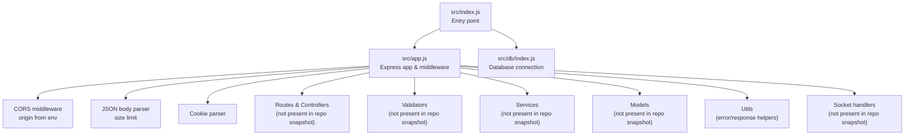
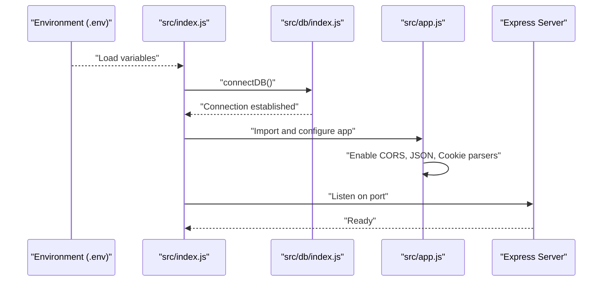
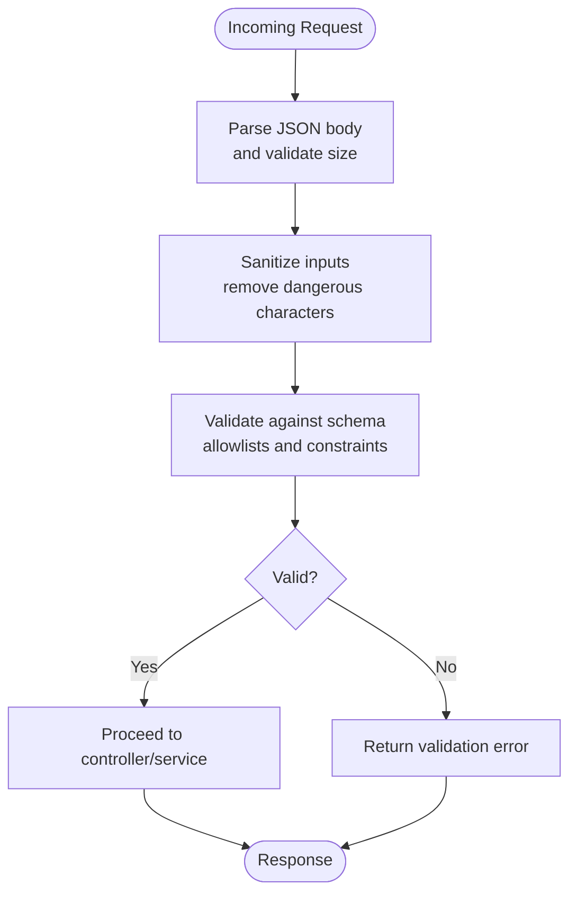
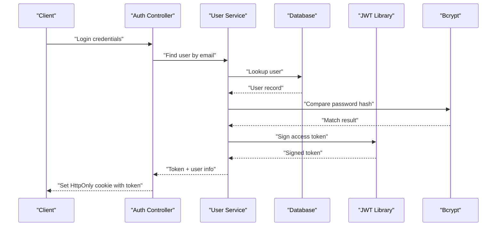
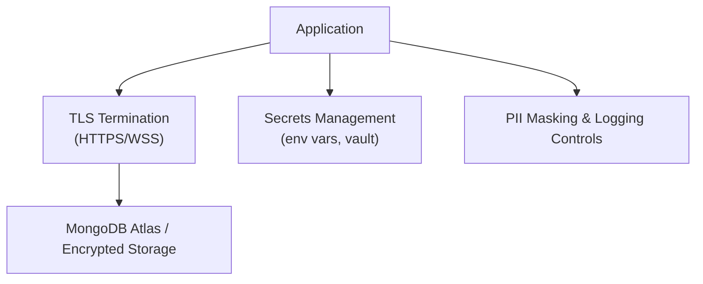
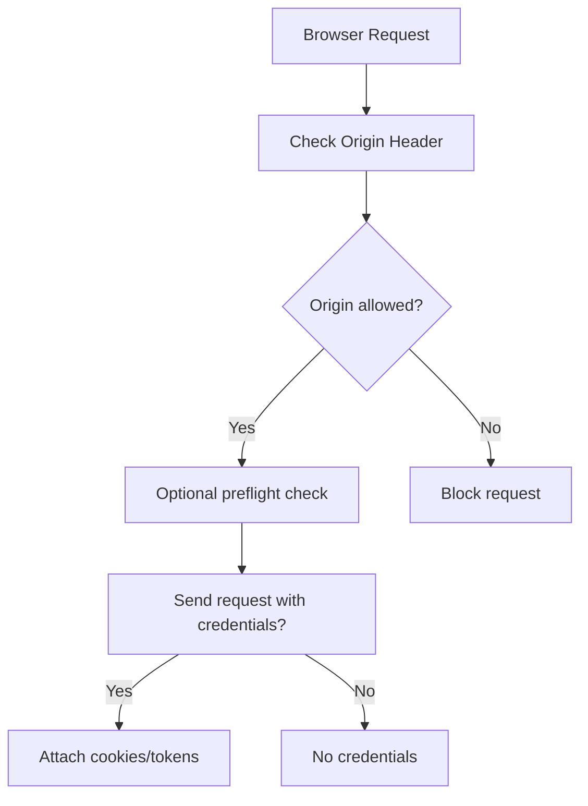
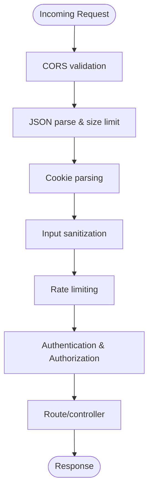
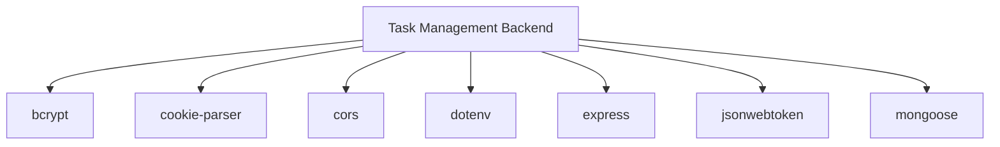

# Security Considerations

<cite>
**Referenced Files in This Document**
- [package.json](file://package.json)
- [src/app.js](file://src/app.js)
- [src/index.js](file://src/index.js)
- [src/db/index.js](file://src/db/index.js)
- [src/utils/ApiError.js](file://src/utils/ApiError.js)
- [src/utils/ApiResponse.js](file://src/utils/ApiResponse.js)
- [src/utils/asyncHandler.js](file://src/utils/asyncHandler.js)
- [src/sockets/socketHandler.js](file://src/sockets/socketHandler.js)
</cite>

## Table of Contents
1. [Introduction](#introduction)
2. [Project Structure](#project-structure)
3. [Core Components](#core-components)
4. [Architecture Overview](#architecture-overview)
5. [Detailed Component Analysis](#detailed-component-analysis)
6. [Dependency Analysis](#dependency-analysis)
7. [Performance Considerations](#performance-considerations)
8. [Troubleshooting Guide](#troubleshooting-guide)
9. [Conclusion](#conclusion)
10. [Appendices](#appendices)

## Introduction
This document provides comprehensive security documentation for the Task Management System Backend. It focuses on input validation strategies, authentication security measures, data protection practices, CORS configuration, middleware security patterns, security testing, incident response, and compliance considerations. Where applicable, the analysis references actual source files in the repository to ground recommendations in the current implementation.

## Project Structure
The backend follows a modular Express-based structure with configuration, routing, controllers, services, models, validators, utilities, and middleware areas. Security-relevant configuration is primarily set in the application bootstrap and environment variables.

**Diagram sources**
- [src/index.js](file://src/index.js#L1-L18)
- [src/app.js](file://src/app.js#L1-L16)
- [src/db/index.js](file://src/db/index.js)

**Section sources**
- [src/index.js](file://src/index.js#L1-L18)
- [src/app.js](file://src/app.js#L1-L16)

## Core Components
- Application bootstrap and middleware initialization
- Environment-driven CORS configuration
- JSON body parsing with size limits
- Cookie parsing
- Database connectivity

Key security-relevant observations:
- CORS origin is configured via an environment variable, enabling centralized control.
- Body parsing enforces a maximum payload size, reducing risk of resource exhaustion.
- Cookie parsing is enabled, which is foundational for session and token handling.

**Section sources**
- [src/app.js](file://src/app.js#L1-L16)
- [src/index.js](file://src/index.js#L1-L18)

## Architecture Overview
The backend initializes environment configuration, connects to the database, and starts the Express server. Middleware is registered early to intercept requests and apply security controls.

**Diagram sources**
- [src/index.js](file://src/index.js#L1-L18)
- [src/app.js](file://src/app.js#L1-L16)
- [src/db/index.js](file://src/db/index.js)

## Detailed Component Analysis

### Input Validation Strategies
Current implementation highlights:
- JSON body parsing with a size cap to mitigate large payload attacks.
- Cookie parsing support for token-based sessions.

Recommended enhancements (to be implemented):
- Request body sanitization and schema validation using libraries such as Joi or express-validator.
- Parameter validation for route parameters and query strings.
- Malicious input detection via allowlists, length limits, and character validation.

[No sources needed since this diagram shows conceptual workflow, not actual code structure]

**Section sources**
- [src/app.js](file://src/app.js#L12-L13)

### Authentication Security Measures
Current implementation highlights:
- Presence of bcrypt and jsonwebtoken in dependencies indicates potential for password hashing and JWT-based authentication.

Recommended implementation (to be added):
- Password hashing using bcrypt with secure rounds and salt generation.
- JWT token issuance with short-lived access tokens and refresh tokens stored securely (HttpOnly cookies).
- Session management best practices: secure flags, SameSite policies, and rotation strategies.

[No sources needed since this diagram shows conceptual workflow, not actual code structure]

**Section sources**
- [package.json](file://package.json#L14-L22)

### Data Protection Practices
Current implementation highlights:
- MongoDB driver usage via Mongoose suggests server-side storage.

Recommended practices (to be implemented):
- Encryption at rest: enable MongoDB encryption options and manage keys securely.
- Secure transmission: enforce TLS/HTTPS for all endpoints and WebSocket connections.
- Sensitive data handling: avoid logging secrets, mask PII, and apply field-level encryption for sensitive attributes.

[No sources needed since this diagram shows conceptual workflow, not actual code structure]

**Section sources**
- [package.json](file://package.json#L21-L21)
- [src/db/index.js](file://src/db/index.js)

### CORS Configuration Security
Current implementation highlights:
- CORS origin is configurable via environment variable.

Security guidance:
- Set origin to explicit domains only.
- Disable credentials (cookies/tokens) when not required.
- Add preflight checks and strict headers for exposed credentials.

[No sources needed since this diagram shows conceptual workflow, not actual code structure]

**Section sources**
- [src/app.js](file://src/app.js#L8-L10)

### Middleware Security Patterns
Current implementation highlights:
- Early registration of CORS, JSON, and cookie parsers.

Recommended middleware additions (to be implemented):
- Request sanitization middleware to normalize and escape inputs.
- Rate limiting middleware to prevent brute force and abuse.
- Access control middleware to enforce RBAC and permissions.

[No sources needed since this diagram shows conceptual workflow, not actual code structure]

**Section sources**
- [src/app.js](file://src/app.js#L8-L13)

### Security Testing Strategies
Recommended testing approaches:
- Static analysis: lint rules, secret scanning, dependency vulnerability scans.
- Dynamic analysis: OWASP ZAP, Burp Suite for authenticated flows.
- Penetration testing: structured red team exercises with signed agreements.
- Input validation tests: boundary conditions, injection vectors, malformed payloads.
- Authentication tests: token replay, CSRF, session fixation, brute force.

[No sources needed since this section provides general guidance]

### Vulnerability Assessment and Penetration Testing Guidelines
- Scope definition: APIs, web UI, WebSocket endpoints.
- Methodology: recon, enumeration, exploitation, post-exploitation.
- Reporting: severity classification, remediation steps, evidence collection.
- Compliance: align assessments with organizational standards and frameworks.

[No sources needed since this section provides general guidance]

### Incident Response Procedures
- Detection: logs, metrics, alerts, SIEM correlation.
- Containment: isolate affected systems, revoke compromised tokens, rotate secrets.
- Eradication: patch vulnerabilities, remove backdoors, update configurations.
- Recovery: restore from clean backups, validate integrity, monitor closely.
- Post-incident: review, update policies, retrain staff.

[No sources needed since this section provides general guidance]

### Security Monitoring and Logging Best Practices
- Structured logging with correlation IDs and timestamps.
- Centralized log aggregation with retention policies.
- Real-time alerting for anomalies and repeated failures.
- Audit logs for privileged actions and sensitive operations.

[No sources needed since this section provides general guidance]

### Compliance Requirements, Data Privacy, and Audit Preparation
- Data privacy: define data categories, obtain consent, implement data minimization.
- Regulatory alignment: GDPR, CCPA, HIPAA depending on jurisdiction and data handled.
- Audit readiness: maintain change logs, access records, security policies, and training attestations.

[No sources needed since this section provides general guidance]

## Dependency Analysis
External dependencies relevant to security:
- bcrypt: password hashing
- cookie-parser: cookie parsing
- cors: cross-origin policy enforcement
- dotenv: environment configuration
- express: web framework
- jsonwebtoken: JWT handling
- mongoose: MongoDB ODM

**Diagram sources**
- [package.json](file://package.json#L14-L22)

**Section sources**
- [package.json](file://package.json#L14-L22)

## Performance Considerations
- Enforce request size limits to prevent memory exhaustion.
- Use efficient hashing parameters for bcrypt to balance security and performance.
- Apply caching judiciously to reduce database load while preserving security.

[No sources needed since this section provides general guidance]

## Troubleshooting Guide
- CORS errors: verify environment variable for origin and ensure wildcard usage is intentional.
- JSON parsing errors: confirm client sends valid JSON and respects size limits.
- Cookie-related issues: ensure SameSite and Secure flags are configured appropriately for production.

[No sources needed since this section provides general guidance]

## Conclusion
The Task Management System Backend currently establishes a foundation for security through environment-driven CORS, JSON size limits, and cookie parsing. To achieve robust security posture, integrate comprehensive input validation, authentication with JWT and bcrypt, encryption at rest and in transit, strict CORS policies, and a suite of middleware for sanitization, rate limiting, and access control. Implement continuous security testing, incident response procedures, and compliance-aligned governance to protect users and meet regulatory obligations.

## Appendices
- Environment variables to configure:
  - CORS origin for trusted domains
  - Database connection string with TLS
  - Secret keys for JWT signing
  - Cookie security flags (Secure, HttpOnly, SameSite)
- Operational checklists:
  - Review dependency versions for known vulnerabilities
  - Validate TLS certificates and cipher suites
  - Confirm audit logging coverage for sensitive operations

[No sources needed since this section provides general guidance]