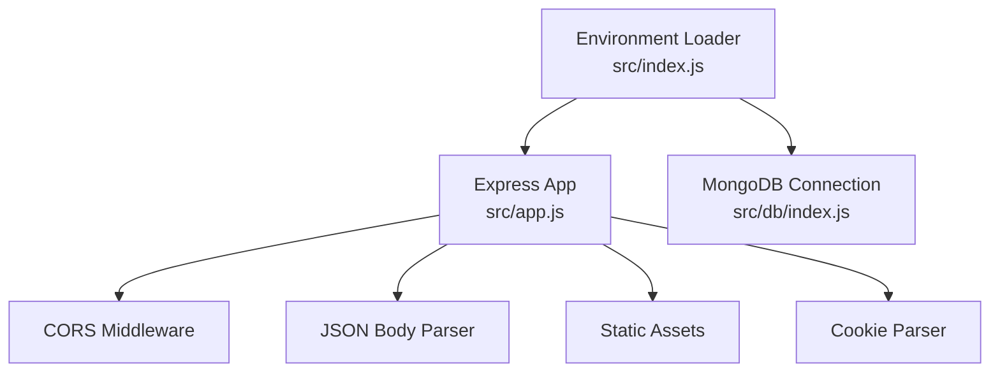
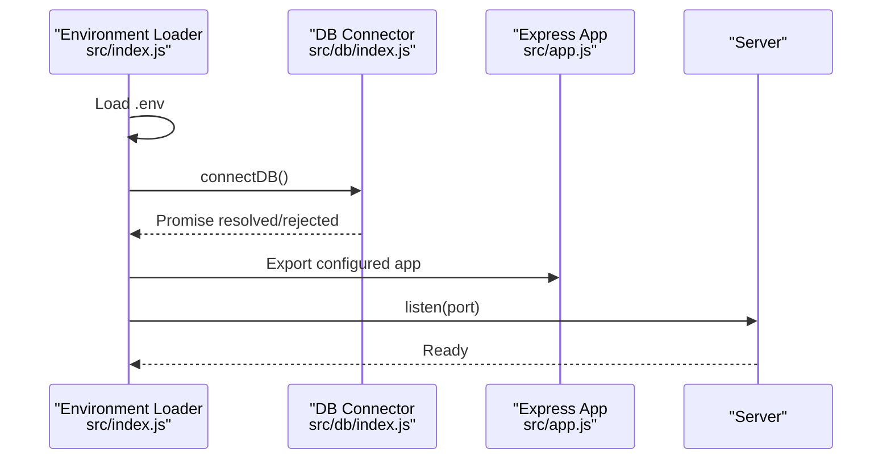
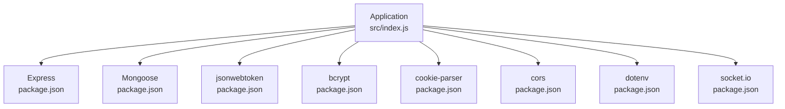

# Security Testing

<cite>
**Referenced Files in This Document**
- [src/app.js](file://src/app.js)
- [src/index.js](file://src/index.js)
- [src/db/index.js](file://src/db/index.js)
- [src/utils/asyncHandler.js](file://src/utils/asyncHandler.js)
- [package.json](file://package.json)
- [package-lock.json](file://package-lock.json)
</cite>

## Table of Contents
1. [Introduction](#introduction)
2. [Project Structure](#project-structure)
3. [Core Components](#core-components)
4. [Architecture Overview](#architecture-overview)
5. [Detailed Component Analysis](#detailed-component-analysis)
6. [Dependency Analysis](#dependency-analysis)
7. [Performance Considerations](#performance-considerations)
8. [Troubleshooting Guide](#troubleshooting-guide)
9. [Conclusion](#conclusion)
10. [Appendices](#appendices)

## Introduction
This document provides a comprehensive security testing guide for the Task Management System Backend. It outlines vulnerability assessment methodologies, including penetration testing, automated security scanning, and manual code review. It also documents testing strategies for authentication systems, input validation, and authorization mechanisms, along with security regression testing and continuous security integration practices. Guidance is included for validating performance impact and optimization strategies, as well as incident response and disaster recovery validation.

## Project Structure
The backend is a Node.js/Express application configured via environment variables and connected to MongoDB using Mongoose. Key initialization points include environment loading, database connection, and server startup. Express middleware stack includes CORS, JSON body parsing, static asset serving, and cookie parsing.

**Diagram sources**
- [src/index.js](file://src/index.js#L1-L18)
- [src/app.js](file://src/app.js#L1-L15)
- [src/db/index.js](file://src/db/index.js#L1-L14)

**Section sources**
- [src/index.js](file://src/index.js#L1-L18)
- [src/app.js](file://src/app.js#L1-L15)
- [src/db/index.js](file://src/db/index.js#L1-L14)

## Core Components
- Express application bootstrap and middleware configuration
- Environment-driven CORS policy and JSON payload limits
- Database connection using Mongoose with environment URI
- Utility wrapper for async route handlers

Security-relevant observations:
- CORS origin is controlled by an environment variable, which should be validated during testing.
- JSON payload size limit is set; this impacts potential denial-of-service vectors and should be considered in load and fuzzing tests.
- Static asset serving is enabled; ensure proper file permissions and content-type controls.
- Cookie parsing is enabled; session cookies and CSRF protection should be validated.
- Asynchronous handler wrapper centralizes error propagation to Express error handlers.

**Section sources**
- [src/app.js](file://src/app.js#L1-L15)
- [src/index.js](file://src/index.js#L1-L18)
- [src/db/index.js](file://src/db/index.js#L1-L14)
- [src/utils/asyncHandler.js](file://src/utils/asyncHandler.js#L1-L7)

## Architecture Overview
The system initializes environment variables, connects to MongoDB, and starts an Express server. Middleware configuration establishes transport-level protections and request parsing behavior.

**Diagram sources**
- [src/index.js](file://src/index.js#L1-L18)
- [src/db/index.js](file://src/db/index.js#L1-L14)
- [src/app.js](file://src/app.js#L1-L15)

## Detailed Component Analysis

### Express App and Middleware Security Implications
- CORS: Controlled by environment variable; misconfiguration can enable cross-origin attacks.
- JSON body parsing: Payload size limit set; affects request smuggling and DoS scenarios.
- Static assets: Public directory served; ensure sensitive files are not exposed.
- Cookies: Parsed globally; CSRF tokens and SameSite policies should be enforced at route level.

Recommended security validations:
- Verify CORS origin allows only trusted domains.
- Test JSON payload limits under load and with malformed payloads.
- Scan static assets for sensitive files and enforce content-type security headers.
- Enforce CSRF protection and SameSite attributes for session cookies.

**Section sources**
- [src/app.js](file://src/app.js#L1-L15)

### Database Connection and Data Protection
- MongoDB connection uses an environment URI; ensure secrets are not logged and URI is properly sanitized.
- Connection errors should not expose internal details.

Security validations:
- Confirm logs do not include full connection URIs.
- Validate that connection failures are handled gracefully without leaking information.

**Section sources**
- [src/db/index.js](file://src/db/index.js#L1-L14)

### Async Handler Utility
- Centralized error propagation to Express error handlers.
- Improper use can mask errors or cause unhandled rejections.

Security validations:
- Ensure all route handlers are wrapped consistently.
- Verify error handler does not leak sensitive data.

**Section sources**
- [src/utils/asyncHandler.js](file://src/utils/asyncHandler.js#L1-L7)

### Authentication Systems
Current state:
- No authentication routes, middleware, or token verification logic are present in the examined files.

Testing strategy:
- Define authentication endpoints and middleware.
- Implement token issuance and validation with secure signing and short expiration.
- Enforce CSRF protection for state-changing requests.
- Validate session storage and cookie security attributes.

Note: Until authentication endpoints and middleware are implemented, penetration tests should focus on identifying missing protections and ensuring no accidental exposure of administrative functions.

[No sources needed since this section provides general guidance]

### Authorization Mechanisms
Current state:
- No authorization enforcement logic is present in the examined files.

Testing strategy:
- Define roles and permissions.
- Implement route-level guards and resource-based checks.
- Validate least-privilege access and consistent enforcement across endpoints.

[No sources needed since this section provides general guidance]

### Input Validation
Current state:
- JSON body parsing is enabled with a size limit; no schema validation or sanitization logic is present in the examined files.

Testing strategy:
- Add schema validation (e.g., Joi, Zod) and sanitization for all inputs.
- Validate that invalid payloads are rejected with appropriate status codes.
- Test boundary conditions around the JSON size limit.

**Section sources**
- [src/app.js](file://src/app.js#L12-L12)

### Security Scanning and Automated Testing Integration
Recommended tools and integration points:
- OWASP ZAP: Passive and active scan against development and staging environments.
- Burp Suite: Manual exploration and targeted active scanning.
- SAST: ESLint with security plugins and npm audit for dependency vulnerabilities.
- DAST: Integrate ZAP/Burp scans in CI pipelines with failure thresholds.
- Secrets detection: Pre-commit hooks and CI scans for exposed keys.

[No sources needed since this section provides general guidance]

### Penetration Testing Methodologies
- Reconnaissance: Identify endpoints, headers, and cookies.
- Enumeration: Discover authentication and authorization boundaries.
- Exploitation: Attempt injection, CSRF, and session manipulation.
- Privilege Escalation: Validate least-privilege and role-based access.
- Persistence: Check for insecure configurations enabling long-term access.

[No sources needed since this section provides general guidance]

### Manual Code Review Processes
- Authentication and authorization logic verification.
- Input validation and sanitization coverage.
- Error handling and information disclosure prevention.
- Logging and monitoring completeness.
- Dependency security posture review.

[No sources needed since this section provides general guidance]

### Security Regression Testing Practices
- Maintain a dedicated regression suite covering OWASP Top 10.
- Run regression tests on every build with security-focused assertions.
- Track and remediate regressions promptly.

[No sources needed since this section provides general guidance]

### Continuous Security Integration
- Pre-commit hooks for linting and secret detection.
- CI pipeline stages for SAST, DAST, and dependency checks.
- Security gates blocking deployments with high-severity findings.

[No sources needed since this section provides general guidance]

### Security Testing Checklists
Common vulnerability checks:
- Cross-Site Scripting (XSS): Validate output encoding and Content-Type headers.
- Cross-Site Request Forgery (CSRF): Verify anti-CSRF tokens for state-changing requests.
- SQL Injection: Ensure ORM usage and parameterized queries; validate input handling.
- Authentication Bypass: Confirm authentication enforcement and session management.

[No sources needed since this section provides general guidance]

## Dependency Analysis
The backend relies on Express, Mongoose, bcrypt, jsonwebtoken, cookie-parser, cors, dotenv, and socket.io. These dependencies introduce various attack surfaces and require regular security updates and audits.

**Diagram sources**
- [package.json](file://package.json#L14-L26)
- [src/index.js](file://src/index.js#L1-L18)

**Section sources**
- [package.json](file://package.json#L14-L26)
- [package-lock.json](file://package-lock.json#L1-L896)

## Performance Considerations
- JSON payload size limit reduces memory pressure but may affect legitimate large requests; adjust cautiously and monitor GC behavior.
- CORS misconfiguration can increase latency due to preflight overhead; validate origins and headers.
- Static asset serving should leverage caching and compression; ensure only intended files are exposed.
- Database connection pooling and timeouts should be tuned to balance responsiveness and resource usage.

[No sources needed since this section provides general guidance]

## Troubleshooting Guide
- Environment variables not loaded: Verify .env presence and path resolution.
- Database connection failures: Check URI format and network connectivity; avoid logging full URIs.
- CORS errors: Confirm allowed origin matches client domain and protocol.
- JSON parse errors: Validate client payloads and size limits; implement proper error responses.

**Section sources**
- [src/index.js](file://src/index.js#L5-L7)
- [src/db/index.js](file://src/db/index.js#L5-L10)
- [src/app.js](file://src/app.js#L8-L13)

## Conclusion
The Task Management System Backend currently lacks explicit authentication, authorization, and input validation logic in the examined files. Security testing should prioritize implementing robust authentication and authorization, enforcing input validation and sanitization, and integrating automated security scanning into CI. Ongoing regression testing and performance tuning will ensure a secure and resilient deployment.

## Appendices
- Incident Response Testing: Simulate common incidents (data breach, DoS, credential theft) and validate detection, containment, and recovery procedures.
- Disaster Recovery Validation: Periodically restore from backups, validate data consistency, and confirm service availability.

[No sources needed since this section provides general guidance]