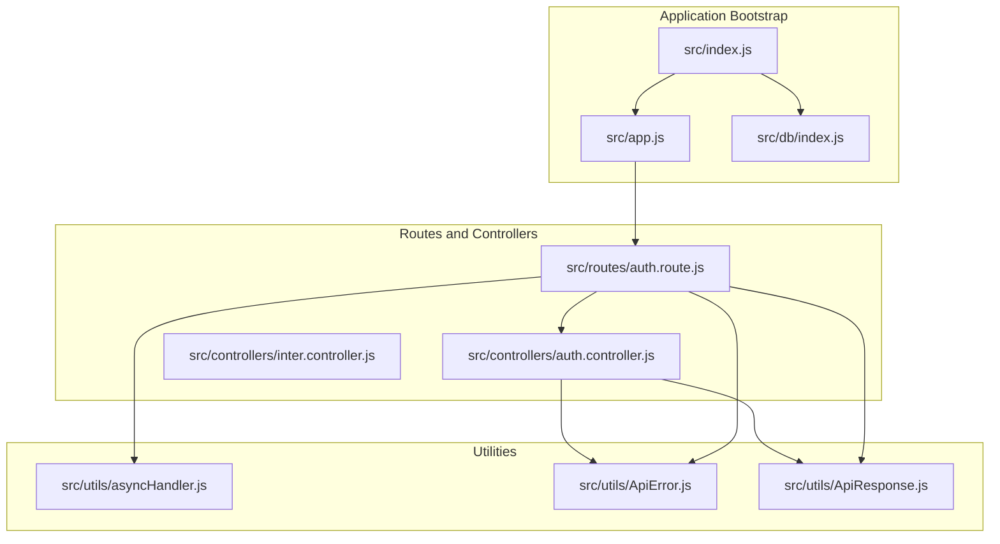
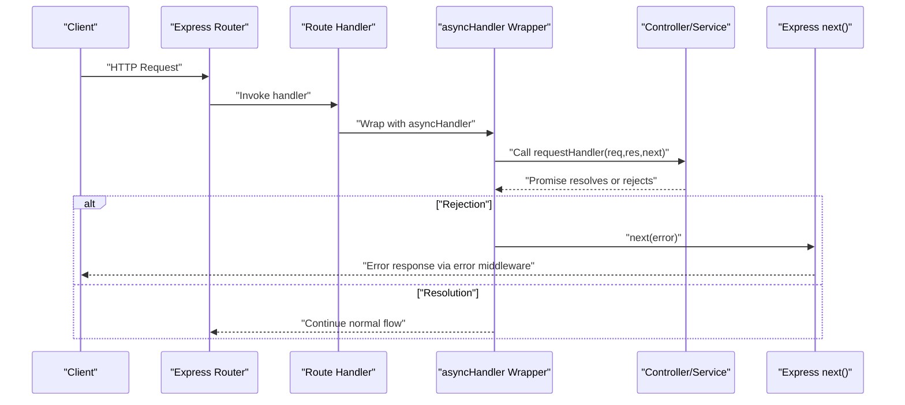
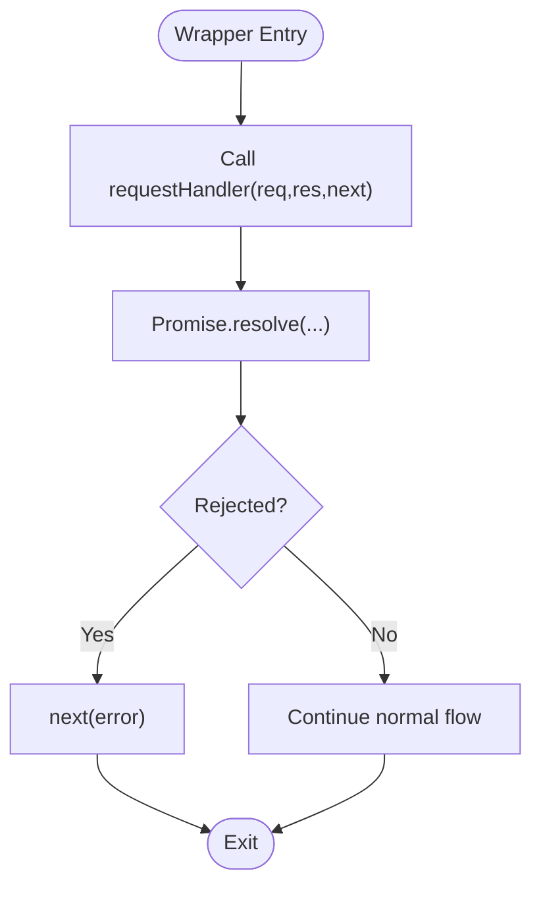
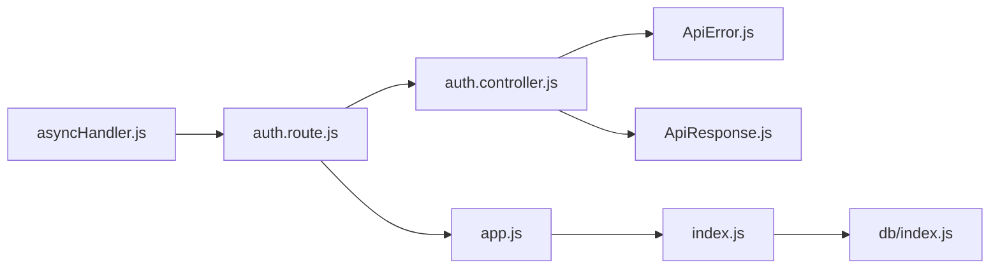

# Async Utilities

<cite>
**Referenced Files in This Document**
- [asyncHandler.js](file://src/utils/asyncHandler.js)
- [ApiError.js](file://src/utils/ApiError.js)
- [ApiResponse.js](file://src/utils/ApiResponse.js)
- [auth.controller.js](file://src/controllers/auth.controller.js)
- [auth.route.js](file://src/routes/auth.route.js)
- [inter.controller.js](file://src/controllers/inter.controller.js)
- [index.js](file://src/index.js)
- [app.js](file://src/app.js)
- [db/index.js](file://src/db/index.js)
</cite>

## Table of Contents
1. [Introduction](#introduction)
2. [Project Structure](#project-structure)
3. [Core Components](#core-components)
4. [Architecture Overview](#architecture-overview)
5. [Detailed Component Analysis](#detailed-component-analysis)
6. [Dependency Analysis](#dependency-analysis)
7. [Performance Considerations](#performance-considerations)
8. [Troubleshooting Guide](#troubleshooting-guide)
9. [Conclusion](#conclusion)
10. [Appendices](#appendices)

## Introduction
This document explains the asyncHandler utility that simplifies asynchronous error handling in the Task Management System. It focuses on the function signature, parameter requirements, middleware integration patterns, and how asyncHandler wraps async route handlers to automatically forward promise rejections to Express error handling middleware. It also covers practical usage in routes, controllers, and services, along with performance, memory, and best practices for async/await error handling.

## Project Structure
The asyncHandler utility resides under src/utils and integrates with Express routes and controllers. The application bootstraps via src/index.js, configures middleware in src/app.js, connects to MongoDB via src/db/index.js, and exposes controllers and routes under src/controllers and src/routes respectively.

**Diagram sources**
- [index.js](file://src/index.js#L1-L18)
- [app.js](file://src/app.js#L1-L16)
- [db/index.js](file://src/db/index.js#L1-L14)
- [asyncHandler.js](file://src/utils/asyncHandler.js#L1-L8)
- [ApiError.js](file://src/utils/ApiError.js#L1-L21)
- [ApiResponse.js](file://src/utils/ApiResponse.js)
- [auth.route.js](file://src/routes/auth.route.js)
- [auth.controller.js](file://src/controllers/auth.controller.js)
- [inter.controller.js](file://src/controllers/inter.controller.js)

**Section sources**
- [index.js](file://src/index.js#L1-L18)
- [app.js](file://src/app.js#L1-L16)
- [db/index.js](file://src/db/index.js#L1-L14)
- [asyncHandler.js](file://src/utils/asyncHandler.js#L1-L8)

## Core Components
- asyncHandler: A thin wrapper that takes an Express route handler and returns a function compatible with Express middleware signatures. It resolves the handler’s return value as a Promise and forwards any rejection to the next() callback for centralized error handling.
- ApiError: An Error subclass used to represent structured API errors with status codes, messages, and optional stacks.
- ApiResponse: Utility for consistent API responses (referenced in controller usage).

Key characteristics:
- Signature: asyncHandler(requestHandler) returns a function with Express middleware signature (req, res, next).
- Behavior: Wraps the provided handler in Promise.resolve and catches rejections to pass them to next().
- Integration: Used inline around route handlers to convert thrown or rejected promises into Express error middleware.

**Section sources**
- [asyncHandler.js](file://src/utils/asyncHandler.js#L1-L8)
- [ApiError.js](file://src/utils/ApiError.js#L1-L21)

## Architecture Overview
The asyncHandler sits between Express routes and controllers/services, ensuring that any unhandled promise rejections in async handlers are captured and forwarded to Express’s error-handling pipeline.

**Diagram sources**
- [asyncHandler.js](file://src/utils/asyncHandler.js#L1-L8)
- [auth.route.js](file://src/routes/auth.route.js)
- [auth.controller.js](file://src/controllers/auth.controller.js)

## Detailed Component Analysis

### asyncHandler Implementation
- Purpose: Normalize async route handlers so that thrown/rejected promises are consistently forwarded to Express error middleware.
- Parameters:
  - requestHandler: An Express route handler function that may return a Promise or throw synchronously.
- Return value: A function compatible with Express middleware signature (req, res, next).
- Mechanism:
  - Promise.resolve(requestHandler(...)) ensures synchronous throws become rejected promises.
  - .catch(error => next(error)) forwards any rejection to the next() callback.

**Diagram sources**
- [asyncHandler.js](file://src/utils/asyncHandler.js#L1-L8)

**Section sources**
- [asyncHandler.js](file://src/utils/asyncHandler.js#L1-L8)

### Middleware Integration Patterns
- Route-level wrapping: Apply asyncHandler around route handlers to ensure async errors are handled centrally.
- Controller-level usage: When controllers call service functions that return Promises, wrap the controller method with asyncHandler to capture errors.
- Service-level functions: While asyncHandler is primarily used around handlers, service functions can still throw/reject; wrapping ensures they surface to Express error middleware.

Practical integration points:
- Routes import asyncHandler and wrap controller methods.
- Controllers may throw ApiError instances or return rejected promises; asyncHandler forwards them to next().
- Error middleware in Express receives the forwarded error for standardized responses.

**Section sources**
- [auth.route.js](file://src/routes/auth.route.js)
- [auth.controller.js](file://src/controllers/auth.controller.js)
- [inter.controller.js](file://src/controllers/inter.controller.js)

### Practical Usage Examples
- Route handler wrapping: Wrap the controller method passed to router.get/post/etc. with asyncHandler to handle async operations inside the controller.
- Controller method wrapping: If a controller method performs async work (e.g., database queries), wrap it with asyncHandler to ensure errors propagate to Express error middleware.
- Service function integration: Even if service functions throw/reject, the surrounding controller or route wrapper ensures they reach next().

Note: The repository demonstrates usage patterns with asyncHandler around route handlers and controllers, and with ApiError thrown in controllers.

**Section sources**
- [auth.route.js](file://src/routes/auth.route.js)
- [auth.controller.js](file://src/controllers/auth.controller.js)
- [inter.controller.js](file://src/controllers/inter.controller.js)

### Error Model Integration
- ApiError: Provides a structured way to represent errors with status codes and messages. Controllers can throw ApiError instances, which asyncHandler forwards to next(), enabling centralized error handling.
- ApiResponse: Used alongside controllers to standardize successful responses.

**Section sources**
- [ApiError.js](file://src/utils/ApiError.js#L1-L21)
- [auth.controller.js](file://src/controllers/auth.controller.js)

## Dependency Analysis
- asyncHandler depends on Express middleware signatures and the next() callback to propagate errors.
- Controllers depend on ApiError for throwing structured errors and on asyncHandler to forward them.
- Routes depend on asyncHandler to wrap controller methods.
- Application bootstrap depends on Express app configuration and database connection.

**Diagram sources**
- [asyncHandler.js](file://src/utils/asyncHandler.js#L1-L8)
- [auth.route.js](file://src/routes/auth.route.js)
- [auth.controller.js](file://src/controllers/auth.controller.js)
- [ApiError.js](file://src/utils/ApiError.js#L1-L21)
- [ApiResponse.js](file://src/utils/ApiResponse.js)
- [app.js](file://src/app.js#L1-L16)
- [index.js](file://src/index.js#L1-L18)
- [db/index.js](file://src/db/index.js#L1-L14)

**Section sources**
- [asyncHandler.js](file://src/utils/asyncHandler.js#L1-L8)
- [auth.route.js](file://src/routes/auth.route.js)
- [auth.controller.js](file://src/controllers/auth.controller.js)
- [ApiError.js](file://src/utils/ApiError.js#L1-L21)
- [app.js](file://src/app.js#L1-L16)
- [index.js](file://src/index.js#L1-L18)
- [db/index.js](file://src/db/index.js#L1-L14)

## Performance Considerations
- Overhead: The wrapper introduces minimal overhead by wrapping the handler in Promise.resolve and adding a single catch handler. This cost is negligible compared to typical async operations (e.g., database calls).
- Memory: No persistent state is maintained; each invocation creates a closure around the provided requestHandler. Memory footprint scales linearly with concurrent requests.
- Best practices:
  - Prefer wrapping route handlers and controller methods with asyncHandler to avoid scattered try/catch blocks.
  - Keep async operations coarse-grained to minimize repeated wrapping overhead.
  - Avoid unnecessary Promise allocations inside hot paths; rely on asyncHandler to normalize errors.

[No sources needed since this section provides general guidance]

## Troubleshooting Guide
- Symptom: Uncaught promise rejections crash the server.
  - Fix: Ensure all async route handlers and controller methods are wrapped with asyncHandler.
- Symptom: Errors are not formatted consistently.
  - Fix: Throw ApiError instances in controllers and ensure Express error middleware handles them.
- Debugging async errors:
  - Log the error object in Express error middleware to inspect stack traces.
  - Verify that asyncHandler is applied around the route handler and that next() is invoked after catching errors.
- Database connectivity:
  - Confirm database connection is established before starting the server; errors during connection are handled in the bootstrap logic.

**Section sources**
- [auth.controller.js](file://src/controllers/auth.controller.js)
- [ApiError.js](file://src/utils/ApiError.js#L1-L21)
- [index.js](file://src/index.js#L11-L17)
- [db/index.js](file://src/db/index.js#L1-L14)

## Conclusion
The asyncHandler utility provides a concise and reliable mechanism to centralize error handling for async Express route handlers. By wrapping handlers and forwarding rejections to next(), it enables consistent use of ApiError and streamlined debugging. Combined with proper middleware integration and structured error modeling, it improves maintainability and reduces boilerplate error handling across routes, controllers, and services.

[No sources needed since this section summarizes without analyzing specific files]

## Appendices

### API Reference: asyncHandler
- Function: asyncHandler(requestHandler)
- Parameters:
  - requestHandler: Express route handler function (req, res, next)
- Returns: Express middleware-compatible function
- Behavior:
  - Calls requestHandler with Express arguments
  - Converts synchronous throws to rejected promises
  - Forwards any rejection to next(error)

**Section sources**
- [asyncHandler.js](file://src/utils/asyncHandler.js#L1-L8)

### Integration Checklist
- Wrap all async route handlers with asyncHandler.
- Throw ApiError in controllers for structured errors.
- Ensure Express error middleware exists to handle forwarded errors.
- Verify database connection is established before listening.

**Section sources**
- [auth.route.js](file://src/routes/auth.route.js)
- [auth.controller.js](file://src/controllers/auth.controller.js)
- [ApiError.js](file://src/utils/ApiError.js#L1-L21)
- [index.js](file://src/index.js#L11-L17)
- [db/index.js](file://src/db/index.js#L1-L14)