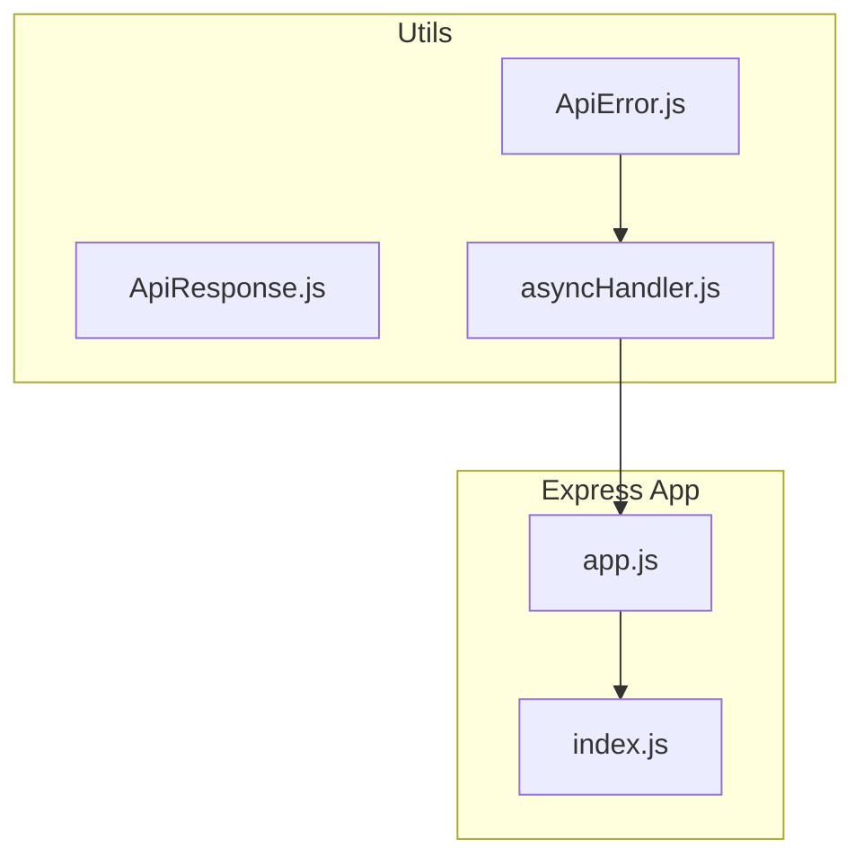
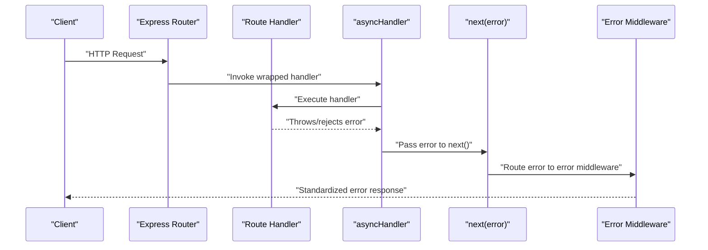
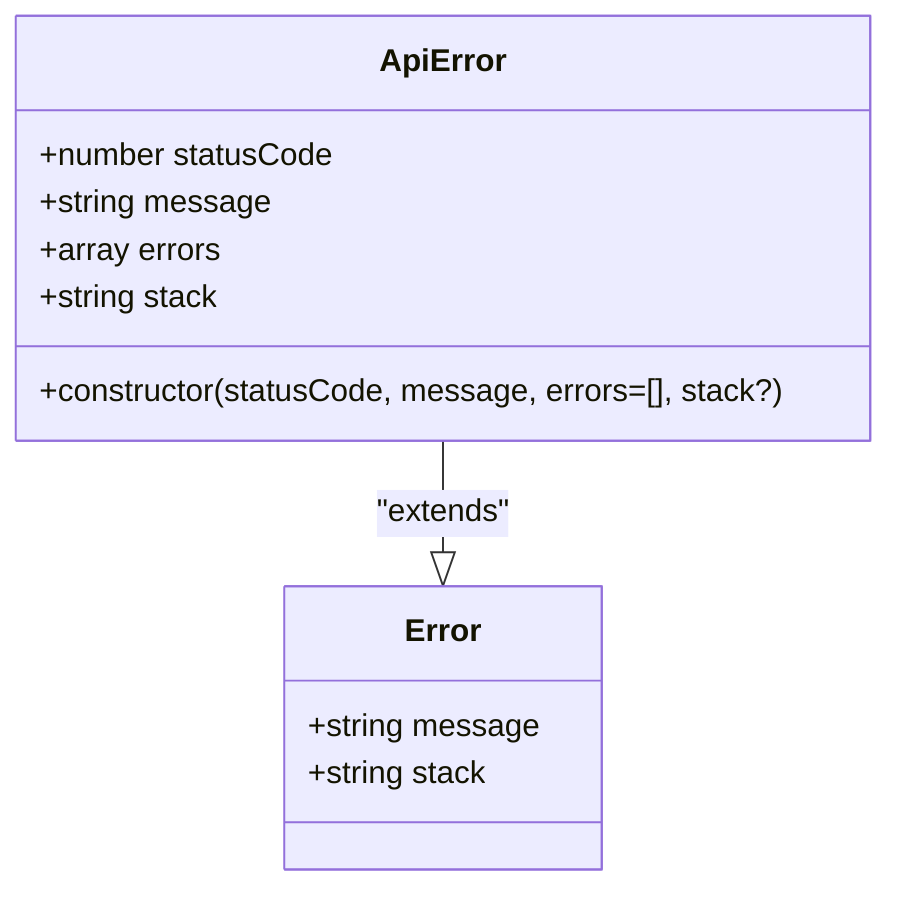
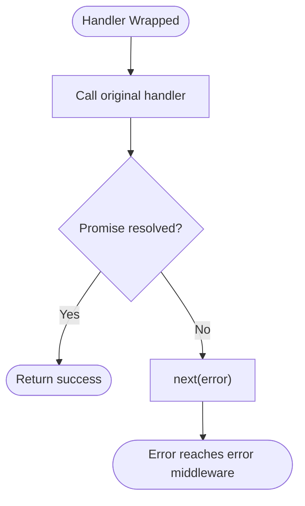
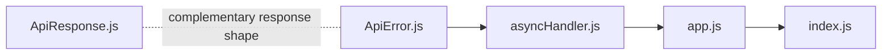

# Error Handling

<cite>
**Referenced Files in This Document**
- [ApiError.js](file://src/utils/ApiError.js)
- [ApiResponse.js](file://src/utils/ApiResponse.js)
- [asyncHandler.js](file://src/utils/asyncHandler.js)
- [app.js](file://src/app.js)
- [index.js](file://src/index.js)
</cite>

## Table of Contents
1. [Introduction](#introduction)
2. [Project Structure](#project-structure)
3. [Core Components](#core-components)
4. [Architecture Overview](#architecture-overview)
5. [Detailed Component Analysis](#detailed-component-analysis)
6. [Dependency Analysis](#dependency-analysis)
7. [Performance Considerations](#performance-considerations)
8. [Troubleshooting Guide](#troubleshooting-guide)
9. [Conclusion](#conclusion)

## Introduction
This document explains the error handling implementation centered around the ApiError class in the Task Management System backend. It covers the constructor parameters, standardized error response format, integration with Express.js middleware, and propagation patterns through controllers and async handlers. It also provides guidelines for extending ApiError with custom error types and maintaining consistent error responses across the application.

## Project Structure
The error-handling-related utilities live under src/utils and integrate with the Express application bootstrap in src/app.js and src/index.js. The async handler utility wraps route handlers to forward thrown or rejected errors to Express’s error middleware.

**Diagram sources**
- [ApiError.js](file://src/utils/ApiError.js#L1-L21)
- [ApiResponse.js](file://src/utils/ApiResponse.js#L1-L16)
- [asyncHandler.js](file://src/utils/asyncHandler.js#L1-L7)
- [app.js](file://src/app.js#L1-L16)
- [index.js](file://src/index.js#L1-L18)

**Section sources**
- [ApiError.js](file://src/utils/ApiError.js#L1-L21)
- [ApiResponse.js](file://src/utils/ApiResponse.js#L1-L16)
- [asyncHandler.js](file://src/utils/asyncHandler.js#L1-L7)
- [app.js](file://src/app.js#L1-L16)
- [index.js](file://src/index.js#L1-L18)

## Core Components
- ApiError: A custom error class extending JavaScript’s native Error. It standardizes error metadata including status code, message, and optional nested errors. It optionally accepts a stack trace to preserve or override stack information.
- asyncHandler: A utility that wraps async route handlers so unhandled promise rejections and thrown errors are forwarded to Express’s error middleware via next(error).
- ApiResponse: A companion class that standardizes successful API responses with status, data, and message fields. While not an error response, it complements ApiError by ensuring consistent response shapes.

Key characteristics:
- ApiError preserves the native Error behavior while adding structured fields for HTTP status codes and error lists.
- asyncHandler ensures that errors thrown inside route handlers propagate to Express’s error middleware automatically.
- ApiResponse provides a symmetric structure for success responses, aiding uniformity across the API.

**Section sources**
- [ApiError.js](file://src/utils/ApiError.js#L1-L21)
- [asyncHandler.js](file://src/utils/asyncHandler.js#L1-L7)
- [ApiResponse.js](file://src/utils/ApiResponse.js#L1-L16)

## Architecture Overview
The error lifecycle in the system follows a predictable flow:
- Route handlers are wrapped by asyncHandler.
- Errors thrown or promises rejected inside handlers are caught and passed to next(error).
- Express routes the error to the application’s error middleware chain.
- The error middleware can inspect ApiError fields (status code, message, nested errors) to produce a consistent error response.

**Diagram sources**
- [asyncHandler.js](file://src/utils/asyncHandler.js#L1-L7)
- [ApiError.js](file://src/utils/ApiError.js#L1-L21)

**Section sources**
- [asyncHandler.js](file://src/utils/asyncHandler.js#L1-L7)
- [ApiError.js](file://src/utils/ApiError.js#L1-L21)

## Detailed Component Analysis

### ApiError Class
ApiError extends the native Error class and adds structured fields for HTTP status codes and nested errors. Its constructor signature includes:
- statusCode: HTTP status code associated with the error.
- message: Human-readable error message.
- errors: Optional array of nested or detailed errors.
- stack: Optional stack trace to override or preserve stack information.

Behavior highlights:
- Extends native Error semantics, preserving message and stack unless overridden.
- Assigns statusCode and errors fields for downstream consumers.
- Accepts an explicit stack to support cloning or overriding stack traces.

**Diagram sources**
- [ApiError.js](file://src/utils/ApiError.js#L1-L21)

**Section sources**
- [ApiError.js](file://src/utils/ApiError.js#L1-L21)

### asyncHandler Utility
The asyncHandler utility wraps route handlers to ensure errors are forwarded to Express’s error middleware. It resolves the handler as a Promise and forwards any rejection to next(error).

Usage pattern:
- Wrap route handlers with asyncHandler before registering them with Express routes.
- This guarantees that thrown errors and rejected promises reach the error middleware consistently.

**Diagram sources**
- [asyncHandler.js](file://src/utils/asyncHandler.js#L1-L7)

**Section sources**
- [asyncHandler.js](file://src/utils/asyncHandler.js#L1-L7)

### ApiResponse Companion
ApiResponse standardizes successful responses with fields for status, data, and message. While not an error response, it complements ApiError by ensuring a consistent response shape across the API.

Fields:
- status: HTTP status code.
- data: Response payload.
- message: Status message.

**Section sources**
- [ApiResponse.js](file://src/utils/ApiResponse.js#L1-L16)

### Express Integration and Bootstrap
The Express application is initialized in app.js and started in index.js. While the error middleware file was not found in the provided context, ApiError integrates with the existing asyncHandler and Express routing to propagate errors to middleware.

Integration points:
- Routes should wrap handlers with asyncHandler.
- Errors thrown inside handlers propagate to Express’s error middleware via next(error).
- The error middleware can inspect ApiError fields to build standardized error responses.

**Section sources**
- [app.js](file://src/app.js#L1-L16)
- [index.js](file://src/index.js#L1-L18)

## Dependency Analysis
The error handling utilities depend on each other as follows:
- ApiError is the core error type used across the application.
- asyncHandler depends on ApiError to ensure thrown errors are forwarded to Express error middleware.
- ApiResponse is independent but complementary, providing a consistent success response shape.

**Diagram sources**
- [ApiError.js](file://src/utils/ApiError.js#L1-L21)
- [asyncHandler.js](file://src/utils/asyncHandler.js#L1-L7)
- [app.js](file://src/app.js#L1-L16)
- [index.js](file://src/index.js#L1-L18)
- [ApiResponse.js](file://src/utils/ApiResponse.js#L1-L16)

**Section sources**
- [ApiError.js](file://src/utils/ApiError.js#L1-L21)
- [asyncHandler.js](file://src/utils/asyncHandler.js#L1-L7)
- [app.js](file://src/app.js#L1-L16)
- [index.js](file://src/index.js#L1-L18)
- [ApiResponse.js](file://src/utils/ApiResponse.js#L1-L16)

## Performance Considerations
- Prefer reusing ApiError instances with appropriate status codes to avoid unnecessary allocations.
- Keep the errors array concise; include only necessary details to reduce payload sizes.
- Avoid capturing excessive stack traces unless debugging is required; pass stack intentionally when cloning errors.

## Troubleshooting Guide
Common scenarios and guidance:
- Validation errors: Create ApiError with a descriptive message and include field-specific details in the errors array. Ensure the handler is wrapped with asyncHandler so the error reaches middleware.
- Authentication failures: Use an appropriate HTTP status code and include a clear message. If wrapping with asyncHandler, the error will propagate to middleware automatically.
- Database errors: Catch underlying database exceptions, map them to ApiError with a suitable status code and message, and forward via next(error) if not using asyncHandler.

Debugging tips:
- Log ApiError fields (statusCode, message, errors) in error middleware for visibility.
- Use the stack field to capture or override stack traces when cloning errors for consistent logs.
- Verify that all route handlers are wrapped with asyncHandler to ensure errors reach the error middleware.

Production best practices:
- Never expose internal stack traces to clients; sanitize stack traces in production environments.
- Centralize error response formatting in middleware to maintain consistency.
- Define a set of error codes and messages aligned with your API contract to aid client-side handling.

## Conclusion
ApiError provides a standardized way to represent application errors with HTTP status codes and nested details. Combined with asyncHandler, it ensures consistent error propagation through Express middleware. By adopting ApiError across the application and centralizing error response formatting, teams can achieve predictable, maintainable error handling that scales with the system.