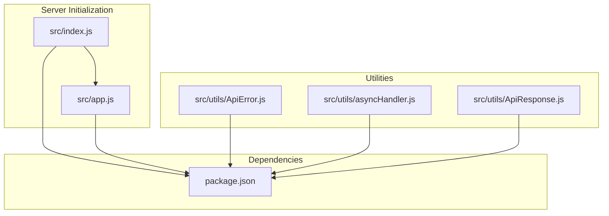
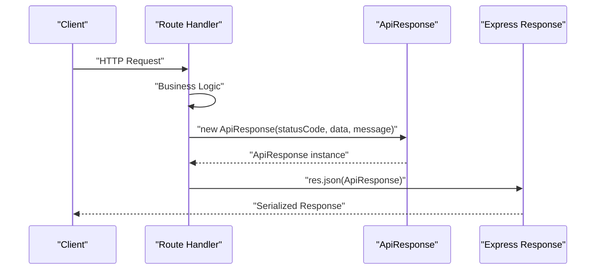
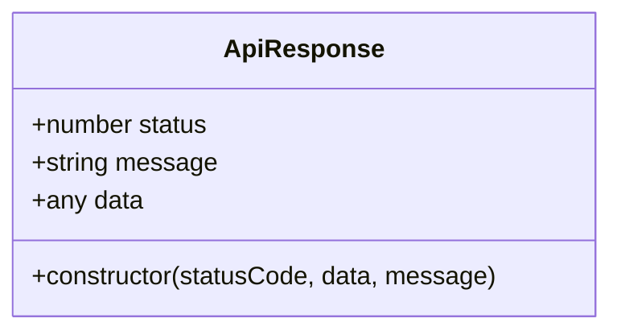
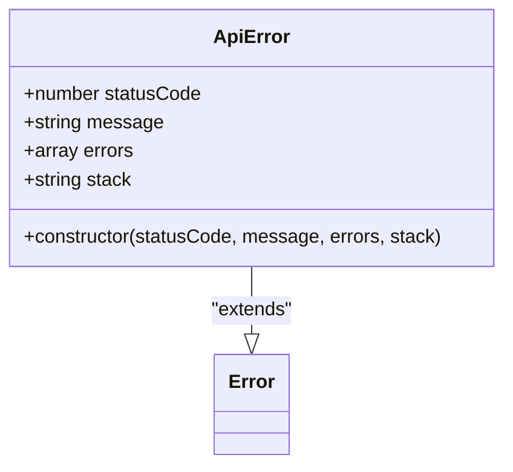
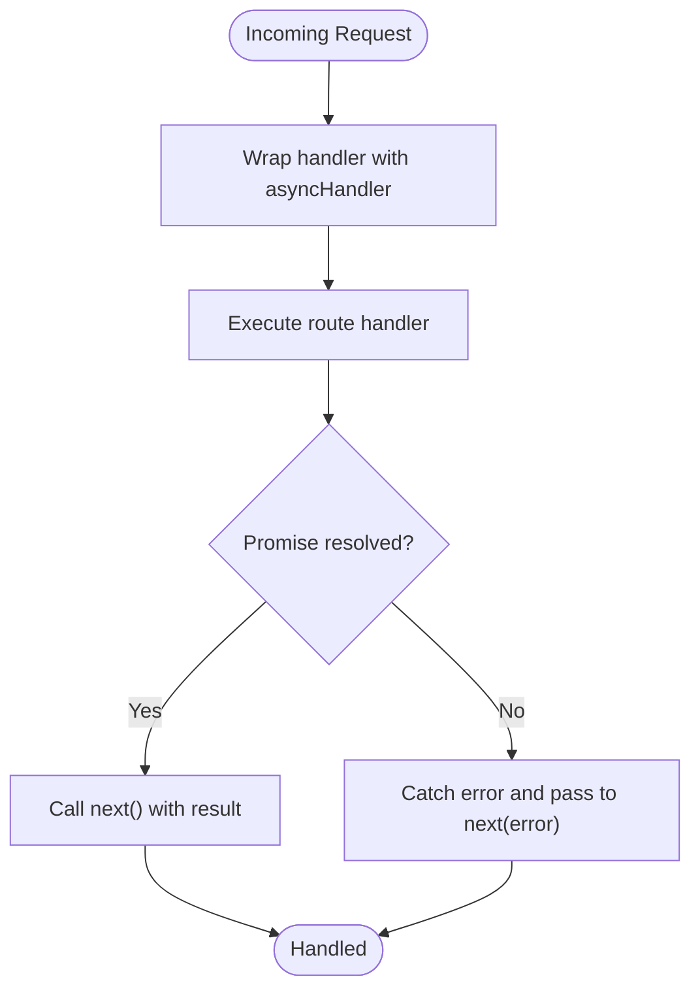
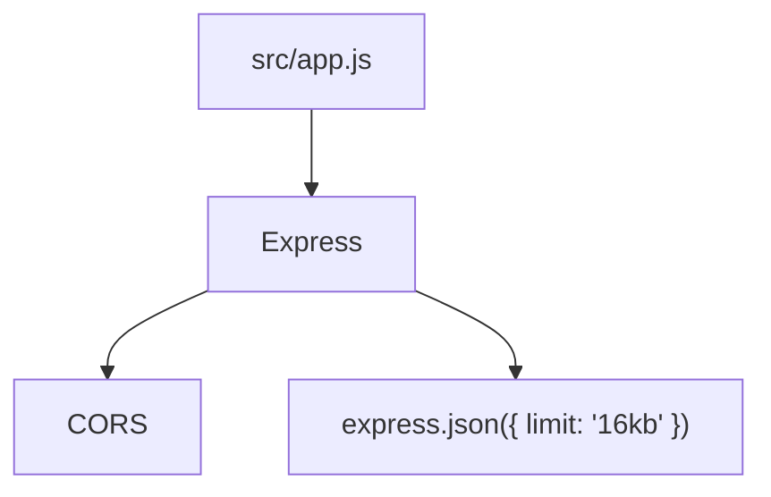
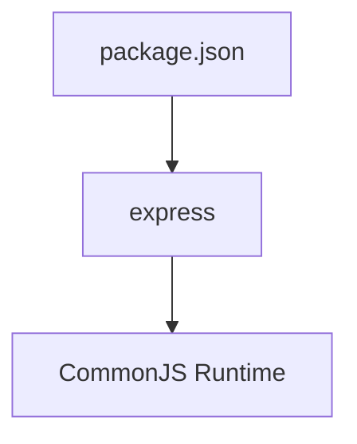

# Response Formatting

<cite>
**Referenced Files in This Document**
- [ApiResponse.js](file://src/utils/ApiResponse.js)
- [ApiError.js](file://src/utils/ApiError.js)
- [asyncHandler.js](file://src/utils/asyncHandler.js)
- [app.js](file://src/app.js)
- [index.js](file://src/index.js)
- [package.json](file://package.json)
</cite>

## Table of Contents
1. [Introduction](#introduction)
2. [Project Structure](#project-structure)
3. [Core Components](#core-components)
4. [Architecture Overview](#architecture-overview)
5. [Detailed Component Analysis](#detailed-component-analysis)
6. [Dependency Analysis](#dependency-analysis)
7. [Performance Considerations](#performance-considerations)
8. [Troubleshooting Guide](#troubleshooting-guide)
9. [Conclusion](#conclusion)
10. [Appendices](#appendices)

## Introduction
This document explains the response formatting strategy used in the Task Management System backend, focusing on the ApiResponse utility class. It describes the standardized response structure, constructor parameters, and how ApiResponse supports consistent API responses across endpoints. It also covers integration with Express.js, practical usage patterns, and guidance for extending the response model while maintaining backward compatibility.

## Project Structure
The response formatting utilities live under the src/utils directory alongside other shared utilities. The Express application initialization and middleware setup are defined in src/app.js, and the server bootstrap is handled in src/index.js. The package.json lists Express and related dependencies.

**Diagram sources**
- [index.js](file://src/index.js#L1-L18)
- [app.js](file://src/app.js#L1-L16)
- [ApiResponse.js](file://src/utils/ApiResponse.js#L1-L17)
- [ApiError.js](file://src/utils/ApiError.js#L1-L22)
- [asyncHandler.js](file://src/utils/asyncHandler.js#L1-L7)
- [package.json](file://package.json#L1-L28)

**Section sources**
- [index.js](file://src/index.js#L1-L18)
- [app.js](file://src/app.js#L1-L16)
- [ApiResponse.js](file://src/utils/ApiResponse.js#L1-L17)
- [ApiError.js](file://src/utils/ApiError.js#L1-L22)
- [asyncHandler.js](file://src/utils/asyncHandler.js#L1-L7)
- [package.json](file://package.json#L1-L28)

## Core Components
ApiResponse defines a minimal, consistent response envelope with three primary fields:
- status: HTTP-like status code indicating outcome
- message: Human-readable summary of the result
- data: Payload returned to clients

Constructor parameters:
- statusCode: Numeric status code
- data: Serializable payload (object, array, scalar)
- message: Optional message string with default value

Integration with Express:
- ApiResponse instances are designed to be serialized by JSON.stringify and sent via res.json()
- Middleware and route handlers should construct ApiResponse instances and call res.json(response)

Key considerations:
- ApiResponse does not include a timestamp field by default; timestamps are typically managed by the server or client-side logging
- ApiResponse does not include metadata fields by default; metadata can be included inside the data payload or extended in subclasses

**Section sources**
- [ApiResponse.js](file://src/utils/ApiResponse.js#L1-L17)

## Architecture Overview
The typical request-response flow for endpoints using ApiResponse is:

**Diagram sources**
- [ApiResponse.js](file://src/utils/ApiResponse.js#L1-L17)
- [app.js](file://src/app.js#L1-L16)

## Detailed Component Analysis

### ApiResponse Class
ApiResponse encapsulates a uniform response shape. It stores the provided status, message, and data fields. To integrate with Express, route handlers should pass an ApiResponse instance to res.json(), allowing Express to serialize and send the response.

**Diagram sources**
- [ApiResponse.js](file://src/utils/ApiResponse.js#L1-L17)

**Section sources**
- [ApiResponse.js](file://src/utils/ApiResponse.js#L1-L17)

### ApiError Class
ApiError extends the native Error class and adds structured fields for error responses. It complements ApiResponse by providing a consistent error envelope pattern.

**Diagram sources**
- [ApiError.js](file://src/utils/ApiError.js#L1-L22)

**Section sources**
- [ApiError.js](file://src/utils/ApiError.js#L1-L22)

### asyncHandler Utility
The asyncHandler utility wraps asynchronous route handlers to catch unhandled promise rejections and forward them to Express’s error-handling middleware. While not part of ApiResponse itself, it enables clean separation of concerns between business logic and error propagation.

**Diagram sources**
- [asyncHandler.js](file://src/utils/asyncHandler.js#L1-L7)

**Section sources**
- [asyncHandler.js](file://src/utils/asyncHandler.js#L1-L7)

### Express Integration
Express is initialized with CORS and JSON parsing middleware. ApiResponse integrates naturally with Express because:
- res.json() serializes ApiResponse instances
- CORS is enabled globally
- Body parsing supports JSON payloads up to 16KB

**Diagram sources**
- [app.js](file://src/app.js#L1-L16)

**Section sources**
- [app.js](file://src/app.js#L1-L16)

## Dependency Analysis
The response utilities depend on the runtime environment provided by Express and Node.js. The project’s package.json lists Express and related packages. ApiResponse and ApiError are pure JavaScript constructs that rely on standard serialization and error handling.

**Diagram sources**
- [package.json](file://package.json#L1-L28)

**Section sources**
- [package.json](file://package.json#L1-L28)

## Performance Considerations
- Serialization overhead: ApiResponse instances are plain objects with primitive fields, minimizing serialization cost.
- Content-Type: res.json() sets the appropriate content type automatically.
- Compression: Enable gzip/deflate at the Express layer or reverse proxy for large payloads.
- Payload size: Keep data payloads lean; consider pagination for large collections.
- Caching: Use HTTP cache headers (e.g., Cache-Control) for static or infrequently changing responses.
- Logging: Timestamps and correlation IDs are typically handled by middleware or logging layers rather than embedded in ApiResponse.

[No sources needed since this section provides general guidance]

## Troubleshooting Guide
- Unexpected null or undefined fields: Ensure the data argument passed to ApiResponse is serializable.
- Message not appearing: Verify that the message parameter is a string and not overwritten elsewhere.
- Error responses: Use ApiError to standardize error envelopes; pair with asyncHandler to propagate errors to Express error middleware.
- Express integration: Confirm that route handlers call res.json(new ApiResponse(...)) and not res.send() or res.status().json() without constructing ApiResponse.

**Section sources**
- [ApiResponse.js](file://src/utils/ApiResponse.js#L1-L17)
- [ApiError.js](file://src/utils/ApiError.js#L1-L22)
- [asyncHandler.js](file://src/utils/asyncHandler.js#L1-L7)

## Conclusion
ApiResponse provides a concise, consistent response envelope that promotes predictable client-server communication. Combined with Express middleware and ApiError for error handling, it establishes a clear pattern for building reliable APIs. Extending the response model should preserve existing field semantics to maintain backward compatibility across API versions.

[No sources needed since this section summarizes without analyzing specific files]

## Appendices

### Practical Usage Patterns
- Success response: Construct ApiResponse with a success status code, data payload, and optional message.
- Error response: Throw or pass an ApiError to the error-handling middleware; standardize the error envelope.
- Paginated results: Include pagination metadata inside the data payload (e.g., page, limit, total) while keeping ApiResponse’s top-level fields intact.

[No sources needed since this section provides general guidance]

### Extending ApiResponse
- Add optional fields (e.g., metadata, version) in subclasses while preserving status, message, and data.
- Maintain backward compatibility by avoiding removal or renaming of core fields.
- Introduce new response types as separate constructors or factory methods to avoid breaking existing consumers.

[No sources needed since this section provides general guidance]