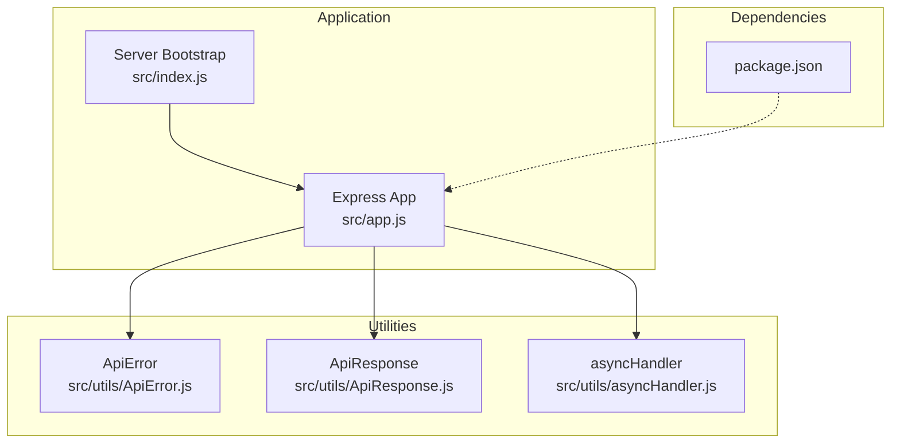
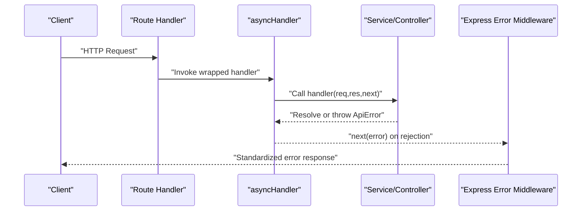
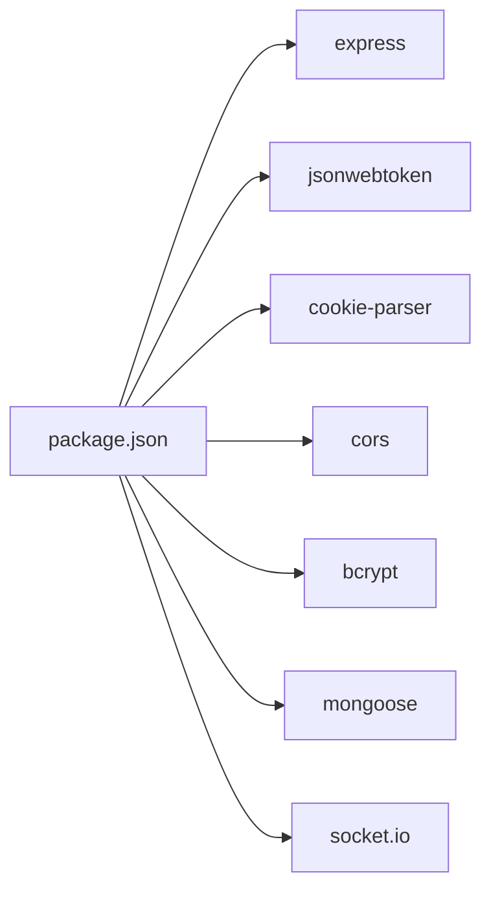

# Utility Classes & Helpers

<cite>
**Referenced Files in This Document**
- [ApiError.js](file://src/utils/ApiError.js)
- [ApiResponse.js](file://src/utils/ApiResponse.js)
- [asyncHandler.js](file://src/utils/asyncHandler.js)
- [app.js](file://src/app.js)
- [index.js](file://src/index.js)
- [package.json](file://package.json)
</cite>

## Table of Contents
1. [Introduction](#introduction)
2. [Project Structure](#project-structure)
3. [Core Components](#core-components)
4. [Architecture Overview](#architecture-overview)
5. [Detailed Component Analysis](#detailed-component-analysis)
6. [Dependency Analysis](#dependency-analysis)
7. [Performance Considerations](#performance-considerations)
8. [Troubleshooting Guide](#troubleshooting-guide)
9. [Conclusion](#conclusion)
10. [Appendices](#appendices)

## Introduction
This document focuses on the Task Management System’s utility classes and helper functions located under src/utils. It explains the ApiError class for standardized error handling, the ApiResponse class for consistent success responses, and the asyncHandler utility for promise-based error handling in Express middleware. It also outlines validation utilities, practical usage examples across controllers, services, and middleware, extensibility guidelines, testing strategies, and integration patterns with the rest of the system.

## Project Structure
The utility layer resides under src/utils and is consumed by controllers, services, and middleware. The Express application initialization and environment configuration live under src/app.js and src/index.js. Dependencies are declared in package.json.

**Diagram sources**
- [app.js](file://src/app.js#L1-L16)
- [index.js](file://src/index.js#L1-L18)
- [ApiError.js](file://src/utils/ApiError.js#L1-L22)
- [ApiResponse.js](file://src/utils/ApiResponse.js#L1-L17)
- [asyncHandler.js](file://src/utils/asyncHandler.js#L1-L8)
- [package.json](file://package.json#L1-L28)

**Section sources**
- [app.js](file://src/app.js#L1-L16)
- [index.js](file://src/index.js#L1-L18)
- [package.json](file://package.json#L1-L28)

## Core Components
This section documents the three primary utility modules and their roles in the system.

- ApiError: A specialized Error subclass to standardize error responses with status codes, messages, and structured error lists.
- ApiResponse: A lightweight wrapper to standardize successful API responses with status, data payload, and optional messages.
- asyncHandler: A higher-order function that wraps Express route handlers to convert thrown errors into Express error-handling middleware via next(error).

Key characteristics:
- Consistent error and success shapes across the application.
- Reduced boilerplate for async route handling.
- Extensible base classes for domain-specific error types and response variants.

**Section sources**
- [ApiError.js](file://src/utils/ApiError.js#L1-L22)
- [ApiResponse.js](file://src/utils/ApiResponse.js#L1-L17)
- [asyncHandler.js](file://src/utils/asyncHandler.js#L1-L8)

## Architecture Overview
The utilities integrate with the Express application lifecycle. Controllers and services raise ApiError instances or return ApiResponse objects. Route handlers are wrapped by asyncHandler to catch asynchronous errors and forward them to Express error-handling middleware.

**Diagram sources**
- [asyncHandler.js](file://src/utils/asyncHandler.js#L1-L8)
- [ApiError.js](file://src/utils/ApiError.js#L1-L22)

## Detailed Component Analysis

### ApiError Class
Purpose:
- Standardize error representation with status code, message, and structured errors array.
- Optionally preserve stack traces for debugging.

Constructor parameters:
- statusCode: Numeric HTTP status code.
- message: Human-readable error message.
- errors: Optional array of validation or domain-specific error objects.
- stack: Optional custom stack trace override.

Behavior:
- Inherits from Error and sets message and statusCode.
- Stores errors array for detailed diagnostics.
- Accepts an optional stack to override default stack behavior.

Extensibility:
- Subclass ApiError to define domain-specific error types (e.g., ValidationError, AuthenticationError).
- Override or augment the errors array to carry richer context.

Usage patterns:
- Throw ApiError in services/controllers when validation or business rules fail.
- Catch and transform into ApiResponse for success paths.

Example reference paths:
- Throwing an ApiError in a controller/service: see [ApiError.js](file://src/utils/ApiError.js#L1-L22).

**Section sources**
- [ApiError.js](file://src/utils/ApiError.js#L1-L22)

### ApiResponse Class
Purpose:
- Provide a consistent success response shape with status, data, and message.
- Encourage uniform client consumption of successful API responses.

Constructor parameters:
- statusCode: Numeric HTTP status code.
- data: Serializable payload (object, array, or primitive).
- message: Optional success message with default value.

Behavior:
- Stores status, data, and message fields for downstream serialization.

Extensibility:
- Extend ApiResponse to include pagination metadata, correlation IDs, or timestamps.
- Compose ApiResponse with additional fields for specialized endpoints.

Usage patterns:
- Return ApiResponse in successful controller flows.
- Wrap paginated results or single resources consistently.

Example reference paths:
- Creating ApiResponse in a controller/service: see [ApiResponse.js](file://src/utils/ApiResponse.js#L1-L17).

**Section sources**
- [ApiResponse.js](file://src/utils/ApiResponse.js#L1-L17)

### asyncHandler Utility
Purpose:
- Reduce boilerplate around async route handlers.
- Centralize error propagation to Express error-handling middleware.

Behavior:
- Returns a wrapper that invokes the provided handler and catches thrown errors.
- Calls next(error) to propagate errors to Express error middleware.

Integration:
- Apply asyncHandler to route handlers to ensure uncaught exceptions are routed to error middleware.
- Works seamlessly with async/await patterns.

Example reference paths:
- Wrapping route handlers: see [asyncHandler.js](file://src/utils/asyncHandler.js#L1-L8).

**Section sources**
- [asyncHandler.js](file://src/utils/asyncHandler.js#L1-L8)

### Validation Utilities
Current state:
- The src/validator directory was not found during analysis. The repository does not include explicit validation utility files in the provided structure.
- Mongoose provides built-in validation errors via its error module, but no custom validation helpers were identified in the repository.

Recommendations:
- Introduce a dedicated validation layer (e.g., input sanitization, Joi/Zod schemas, or custom validators) to complement ApiError and ApiResponse.
- Centralize validation rules and error message formatting to keep responses consistent.
- Use domain-specific error types (subclasses of ApiError) for validation failures.

[No sources needed since this section describes recommendations and current absence of files]

## Dependency Analysis
The utilities depend on minimal external libraries. Express is used for routing and middleware, while other dependencies support authentication, cookies, CORS, and database connectivity.

**Diagram sources**
- [package.json](file://package.json#L14-L26)

**Section sources**
- [package.json](file://package.json#L1-L28)

## Performance Considerations
- Prefer ApiResponse for success responses to minimize serialization overhead and ensure consistent payloads.
- Avoid excessive nesting in the errors array of ApiError; keep it concise and actionable.
- asyncHandler introduces negligible overhead; ensure handlers remain efficient to prevent latency spikes.
- Centralize validation logic to avoid repeated computations and inconsistent error messages.

[No sources needed since this section provides general guidance]

## Troubleshooting Guide
Common issues and resolutions:
- Uncaught exceptions in async handlers: Wrap route handlers with asyncHandler to route errors to Express error middleware.
- Inconsistent error responses: Use ApiError to standardize error payloads across the application.
- Inconsistent success responses: Use ApiResponse to maintain a uniform success shape.
- Debugging: Provide meaningful messages and optionally include stack traces in development environments.

Integration tips:
- Ensure Express app initializes middleware and routes before wrapping handlers with asyncHandler.
- Verify that error middleware is registered after route handlers to receive propagated errors.

**Section sources**
- [asyncHandler.js](file://src/utils/asyncHandler.js#L1-L8)
- [ApiError.js](file://src/utils/ApiError.js#L1-L22)
- [ApiResponse.js](file://src/utils/ApiResponse.js#L1-L17)
- [app.js](file://src/app.js#L1-L16)

## Conclusion
The utility classes and helper functions provide a solid foundation for consistent error and success responses, streamlined async error handling, and extensible patterns for domain-specific types. While validation utilities are not present in the current repository, adopting a centralized validation layer will further enhance consistency and reliability across controllers, services, and middleware.

[No sources needed since this section summarizes without analyzing specific files]

## Appendices

### Practical Usage Examples (Reference Paths)
- Using ApiError in a controller/service:
  - [ApiError.js](file://src/utils/ApiError.js#L1-L22)
- Using ApiResponse in a controller/service:
  - [ApiResponse.js](file://src/utils/ApiResponse.js#L1-L17)
- Wrapping route handlers with asyncHandler:
  - [asyncHandler.js](file://src/utils/asyncHandler.js#L1-L8)
- Express app initialization and middleware setup:
  - [app.js](file://src/app.js#L1-L16)
- Server bootstrap and environment configuration:
  - [index.js](file://src/index.js#L1-L18)

### Testing Strategies for Utilities
- Unit tests for ApiError:
  - Verify constructor parameters and default values.
  - Confirm stack trace behavior and error array handling.
- Unit tests for ApiResponse:
  - Validate fields presence and default message behavior.
  - Test serialization compatibility with JSON.stringify.
- Integration tests for asyncHandler:
  - Simulate thrown errors and ensure next(error) is invoked.
  - Validate success path remains unaffected.

[No sources needed since this section provides general guidance]

### Extensibility Guidelines
- Domain-specific error types:
  - Create subclasses of ApiError for distinct failure modes (e.g., AuthenticationError, AuthorizationError, ValidationError).
- Response customization:
  - Extend ApiResponse to include metadata such as pagination, timestamps, or correlation IDs.
- Validation layer:
  - Add a validator module with reusable rules and consistent error formatting aligned with ApiError.

[No sources needed since this section provides general guidance]