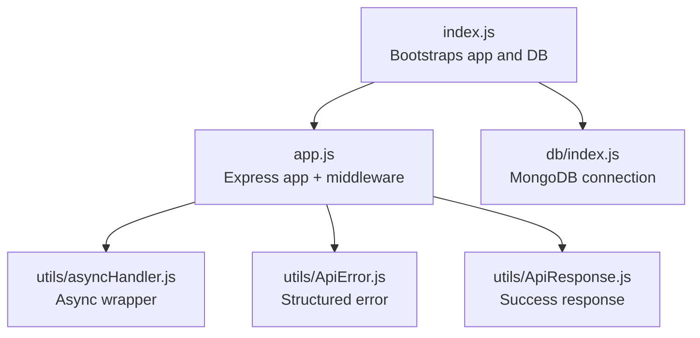
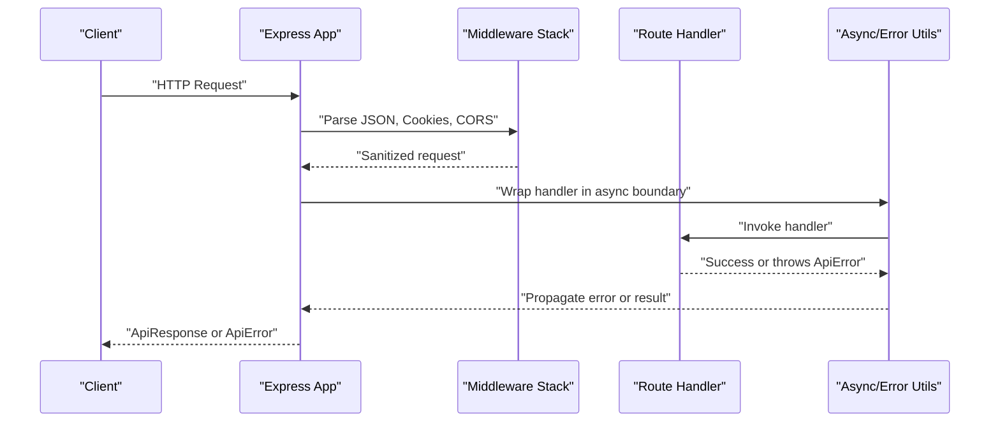
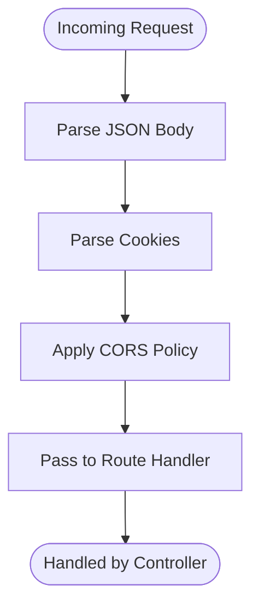
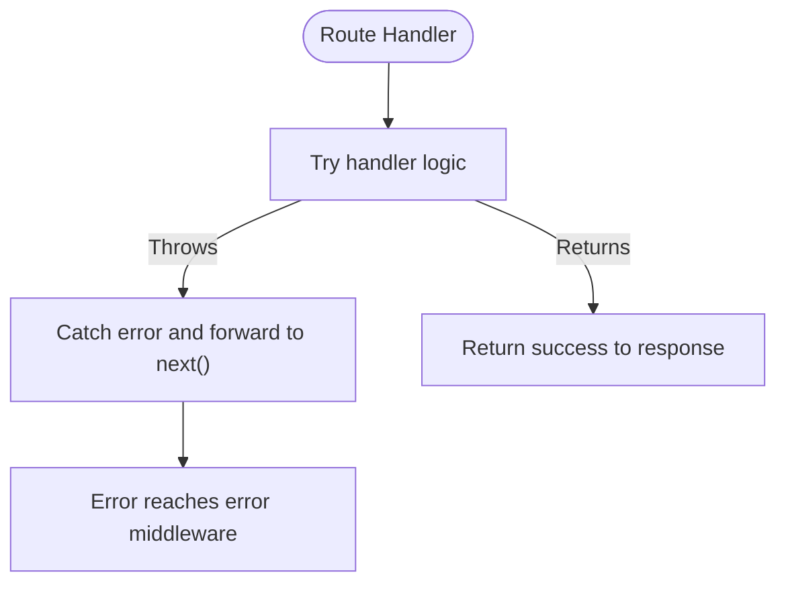
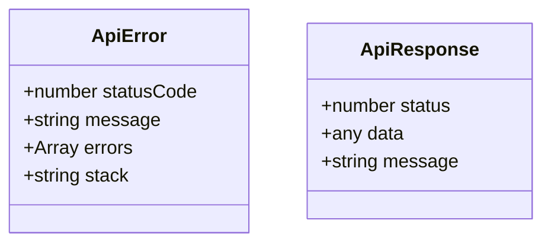
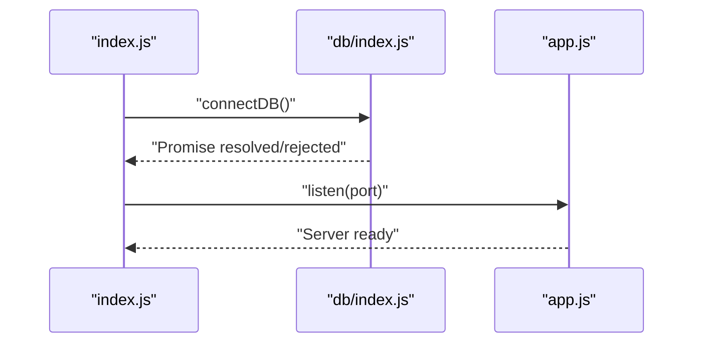
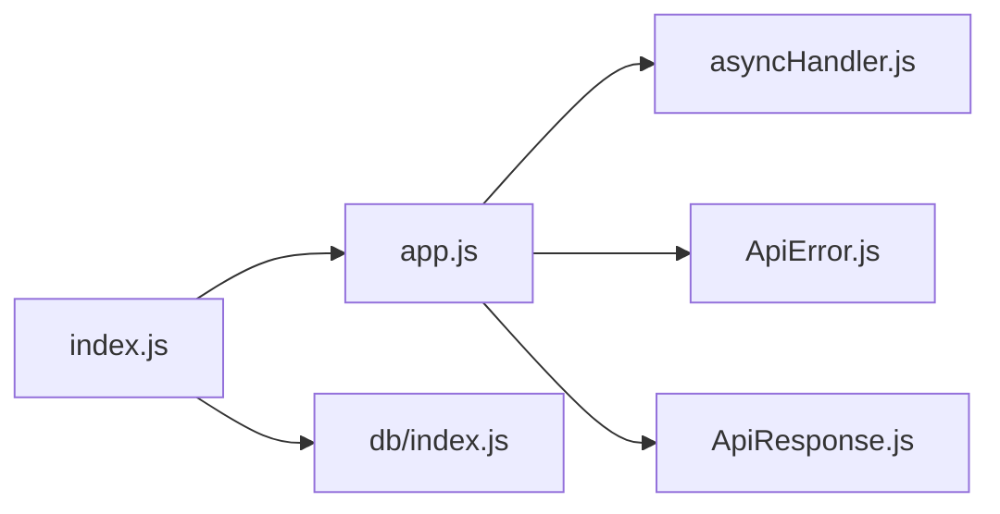

# Validation Utilities

<cite>
**Referenced Files in This Document**
- [ApiError.js](file://src/utils/ApiError.js)
- [ApiResponse.js](file://src/utils/ApiResponse.js)
- [asyncHandler.js](file://src/utils/asyncHandler.js)
- [app.js](file://src/app.js)
- [index.js](file://src/index.js)
- [db/index.js](file://src/db/index.js)
</cite>

## Table of Contents
1. [Introduction](#introduction)
2. [Project Structure](#project-structure)
3. [Core Components](#core-components)
4. [Architecture Overview](#architecture-overview)
5. [Detailed Component Analysis](#detailed-component-analysis)
6. [Dependency Analysis](#dependency-analysis)
7. [Performance Considerations](#performance-considerations)
8. [Troubleshooting Guide](#troubleshooting-guide)
9. [Conclusion](#conclusion)
10. [Appendices](#appendices)

## Introduction
This document describes the validation utilities and patterns in the Task Management System backend. It focuses on input sanitization, data validation rules, error message formatting, middleware integration, and the validation pipeline. It also covers error collection, user-friendly error reporting, performance optimization, and guidelines for extending and reusing validation schemas consistently across the application.

## Project Structure
The validation layer in this backend is primarily implemented via Express middleware and shared utilities. The application initializes middleware early in the boot process, and error-handling utilities standardize error responses.

**Diagram sources**
- [index.js](file://src/index.js#L1-L18)
- [app.js](file://src/app.js#L1-L16)
- [asyncHandler.js](file://src/utils/asyncHandler.js#L1-L7)
- [ApiError.js](file://src/utils/ApiError.js#L1-L22)
- [ApiResponse.js](file://src/utils/ApiResponse.js#L1-L17)
- [db/index.js](file://src/db/index.js#L1-L14)

**Section sources**
- [index.js](file://src/index.js#L1-L18)
- [app.js](file://src/app.js#L1-L16)

## Core Components
- Express middleware stack for input parsing and CORS
- Async error boundary for route handlers
- Structured error and success response utilities

Key responsibilities:
- Input sanitization and normalization via Express middleware
- Centralized error handling and propagation
- Consistent success/error response formatting

**Section sources**
- [app.js](file://src/app.js#L1-L16)
- [asyncHandler.js](file://src/utils/asyncHandler.js#L1-L7)
- [ApiError.js](file://src/utils/ApiError.js#L1-L22)
- [ApiResponse.js](file://src/utils/ApiResponse.js#L1-L17)

## Architecture Overview
The validation pipeline integrates with the Express application lifecycle. Requests pass through middleware for sanitization, then reach route handlers wrapped in an async boundary. Errors are standardized and returned to clients.

**Diagram sources**
- [app.js](file://src/app.js#L1-L16)
- [asyncHandler.js](file://src/utils/asyncHandler.js#L1-L7)
- [ApiError.js](file://src/utils/ApiError.js#L1-L22)
- [ApiResponse.js](file://src/utils/ApiResponse.js#L1-L17)

## Detailed Component Analysis

### Input Sanitization and Middleware Integration
- JSON body parsing with size limits
- Cookie parsing
- CORS configuration
- Static asset serving

These middleware steps normalize raw input into structured request objects, reducing downstream validation complexity.

**Diagram sources**
- [app.js](file://src/app.js#L1-L16)

**Section sources**
- [app.js](file://src/app.js#L1-L16)

### Async Error Boundary
- Wraps route handlers to convert thrown errors into the error-handling pipeline
- Prevents unhandled promise rejections from crashing the server

**Diagram sources**
- [asyncHandler.js](file://src/utils/asyncHandler.js#L1-L7)

**Section sources**
- [asyncHandler.js](file://src/utils/asyncHandler.js#L1-L7)

### Structured Error Handling
- ApiError encapsulates status code, message, and structured errors
- ApiResponse standardizes successful responses

**Diagram sources**
- [ApiError.js](file://src/utils/ApiError.js#L1-L22)
- [ApiResponse.js](file://src/utils/ApiResponse.js#L1-L17)

**Section sources**
- [ApiError.js](file://src/utils/ApiError.js#L1-L22)
- [ApiResponse.js](file://src/utils/ApiResponse.js#L1-L17)

### Database Connection and Boot Sequence
- Environment configuration and DB connection
- Application startup and port binding

**Diagram sources**
- [index.js](file://src/index.js#L1-L18)
- [db/index.js](file://src/db/index.js#L1-L14)

**Section sources**
- [index.js](file://src/index.js#L1-L18)
- [db/index.js](file://src/db/index.js#L1-L14)

## Dependency Analysis
- The application depends on Express middleware for input normalization
- Route handlers depend on the async boundary for error propagation
- Error utilities are consumed by the error-handling pipeline

**Diagram sources**
- [app.js](file://src/app.js#L1-L16)
- [asyncHandler.js](file://src/utils/asyncHandler.js#L1-L7)
- [ApiError.js](file://src/utils/ApiError.js#L1-L22)
- [ApiResponse.js](file://src/utils/ApiResponse.js#L1-L17)
- [index.js](file://src/index.js#L1-L18)
- [db/index.js](file://src/db/index.js#L1-L14)

**Section sources**
- [app.js](file://src/app.js#L1-L16)
- [asyncHandler.js](file://src/utils/asyncHandler.js#L1-L7)
- [ApiError.js](file://src/utils/ApiError.js#L1-L22)
- [ApiResponse.js](file://src/utils/ApiResponse.js#L1-L17)
- [index.js](file://src/index.js#L1-L18)
- [db/index.js](file://src/db/index.js#L1-L14)

## Performance Considerations
- Prefer early middleware for input parsing to reduce downstream work
- Keep validation logic lightweight and deterministic
- Use streaming or chunked processing for large payloads when applicable
- Avoid synchronous blocking operations in the validation path
- Cache expensive validations only when safe and bounded

## Troubleshooting Guide
- If requests fail with uncaught exceptions, ensure route handlers are wrapped with the async boundary utility
- When returning errors, use the structured error utility to maintain consistent client-facing messages
- Verify middleware order: parsing, cookies, CORS, then routes
- Confirm database connectivity before starting the server

**Section sources**
- [asyncHandler.js](file://src/utils/asyncHandler.js#L1-L7)
- [ApiError.js](file://src/utils/ApiError.js#L1-L22)
- [app.js](file://src/app.js#L1-L16)
- [index.js](file://src/index.js#L1-L18)

## Conclusion
The validation layer in this backend emphasizes middleware-driven input sanitization, centralized error handling, and consistent response formatting. By leveraging the provided utilities and following the outlined patterns, teams can implement robust, maintainable validation across tasks, user credentials, and API payloads while preserving performance and developer ergonomics.

## Appendices
- Extending validation: Add new middleware for domain-specific checks after general parsing and before route handlers
- Reusable schemas: Define common validation rules in shared modules and compose them per endpoint needs
- Localization: Introduce locale-aware messages in the error utility and surface them via response metadata
- Batch validation: Aggregate field-level errors into a single response payload for user-friendly feedback